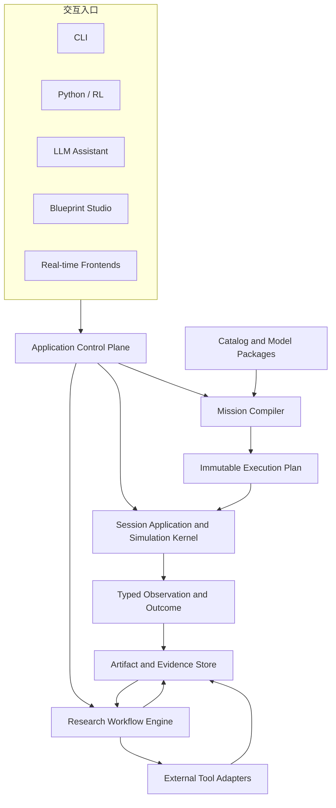

# 00｜愿景、范围与架构宪章

[返回总索引](README.md) · [下一册：当前架构深度审阅](01-current-architecture-deep-audit.md)

**主线定位**：本册固定整条研究闭环的目的、产品尺度和长期取舍依据。它向 [02](02-layered-reference-architecture.md) 提供设计约束，不负责展开局部对象、执行步骤或迁移顺序。

## 1. 目标陈述

GNCZMKN 的长期目标是一套面向制导、导航与控制研究者的可信研究工作台。研究者负责提出问题、选择物理假设、设计算法和解释结论；框架负责装配、校验、执行、数据管理、工具协作、论证材料和复现证据。

这个目标包含三层价值：

1. **研究表达**：用稳定领域概念表达飞行器、环境、传感器、估计、制导、控制、执行机构和动力学闭环。
2. **可信执行**：以明确时间语义、数值策略、失败模型和证据链运行单次仿真及批量实验。
3. **研究生产力**：把常见气动、控制、轨迹优化、绘图和报告工作固化成可组合流程。

框架保持实验室级、自用优先的尺度。目标是形成一套边界完整、风格一致、能持续演进的模块化单体架构。进程拆分、动态插件和分布式执行只有在真实约束出现时才引入。

## 2. 服务对象与核心场景

### 2.1 主要角色

| 角色 | 主要关注点 | 框架承担的工作 |
| --- | --- | --- |
| GNC 理论研究者 | 算法、假设、稳定性、性能 | 脚手架、闭环装配、分析、报告、复现 |
| 模型开发者 | 动力学、气动、传感器、执行机构 | 接口契约、参数校验、模型包、测试基座 |
| 仿真工程维护者 | 内核、时间、数值、诊断 | 稳定执行计划、生命周期、故障隔离、观测 |
| 试验设计者 | 工况、拉偏、批量打靶、比较 | Experiment、参数空间、调度、统计汇总 |
| 工具与前端开发者 | Python、LLM、蓝图、实时显示 | 控制面、schema、事件流、Artifact API |

### 2.2 核心用户旅程


每一步都有机器可读输入、结构化诊断和可追踪输出。图形界面与自然语言助手只是这条旅程的不同入口，不能形成独立语义。

## 3. 产品边界

### 3.1 核心范围

- 确定性仿真内核及连续、离散、事件混合时间语义；
- 领域模型装配、配置校验、依赖解析和执行计划生成；
- 数学、坐标、单位、插值、求根、积分、控制分析等公共底座；
- 单次运行、批量实验、数据记录、指标计算和研究产物管理；
- 常见 GNC 研究工作流及外部工具适配；
- 项目私有模型向稳定模型包晋升的治理机制；
- CLI、Python、LLM、蓝图编辑器和实时前端共用的控制面。

### 3.2 受控扩展范围

- 动态加载模型包；
- 多进程或多机批量执行；
- 硬实时与硬件在环；
- 通用商业仿真平台所需的租户、市场、计费和权限体系；
- 完整游戏引擎功能。

这些方向可以使用当前架构边界继续扩展。引入前需要由真实场景给出延迟、隔离、部署或生态约束。

## 4. 质量属性优先级

架构取舍按以下优先级评估：

| 优先级 | 质量属性 | 判断问题 |
| --- | --- | --- |
| P0 | 物理与语义正确性 | 单位、坐标、时间、方向和数据含义能否被证明 |
| P0 | 可复现性 | 输入、版本、随机性、环境和产物能否完整重建 |
| P0 | 可诊断性 | 失败能否指向阶段、主体、位置、原因和修复建议 |
| P1 | 架构一致性 | 相同问题是否采用同一套契约与生命周期 |
| P1 | 可扩展性 | 新项目模型能否沿稳定边界加入且不改内核 |
| P1 | 可测试性 | 纯算法、组件、图编译、运行时和工作流能否分层验证 |
| P2 | 性能与实时性 | 数据量和步进频率增长时能否测量、预算和优化 |
| P2 | 易用性 | 研究者能否获得脚手架、模板和清楚反馈 |
| P3 | 部署弹性 | 单进程、多进程、嵌入和远程运行能否共享语义 |

功能数量不能抵消 P0 缺陷。任何会让物理配置静默失效、数据语义变得含糊或证据链断裂的便利功能都应退回设计阶段。

## 5. 架构宪章

以下规则作为长期约束。若后续需求确实需要突破，必须先形成 ADR，说明替代机制与迁移办法。

### C-01：领域语义先于存储类型

`double`、Eigen 向量和 JSON 字段只是载体。公开契约还必须表达单位、坐标系、方向、时间基准、有效区间和数据质量。

### C-02：作者输入必须经过编译

Mission Source 不直接驱动运行对象。解析、schema 迁移、默认值展开、类型解析、图构建、端口绑定、速率规划和输出规划完成后，先生成不可变 ExecutionPlanDescriptor，再以精确 package implementation link 为 ExecutionPlanImage。

### C-03：单次运行内核只负责确定性执行

批量打靶、DATCOM、GPOPS2、绘图、报告和论文复现由研究工作流编排。RuntimeComponent 与模型 kernel 不得启动这些外部流程。

### C-04：依赖边在运行前显式化

模型 occurrence 的绑定结果必须形成可查询的图边。运行时不得依靠隐式全局查找、未记录的裸指针关系或名称猜测建立新依赖。

### C-05：状态所有权唯一

连续状态、离散状态、参数、缓存、产物和前端镜像各有唯一权威所有者。跨边界通过只读视图、命令或显式转移共享。

### C-06：时间语义是公共契约

仿真时间、采样时间、有效时间、发布时间和墙钟时间分别表达。所有端口数据携带足够的时效信息，调度不通过隐式取整改变用户意图。

### C-07：失败必须结构化且可追踪

配置错误、绑定错误、数值失败、物理域越界、I/O 失败、取消和外部工具失败进入统一 Diagnostic 与 Outcome 模型。日志只是表现形式之一。

### C-08：数值策略属于实验输入

积分器、容差、外推策略、迭代上限、非有限值策略和随机种子会影响研究结论，必须进入 RunProfile 和运行清单。

### C-09：产物形成证据图

有效 Mission、Execution Plan、运行日志、时序数据、指标、图表和报告都以 Artifact 表达，带内容哈希、schema、生产者和输入谱系。

### C-10：稳定能力从项目真实需求中晋升

新模型优先位于 `user/<project>`。完成真实案例、失败测试、契约收敛和复用验证后，才进入 framework 或稳定模型包。

### C-11：所有前端共享同一控制面

CLI、Python、LLM、蓝图和实时前端调用同一组应用命令、查询和事件。任何前端都不能绕过 Mission 编译、权限策略和证据记录。

### C-12：逻辑边界先于部署边界

模块先在一个进程和仓库内保持清楚依赖。只有隔离、并行、许可证或实时约束提供充分理由时，才跨进程部署。

### C-13：变化通过架构接缝进入

新算法、新组件内部逻辑、新领域连接、新研究流程和新交互入口分别通过 Model Package、Behavior Composition、Compiler Graph、Workflow/Artifact 和 Application Adapter 扩展。常见功能增长不得推动 Kernel 同步增加领域类型和调用分支。

### C-14：Kernel 只因执行语义扩充

`KernelCapability` 只处理时间、原子性、rollback、resource lifetime 和不可逆效果等通用执行语义。新增 KernelCapability 必须证明现有 execution obligations/regions 无法正确组合，并提供 Compiler representation、纵向案例和 failure-point evidence。

### C-15：表示编码与核心语义分离

JSON、YAML、受限 INI、蓝图和 API 通过 Source Frontend 形成统一 SourceTree，再进入规范模型图；CSV、MAT、HDF5、数据库和实时流通过 Dataset Sink 编码同一 Observation schema。等价输入编码保持模型与执行 identity，输出编码变化不得改变已提交物理状态或执行核心 identity。

### C-16：跨实体与场景干预保持因果和 owner 边界

每个实体的 truth 由自身 committed state 投影；跨实体物理作用、模拟观测和通信分别使用编译后的窄契约。拉偏、扰动和模拟故障通过 stable id、typed input/command 与声明 owner 进入普通物理链。框架自身的配置、数值、资源和 I/O 失败继续由 Diagnostic/Outcome 表达。

### C-17：需求先形成变化签名，再形成模块

任何新增能力先拆成 CapabilitySlice。每个切片明确 Design/Plan、Model、Operation 或 Artifact 权威域，再按 Vocabulary、Graph/Topology、State/Evolution、Time/Atomicity、Information/Authority/Evidence、Representation/Encoding、Execution Context/Resources 七维描述语义差异。产品名称不能直接成为 Kernel 分支或基础设施类型。

### C-18：每个权威域拥有封闭操作集

Package/Catalog 与 Plan Compiler、Simulation Session、Application/Workflow operation owner、Artifact Store 分别提交本域事实，并通过 typed intent、immutable ref、receipt 与 Outcome 衔接。只有 Model Authority 缺少通用时间、原子性、rollback 或 effect 算子时，才评审新的 `KernelCapability`；其他缺口回到对应 Design/Compiler、Workflow/Control 或 Artifact 边界。

## 6. 架构风格

### 6.1 总体风格

目标风格为“编译式模型图 + 事务微内核 + 证据工作流”，其核心思想是“开放语义、分区封闭执行、证据闭环”，并采用模块化单体部署。整个系统反复使用同一条语义主干：

```text
intent encoding
-> canonical intent / graph
-> immutable plan
-> bounded executor
-> authoritative commit + receipt
-> evidence projection
```

这条主干按权威域实例化：Package/Catalog 与 Compiler 提交 Design/Plan，Simulation Session 提交 Model State，Application/Workflow owner 提交 command/task lifecycle，RecordPipeline/Artifact Store 提交 Artifact 与 lineage。单次仿真路径上的 Canonical Model Graph、Execution Plan、committed Model State 与 Evidence Graph 仍是四种长期语义形态。各分区拥有明确变换：

- **Model Ecosystem**：package 通过 Runtime Cell Recipe 组合算法、嵌入机制、状态、端口与验证证据；
- **Semantic Compiler**：把作者友好输入和 package contribution 降级为闭合 Execution Plan；
- **Transactional Kernel**：只执行 publish、boundary DAG、`SolverIslandPlan`、commit 和 post-commit regions；
- **Artifact-driven Research**：外部工具、批量试验、分析和报告交换有谱系的数据产物；
- **Ports and Adapters**：隔离文件、进程、语言绑定、硬件和界面；
- **Application Control**：让 CLI、Python、LLM、蓝图和实时入口共享命令、查询、权限与 Outcome。

Plan Firewall、Commit Firewall 和 Artifact/Control Firewall 构成稳定主轴。输入/输出适配器停留在语义主干两端；研究 Workflow 通过 committed ArtifactRef 和 Session operation 与仿真衔接，不进入单步模型推进。详细权威域、变化向量、扩展接缝与压力地图见 [02](02-layered-reference-architecture.md)。

### 6.2 系统边界图



## 7. 两个核心闭环

### 7.1 飞行仿真闭环

```text
truth -> sensor/input -> navigation -> guidance -> control
      -> allocation/actuator -> force/moment -> closure -> form
```

该闭环运行在 Simulation Session 中，受严格时间和状态规则约束。

### 7.2 研究论证闭环

```text
question -> assumptions -> assets -> mission -> runs
         -> metrics -> analysis -> evidence -> review -> revision
```

该闭环运行在 Workflow 与 Artifact 系统中。两者在 Run Artifact 处衔接。

## 8. 关键隔离线

| 隔离线 | 左侧 | 右侧 | 交换方式 |
| --- | --- | --- | --- |
| 数学与领域 | 无语义数值算法 | 带单位和坐标的领域量 | 显式适配与强类型 |
| 表示与语义 | JSON/YAML/INI/蓝图/API | SourceTree 与 Canonical Model Graph | Source Frontend + semantic compiler |
| 编译与执行 | Canonical Model Graph | ExecutionPlanDescriptor + process-local Image | compile/link outcomes |
| 装配与运行 | 类型解析、依赖绑定 | 时间推进、状态更新 | 已闭合图 |
| 内核与工作流 | 单次确定性仿真 | 批量、分析、外部工具 | Artifact |
| 领域与 I/O | typed Observation 与数据集 schema | CSV、MAT、HDF5、Parquet、数据库、网络 | EncodingPlan + Dataset Sink |
| 应用与前端 | 命令、查询、事件 | CLI、Python、LLM、GUI | Control API |
| 稳定与实验 | framework/稳定包 | user 项目模型 | 晋升门禁 |

## 9. 一致性准则

同一类问题只保留一个权威机制：

- 可选择模型身份由稳定 ModelDefinition id/version 表示；RuntimeComponent 实例另有 instance id，C++ RTTI 仅供进程内实现使用。
- 依赖关系由编译后的端口边表示；model occurrence display name 只存在于 Mission Source 的作者视图，运行期不做名称查找。
- 可选择模型、RuntimeComponent 与 AlgorithmKernel 使用独立身份；RuntimeComponent 资格由独立 state、schedule、`DecisionAuthority` 或 resource lifecycle 决定。
- 所有影响后续模型结果、需要 reset/checkpoint/replay 的可变状态由 Session `CommittedStateStore` 权威拥有；组件只返回 delta，整步统一提交或回滚。外部资源句柄与性能计数使用独立显式生命周期，不能隐藏物理状态。
- 数据语义由领域契约和 schema 表示；CSV 列名只是输出映射。
- 输入语义由 Canonical Model Graph 表示；JSON、YAML 和受限 INI 只是 SourceTree 编码。
- 实体 truth 由 entity state owner 投影；跨实体信息使用显式 selector、sensor、interaction 或 link contract。
- 模拟故障由模型 owner 接受并产生物理响应；框架 failure 由 Diagnostic/Outcome 表达。
- 运行状态由 Simulation Session 表示；散落的布尔标志退出目标运行路径。
- 错误信息由 Diagnostic 表示；异常、返回值和日志都映射到它。
- 研究结果由 Artifact 和 Manifest 表示；临时文件不能成为隐式权威输入。
- 工具调用由 Workflow Adapter 表示；RuntimeComponent 与 model kernel 内部不得直接拼接外部命令。

## 10. 成功标准

当目标架构达到首个稳定版本时，应满足以下场景：

1. 研究者从模板创建一个项目，替换导航或制导算法后即可编译 mission，并在错误时获得字段级和端口级诊断。
2. 同一 Mission IR 可由 CLI、Python 和蓝图编辑器提交，生成一致 Execution Plan 哈希。
3. 单次运行在成功、终止、取消、数值失败和 I/O 失败后都产生完整 RunOutcome 与可读清单。
4. 气动数据导入、配平、线性化、控制特性与回路裕度形成可缓存的 Artifact DAG。
5. 任一图表或报告都可追溯到输入资产、模型包版本、有效 Mission、数值策略和源代码版本。
6. Python 环境可以创建多个相互隔离的 Session，支持确定性 reset/step 和并行采样。
7. LLM 只能提交结构化提案，所有配置先编译、显示差异和假设，再经策略批准执行。
8. 实时前端通过命令和发布快照协作，无法直接修改积分中的内核状态。
9. 新制导律、局部状态切换工具、报告模板、Python/LLM/蓝图入口和新领域 package 可以分别沿既有接缝加入，Kernel 保持零领域改动。
10. 新 `KernelCapability` 都有无法由现有 obligations/regions 表达的真实场景及完整时间、rollback 和 evidence 证明。
11. 同一语义的 JSON/YAML 输入生成相同模型与执行 hash，CSV/MAT 输出可 round-trip 为同一语义数据集。
12. 多飞行器 truth/传感/通信、故障到物理终止、已知子体 activation、起降接触和星座运行均能沿既定 contract/plan/transaction 路径扩展。
13. 任一新增需求都能拆成 AuthorityDomain + 七维 ChangeVector，并沿所属域 grammar、proof、closed operators、commit 和 evidence 路径闭合。
14. Design/Plan、Model、Operation 与 Artifact 跨域只交换 typed intent/ref/receipt/Outcome；Kernel、Workflow scheduler、Control handler 和 Artifact Store 无产品专用 dispatch。

## 11. 与后续分册的关系

本册定义长期不变量。后续分册负责把这些不变量展开成各层契约：

- [02](02-layered-reference-architecture.md) 定义 AuthorityDomain + 七维 ChangeVector、各域封闭操作语言、稳定架构主轴、扩展接缝、膨胀压力和 Kernel 准入门；
- [03](03-mathematics-and-numerical-foundation.md) 细化 C-01、C-06、C-08；
- [04](04-domain-contracts-and-interface-layer.md) 细化 C-01、C-04、C-05；
- [05](05-component-catalog-and-mission-compiler.md) 细化 C-02、C-04、C-10；
- [06](06-simulation-kernel-time-and-lifecycle.md) 细化 C-03、C-05、C-06；
- [07](07-diagnostics-reliability-and-observability.md) 细化 C-07；
- [08](08-data-artifacts-and-research-evidence.md) 细化 C-09；
- [09](09-research-workflows-and-tool-adapters.md) 细化研究论证闭环；
- [10](10-packages-multilanguage-and-frontends.md) 细化 C-11、C-12。
- [12](12-runtime-object-model-and-component-anatomy.md) 确定运行对象、组件内部构成和函数/变量 ownership；
- [13](13-behavior-composition-and-extension-mechanisms.md) 确定 Runtime Cell Recipe、嵌入机制、共享 DecisionAuthority 与物理 configuration 的组合边界；
- [14](14-cycle-dataflow-state-transaction-and-continuous-closure.md) 确定 CycleFrame、StepTransaction 与连续闭合；
- [15](15-reference-vertical-designs-and-object-placement.md) 用 YYZ/CAVH 纵向设计验证上述对象可以落地。
