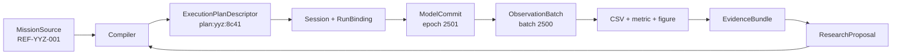

# 00A｜从 YYZ Mission 到一条可复核结论

[返回主入口](README.md) · [系统主叙事](02-layered-reference-architecture.md) · [术语注册表](reference-glossary.md) · [纵向架构验证](15-reference-vertical-designs-and-object-placement.md)

> 文档状态：目标架构 v1 的规范参考 fixture，编号 `REF-YYZ-001`。  
> 用途：用一组固定数据贯穿 authoring、Compiler、Session、Observation、Diagnostic、Artifact 和下一轮提案。  
> 实现状态：`Fixture`。字段和不变量是后续实现及测试的目标输入；当前源码仍以仓库 `doc/` 与测试为运行事实。

## 1. 先认识这一条链

研究者希望验证一枚 YYZ 六自由度飞行器在固定工况下能否稳定跟踪 1000 m 高度指令，并确认俯仰通道的超调量不超过 8%。这项研究只需要先掌握二十个核心对象：

| 阶段 | 核心对象 | 本例中的作用 |
| --- | --- | --- |
| 作者输入 | `MissionSource`、`DefinitionRef`、`MissionSourcePatch` | 描述飞行器、算法、连接和观测意图 |
| 语义编译 | `CanonicalModelGraph`、`BindingPlan`、`ExecutionPlanDescriptor`、`PlanProofRecord` | 解析身份与端口，证明时间和因果关系，冻结执行计划 |
| 单次运行 | `RunBinding`、`Session`、`StepTransaction`、`ModelCommit` | 绑定初态和 seed，按整步事务推进模型事实 |
| 运行结果 | `ObservationBatch`、`DiagnosticRecord`、`RunOutcome` | 保存已提交数据、结构化问题与终态 |
| 研究证据 | `ArtifactRef`、`LineageEdge`、`RunManifest`、`EvidenceBundle` | 连接输入、数据、分析、图表和结论 |
| 下一轮设计 | `ResearchProposal` | 把基于证据的调整重新送入受控编译路径 |

全链路只有六次权威交接：source 进入 Compiler，plan 进入 Session，候选态形成 ModelCommit，commit 形成 Observation，Observation 形成 Artifact，证据形成下一轮 proposal。每次交接都有稳定身份、结构化结果和可追踪来源。



## 2. 作者写下什么

`MissionSource` 是可编辑表示。下面的 JSON 只展示本例所需字段；完整 schema 由 05 册负责。所有身份、物理参数、速率和观测字段均显式给出。

```json
{
  "schema_version": "gnczmkn.mission/1",
  "mission_id": "mission:yyz-altitude-hold:1",
  "base_rate_hz": 100,
  "duration_s": 30.0,
  "vehicles": [
    {
      "entity_id": "vehicle:yyz-01",
      "form": {
        "definition": "gnc.form.yyz_6dof@1.0.0",
        "occurrence_id": "occ:yyz-body",
        "config": {
          "initial_state": {
            "latitude_deg": 31.2304,
            "longitude_deg": 121.4737,
            "altitude_m": 1000.0,
            "speed_mps": 220.0,
            "heading_deg": 90.0,
            "flight_path_deg": 0.0,
            "bank_deg": 0.0,
            "mass_kg": 680.0
          }
        }
      },
      "components": [
        {
          "definition": "yyz.navigation.truth_passthrough@1.0.0",
          "occurrence_id": "occ:nav",
          "rate_hz": 100
        },
        {
          "definition": "yyz.guidance.altitude_hold@2.1.0",
          "occurrence_id": "occ:guidance",
          "rate_hz": 20,
          "config": {"command_altitude_m": 1000.0}
        },
        {
          "definition": "yyz.control.pitch_autopilot@3.0.0",
          "occurrence_id": "occ:control",
          "rate_hz": 50,
          "config": {"max_elevator_deg": 20.0}
        },
        {
          "definition": "yyz.output.aero_actuator@1.4.0",
          "occurrence_id": "occ:plant-output",
          "rate_hz": 100,
          "assets": {
            "aero_table": "asset://yyz/aero/baseline@sha256:91b7"
          }
        }
      ]
    }
  ],
  "connections": [
    {"from": "occ:nav.estimate", "to": "occ:guidance.estimate"},
    {"from": "occ:guidance.pitch_command", "to": "occ:control.pitch_command"},
    {"from": "occ:control.elevator_command", "to": "occ:plant-output.elevator_command"}
  ],
  "observation": {
    "rate_hz": 25,
    "fields": [
      "vehicle:yyz-01.truth.altitude_m",
      "vehicle:yyz-01.truth.pitch_deg",
      "occ:guidance.command_altitude_m",
      "occ:control.elevator_command_deg"
    ],
    "encoding": "csv"
  }
}
```

在 source 层，`rate_hz` 仍是作者意图。Compiler 必须检查它能否形成整数 tick interval：100、50、25、20 Hz 分别对应 1、2、4、5 tick。source parser 只产生带 `SourceMap` 的 typed source tree，不创建任何 C++ 运行对象。

## 3. Compiler 冻结什么

### 3.1 Canonical Model Graph

Compiler 展开 package contribution 和 Runtime Cell Recipe 后，先形成与 JSON/YAML 表示无关的规范图。本例的核心节点摘要如下：

```yaml
canonical_model_graph:
  graph_id: graph:yyz-altitude-hold:6f2d
  source_semantic_hash: sha256:3d0a
  entities:
    - entity_id: vehicle:yyz-01
      lifecycle: active_at_initialize
  occurrences:
    - {id: occ:yyz-body, definition: gnc.form.yyz_6dof@1.0.0, owner: state:yyz-body}
    - {id: occ:nav, definition: yyz.navigation.truth_passthrough@1.0.0, owner: state:nav}
    - {id: occ:guidance, definition: yyz.guidance.altitude_hold@2.1.0, owner: state:guidance}
    - {id: occ:control, definition: yyz.control.pitch_autopilot@3.0.0, owner: state:control}
    - {id: occ:plant-output, definition: yyz.output.aero_actuator@1.4.0, owner: state:plant-output}
```

`occurrence_id` 是 mission 中一次放置的身份，`definition` 是可复用定义的身份，`owner` 是可变状态的唯一提交者。三者不能互换。

### 3.2 BindingPlan

端口解析产生稳定 edge。每条 edge 保存类型、单位、frame、时间关系和 adapter 决策。

```yaml
binding_plan:
  plan_id: binding:yyz:27e1
  edges:
    - edge_id: edge:nav-to-guidance:estimate
      producer: occ:nav.estimate
      consumer: occ:guidance.estimate
      contract: gnc.contract.NavigationEstimate@1
      unit_check: Proven
      frame_check: Proven
      temporal_relation: CurrentCycle
      adapter: null
    - edge_id: edge:control-to-actuator:elevator
      producer: occ:control.elevator_command
      consumer: occ:plant-output.elevator_command
      contract: gnc.contract.ElevatorCommand@1
      unit_check: Proven
      frame_check: Proven
      temporal_relation: HeldLatest
      adapter: null
```

### 3.3 ExecutionPlanDescriptor

编译 pass 把开放的模型语义降级为 Kernel 能执行的固定 obligation 和 region：

```yaml
execution_plan_descriptor:
  plan_ref: plan:yyz:8c41
  model_graph_hash: sha256:6f2d
  execution_core_hash: sha256:8c41
  base_tick_ns: 10000000
  regions:
    - {id: region:publish, operator: Publish, order: 0}
    - {id: region:boundary, operator: Invoke, order: 1, dag_ref: dag:boundary:90c3}
    - {id: region:advance, operator: Advance, order: 2, integration_scope_refs: [scope:yyz-rigid-body]}
    - {id: region:validate, operator: Validate, order: 3}
    - {id: region:commit, operator: Commit, order: 4}
    - {id: region:seal, operator: Seal, order: 5}
  schedules:
    occ:nav: {interval_ticks: 1, phase_offset: 0}
    occ:guidance: {interval_ticks: 5, phase_offset: 0}
    occ:control: {interval_ticks: 2, phase_offset: 0}
    occ:plant-output: {interval_ticks: 1, phase_offset: 0}
    observation:yyz-core: {interval_ticks: 4, phase_offset: 0}
  integration_scopes:
    - id: scope:yyz-rigid-body
      strategy: FrozenInterval
      integrator: rk4
      members: [state:yyz-body]
      closure_plan_ref: closure:yyz-forces:4aa2
  observation_projection_plan_ref: observation-plan:yyz-core:451a
  proof_index_ref: proof-index:yyz:780b
  run_binding_schema_ref: binding-schema:yyz:da71
```

### 3.4 PlanProofRecord

Compiler 对关键断言生成可序列化证明记录。它记录“哪个 pass 根据哪些来源断言了什么”，使 dry-run、评审工具和失败诊断可以指向同一事实。

```yaml
plan_proof_record:
  schema_version: gnczmkn.plan-proof-record/1
  proof_id: proof:temporal:guidance-rate:4fd0
  proof_kind: TimeLifecycle
  subject_refs: [occ:guidance, region:boundary]
  assertion_code: GNC.PLAN.RATE.INTEGER_INTERVAL
  source_refs:
    - mission:yyz-altitude-hold:1#/base_rate_hz
    - mission:yyz-altitude-hold:1#/vehicles/0/components/1/rate_hz
  premises:
    base_rate_hz: 100
    requested_rate_hz: 20
    interval_ticks: 5
  result: Proven
  diagnostic_ids: []
  lowered_operator_refs: [invoke:occ:guidance@every-5-ticks]
  generated_by_pass: schedule-lowering@1
```

`PlanProofIndex` 按 `subject_ref`、`source_ref`、`plan_element_ref` 和 `proof_kind` 建索引。Compiler 生成并验证这些记录；plan linker 与 Session 只验证索引完整性和 hash，不重新推导模型选择、连接或调度。

## 4. RunBinding 绑定什么

同一个 plan 可以运行多个初态和随机 seed，前提是变化落在 `RunBindingSchema` 允许范围内：

```json
{
  "execution_core_hash": "sha256:8c41",
  "run_binding_schema_hash": "sha256:da71",
  "canonical_field_values": {
    "initial:yyz-body.altitude_m": 1000.0,
    "initial:yyz-body.speed_mps": 220.0,
    "time_origin": "T+0"
  },
  "episode_seed": 42017,
  "provenance_refs": [],
  "binding_hash": "sha256:7c10"
}
```

改变组件类型、端口图、观测 schema 或求解成员会改变 plan，不能通过 RunBinding 偷渡。Application 按 Descriptor 的 RunBindingSchema 校验并规范化这些字段；Session lifecycle 随后为 initialize attempt 分配 `run:yyz:baseline:0001`，RunId 不参与 binding hash，也不接受用户指定。

## 5. 一个 step 怎样提交

以 `tick=2500`、`t_k=25.00 s` 为例：

| 顺序 | Kernel operator | 读取 | 暂存或提交 | 本例结果 |
| --- | --- | --- | --- | --- |
| 1 | `Publish` | epoch 2500 committed state | published views | truth 高度 1001.73 m |
| 2 | `Invoke` | published views、held values | `ComponentDelta` | guidance 本 tick 命中 5-tick schedule；control 命中 2-tick schedule |
| 3 | `Advance` | committed state、冻结 interval input | `ContinuousCandidate` | RK4 候选高度 1001.69 m |
| 4 | `Stage` | 所有 delta/candidate | `StepJournal` | staged owner patches 5 个 |
| 5 | `Validate` | staged journal | validation decision | 所有 state invariant 与 finite check 通过 |
| 6 | `Commit` | validated journal | `ModelCommit` | epoch 从 2500 增至 2501，tick 从 2500 增至 2501 |
| 7 | `Seal` | commit ref、观测 draft | `ObservationBatch` | 绑定 `commit:model:2501` 后 sealed |

任何一步在 commit 前失败都会丢弃整份 staged journal，epoch 保持 2500。commit 后的 CSV 写入失败只改变 evidence validity 和 RunOutcome，不能回滚已经成立的物理事实。

## 6. Observation 和 CSV 怎样对应

观测投影先形成 transaction-owned `ObservationDraft`。`ObservationSeal` 将它绑定到成功提交：

```json
{
  "batch_id": "observation:run-0001:2500",
  "run_id": "run:yyz:baseline:0001",
  "schema_ref": "schema:observation:yyz-core@1",
  "observation_kind": "CycleAtTk",
  "logical_sequence": 2500,
  "sample_tick": 2500,
  "sample_time_s": 25.0,
  "model_commit_ref": "commit:model:2501",
  "base_state_epoch": 2500,
  "committed_state_epoch": 2501,
  "committed_tick": 2501,
  "topology_revision": 0,
  "validity": "Valid",
  "columns": {
    "vehicle:yyz-01.truth.altitude_m": [1001.73],
    "vehicle:yyz-01.truth.pitch_deg": [1.84],
    "occ:guidance.command_altitude_m": [1000.0],
    "occ:control.elevator_command_deg": [-0.62]
  }
}
```

CSV sink 消费 sealed batch 和 `EncodingPlan`，产生一行确定映射：

```csv
observation_kind,sequence,sample_tick,time_s,base_state_epoch,committed_state_epoch,model_commit_ref,altitude_m,pitch_deg,command_altitude_m,elevator_command_deg
CycleAtTk,2500,2500,25.000000,2500,2501,commit:model:2501,1001.730000,1.840000,1000.000000,-0.620000
```

这里的 `time_s` 是采样边界 `t_k`。truth 字段来自 `base_state_epoch=2500` 的发布态，本周期离散 output 来自同一个 StepTransaction 的 CycleFrame；`committed_state_epoch=2501` 与 `model_commit_ref` 表示 draft 经哪次成功提交获得发布资格。字段的 publish/update 时序由 `ObservationProjectionPlan` 固定，编码器没有解释模型状态的权力。

## 7. 失败怎样指向根因

若作者把 guidance 改成 60 Hz，100 Hz 基频无法形成整数 interval。Compiler 在 schedule lowering 阶段拒绝生成 plan：

```json
{
  "diagnostic_id": "diag:compile:0007",
  "code": "GNC-SCH-0104",
  "category": "scheduling",
  "authority_domain": "DesignPlan",
  "stage": "schedule-lowering",
  "subject": "occ:guidance",
  "message_key": "schedule.rate_requires_integer_interval",
  "parameters": {
    "base_rate_hz": 100,
    "requested_rate_hz": 60,
    "ratio": 1.6666666667
  },
  "source_location": "mission:yyz-altitude-hold:1#/vehicles/0/components/1/rate_hz",
  "operation_context": {"operation_ref": "compile:yyz:attempt-02"},
  "evidence": {"required_integer_interval": true},
  "cause_ids": [],
  "related_ids": [],
  "remediation": ["choose_a_rate_that_divides_base_rate"]
}
```

Qualification policy 对这条事实记录作出独立裁决：

```json
{
  "decision_id": "policy-decision:compile:0007",
  "diagnostic_id": "diag:compile:0007",
  "policy_rule_set_id": "qualification@1",
  "matched_rule_id": "plan-error-fails-compile",
  "severity": "Error",
  "disposition": "FailOperation",
  "validity_effect": "Invalid",
  "action_payload": {"outcome_status": "Failed"}
}
```

`DiagnosticRecord` 由 pass 产生的 `DiagnosticDraft` 经上下文补全而来，随后进入 `DiagnosticBatch`；`PolicyDecision` 保存规则相关的最终等级、处置与有效性影响。CLI、Python 和 Studio 可以从二者生成各自的 `RenderedDiagnostic`，稳定 code、参数、来源位置和 policy rule id 保持一致。该次 `CompilationOutcome` 的状态为 `Failed`，`plan_ref` 为空，也不会发布可执行计划。

## 8. 结果怎样成为证据

基线运行成功后，Artifact commit coordinator 把 staged outputs 校验并原子登记。每条 lineage 连接 committed input 和 committed output：

```json
{
  "edge_id": "lineage:metric:pitch-overshoot:0001",
  "input_ref": "artifact:dataset:yyz-baseline@sha256:d671",
  "output_ref": "artifact:metric:pitch-overshoot@sha256:3e2a",
  "role": "primary-input",
  "producer_operation_ref": "operation:analyze-overshoot:0001",
  "plan_ref": "workflow-plan:yyz-report:7b19",
  "task_ref": "task:compute-pitch-overshoot",
  "run_ref": "run:yyz:baseline:0001",
  "parameter_hash": "sha256:4f91",
  "commit_ref": "commit:artifact:9081",
  "created_at": "2026-08-03T09:30:00Z"
}
```

本例 `RunManifest` 至少包含：

```yaml
run_manifest:
  manifest_ref: artifact:run-manifest:0001@sha256:55ab
  session_id: session:yyz:0001
  run_id: run:yyz:baseline:0001
  run_sequence: 0
  source_ref: artifact:mission-source:yyz@sha256:3d0a
  plan_ref: plan:yyz:8c41
  proof_index_ref: proof-index:yyz:780b
  run_binding_hash: sha256:7c10
  observation_plan_hash: sha256:451a
  encoding_plan_hash: sha256:c810
  package_lock_ref: artifact:package-lock:yyz@sha256:a28e
  build_identity: gnc_sim@commit:4a1c
  numerical_policy_hash: sha256:0b31
  last_model_commit_ref: commit:model:3000
  run_outcome_ref: artifact:run-outcome:0001@sha256:218f
  outputs:
    - artifact:dataset:yyz-baseline@sha256:d671
    - artifact:diagnostic-bundle:yyz-baseline@sha256:70c0
```

`EvidenceBundle` 再收集 mission、plan、manifest、dataset、metric、figure、report 和 lineage 子图。报告中的“俯仰超调 6.4%，满足 8% 门限”由 metric artifact 支撑，可以追到原始 ObservationBatch、plan 和输入资产。

## 9. 结论怎样回到下一轮设计

若评审者希望把高度指令改为 1200 m，工具提交 typed proposal：

```json
{
  "proposal_id": "proposal:yyz-altitude-1200:0002",
  "actor": {"kind": "human", "id": "researcher:owner"},
  "intent": "evaluate_altitude_hold_at_1200m",
  "target_authority_domain": "DesignPlan",
  "target_owner": "workspace:active-project",
  "base_source_ref": "artifact:mission-source:yyz@sha256:3d0a",
  "evidence_refs": [
    "artifact:metric:pitch-overshoot@sha256:3e2a",
    "artifact:report:yyz-baseline@sha256:991c"
  ],
  "operations": [
    {
      "kind": "MissionSourcePatch",
      "op": "replace",
      "path": "/vehicles/0/components/1/config/command_altitude_m",
      "value": 1200.0,
      "unit": "m"
    }
  ],
  "expected_receipt_type": "CompilationOutcome",
  "assumptions": ["existing altitude-hold definition remains selected"],
  "unresolved_questions": [],
  "requested_permission_grants": ["Compile"],
  "requested_action": "compile-dry-run",
  "approval_state": "PendingReview"
}
```

控制面只受理 proposal、返回 diff 和编译结果。批准后的 source change 与 case `CompilePatch` 再走同一 Compiler；LLM、蓝图或 Python 不会直接修改 Runtime Cell 或 Session state。

## 10. 旧行为 oracle 怎样保护迁移

`REF-YYZ-001` 同时定义 R0 迁移 oracle。oracle 关注科学和时间语义，不锁定旧类名、节点数量或 CSV 列顺序。

| Oracle | 固定事实 | 自动证据 |
| --- | --- | --- |
| `ORACLE-YYZ-PUBLISH-01` | `t_k` publish 不推进连续状态 | publish 前后 state hash 相同 |
| `ORACLE-YYZ-PHASE-02` | 当前离散 phase 顺序保持为 environment → perturbation → input → process → output → interaction → evaluation | invocation trace |
| `ORACLE-YYZ-SYNC-03` | 所有连续候选先算完，再统一提交 | candidate/commit journal |
| `ORACLE-YYZ-GROUP-04` | 当前 `IContinuousGroup` 的共享 RK 子步行为迁移为 `IntegrationScopePlan` | legacy/new trajectory comparison |
| `ORACLE-YYZ-CSV-05` | CSV 每行时间对应 `t_k`，字段来自规定的 publish/update 边界 | golden dataset with semantic field ids |
| `ORACLE-YYZ-STOP-06` | 触发停止的状态先被记录，再形成终态 | terminal observation + RunOutcome |
| `ORACLE-SIMFLOW-07` | SimFlow 只物化 case；单 case 仍走普通 compile/run 路径 | effective mission replay |

每条 oracle 都带输入 hash、允许容差、比较字段、保留/修正/退出判定和负责人。R3 硬切换前，reference fixture 必须在旧路径和新路径各运行一次；科学差异要能归因于已批准的模型变更、时间语义变更或缺陷修复。

## 11. 从这里继续读

读者现在可以按问题进入详细分册：

- 想了解 source 怎样变成 graph、plan 和 proof，进入 [05](05-component-catalog-and-mission-compiler.md)；
- 想了解 step 事务、积分和 commit，进入 [14](14-cycle-dataflow-state-transaction-and-continuous-closure.md) 与 [06](06-simulation-kernel-time-and-lifecycle.md)；
- 想了解 Diagnostic、Outcome 和 policy，进入 [07](07-diagnostics-reliability-and-observability.md)；
- 想了解 Observation、CSV、manifest 和 lineage，进入 [08](08-data-artifacts-and-research-evidence.md)；
- 想了解分析任务、外部工具和报告，进入 [09](09-research-workflows-and-tool-adapters.md)；
- 想了解 Python、LLM、蓝图和实时消费者，进入 [10](10-packages-multilanguage-and-frontends.md)。

任何新增设计若无法在这条链中指出输入、权威变换、提交结果、失败结果和 Evidence route，说明它仍是一个功能名，还没有成为可实施的架构能力。
