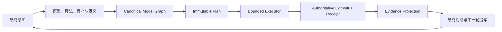
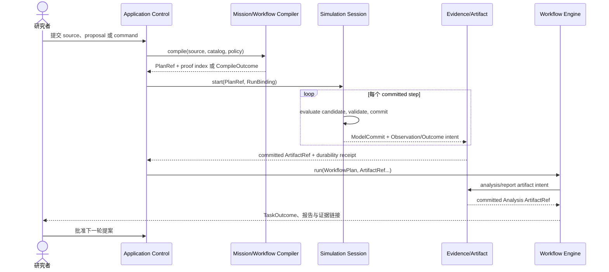
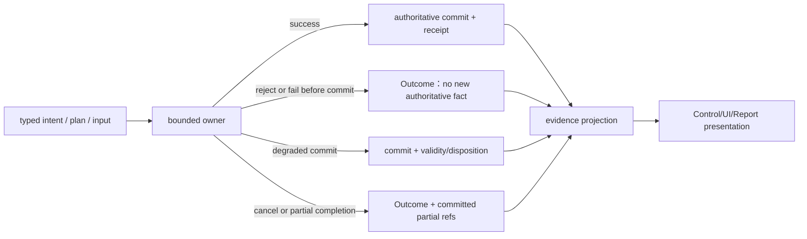
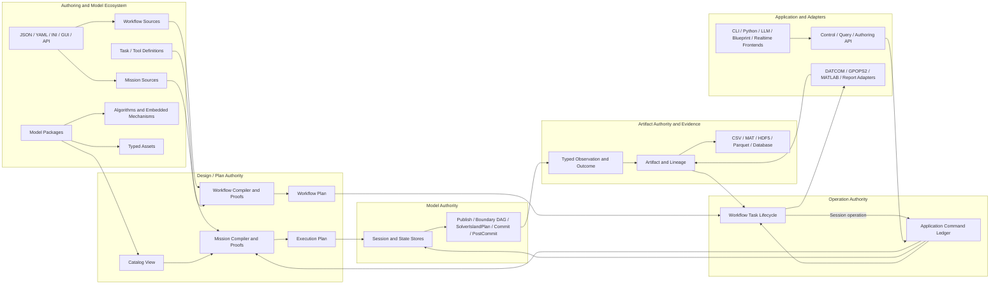
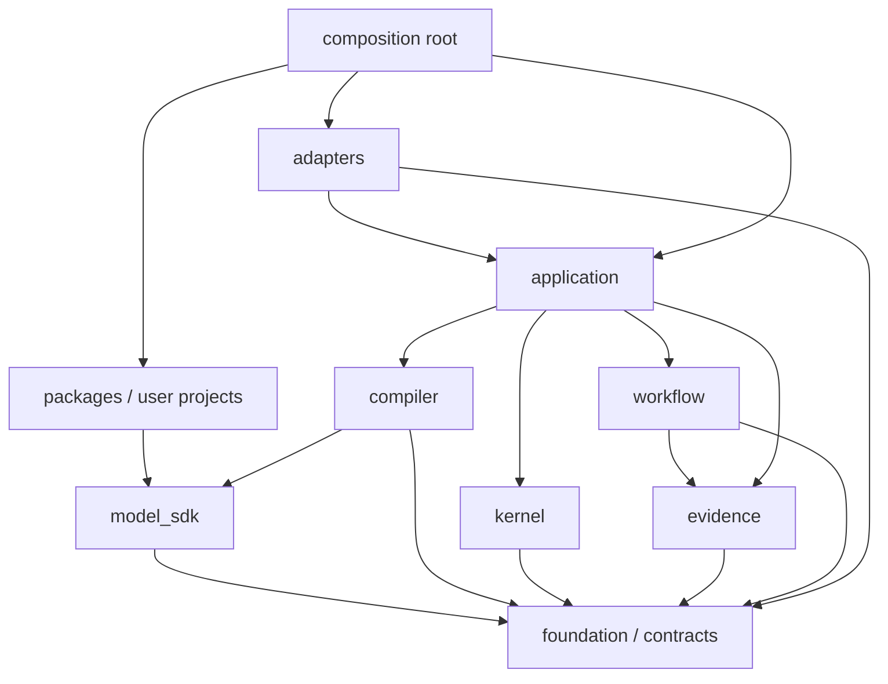

# 02｜系统架构蓝图与演进接缝

[上一册：当前架构深度审阅](01-current-architecture-deep-audit.md) · [返回总索引](README.md) · [下一册：数学与数值基础](03-mathematics-and-numerical-foundation.md)

## 主叙事｜从研究问题走到下一轮设计

本册是整套目标设计的全局叙事权威。后续分册分别放大数学、契约、模型、编译、运行、诊断、证据、工作流和前端；它们都要能还原到本节描述的同一条主线。局部设计若无法说明自己的上游、权威提交、下游和证据路径，应先回到本册修正关系。

### A. 一句话掌握系统

GNCZMKN 接受研究者表达的问题、假设、模型与算法，把它们编译为闭合计划；计划驱动 Session 产生唯一的 committed-state sequence；Observation、Outcome 和 Artifact 把运行事实组织成 Evidence Graph；Workflow 基于证据执行分析、优化、比较和报告，随后形成下一轮设计输入。



图中每个箭头都是有类型、可失败、可追踪的交接。架构边界来自这些交接需要保护的权威事实；目录、类名和部署进程只是实现投影。

### B. 外层：一项研究怎样完成

一项研究按以下顺序穿过整个系统：

| 阶段 | 研究者或上游提供 | 系统完成 | 主导 AuthorityDomain | 产生的稳定交接 |
| --- | --- | --- | --- | --- |
| 1. 定义问题 | 研究问题、假设、适用域、比较基线、验收指标 | 把目标写入 authoring source 或 Workflow source，并引用现有证据 | Design/Plan | 可定位的作者意图与 source identity |
| 2. 准备模型 | 算法公式、参数、气动/推进/传感器资产、数值策略 | package 形成 definitions、contracts、recipes、assets 和 reference evidence | Design/Plan | versioned DefinitionRef 与 AssetRef |
| 3. 编译方案 | Mission source、Catalog view、run/observation intent | Compiler 归一化、解析、绑定、证明、lower 和 freeze/link | Design/Plan | Canonical Model Graph、PlanRef、proof index |
| 4. 执行运行 | ExecutionPlanImage、RunBinding、授权命令、资源策略 | Operation owner 受理运行，Session 初始化 owner state、反复提交 step 并结束 | Operation + Model | operation receipt、ModelCommit 序列、Observation、RunOutcome |
| 5. 提交证据 | 已提交模型事实、诊断、指标和待持久化 payload | RecordPipeline/Artifact Store 校验、编码、持久化并登记谱系 | Artifact | committed ArtifactRef 与 Evidence Graph |
| 6. 研究加工 | ArtifactRef、Workflow Plan、人工审批 | Workflow 调用分析器、DATCOM、GPOPS2、绘图和报告适配器 | Operation + Artifact | TaskOutcome、Analysis Artifact、报告 |
| 7. 评审迭代 | 结果、适用域、误差、失败和对比证据 | 人或受控助手提出修改，审批后生成新的 authoring source | Design/Plan | 下一轮提案、批准记录与新的编译输入 |

这七个阶段构成研究论证闭环。一次研究可以包含一组 Experiment、许多 Simulation Session 和多条 Workflow 分支。外部工具只通过 Artifact 与这条主线交换数据；它们不会在模型 step 内启动进程或写报告。



### C. 中层：一次 Run 怎样完成

Compiler 已经完成模型选择、依赖绑定、端口因果、速率、`SolverIslandPlan`、transaction region、观测和资源规划。Session 因此不再解释 Mission，也不临时发现组件关系。一次 Run 的生命周期只有下列主干：

```text
admit operation
-> create/reset session bindings
-> initialize owned state and resources
-> repeat compiled step transactions
-> reach terminate / fail / cancel
-> finalize RunOutcome
-> close resources and seal run evidence
```

Run 内部有三类同时存在又各自独立的事实：

- Operation owner 记录 start、pause、resume、cancel 和 finalize 的处置状态；
- Session transaction 提交模型状态、控制状态和实体生命周期；
- Artifact owner 持久化运行清单、时序数据、诊断和结果证据。

某次 ModelCommit 成功后即成为模型事实。后续 ArtifactCommit 失败会让证据完整性降级，但不会倒写模型历史。一次 Run 失败时，已经提交的诊断和部分证据仍可保留，并由 validity 与 Outcome 明确其可用范围。

### D. 内层：一个 step 怎样形成唯一状态结果

一个 step 从 `t_k` 的 committed boundary 出发，以 `t_{k+1}` 的新 committed boundary 结束：

```text
PublishCommitted(t_k)
-> InvokeCompiled(boundary DAG)
-> AdvanceCandidate([t_k, t_{k+1}], solver islands)
-> Stage(all declared deltas/events/receipts)
-> Validate(ownership, epoch, invariants, commit set)
-> Commit(t_{k+1})
-> SealEvidence(commit-linked observation)
-> EffectAfterCommit(external effects and receipts)
```

这条顺序解释了运行时的全部关键约束：

- 模型求值只读已授权 view，返回 candidate 或 delta；
- 状态 owner 在 commit 前保持唯一，任何组件都不能越权原地写 committed state；
- Boundary DAG 决定同周期可见性，TemporalRelation 决定 current、held、delayed 或 sampled 关系；
- `SolverIslandPlan` 只共享编译期声明的 candidate state；
- 失败发生在 commit 前时，本 step 没有新模型事实；
- Observation 精确绑定 commit revision；
- 文件、网络和设备等不可逆效果位于 commit 之后，并产生独立 receipt。

03、04、12、13 决定“组件能够表达什么”；05 决定“这些表达怎样编译”；14 决定“一个 step 怎样闭合”；06 决定“多个 step 怎样组成 Run”。这四层关系给局部运行代码提供了固定上下文。

### E. 纵向走查一：新增一个多阶段制导律

新增多阶段制导律时，完整路径如下：

1. 研究者在 `user/<project>` 写纯 AlgorithmKernel、AlgorithmDefinition、适用域和公式级 reference；
2. 阶段切换、滞回和锁存作为 embedded mechanism 合入 Guidance Runtime Cell 的 StateFragment；
3. package/项目 definition 声明配置、输入输出 contract、recipe、obligations 和 observation projections；
4. Mission 只选择 definition、参数、资产与连接，不描述 C++ 对象布局；
5. Compiler 解析 occurrence，验证单位、frame、time、DecisionAuthority 和 port binding，把 recipe 展开为既有 obligations/regions；
6. Session 按计划调用 Guidance Cell，delta 经同一 StepTransaction 提交；
7. ObservationPlan 投影阶段、指令和误差，Dataset Sink 可以同时生成 CSV、MAT 或流式编码；
8. Workflow 运行基线对比、指标统计和报告模板，Evidence Graph 连接算法版本、Mission、Run 与结论。

该变化通常只触及 project/package、Mission 和 observation/workflow 配置。Kernel、Session 生命周期、Artifact identity 和前端命令语义保持稳定。若制导律要求新的步内原子提交或跨 clock 协调，再以通用执行语义进入 `KernelCapability` gate。

### F. 纵向走查二：DATCOM 到闭环论证报告

DATCOM 链路跨越多个执行尺度，完整路径如下：

```text
Geometry/condition Artifact
-> DATCOM Workflow Task
-> validated Aerodynamic Asset Artifact
-> package/model preparation input
-> Mission compile
-> trim / linearization / closed-loop Simulation Runs
-> metrics and margin Analysis Artifacts
-> figure/table/report tasks
-> Evidence Bundle
```

DATCOM adapter 负责外部进程、许可证、工作目录和文件协议；Artifact contract 负责气动数据的单位、轴系、网格、有效域和谱系；Aero ModelDefinition 只消费已验证资产；Session 只看到编译后的模型与运行输入；报告模板只消费 committed analysis artifacts。这样可以在替换 DATCOM 版本、MATLAB 脚本、绘图后端或 Word 模板时保持模型 step 和 Kernel 不变。

GPOPS2、论文复现、导航交班论证、Monte Carlo 和自动配平都沿同样的 Workflow/Artifact 主线组织。区别体现在 task grammar、Artifact schema 和分析算法，跨域交接方式保持一致。

### G. Python、LLM、蓝图和实时前端位于哪里

所有入口都投影到 Application Control Plane 的三类能力：

- **Authoring**：读取 schema/catalog，生成 source 或 proposal，再交给 Compiler；
- **Control**：提交 start/reset/step/pause/cancel 等有权限的 command，接收 receipt 与 Outcome；
- **Observation**：订阅 immutable snapshot、diagnostic、metric 和 ArtifactRef。

Python RL 环境把 reset/step 映射到普通 Session operation；LLM 生成可审阅 proposal；蓝图编辑器生成 authoring graph；UE、Godot 和 ImGui 提交 command 并渲染 snapshot。它们共享 identity、plan、commit、time 和 evidence 语义。前端增加便利性，不获得 Runtime Cell 指针或 `CommittedStateStore` 写权限。

### H. 新需求怎样进入这条主线

设计新能力时先写一段因果叙述：谁提出意图，谁拥有状态，何时生效，经过哪些提交点，怎样失败，最终由什么证据证明。随后再进行结构化分解：

```text
requirement story
-> ChangeCard or CapabilitySlice instances by authoritative fact
-> <AuthorityDomain, Delta<V,G,S,T,I,R,X>>
-> canonical grammar and PlanProofRecord
-> closed operators and commit semantics
-> typed cross-domain handoffs
-> extension seam and local code placement
-> success/failure evidence
```

治理深度与变化风险对应。单一权威域内、沿现有接缝完成、没有新增共享契约或执行语义的 A–E 类变化使用 `ChangeCard`；F 类、跨两个及以上 AuthorityDomain，或改变 identity、owner、time、commit、rollback、effect/shared contract 的变化使用完整 `CapabilitySlice` 与七维 ChangeVector。两者都用来阻止一个产品需求被粗暴塞进单个类。只有 Model Authority 缺少通用时间、原子性、rollback 或 effect 算子时，才评审 `KernelCapability`。

```yaml
change_card:
  requirement_story: "新增一个只读控制器 telemetry 字段"
  authority_domain: Model
  change_class: A
  input: occ:control.internal_state
  authoritative_output: observation-field:control.integrator_state
  seam: ObservationProjection
  failure_and_evidence: field-schema conformance fixture
  untouched: [SimulationKernel, ApplicationControlPlane]
  escalation_triggers: []
```

`ChangeCard` 一旦出现第二个 AuthorityDomain、新 owner、新 commit/rollback/effect，或 shared contract 变更，立即升级为 CapabilitySlice。它是简化入口，不提供绕过架构评审的路径。

以“把硬编码警告和异常改造成统一处置系统”为例，架构需求覆盖整条失败信息链：

1. contracts 定义稳定 Diagnostic code、subject、location、cause、severity 和 validity；
2. 发现问题的 Compiler、Session、Workflow 或 Artifact owner 产生 DiagnosticDraft；
3. 各权威域的 policy 在自己的 safe point 决定 reject、degrade、retry、cancel 或 terminate；
4. Outcome 记录该 owner 最终提交了什么、拒绝了什么以及证据引用；
5. Evidence 系统持久化因果链、commit refs 和运行上下文；
6. CLI、Python、GUI 和报告 adapter 分别渲染同一结构化事实。

由此可见，异常处置属于跨全生命周期的语义、决策和证据机制。单独建立一个全局 exception manager 仍会遗漏 owner、提交点、降级有效性和跨前端呈现。07 负责详细契约，02 负责保证它与整条架构主线闭合。

### I. 失败是每次权威交接的并行分支

主线中的每个 executor 都必须给成功、拒绝、失败、降级和取消一个权威结果：



不同权威域保留各自的原子边界：Compiler 失败时不发布 PlanRef；Model commit 前失败时不产生新 state revision；post-commit effect 失败时保留已经提交的模型事实并记录 effect outcome；Operation 被拒绝时不越权改写 Model；Artifact 验证或持久化失败时 staging payload 不成为稳定 ArtifactRef。共同 Diagnostic/Outcome schema 统一描述这些结果，各 owner 的 policy 决定本域处置。

### J. 局部设计的全局校验

任何类、接口、配置字段或目录进入计划前，都要在一行中写清：

```text
upstream committed input
-> local transformation and owner
-> authoritative output/receipt
-> downstream consumer
-> evidence and untouched stable regions
```

无法填写其中一项，通常意味着职责仍在多个尺度或权威域之间游移。后续第 1–16 节把本节主叙事投影为稳定语义、逻辑分区、执行语言、扩展接缝、压力地图、源码依赖和评审守卫；阅读它们时应持续回到上述输入—变换—提交—证据链。

## 1. 由主叙事推导出的架构结论

GNCZMKN 采用一条可重复实例化的稳定主轴：

```text
Intent Encoding + Definitions
    -> canonical intent / graph
    -> immutable plan
    -> bounded executor
    -> authoritative commit + receipt
    -> evidence projection
```

这条主轴分别形成 Mission/Simulation、Research Workflow 和 Application Control 路径，最后汇入 Evidence Graph。整体架构可以概括为“编译式语义图 + 分区事务执行 + 证据工作流”。核心含义如下：

1. 领域模型、算法和项目需求保持高频变化，通过 package 与 authoring schema 扩展；
2. Mission Compiler 与 Workflow Compiler 把开放语义消化成各自闭合、可检查、可解释的 immutable plan；
3. Simulation Kernel 只理解 Model Authority 的时间、状态所有权、端口因果、执行义务、事务提交、资源边界和 Outcome；
4. 仿真外的分析、工具调用、批量试验和报告由 Operation + Artifact 权威域承接；
5. CLI、Python、LLM、蓝图和实时前端共享 Operation Authority 的 Control API，不接触内核对象布局；
6. 每个域只因自身现有操作集缺少通用语义而扩充；Model Authority 的缺口才可能扩充 Kernel。

这条主轴是未来演进的设计中心。模块名称、类层次和目录可以调整，主轴上的三个架构防火墙必须长期稳定：

- **Plan Firewall**：作者输入与各域 executor 之间只通过已编译计划连接；
- **Commit Firewall**：每个 owner 只通过本域事务提交权威事实；
- **Artifact/Control Firewall**：不同执行路径通过 ArtifactRef、Observation、Command、receipt 与 Outcome 连接。

### 1.1 架构从一条语义主干推导

系统的整体感来自一条反复使用的语义主干。单次仿真、研究工作流和应用操作各自实例化这条主干，并在权威提交点衔接；各分区负责一种明确变换：

```text
authoring encodings
    -> canonical Model Graph
    -> immutable Execution Plan
    -> committed model-state sequence
    -> typed Observation / Outcome
    -> Evidence Graph
    -> presentation and storage encodings
```

单次仿真路径上有四种长期权威形态：

| 权威形态 | 回答的问题 | 典型对象 | 禁止混入 |
| --- | --- | --- | --- |
| Canonical Model Graph | 世界中有哪些实体、状态 owner、模型、连接和研究意图 | Mission IR、contracts、model occurrences、binding intents | JSON/YAML 特性、运行指针、文件 sink |
| Execution Plan | 该模型图怎样按时间、因果和资源约束执行 | Descriptor/Image、regions、callsites、solver/transaction plans | 作者语法、领域角色分支、UI layout |
| Committed Model State | 某个 committed boundary 上哪些物理与离散事实成立 | state/output/control stores、state epoch、tick | staged candidate、报告缓存、外部文件状态 |
| Evidence Graph | 哪些输入、运行、指标和产物支撑研究结论 | Observation、Outcome、Artifact、lineage | Runtime Cell 指针、可变模型状态、隐式临时文件 |

源文件是作者意图的编码，CSV、MAT、HDF5 和图表是证据的编码。编码可以更换，链中间的语义权威保持稳定。JSON 切换为 YAML 或 INI，只替换进入 Model Graph 前的 Source Frontend；CSV 切换为 `.mat`，只替换 ObservationBatch 之后的 Dataset Sink。两类变化都不能渗入模型包、执行计划的物理语义或 Kernel。

Compiler 和 Kernel 的职责也由这条路径直接得到：Compiler 证明 Model Graph 能否降级为闭合计划；Kernel 只负责让一个计划产生唯一的 committed-state sequence；Evidence 只投影已提交事实。Workflow 另有自己的 Workflow Graph、Plan、operation lifecycle 和 ArtifactCommit，并通过 committed ArtifactRef 调用或消费仿真，不进入 Model Authority。

### 1.2 需求抽象采用“权威域 + 七维变化向量”

高风险或跨域需求先拆成语义切片，随后才讨论类、接口和目录：

```text
Requirement N
-> { CapabilitySlice_i }

CapabilitySlice_i = <AuthorityDomain_i, Delta_i>
Delta_i = <V, G, S, T, I, R, X>
```

`AuthorityDomain` 回答“哪一类权威事实可能改变”，七维向量回答“该事实的哪些语义发生变化”。完整 CapabilitySlice 缺少其中一项时，需求仍停留在产品描述层。普通局部变化由 ChangeCard 保存同一组问题的最小答案。

| 维度 | 核心问题 | 开放语法 | 必须闭合的约束 |
| --- | --- | --- | --- |
| `V` Vocabulary | 新增了哪些物理、算法或研究概念 | stable Definition、Contract、Schema、Asset、Policy | identity、version、unit/frame/domain、compatibility |
| `G` Graph and Topology | 实例、关系、作用域和生命周期怎样组织 | Occurrence、Entity、Relation、Selector、Authority、Topology intent | ownership、cardinality、visibility、binding、lifecycle completeness |
| `S` State and Evolution | 权威事实怎样随方程、命令和外部条件变化 | StateOwner、Kernel、Reducer、Intervention、Transition、Invariant | single writer、complete mapping、causal inputs、rollback-safe delta |
| `T` Time and Atomicity | 何时采样、求值、求解、可见和提交 | Clock、TemporalRelation、Event、SolverScope、Transaction、Effect boundary | rate/freshness、DAG、solver closure、commit set、safe point |
| `I` Information, Authority and Evidence | 谁能知道、决定和证明什么 | Truth、Measurement、Estimate、Message、Command、Observation、Outcome、Lineage | access path、DecisionAuthority、quality、provenance、validity、evidence completeness |
| `R` Representation and Encoding | 同一语义怎样被书写、序列化和呈现 | Source Frontend、Dataset Sink、Schema Mapping、Protocol Codec | semantic equivalence、round-trip、migration、loss declaration |
| `X` Execution Context and Resources | 在何种进程、设备、工具和预算下执行 | Backend、Endpoint、Resource/License/Security Policy | BackendCapability/endpoint support negotiation、capacity、deadline、isolation、effect policy |

七维来自语义主干上的七个不可互相代答的问题：存在什么、怎样组合、怎样演化、何时生效、谁能知晓/决定/举证、怎样编码、在哪里以何种资源执行。它们是评审坐标，代码中不建立七个 manager。若未来需求无法进入这七维，提案需要证明它引入了一个可独立变化、无法由现有维度组合表达的新问题，再修改架构宪章。

表示与承载分成 `R/X` 两维，因为更换 YAML 和迁移 GPU 可以独立发生。规模本身也不形成额外维度：实体数、采样率、时长和并发度只改变容量时归入 `X`；若它们改变拓扑、数值近似、因果顺序或原子边界，再分别增加 `G/S/T` delta。保真度按实际影响拆到 `V/S/T/I/X`。

`Delta=0` 也有明确含义：纯重构、等价性能优化和实现缺陷修复不增加能力语义，需要提交 preservation proof 与 regression evidence。若“修复”实际改变物理约定、时间结果或有效性判断，就按对应非零维度处理，不能借 bug 标签绕过设计审阅。

一个自然语言需求可以产生多个 CapabilitySlice。以“自动调用外部气动工具并用结果运行闭环仿真、生成报告”为例，它至少包含 Plan、Operation、Artifact 和 Model 四个权威域的切片，因此直接进入完整表单。单个 package 内新增纯 AlgorithmKernel，且 contracts、owner、time 和 evidence route 保持不变时，ChangeCard 已足够。任何产品名称都只充当验证场景，不能直接成为 Kernel 分支或全局服务。

七维向量回答“语义改变了什么”，AuthorityDomain 回答“谁有提交权”。第 9 节的 A–F 分流继续回答“实现落到哪个接缝”。三步依次完成，才进入对象设计。

### 1.3 开放语义、分区封闭执行、证据闭环

目标架构遵循一条可重复实例化的语义主干：

```text
intent encoding
-> canonical intent / graph
-> immutable plan
-> bounded executor
-> authoritative commit + receipt
-> evidence projection
```

系统允许领域语汇、工作流任务和交互入口持续增长；每个拥有提交权的边界只接受本域有限操作集。研究工作流、应用控制和数据持久化因此拥有自己的闭合语言，无需借用 Simulation Kernel 表达离线任务、审批或文件提交。

四类长期权威域如下：

| AuthorityDomain | 权威事实 | 典型 owner | 主要提交结果 |
| --- | --- | --- | --- |
| Design/Plan Authority | versioned Definition、canonical graph、绑定结果、执行选择和版本锁 | Package/Catalog + Mission/Workflow Compiler | definition release 或 immutable Descriptor/Plan + proof index |
| Model Authority | 物理、离散、控制、实体生命周期状态 | Simulation Session transaction | ModelCommit + state/topology revision |
| Operation Authority | command ledger、task/operation lifecycle、审批和资源占用 | Application/Workflow operation owner | acceptance/application/task receipt + Outcome |
| Artifact Authority | immutable payload、dataset、manifest、lineage 和有效性 | RecordPipeline/Artifact Store | EvidenceCommit/ArtifactCommit + durability receipt |

四域来自系统可对外宣称的四类事实：版本化定义或可执行设计已经冻结、模型世界已经推进、某项工作或命令已经处置、某份证据已经持久化。`Plan` 是工作表中的简写，同时覆盖 immutable package/task definitions、canonical graphs 和 compiled plans；author working copy 仍由 workspace/user 拥有。一个对象同时参与多域时必须拆开提交结果，例如 Run 可以同时拥有 ModelCommit、OperationOutcome 和 ArtifactCommit，三者状态分别可查。未来若出现第五类权威事实，新增 AuthorityDomain 需要证明它无法归入这四类，并给出独立 owner、commit、rollback、receipt 与 evidence 语义。

AuthorityDomain 是语义边界，首版可以全部位于同一进程、使用普通 C++ 对象和本地目录。它不要求微服务、全局 service locator 或统一基类。一个 owner 不能直接写另一个域的权威状态，只能提交 typed intent、immutable ref、receipt 或 Outcome。

### 1.4 各权威域的封闭操作语言

各域共享“先计划、后验证、再提交、留证据”的结构，同时保留不同的原子性：

| 权威域 | v1 操作族 | 不能越过的边界 |
| --- | --- | --- |
| Design/Plan | definition publication：`Declare -> Validate -> Version -> PublishDefinition`；plan compilation：`Normalize -> Resolve -> Prove -> Lower -> Freeze` | package publication 与 plan freeze 均不推进模型时间，不启动外部工具 |
| Model | `Publish -> Invoke -> Advance -> Stage -> Validate -> Commit -> Seal -> Effect` | model commit 不等同于文件持久化或 task 成功 |
| Operation | `Admit -> Authorize -> Reserve -> Invoke -> Observe -> Cancel/Finalize` | task/command owner 不直接改 `CommittedStateStore` 或 Artifact bytes |
| Artifact | `BeginStage -> Produce/EncodePayload -> ValidateArtifact -> CommitArtifact(with lineage) -> PublishRef` | staging 文件不成为稳定输入，编码不改科学语义 |

Simulation Kernel 的精确基础算子为：

| 执行算子 | 输入与输出 | 保证 |
| --- | --- | --- |
| `PublishCommitted` | committed state -> read-only views | 不推进状态；同一 revision/epoch 可查 |
| `InvokeCompiled` | callsite + authorized views -> result/delta | 无运行期发现；写集受 owner 限制 |
| `AdvanceCandidate` | solver scope + interval model -> candidate | 候选态与 committed state 隔离 |
| `Stage` | typed delta/event/receipt -> transaction journal | 变更尚未取得权威性 |
| `Validate` | complete staged set -> validation outcome | schema、invariant、resource 与 commit set 闭合 |
| `Commit` | validated transaction -> new state/topology/control revision | 原子产生唯一 committed boundary |
| `SealEvidence` | commit/outcome + projectors -> immutable observation | 证据精确绑定 commit |
| `EffectAfterCommit` | committed effect intent -> external receipt/outcome | 不可逆效果不伪装成模型回滚 |

execution obligation、region、`SolverIslandPlan`、StepTransaction 和 lifecycle plan 都是 Model Authority 算子的编译组合。Workflow task lifecycle 由 Operation + Artifact 两域的算子组合；Application command lifecycle 由 Operation 算子组合；Source/Dataset adapter 只改变 `R` 维映射。上述算子名称表达语义责任，不要求为每个名称创建一个 runtime class。

跨域调用必须产生可追踪交接：Package/Catalog 向 Compiler 提供 immutable DefinitionRef；Compiler 返回 PlanRef 和 proof index；Application/Workflow 以 PlanRef、RunBinding 和 command 提交 Session operation；Session 返回 RunOutcome、Observation 与 Artifact intent；Artifact Store 返回 committed ArtifactRef；Workflow 只消费 committed ref。任何跨域 shortcut 都视为闭包失败。

跨域状态不能压成一个 success 布尔值：

| 事实组合 | 权威解释 |
| --- | --- |
| plan freeze 失败 | 无可执行 PlanRef，下游 operation 不得启动 |
| ModelCommit 成功、ArtifactCommit 失败 | 模型事实保留；证据 `EvidenceValidity` 为 `Invalid` 或 `Partial`，具体 reason 记录 durability failure |
| Session run 失败、diagnostic ArtifactCommit 成功 | 运行失败，失败证据仍完整可查 |
| command admission 被拒绝 | Operation receipt 为 rejected，Model Authority 没有变化 |
| Workflow task 失败且已有 Partial Artifact | TaskOutcome 与 Artifact validity 分别记录，下游按 contract 决定是否可消费 |

### 1.5 扩展闭包与 Kernel 准入推导

统一支持判据作用于需求分解后的每个切片：

```text
SliceClosed(c)
  = AuthorityAssigned(c)
  && GrammarClosed(c)
  && ProofClosed(c)
  && OperatorClosed(c)
  && CommitClosed(c)
  && EvidenceClosed(c)

Supported(N)
  = DecompositionComplete(N)
  && every SliceClosed(c_i)
  && HandoffClosed(N)
```

`GrammarClosed` 表示该域的 canonical graph/intent 能完整表达概念、关系与演化意图；`ProofClosed` 表示对应 Compiler 能证明绑定与约束；`OperatorClosed` 表示计划只使用本域已声明操作；`CommitClosed` 表示成功、失败、取消和部分完成拥有唯一权威结果；`EvidenceClosed` 表示结论与降级可追踪；`HandoffClosed` 表示跨域数据只通过 typed ref/intent/receipt 流动。只画接口、预留 callback 或列出未来模块无法满足该判据。

各域的 proof payload 可以不同，但都形成可索引的 `PlanProofRecord`，并回答七类问题：

1. **身份闭合**：Definition、Entity、Task、Parameter、Contract、Field 和 Artifact 都有稳定 identity/version；
2. **所有权与权限闭合**：每个可变事实只有一个 StateOwner，每项决策只有一个 DecisionAuthority，每个外部 effect 都有明确 PermissionGrant；
3. **因果闭合**：每个读取都有 typed source、授权路径和时效；
4. **时间与生命周期闭合**：clock、rate、event、task state、visible point 和 commit boundary 明确；
5. **状态与转换闭合**：初态、transition mapping、invariant、reset/checkpoint、取消和失败回滚完整；
6. **资源与效果闭合**：容量、许可证、外部 effect、实时预算和处置策略在 plan 中声明；
7. **证据闭合**：关键输入、决策、状态变化、有效性、receipt 和输出都有 lineage route。

只有 Model Authority 切片缺少通用时间、原子性、rollback 或 effect 算子时，才进入 `KernelCapability` gate。Workflow 切片的缺口进入 Workflow Engine，Operation 切片的缺口进入 Control/Task protocol，Artifact 切片的缺口进入 Store/Sink contract。由此可从“步内形成多个模型提交点”和“原子改变运行图与 solver membership”推导 `SegmentTransaction` 与 `TopologyTransaction`，无需从飞机触地或火箭分离等产品名称反推内核类型。

### 1.6 前瞻兼容与防御式编程的分界

前瞻架构处理合法需求空间：先找出可独立变化的语义维度，稳定 identity、owner、contract、time、commit 和 evidence 规则，再提供 grammar、lowering 与 typed support negotiation。防御式编程处理已声明空间中的非法值、非法组合和失败边界，通过 schema、invariant、Diagnostic 与 rollback 拒绝或隔离。

“为未来预留”在本框架中具体指：

- ID、schema、handle 和 lineage 不绑定当前容器、文件格式或单实体假设；
- Compiler 可以表达 unsupported required operator/support，并指出缺少的 proof/operator；
- Model Graph 与 Plan 保留清楚的版本和迁移边界；
- 后续 `KernelCapability` 可以增加一个通用算子，同时复用现有领域模型和证据身份；
- 当前实现仍选择最小可用路径，例如静态 topology、AtGrid event 和本地 Artifact Store。

空 callback、万能 context、全局 registry、宽松默认和提前建立的大型抽象层不提供这种兼容性；它们只把未知语义推迟到运行时。

## 2. 稳定核心与高变化区域

架构需要提前保护变化密度最高的位置，同时避免把每种未来功能预装进 framework。

### 2.1 长期稳定的语义

| 稳定语义 | 原因 |
| --- | --- |
| identity 与版本 | 复现、缓存、诊断和跨进程引用都依赖它 |
| unit、frame、time、quality | GNC 数据交换必须共享同一物理语言 |
| state ownership | 避免多个对象同时修改同一权威状态 |
| typed port 与 temporal relation | 决定数据因果和多速率语义 |
| compile-before-run | 把配置错误、依赖缺口和代数环移出热路径 |
| transaction/commit | 保证失败、终止、取消和观测具有唯一状态结果 |
| Diagnostic、Outcome 与 evidence lineage | 研究结论需要可解释、可复核 |
| application boundary | 多入口共享相同权限、命令和生命周期语义 |

### 2.2 允许持续变化的区域

| 高变化区域 | 主要承载位置 |
| --- | --- |
| 配置语法、数据文件和存储介质 | Source Frontend + Dataset Sink/Artifact Storage Adapter |
| 制导、导航、控制及论文算法 | project/domain package 的纯算法与 behavior composition |
| 气动、推进、质量、执行机构和传感器模型 | Model Package definitions、assets 与 Runtime Cell recipes |
| 状态机、滞回、限幅、故障锁存、交班协议等局部工具 | model SDK 的可嵌入 mechanism；状态归宿主 cell 所有 |
| 飞行器类型与任务拓扑 | package contracts + Mission graph + Compiler lowering |
| 连续强耦合与不同保真度 | `SolverIslandPlan` definition 与数值 package |
| 观测字段、指标、图表和报告 | Observation projection + Workflow task/template |
| DATCOM、GPOPS2、MATLAB、Origin 等工具 | Workflow Adapter |
| Python、RL、LLM、蓝图和游戏前端 | Application/Authoring/Control Adapter |
| 并行、进程隔离、实时调度和硬件桥接 | execution backend 与 External Endpoint adapter |

稳定核心只提供高变化区域需要依附的接缝。新增 package、algorithm、mechanism、workflow 或 frontend 不应要求 Kernel 增加领域分支。

## 3. 系统整体形态



图中有两条独立循环：

- **仿真闭环**：Plan 驱动 Session，Session 在事务边界上推进模型；
- **研究闭环**：Artifact 驱动分析、优化、比较和报告，结果可以生成新的 authoring source。

研究闭环可以调用多次仿真闭环。外部工具、报告生成和批量调度不进入单步推进路径。

## 4. 五个架构分区

这里使用分区描述变换责任和依赖关系。五个分区承载 Design/Plan、Model、Operation 与 Artifact 四类权威域及其转换，没有按每个名词建立一个层；同一分区可以包含多个窄 owner，同一 owner 只能提交一种权威事实。

### 4.1 Model Ecosystem

负责表达“仿真什么”：

- Domain Contract；
- Model Definition 与配置 schema；
- Algorithm Definition/Kernel；
- embedded mechanism 与 Runtime Cell Recipe；
- typed Asset；
- package 级 reference case、成熟度和适用域声明。

Model Ecosystem 可以高速演进。它只能依赖 foundation、domain contracts 和窄 model SDK，不依赖 Mission parser、Session、Artifact Store、CLI 或具体记录后端。

### 4.2 Semantic Compiler

负责证明“这个模型图能否运行”：

- source 解析、schema 迁移和默认值物化；
- package/version/asset resolution；
- port binding、unit/frame/time compatibility；
- topology、StateOwner/DecisionAuthority、single-writer 和 dependency DAG；
- rate/clock/freshness/hold 规划；
- execution obligation lowering；
- `SolverIslandPlan` 和 transaction region 生成；
- observation、diagnostic、resource 与 policy plan；
- 输出 portable `ExecutionPlanDescriptor`，随后无选择语义地 link 为 process-local `ExecutionPlanImage`。

Compiler 是架构的变化吸收器。新的 package、组合工具和 authoring frontend 优先转化为已有计划语义；Kernel 无需理解源配置形式。

### 4.3 Transactional Execution Substrate

负责“按计划可信地推进”：

- Session 与 run 生命周期；
- committed state/output/control stores；
- clock、tick、rate 和 safe point；
- plan region 执行；
- solver/integrator orchestration；
- model delta 校验、commit 与 rollback；
- command、event、cancel、checkpoint 和 resource lease；
- ObservationSeal、Outcome 与 post-commit effect coordination。

Kernel 不含 guidance、aero、mass、sensor、vehicle type 或 UI 分支。它只调度计划中已经 link 的 execution obligations。

### 4.4 Evidence and Research Services

负责“如何证明和复用结果”：

- typed observation、metrics 和 Run Manifest；
- Artifact identity、hash、lineage 和 durability；
- Experiment case materialization；
- Workflow DAG、cache、retry、manual gate；
- 外部工具、图表、报告和论文复现任务。

该分区只消费公开 Observation、Outcome、Artifact 和 Application API，不读取 `CommittedStateStore`、CycleFrame 或 Runtime Cell 内存。

### 4.5 Application and Adapters

负责“谁以何种方式使用系统”：

- compile/link/session/workflow application services；
- command、query、event 和 authorization；
- CLI、Python、LLM、蓝图、Web 与实时前端；
- 本地进程、worker、IPC、HIL 和游戏引擎适配。

入口变化不改变领域模型和单步语义。高频快照可以使用专用 buffer transport，但 identity、schema、time 和 PermissionGrant 仍受 Control/Observation contract 约束。

## 5. Kernel 的最小稳定语言

Kernel 面向执行语义设计，不面向领域角色设计。其长期词汇限定为：

1. identity 与 immutable plan；
2. owned state block 与 read view；
3. typed port、temporal relation 和 clock domain；
4. execution region 与 execution obligation；
5. candidate/delta、transaction 和 commit；
6. resource lease、external source/effect boundary；
7. Diagnostic、StepOutcome 与 RunOutcome。

### 5.1 Execution Obligation

`RuntimeComponentDescriptor` 经 Compiler lowering 后形成下列基础义务。它们按时间和副作用语义划分，避免按 Guidance、Controller、Aero、Sensor 等领域名称扩展 Kernel。

| Obligation | 调用位置 | 允许结果 |
| --- | --- | --- |
| `PublishProjection` | committed boundary | truth/view/sample projection |
| `BoundaryEvaluation` | publish 后的 DAG region | typed outputs、instant delta、events、diagnostics |
| `IntervalEvolution` | 区间模型 region | interval candidate/interval model write |
| `DerivativeEvaluation` | `SolverIslandPlan` stage | derivative/closure outcome |
| `SourceFreeze` | safe point | immutable input batch + cursor candidate |
| `PostCommitEffect` | ModelCommit 后 | effect receipt/outcome |
| `ResourceLease` | session/run lifecycle | acquire/rollback/close actions |

一个 Runtime Cell 可以声明多个 obligation。常见的 sampled transform、discrete processor、continuous owner、coordinator、evaluator 和 endpoint 是 model SDK 提供的 `RuntimeCellProfile`；Compiler 将 RuntimeCellProfile 展开为 obligation set，Kernel 不根据其名称执行 `switch`。

新增 `RuntimeCellProfile` 只增加 SDK recipe。新增 Kernel obligation 必须证明现有义务无法表达其时间、原子性或副作用语义。

### 5.2 Execution Region

Compiler 把 obligation callsite 编译为五类 region：

```text
Publish Region
-> Boundary DAG Region(s)
-> Integration / SolverIslandPlan Region(s)
-> ModelCommit + ObservationSeal
-> PostCommit Region
```

- Publish Region 只从 committed state 生成本周期基准视图；
- Boundary DAG 通过 typed port edge 和 temporal relation 排序；
- `SolverIslandPlan` 对一个明确耦合集合负责 candidate-state evaluation；
- Commit 统一检查 owner、epoch、invariant 和 terminal branch；
- PostCommit 调用计划绑定的 effect/observation ports 并收集 receipt；外部效果实现和证据持久化仍归 adapters/evidence services。

未来增加线程池、GPU、实时 pacing 或 worker backend 时，可以替换 region executor。计划语义、commit 边界和模型代码保持一致。

### 5.3 Runtime Cell 的资格

模型满足以下任一条件时才形成独立 Runtime Cell：

- 拥有独立权威状态与 reset/checkpoint 边界；
- 拥有独立 clock、rate、trigger 或 deadline；
- 拥有独立 command DecisionAuthority 或共享状态发布责任；
- 拥有独立 failure/termination domain；
- 持有需要独立管理的运行资源；
- 其输出被多个 owner 作为稳定 contract 消费。

局部算法、状态机、滤波器、滞回、限幅器、插值器、故障锁存和小型求解器优先嵌入宿主 cell。工具是否复杂、代码是否复用、类是否独立，都不足以赋予它运行身份。

## 6. Runtime Cell Recipe 与内部行为组合

Package 作者通过 `RuntimeCellRecipe` 描述一个运行边界：

```text
RuntimeCellRecipe
  definition and configuration schema
  state schema fragments
  input/output contracts
  behavior composition
  execution obligations
  resource/lifecycle declarations
  observation projections
  verification references
```

`behavior composition` 由纯 AlgorithmKernel、显式 Adapter 和可嵌入 mechanism 组成。Compiler/SDK 在构建 descriptor 时完成以下工作：

1. 合并 mechanism state fragment 到宿主 StateSchema；
2. 把局部输入输出映射编译进宿主 obligation entry；
3. 验证局部写入最终只落到宿主 owner block 或正式 output；
4. 生成 config/documentation/blueprint metadata；
5. 消除局部 mechanism 的运行身份。

状态机只是 mechanism 的一种。抗饱和、滤波、故障锁存、交班协议、增益调度、限幅、debounce、缓存策略和局部数值迭代都遵循同一嵌入规则。它们不获得 Session identity、独立端口、调度、logger 或 resource lifecycle。

共享飞行阶段、导航源选择或物理构型需要多个组件一致观察时，应建立窄 Runtime Cell 作为 StateOwner/DecisionAuthority；内部仍可使用状态机或其他 mechanism。组件资格来自共享权威边界，与所选工具类型无关。

具体组合规则见 [13｜行为组合、嵌入机制与共享权威](13-behavior-composition-and-extension-mechanisms.md)。

## 7. 九类扩展接缝

九类接缝是 1.1 变换链在源码和 API 上的受控出口。它们不会演变成九套独立运行框架；同一需求仍由一条主要变换路径负责。

| 接缝 | 吸收的变化 | 权威产物 | Kernel 是否变化 |
| --- | --- | --- | --- |
| Domain Contract seam | 新物理量、命令、事件和资产语义 | versioned contract/schema | 否 |
| Model Package seam | 新算法、模型、飞行器和论文复现 | definitions/recipes/assets/evidence | 否 |
| Behavior Composition seam | 组件内部逻辑膨胀与复用 | pure kernels + embedded mechanisms | 否 |
| Graph/Topology seam | 新组件连接、多飞行器和预声明实体 | Mission IR + Binding/Topology Plan | 通常否 |
| Solver seam | 强耦合、不同保真度和候选态闭合 | `ClosurePlan` / `SolverIslandPlan` | 已有 region 可表达时否 |
| Observation seam | 新字段、指标、显示、MAT/HDF5/数据库等数据编码 | projection/schema/dataset sink | 否 |
| Workflow seam | DATCOM、优化、批量、图表和报告 | task definitions + Artifact DAG | 否 |
| Application seam | JSON/YAML/INI/GUI source frontend、Python、LLM、蓝图和审批 | SourceTree/SourceMap + command/query/proposal DTO | 否 |
| Execution Backend seam | 线程、worker、实时宿主、HIL transport | region executor/endpoint adapter | 计划语义不变时否 |

七维变化与九类接缝是“语义维度—实现落点”的多对多投影：`V` 通常进入 Contract/Package/Behavior/Task，`G` 进入 Contract/Model Graph/Workflow Graph，`S` 进入 Package/Behavior/Solver/operation lifecycle，`T` 进入 Graph/Solver/Workflow/Backend 或相应语义准入门，`I` 进入 Contract/Control/Observation/Workflow，`R` 进入 Source/Dataset/Protocol adapter，`X` 进入 Workflow/Application/Backend/resource policy。AuthorityDomain 再决定该接缝可以提交 Design/Plan、Model、Operation 或 Artifact 中哪一类事实。接缝数量来自职责与依赖方向，维度数量来自需求语义；两套分类不能互相替代。

接缝代表受约束的变化通道，不要求每一项都拥有一个通用基类。C++ 内部可以使用显式类、自由函数、窄模板或生成代码；稳定性来自输入输出契约、编译检查和事务语义。

## 8. 未来膨胀压力地图

本节列出长期压力面，用于检验“AuthorityDomain + 七维变化向量”的组合闭包。这些压力面仅作为测试输入，彼此不形成独立架构模块，也不构成有限需求目录。任何未列需求仍先拆 CapabilitySlice，再推导各域的 grammar、proof、operator、commit、handoff 和 evidence route。

### 8.1 表示形式增长

**信号**：配置从 JSON 扩展到 YAML、INI、GUI 或程序化 builder；时序数据需要 MAT、HDF5、Parquet、数据库或网络流。

**架构响应**：Source Frontend 只负责语法、位置和 SourceTree；Dataset Sink 只负责 FieldSchema/ObservationBatch 到具体编码的映射。相同语义输入生成相同 canonical Model Graph hash，相同 ObservationBatch 可以被多个 sink 并行编码。格式依赖和第三方库停留在 adapters。

### 8.2 领域模型数量增长

**信号**：导弹、卫星、火箭、飞机、地面载体以及不同论文模型持续增加。

**架构响应**：按 package namespace 管理 definitions、contracts、assets 和 evidence；Compiler 只读取 contribution。Kernel 保持无领域枚举。相同物理语义优先复用 contract，不强求模型共享继承层次。

### 8.3 组件内部结构增长

**信号**：一个控制器开始包含状态切换、滤波、抗饱和、故障处理、增益调度和多种算法公式。

**架构响应**：通过 Runtime Cell Recipe 组合 AlgorithmKernel、mechanism 和 Adapter；state fragment 合并到唯一 owner。只有出现独立 clock、DecisionAuthority、resource 或共享输出时才拆 Runtime Cell。

### 8.4 跨组件与跨实体信息增长

**信号**：组件依赖 lookup、priority 或共享可变对象；多飞行器需要相对几何、传感、数据链和协同状态。

**架构响应**：依赖提升为 typed port + temporal relation。每个 form 发布 entity-scoped truth contract，Compiler 为获得授权的 interaction、sensor 或 evaluation 生成窄 entity selector/view；系统不建立全局可写 truth bus。机间通信通过带延迟、带宽、丢包和时钟语义的 link model 传递 Message/Measurement，无法借用 truth view 跳过传感与通信模型。

### 8.5 物理保真度、混合约束与连续耦合增长

**信号**：质量、推进、气动、执行机构、弹性体、液体晃动、热/电系统或地面接触需要共享 candidate state。

**架构响应**：先以独立 ModelDefinition 表达 FidelityLevel，再把强耦合集合编译为 `SolverIslandPlan`。地面接触、碰撞和约束力使用 terrain/contact contracts 与 solver membership；简化地面运动和空中动力学的切换使用显式 state mapping/event plan。步内撞击或跳变需要 `SegmentTransaction` KernelCapability。

### 8.6 实体生命周期与拓扑增长

**信号**：多级分离、母体投放子体、对接、碰撞碎片、编队和星座等实体关系增加。

**架构响应**：v1 使用编译期实体图和 inactive entity activation，已知子体通过 typed parent-to-child state mapping 在事务内激活。未知数量实体、运行期连接重写、动态 solver membership 和中途 plan revision 进入 `TopologyTransaction`。EntityId、state/port access 和 observation 从首版起使用稳定 handle/selector，禁止把数组下标或裸指针写入领域契约。

### 8.7 时间模型增长

**信号**：多速率、异步传感器、自适应积分、事件定位、实时 pacing、通信时钟或 UTC/TAI/TT/TDB 等天文时间尺度出现。

**架构响应**：普通变化落到 clock/rate/temporal relation、TimeScale contract 和 execution backend。步内 jump、partial commit、跨 clock 原子协同或可变步长观测边界会触发 Kernel semantic ADR。模型字段不能默认使用无 epoch、无 time scale 的裸 `double seconds`。

### 8.8 数据规模与观测需求增长

**信号**：更多字段、高频可视化、可变维数据、大规模 Monte Carlo、数据库检索或不同报告模板。

**架构响应**：ObservationPlan 负责投影和采样，Dataset Sink 负责格式与 transport，Artifact Store 负责寻址和持久化，Workflow 负责聚合。模型不保存“为了画图”的第二份状态。

### 8.9 不确定性、故障试验与训练规模增长

**信号**：新增拉偏量、相关参数分布、阵风/扰动、舵机卡死、发动机失效、传感器退化、打靶和 RL episode 持续增加。

**架构响应**：固定 case 差异物化为 CompilePatch 或 RunBinding；随时间变化的扰动进入 typed signal；可触发故障进入模型声明的 command/event 与 owner state。Experiment 只依赖稳定 ParameterId/CommandId，不理解各组件成员布局。并行与远程执行属于 workflow backend。

### 8.10 外部工具、联合仿真与格式增长

**信号**：DATCOM、MATLAB、Origin、Excel、Word、FMI/FMUs、Simulink 或其他气动数据库持续加入。

**架构响应**：离线工具通过 Workflow/Artifact adapter；步进式联合仿真通过 `ExternalEndpoint` 和明确 clock/rollback contract。工具路径、命令行、模板、进程协议和文件格式不进入 Runtime Cell。

### 8.11 语言、AI 与可视化入口增长

**信号**：Python、Lua、LLM、ComfyUI 风格蓝图、UE、Godot 和 ImGui 同时存在。

**架构响应**：authoring 工具生成 source/proposal，控制工具调用 Application API，显示工具订阅 immutable snapshot。所有入口共享 Compiler diagnostics、authorization 和 Outcome。

### 8.12 性能、部署与硬件增长

**信号**：单进程性能不足，需要线程池、worker、GPU、HIL、实时宿主或分布式联合运行。

**架构响应**：ExecutionPlanDescriptor 保持 portable，Image 绑定本地 backend；region executor 与 endpoint adapter 承担部署差异。数值顺序、原子性或确定性契约发生变化时增加显式 `BackendCapability` 与 plan requirement。

### 8.13 可靠性与治理增长

**信号**：外部调用、自动化入口、模型故障场景和证据要求增加。

**架构响应**：模拟故障是模型支持的有效输入与状态，Framework failure 才进入 Diagnostic/Outcome 处置。两者通过不同 contract 表达。Diagnostic code、policy、DecisionAuthority、resource budget 和 EvidenceCriticality 在编译/应用边界显式声明；全局 logger、全局异常处理器或隐式重试器不能形成隐藏控制流。

## 9. 新需求的架构分流规则

每个新需求先归入下列一种变化类别：

| 类别 | 典型变化 | 应修改的位置 |
| --- | --- | --- |
| A：模型变化 | 新公式、新参数、新资产、新论文算法 | project/package definition + kernel function |
| B：局部行为变化 | 状态切换、滤波、锁存、协议、限幅 | embedded mechanism + Runtime Cell Recipe |
| C：领域连接变化 | 新 port、StateOwner/DecisionAuthority、实体关系、适配 | contract/package + Compiler graph |
| D：证据与研究流程变化 | MAT/HDF5 sink、数据库、批量、优化、工具、图表、报告 | Observation/Experiment/Workflow/Artifact adapters |
| E：表达、交互与部署变化 | JSON/YAML/INI frontend、Python、LLM、UI、worker、实时 transport | Application/Adapter/backend |
| F：权威执行语义变化 | 新域内 operator、commit/receipt、原子性、rollback 或 effect 模型 | 对应 AuthorityDomain operator + Compiler lowering；Model 子类才涉及 KernelCapability |

A–E 应沿现有接缝扩展，且常规单域改动只填写 ChangeCard。F 需要证明所属权威域的现有操作无法组合出正确语义；跨域或触发关键语义变化的 A–E 仍填写 CapabilitySlice。F-Plan、F-Operation、F-Artifact 分别进入 Compiler、Workflow/Control 和 Artifact 语义准入门；F-Model 再进入第 9.2 节。

### 9.1 能力晋升路径

```text
user/<project> experiment
-> project-local reusable helper/mechanism
-> versioned package contribution
-> stable framework contract or SDK facility
-> KernelCapability（极少发生）
```

每次晋升都需要回答：

- 已有多少真实 consumer；
- 哪项重复或漂移会被消除；
- 新稳定承诺的最小表面是什么；
- failure、time、state ownership 和 evidence 如何表达；
- 保留在上一级会造成什么具体问题。

复杂度本身不触发晋升。跨 owner 一致性、跨 package 互操作或新的域内权威提交语义才可能触发更高层抽象。

### 9.2 `KernelCapability` 准入门

扩充 Kernel 前必须同时具备：

1. 一个现有能力无法正确表达的真实纵向场景；
2. 时间、原子性、rollback、cancel、checkpoint 和 evidence 语义；
3. Compiler 可静态验证的 descriptor；
4. 与现有 region 的组合规则；
5. 至少一个成功案例和一个 framework failure-point injection 案例；
6. 明确的性能预算与确定性等级；
7. 对旧 workaround 的删除计划。

满足局部代码复用、减少几行样板或预想中的第三方插件需求，都不足以扩充 Kernel。

## 10. 横切能力的归属

诊断、日志、随机数、资源预算、安全、缓存和性能统计会跨越多个分区。目标架构采用“策略归权威边界、实现通过 adapter 注入”的规则：

| 横切能力 | 权威边界 | 模型侧接触方式 |
| --- | --- | --- |
| Diagnostic | 产生问题的 Design/Plan、Model、Operation 或 Artifact owner | 返回 DiagnosticDraft，不直接写日志；Outcome 携带 AuthorityDomain 与 commit refs |
| Randomness | RunBinding + Session stream plan | typed RandomStreamView |
| Resource budget | Application/Workflow/Session policy | descriptor declaration + bounded workspace |
| Cache | PreparedModel/Artifact/Workflow owner | immutable key/result，不藏进 kernel member |
| Authorization | Application Control boundary | command `PermissionGrant` |
| Determinism | Execution Plan + Run Manifest | declared level and measured evidence |
| Performance telemetry | region executor/observer | counters and spans，不改变模型结果 |

横切能力不形成可随处查询的 service locator。每个调用点只获得计划授权的窄 view。

## 11. 部署演进不改变逻辑架构

| 部署形态 | 变化位置 | 保持稳定 |
| --- | --- | --- |
| 单进程模块化单体 | 默认 Application host | Descriptor、Session、Artifact contracts |
| Python 嵌入 | pybind adapter 与 buffer transport | opaque handles、RunBinding、Observation schema |
| 批量 worker | workflow backend + plan linker | plan hash、binding hash、RunOutcome |
| 本地 IPC | Control/Observation transport | PermissionGrant、identity、time |
| UE/Godot/ImGui 宿主 | realtime adapter + snapshot renderer | model state ownership、commit boundary |
| HIL/设备 | External Endpoint adapter | source cursor、effect receipt、failure policy |

进程、线程和动态库属于部署选择。模型 package 与 Kernel contract 不以部署拓扑为前提。

## 12. 架构压力测试

下表用于验证扩展接缝能否真正吸收未来需求。

| 场景 | 主要变化位置 | 应保持不动 |
| --- | --- | --- |
| JSON 改为 YAML，平面 ParameterSet 另提供 INI | Source Frontend -> canonical SourceTree/SourceMap | ModelDefinition、Compiler semantic passes、`model_graph_hash`、`execution_core_hash`、Kernel |
| CSV 改为 MATLAB `.mat`、HDF5 或数据库 | DatasetSink codec support + EncodingPlan + Artifact metadata | FieldId、ObservationBatch、Session transaction、模型代码 |
| 新制导律带五个制导阶段 | package AlgorithmKernel + 内嵌 mode mechanism | Kernel、Session lifecycle、Artifact Store |
| 控制器加入抗饱和、增益调度和故障锁存 | Runtime Cell Recipe + behavior state fragments | Compiler region types、Control API |
| 新增舵机卡死、发动机熄火或传感器漂移故障 | model-supported typed fault command + owner state/mechanism | Diagnostic 处置系统、Kernel commit、其他组件内部状态 |
| 新增一组带相关性的拉偏项 | Parameter schema + Experiment target mapping + RunBinding/CompilePatch | Session、case executor、模型私有成员布局 |
| 多飞行器目标观测与协同通信 | entity-scoped truth selector + sensor/link models + typed message ports | 各 form state owner、Kernel、记录后端 |
| 气动外形展开同时改变质量、气动和执行机构能力 | configuration StateOwner cell + typed snapshot/ports | 各 consumer 私有算法、Kernel domain knowledge |
| 新增卫星姿轨控领域包 | contracts/package definitions/assets | Mission compiler core passes、Session transaction |
| 数百颗卫星的星座、可见性与星间链路 | entity templates/groups + time/frame/ephemeris contracts + group queries | Kernel domain vocabulary、单星模型内部实现 |
| 飞机滑跑、起飞、着陆与冲出跑道 | terrain/contact contracts + `SolverIslandPlan` + event/state mapping | guidance/control contracts、Artifact/Workflow |
| 母体在已知事件抛出预声明子体 | inactive entity + typed separation mapping + atomic activation | EntityId contract、普通 StepTransaction |
| 刚柔耦合与高保真推进质量联立 | `SolverIslandPlan` definition；必要时新增 `NumericalExtension` 或 KernelCapability | Workflow、frontend、普通 sampled components |
| 十万次 Monte Carlo | Experiment materializer + worker backend | 单次 Session 语义 |
| Python RL reset/step/vector env | Application Session adapter + RunBinding | 组件模型和 observation ownership |
| LLM 生成任务和仿真配置 | proposal schema + Compiler diagnostics + approval | Runtime Cell internals |
| ComfyUI 风格蓝图 | authoring graph projected to Mission IR | ExecutionPlan semantics |
| UE 实时飞行游戏 | command/snapshot realtime adapter + pacing backend | committed StateOwner、domain packages |
| DATCOM 到配平、裕度、Word 报告 | Workflow DAG + Artifact adapters/templates | Simulation step |
| FMI/Simulink 等步进式联合仿真 | ExternalEndpoint + clock/rollback contract | Model Graph identity、Evidence contracts |
| HIL 输入和执行器输出 | External Endpoint source/effect facets | model transaction semantics |
| 未知数量分离体运行期生成 | future `TopologyTransaction` KernelCapability | 现有 v1 继续使用预声明实体 activation |

复合场景可以包含多个权威域切片，因此允许多个接缝各自增加局部能力。若一个切片必须同时改写多个域的内部状态、绕过 typed handoff，或迫使无关稳定区同步修改，当前接缝设计存在泄漏，应先修正架构再实现功能。

## 13. 物理源码分区

目标仓库只需要与五个架构分区对应的粗粒度物理边界：

```text
framework/include/gnc/
  foundation/          math, numerics, value utilities
  contracts/           domain, time, diagnostic and artifact contracts
  model_sdk/           definitions, recipes, behavior composition, typed views
  compiler/            source, catalog view, IR, checks and lowering
  kernel/              session, regions, state, transaction and backends
  evidence/            observation, artifact and lineage
  workflow/            experiment, task graph and tool ports
  application/         use cases, control, authorization and DTO

packages/              reusable domain/model/workflow contributions
adapters/              CLI, Python, tools, storage, IPC and realtime
user/<project>/         volatile research code, configs, assets and evidence
```

首版继续采用 header-only framework；上述目录表达 include dependency 与 ownership。编译库、稳定 ABI 或动态 package 需要真实构建/部署证据和独立 ADR，不能随目录重组顺带引入。

`model_sdk/behavior` 可以容纳状态机、滤波、滞回、协议和其他可嵌入工具。无需建立顶层 `mode/` 子系统。package 中只被单个项目使用的机制继续留在 `user/<project>`。

物理目录服从依赖 DAG。下图箭头表示“源模块可以依赖目标模块”：



Compiler 只依赖 descriptor/contract protocol，不 include 具体 package 实现；Kernel 只依赖 plan/runtime contracts，不依赖 Compiler。Application 组合 Compiler、Session、Evidence 与 Workflow use case。只有 composition root 同时看到具体 packages、adapters 和 application host。

## 14. 与详细分册的关系

- [12](12-runtime-object-model-and-component-anatomy.md) 细化 ModelDefinition、Runtime Cell、State、AlgorithmKernel 和 execution obligation 的对象关系；
- [13](13-behavior-composition-and-extension-mechanisms.md) 细化 Runtime Cell Recipe、可嵌入 mechanism、共享 DecisionAuthority 和内部行为膨胀的处理方式；
- [14](14-cycle-dataflow-state-transaction-and-continuous-closure.md) 细化 region、port timing、transaction、solver island 和 commit；
- [15](15-reference-vertical-designs-and-object-placement.md) 用 YYZ、CAVH 及未来场景验证接缝；
- [05](05-component-catalog-and-mission-compiler.md) 与 [06](06-simulation-kernel-time-and-lifecycle.md) 分别定义 Plan Firewall、Commit Firewall；[08](08-data-artifacts-and-research-evidence.md)、[09](09-research-workflows-and-tool-adapters.md) 与 [10](10-packages-multilanguage-and-frontends.md) 分别细化 Artifact、Workflow Operation 与 Control 边界。

详细分册服务于本蓝图。若一个 CapabilitySlice 迫使对象直接跨越多个防火墙或绕过 typed handoff，应回到本册修正主轴，避免继续增加补丁型对象。

## 15. 架构不变量

1. 常规单域 A–E 变化填写 ChangeCard；F 类、跨域或关键语义变化分解为 `<AuthorityDomain, Delta<V,G,S,T,I,R,X>>` 切片；产品名称不充当架构类别。
2. 每个 ChangeCard 或切片都能追到 canonical grammar、PlanProofRecord、closed operator、AuthorityDomain commit 和 evidence route。
3. 跨权威域只交换 typed intent/ref/receipt/Outcome，任何 owner 都不能旁路写入其他域的权威状态。
4. 同一作者语义经不同 Source Frontend 进入后产生相同 canonical graph；Source encoding 不进入执行语义。
5. 同一 ObservationBatch 可以写入多种 Dataset encoding；sink 选择不改变模型结果和 FieldId。
6. Runtime 与 Workflow Engine 只消费各自已编译、已 link 的 immutable plan。
7. Kernel 只认识 Model Authority 执行语义，不认识领域角色、工具、workflow task 和前端。
8. 模型求值不直接修改 committed state，不执行不可逆外部效果。
9. 组件内部工具默认嵌入 owner，不自动获得运行身份。
10. 跨组件依赖必须表现为 typed port、query、command、event、solver membership 或 Artifact。
11. 跨实体 truth 通过编译授权的 entity-scoped view/query 传播，机间数据通过 sensor/link model 传播；系统无全局可写 truth bus。
12. 模拟故障、扰动和拉偏属于模型输入或状态；Framework failure 使用 Diagnostic/Outcome，二者不共用隐藏控制流。
13. 新 package、新 workflow、新 frontend 和新 backend 可以沿接缝加入且不修改 Kernel。
14. 新 `KernelCapability` 只处理 Model Authority 现有算子无法表达的时间、原子性、rollback 或副作用语义。
15. Diagnostic、Outcome、Observation 和 Artifact 分别表达问题、状态、数据和证据。
16. Project 保留高变化实验，Framework 只吸收经过真实场景验证的稳定机制。
17. 任意部署形态都保持相同 identity、plan、commit、receipt 和 evidence 语义。

## 16. 架构评审问题

评审新需求时先回答九个架构问题：

1. 该需求可以使用 ChangeCard，还是触发完整 CapabilitySlice；每个高风险切片的七维 delta 是什么？
2. 每个切片改变 Plan、Model、Operation 或 Artifact 中哪一类权威事实？
3. 该域的 canonical grammar 能否完整表达意图，缺失的是概念、关系、演化、时间、信息、表示还是执行环境语义？
4. 哪个现有接缝吸收它，权威产物是什么？
5. 哪项状态或决策由谁拥有，以何种 contract 和时间关系传播？
6. 对应 Compiler 能提前证明哪些约束，执行期还需检查哪些条件？
7. 能否降级到本权威域的既有操作集；若不能，缺少的通用 operator 和 commit 语义是什么？
8. failure、simulated fault、rollback、cancel、external effect、evidence 和 resource lifetime 如何闭合？
9. 哪些稳定分区应保持零修改，跨域 handoff 是否只使用 typed intent/ref/receipt/Outcome？

回答无法落到明确接缝时，优先修正架构主轴；添加新全局对象、通用 registry 或跨层 callback 会掩盖真实缺口。
