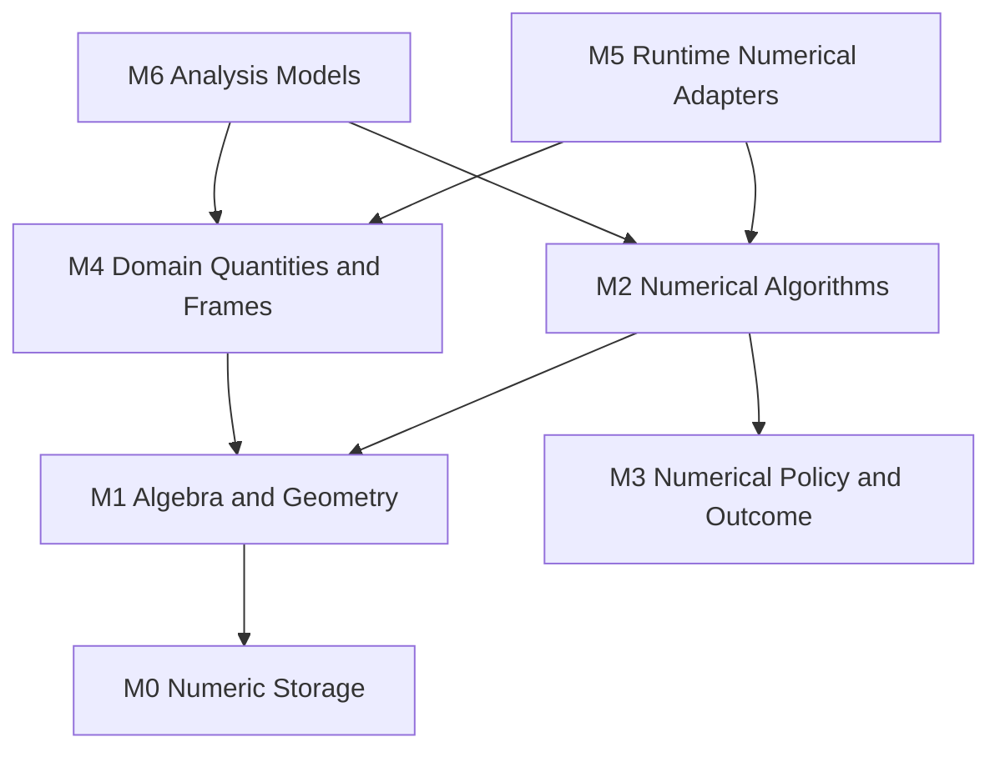

# 03｜数学与数值基础架构

[上一册：系统架构蓝图](02-layered-reference-architecture.md) · [返回总索引](README.md) · [下一册：领域契约与接口层](04-domain-contracts-and-interface-layer.md)

**主线定位**：本册是全链路的科学可信根。它接收 00 的物理正确性要求，产出单位、坐标、时间、数值策略和算法结果契约，供模型、Compiler、Session、分析与证据共同使用；它不拥有 Mission、运行状态或研究流程。

## 本册一口气读完：`REF-YYZ-001` 的数值事实

YYZ 参考 fixture 在 1000 m、220 m/s 工况查询气动表，得到 `QueryResult{value=0.0318, domain_status=Inside, quality=Nominal}`；RK4 使用 `NumericalPolicy{abs_tol=1e-9, rel_tol=1e-7, finite_check=Reject}`，在 `t=25.00 s` 产生高度候选 1001.69 m。每次插值、求根、积分与线性化都返回 `NumericalOutcome`，调用方不会用异常文本或零值猜测算法状态。

其中 `QueryResult.quality` 使用 [04 §4.3](04-domain-contracts-and-interface-layer.md#43-quality-与-validity) 的数据质量契约，结论可用性另由统一 `EvidenceValidity` 表达。数值层只产生 typed status/evidence，07 册的领域边界再将其翻译为 Diagnostic 与 PolicyDecision。

同一工况的纵向分析 fixture 给出 `c1=0.84`、`c2=1.91`、`b1=0.37`、`b2=0.12`，开环交越频率 5.6 rad/s、相位裕度 47.2°、增益裕度 8.1 dB。这里的值连同单位、线性化点、模型/资产 hash、扰动步长和 NumericalPolicy 一起进入 analysis Artifact；Session 只消费已批准的模型参数。查询越界、线性化奇异或裕度不可计算时，NumericalOutcome 保存 residual、condition estimate 和 diagnostic facts，07 册再决定处置与呈现。

[完整 source、plan、step 和 CSV 数据](00a-yyz-end-to-end-walkthrough.md)；本册后文定义这些值如何获得科学身份。

## 1. 设计目标

数学与数值层是整个研究工作台的可信根。它需要同时满足四个要求：

1. 纯算法可以脱离仿真框架独立测试、复用和对照验证；
2. 领域接口能显式表达单位、坐标、方向、时间和有效域；
3. 数值失败不会被零值、Clamp 或自由文本掩盖；
4. 算法选择、容差和外推策略进入实验输入与复现清单。

本册定义目标边界和契约，不指定每个模板或函数的最终 C++ 语法。

## 2. 当前问题摘要

当前底层存在以下结构性问题：

- Eigen 别名、自定义 `Quaternion` 和旧 `math_types.hpp` 三套表示并存；
- 项目组件直接使用 `Eigen::Quaterniond`，姿态约定分散在字段名和实现中；
- `Vector3` 同时承载位置、速度、力、力矩以及多个 frame；
- 求根、优化、统计、插值、PID 和 ODE 采用不同失败策略；
- 数学 ODE 工具与运行时积分器形成两套相近语义；
- 状态空间模型把不可变模型参数、运行状态和时间推进合在一个对象中；
- 插值默认 Clamp，越界事实无法稳定传给上层；
- 核心算法缺少统一精度声明、适用域、对照数据和成熟度。

这些问题会直接影响物理可信度、并行 Session、安全语言绑定和实验复现。

## 3. 内部分层



### M0：数值存储

- `double` 作为首个稳定标量；
- Eigen 固定维和动态维 vector/matrix；
- 明确对齐、连续性和所有权规则；
- 不附加 GNC 业务语义。

### M1：代数与几何

- 向量、矩阵、四元数、旋转矩阵、欧拉角；
- 基础分解、求解、范数和几何操作；
- 仍不依赖 Mission、RuntimeComponent、日志或文件。

### M2：数值算法

- 插值、微分、积分、求根、优化、统计；
- ODE stepper 和控制数学；
- 所有算法显式返回 NumericalOutcome。

### M3：数值策略与结果

- 容差、迭代上限、外推、非有限值和条件数策略；
- 统一状态、标志、误差估计和评估计数；
- 可序列化为 Run Manifest 元数据。

### M4：领域量与坐标

- SI 规范化量；
- frame、方向、时效和数据质量；
- 高风险概念的名义类型；
- 领域层和数值层之间的显式转换。

### M5：运行时数值适配

- 把纯 ODE stepper 适配为 Session 的 IntegrationPolicy；
- 管理 StateLayout、workspace、连续组、约束投影和事件；
- 把 NumericalOutcome 的 diagnostic facts 转换成 `DiagnosticDraft`。

### M6：分析模型

- 不可变状态空间、传递函数和线性化结果；
- 控制器/滤波器 definition 与 instance；
- 回路裕度、频域和时间域分析算法。

## 4. 依赖和纯度规则

### 4.1 数学层允许依赖

- C++ 标准库；
- Eigen；
- 经 ADR 批准的纯数值第三方库；
- 本模块内更低层次的值和算法。

### 4.2 数学层禁止依赖

- `ConfigNode`、JSON parser 和文件路径；
- RuntimeComponent、Session、`CommittedStateStore`、Mission Compiler 及任何运行时装配对象；
- logger、RecordSink、ArtifactStore；
- CLI、Python、外部进程；
- project 组件或特定论文模型。

### 4.3 纯算法契约

纯算法调用满足：

- 输入通过值、const view 或显式 workspace 传入；
- 算法不读取全局随机源、当前目录或环境变量；
- 相同输入、policy 和平台数值模式产生同等级可重复结果；
- 不在内部记录日志；
- 预期的收敛失败通过 NumericalOutcome 返回；
- 编程错误和违反不可恢复前置条件可以触发契约断言或受控异常。

## 5. 规范数值表示

### 5.1 唯一数值底座

**目标决策**：L1 统一使用 Eigen 作为向量和矩阵存储底座，提供少量稳定别名与 view。旧 `gnc::Vector3d/Quaterniond/Matrix3d` 在目标分支一次性替换；自定义 Quaternion 只在完成约定统一和充分验证后保留，否则收敛到一个规范实现。

目标别名只表达存储形状：

| 类别                  | 规范含义        |
| ------------------- | ----------- |
| `Vec3`              | 三维无语义数值向量   |
| `Mat3`              | 3×3 无语义数值矩阵 |
| `Vector`            | 动态维列向量      |
| `Matrix`            | 动态维矩阵       |
| `QuaternionStorage` | 规范四元数底层表示   |

这些类型不直接出现在跨包的高层领域端口，除非端口本身明确声明“无量纲数值数组”。

### 5.2 标量精度

首个稳定版本以 IEEE-754 binary64 为权威精度。算法设计应避免把 `double` 写死在领域名称中，为以下候选需求保留局部泛型能力：

- 自动微分；
- long double 对照；
- GPU float 批量推演；
- symbolic/dual number 分析。

公开 ABI 与 Artifact schema 不承诺内部模板实例，跨边界使用明确 dtype 标识。

### 5.3 内存和所有权

| 类型                     | 所有权规则              | 使用场景              |
| ---------------------- | ------------------ | ----------------- |
| owning value           | 自有连续存储             | 结果、持久状态、小型固定维量    |
| const view             | 调用期间借用             | 大矩阵输入、state slice |
| mutable view           | 调用期间独占借用           | workspace、输出缓冲    |
| immutable shared asset | 准备后只读共享            | 大型气动表、控制表         |
| workspace              | 单算法实例或单 Session 独占 | 避免热路径反复分配         |

view 不能越过其 owner 生命周期，也不能进入异步队列。跨语言边界需要复制或受管理 buffer handle。

## 6. 单位体系

### 6.1 内部规范单位

**目标决策**：运行时物理量统一使用 SI 基本单位和弧度。配置与外部工具可以使用其他单位，必须在边界显式转换。

| 概念    | 规范单位  |
| ----- | ----- |
| 长度/位置 | m     |
| 时间/时长 | s     |
| 质量    | kg    |
| 角度    | rad   |
| 速度    | m/s   |
| 加速度   | m/s²  |
| 角速度   | rad/s |
| 力     | N     |
| 力矩    | N·m   |
| 压力    | Pa    |
| 温度    | K     |

### 6.2 两层强类型策略

采用平衡可用性与安全性的混合方案：

1. 数值算法内部使用 `double/Vec/Mat`，不引入复杂单位模板。
2. 领域公共边界对高风险标量使用名义类型，如 Time、Duration、Angle、Mass、Length。
3. 三维量使用带 semantic 与 frame 的领域值，如 Position、Velocity、Force、Moment。
4. 配置 schema 和 Artifact schema 始终带 unit；解析后转换到 SI。
5. 热路径在 bind 阶段完成兼容检查，运行时使用已验证的紧凑 frame id 和规范存储。

这种策略把错误挡在装配边界，同时避免所有矩阵运算进入高阶单位模板。

### 6.3 单位转换规则

- 转换只能在 Config Adapter、Tool Adapter、Artifact Adapter 或明确 Domain Converter 中发生；
- 组件内部不能根据字段名猜单位；
- 任何非 SI 输入都在 effective Mission 或 manifest 中记录原值与规范值；
- offset unit（如摄氏度）需要独立转换规则；
- 复合单位由 schema id 管理，禁止任意自由文本解析进入热路径；
- 报告可以选择显示单位，但计算值的规范单位保持不变。

## 7. 坐标系和 frame 体系

### 7.1 FrameId

Frame 使用稳定语义 id，包含命名空间和版本，例如：

```text
frame.inertial.j2000@1
frame.earth.ecef@1
frame.local.nue@1
frame.vehicle.body@1
frame.vehicle.wind@1
```

实例相关 frame 还包含 owner，如 `vehicle/lead/body`。编译器将字符串 id 解析成紧凑 FrameHandle，Session 热路径不做字符串查找。

### 7.2 frame 关系

Coordinate Graph 表达随时间变化的有向变换。每条边至少声明：

| 字段                 | 含义                                               |
| ------------------ | ------------------------------------------------ |
| source\_frame      | 输入坐标表达所属 frame                                   |
| target\_frame      | 输出坐标表达所属 frame                                   |
| transform\_kind    | static、kinematic、earth model、component-published |
| valid\_time\_model | 静态、采样保持、连续查询                                     |
| provider           | 权威提供者                                            |
| accuracy/quality   | 可选精度和有效性                                         |

编译期检查图的唯一性、可达性和循环一致性；运行期查询携带时间。

### 7.3 领域向量

三维领域量至少区分：

- point 与 free vector；
- expressed-in frame；
- 相对参考 frame；
- 物理 semantic；
- 规范单位；
- sample/valid time。

例如“飞行器相对地球的位置，以 ECEF 坐标表达”和“速度相对空气，以机体系表达”需要形成不同契约。单个 `Vector3` 不能代替这组语义。

### 7.4 变换规则

- 点变换应用旋转和平移；
- free vector 只应用旋转；
- 速度变换还可能需要 frame 相对角速度与原点速度；
- 加速度变换要考虑科氏、离心和欧拉项；
- wrench 变换区分力与关于指定点的力矩；
- covariance 通过对应雅可比变换；
- 所有简化变换必须在契约中声明物理假设。

Transform API 需要避免把 position transform 用于 velocity，名称和类型都应表达变换类别。

## 8. 姿态与四元数约定

### 8.1 权威约定

**目标决策**：统一采用以下写法并写入公共文档、测试和 schema：

- 列向量；
- `R_to_from` 把同一几何向量的 from-frame 坐标变换为 to-frame 坐标；
- `v_to = R_to_from * v_from`；
- `q_to_from` 与 `R_to_from` 表达同一被动旋转变换；
- `v_to = q_to_from^{-1} * v_from * q_to_from`;
- 四元数采用 Hamilton 乘法；
- 序列化顺序固定为 `[w, x, y, z]`；
- 组合满足 `R_c_a = R_c_b * R_b_a`，四元数组合采用右乘方向规则 `q_c_a = q_b_a * q_c_b`；
- 欧拉角必须同时声明 sequence、intrinsic/extrinsic 和奇异区间。

实际实现若选择相反主动旋转表达，需要在 ADR 中修改全部规则并提供等价测试。系统只允许一个权威约定。

### 8.2 姿态类型

姿态领域值至少携带：

- from frame；
- to frame；
- quaternion storage；
- normalization status；
- sample time；
- quality。

字段名采用 `attitude_to_from` 或明确语义别名，避免 `attitude`、`orientation` 这类方向不明的名称。

### 8.3 姿态不变量

- norm 在 policy 容差内接近 1；
- 零模四元数为 DomainError；
- 正规化是否自动执行由 policy 决定并产生 flag；
- `q` 与 `-q` 的等价性进入比较测试；
- 积分后正规化或流形积分策略进入 RunProfile；
- 跨 ±π 的欧拉角比较通过旋转对象进行。

### 8.4 必需测试

- 单轴 90° 与 180°；
- 三轴组合和逆变换；
- matrix/quaternion/Euler 往返；
- body-to-inertial 与 inertial-to-body 对偶；
- 角速度在 body/inertial 表达下的四元数导数；
- 随机旋转的正交性、行列式和 composition property；
- 与 MATLAB Aerospace Toolbox 或独立 Python 参考实现交叉验证。

## 9. 时间值与时戳

### 9.1 五类时间

| 类型             | 含义            | 典型使用                         |
| -------------- | ------------- | ---------------------------- |
| SimulationTime | Session 内逻辑时间 | dynamics、publish、termination |
| Duration       | 时间间隔          | dt、延迟、窗口                     |
| SampleTime     | 数据产生时刻        | measurement、estimate         |
| ValidTime      | 数据适用时刻或区间     | command、ephemeris、asset      |
| WallTime       | 真实世界时间        | 性能、超时、审计                     |

这些概念不得都以无标签 `double time` 穿过公共边界。

### 9.2 时戳与序列

跨组件数据包建议包含：

| 字段                       | 用途              |
| ------------------------ | --------------- |
| sample\_time             | 何时采样或计算         |
| valid\_from/valid\_until | 有效区间            |
| publish\_time            | 何时进入本周期发布态      |
| sequence                 | 检测遗漏、重复和乱序      |
| source\_clock            | 仿真 clock domain |

固定步长内核可以通过紧凑结构实现，Artifact schema 仍保留完整语义。

## 10. NumericalPolicy

### 10.1 策略层次

数值策略按以下优先级合并：

```text
framework safe baseline
< model/package declared default
< RunProfile
< algorithm invocation override
```

每次覆盖都进入 effective policy 和 Run Manifest。物理关键策略不能藏在函数内部常量中。

### 10.2 通用字段

| 字段                    | 含义                                      |
| --------------------- | --------------------------------------- |
| absolute\_tolerance   | 绝对误差阈值                                  |
| relative\_tolerance   | 相对误差阈值                                  |
| zero\_tolerance       | 零判据                                     |
| max\_iterations       | 迭代上限                                    |
| max\_evaluations      | 函数评估上限                                  |
| condition\_limit      | 可接受条件数上限                                |
| finite\_check         | 输入、阶段值、输出检查策略                           |
| domain\_policy        | 域外失败、警告或受控映射                            |
| extrapolation\_policy | Error、Clamp、Linear、ModelDefined         |
| normalization\_policy | Error、NormalizeWithFlag、AssumeValidated |
| deterministic\_mode   | 严格、稳定、快速                                |

算法可以使用专有扩展字段，必须有 schema 和默认来源。

### 10.3 尺度和容差

固定一个全局 `1e-12` 无法适应高度、质量、角度和四元数等不同尺度。StateVariableDescriptor 需要提供 nominal scale 或 absolute tolerance。比较规则优先使用：

```text
error <= atol(variable) + rtol * scale(reference, candidate)
```

状态积分、事件定位和终止条件可以拥有不同容差集，名称必须区分。

## 11. 统一数值结果模型

### 11.1 NumericalStatus

建议稳定状态集合：

`NumericalStatus = Success | Converged | Approximate | OutOfRange | Extrapolated | NoBracket | MaxIterations | Singular | IllConditioned | DomainError | NonFiniteInput | NonFiniteIntermediate | NonFiniteOutput | StepUnderflow | ToleranceUnreachable | Cancelled | InternalFailure` 是统一数值结果状态枚举。

| 状态                    | 含义             | 默认有效性   |
| --------------------- | -------------- | ------- |
| Success               | 正常完成           | 有效      |
| Converged             | 在容差内收敛         | 有效      |
| Approximate           | 达到可接受近似但有 flag | 由调用方决定  |
| OutOfRange            | 查询超出定义域且未给出值   | 无效      |
| Extrapolated          | 按策略外推并返回值      | 有条件有效   |
| NoBracket             | 求根区间不包根        | 无效      |
| MaxIterations         | 达到迭代上限         | 通常无效    |
| Singular              | 奇异矩阵或不可逆问题     | 无效      |
| IllConditioned        | 条件数超过策略        | 有条件或无效  |
| DomainError           | 输入违反数学定义域      | 无效      |
| NonFiniteInput        | 输入含 NaN/Inf    | 无效      |
| NonFiniteIntermediate | 中间结果非有限        | 无效      |
| NonFiniteOutput       | 输出非有限          | 无效      |
| StepUnderflow         | 自适应步长无法继续      | 无效      |
| ToleranceUnreachable  | 精度目标低于可实现范围    | 无效      |
| Cancelled             | 外部请求取消         | 无效      |
| InternalFailure       | 算法不变量破坏        | 无效并升级诊断 |

### 11.2 NumericalOutcome 字段

| 字段                               | 说明                                 |
| -------------------------------- | ---------------------------------- |
| status                           | 稳定状态                               |
| value                            | 状态允许时的值                            |
| flags                            | clamped、normalized、fallback-used 等 |
| iterations/evaluations           | 成本和收敛信息                            |
| estimated\_abs\_error/rel\_error | 可用时提供                              |
| residual\_norm                   | 求解残差                               |
| condition\_estimate              | 可用时提供                              |
| last\_step                       | 最后步长或增量                            |
| algorithm\_id/version            | 算法身份                               |
| detail                           | 短机器辅助信息，不充当稳定 code                 |

数值层不生成面向用户的长错误文案。应用边界依据 status、算法 id 和上下文形成 Diagnostic。

### 11.3 异常边界

以下情况可以抛出受控契约异常：

- API 使用违反不可恢复前置条件；
- 输出 buffer 维度与声明不一致；
- workspace 属于其他算法实例；
- 内部不变量破坏。

下列情况属于预期数值结果：不收敛、无根区间、奇异、域外、容差不可达、非有限输入。它们通过 NumericalOutcome 返回。

## 12. 线性代数契约

### 12.1 求解优先于显式求逆

公共 API 以 `solve(A,b,policy)` 为核心，显式 inverse 仅用于明确分析场景。结果记录分解方法、rank、condition estimate 和 residual。

### 12.2 维度与有限性

- 维度错误在入口立即失败；
- 热路径可以使用已验证 descriptor 跳过重复形状检查；
- NaN/Inf 检查粒度由 policy 决定；
- 对称、正定、正交等结构必须显式声明并验证；
- 容差比较不能直接依赖机器 epsilon。

### 12.3 分解策略

算法选择通过 policy 或明确入口表达：LU、QR、Cholesky、SVD、eigensolver。自动 fallback 必须设置 `fallback-used` flag，记录原方法和替代方法。

## 13. 插值与查表

气动、发动机、质量和控制表是高风险基础能力，需要独立架构。

### 13.1 TableDefinition

| 字段                    | 含义                          |
| --------------------- | --------------------------- |
| table\_id/version     | 稳定身份                        |
| axes                  | 每个轴的 name、unit、semantic、有效域 |
| values                | 输出 shape、unit、semantic      |
| method                | nearest、linear、spline 等     |
| extrapolation         | 每个轴独立策略                     |
| monotonicity          | 输入轴和可选输出约束                  |
| missing\_data\_policy | 缺测处理                        |
| source\_artifact      | 原始数据谱系                      |
| validation\_record    | 准备阶段校验结果                    |

### 13.2 Prepare 阶段

表在 prepare 时完成：

- 维度和行列长度检查；
- 轴严格单调、重复点和有限值检查；
- 单位规范化；
- 域范围和稀疏区域检查；
- spline 系数或搜索索引预计算；
- source hash 与 prepared hash 记录；
- 需要时生成梯度或局部线性化缓存。

### 13.3 QueryResult

每次查询至少可以表达：

- 值；
- in-domain / on-boundary / extrapolated / clamped；
- 命中的 cell；
- 距有效域距离；
- 可选梯度；
- data quality。

仿真热路径允许按 `DiagnosticAggregationPolicy` 聚合越界计数，首次或达到阈值时发出 Diagnostic，避免每步刷屏。

### 13.4 外推原则

- 物理关键表默认 Error；
- Clamp 需要配置显式选择；
- Linear extrapolation 需要资产声明支持；
- 模型自定义外推需给出算法 id 和适用域；
- 所有外推进入运行指标和 summary；
- 超出硬安全域时强制失败，不能被局部 policy 覆盖。

## 14. 求根、优化与微分

### 14.1 求根

`RootProblem` 统一描述标量根求解问题，包含函数、可选导数、区间/初值、尺度和 policy。结果包含 bracket、residual、步数和停止原因。配平流程应能区分：无物理解、初值差、局部不收敛和模型返回域外。

### 14.2 优化

优化定义区分：

- decision variables 与尺度；
- bounds；
- objective terms；
- equality/inequality constraints；
- gradient 来源；
- stopping policy；
- feasibility 与 optimality 状态。

单个 `converged` 无法支撑轨迹优化和配平论证。结果需要同时表达 feasible、optimal、stationary、limit reached。

### 14.3 数值微分

- step size 由变量尺度和 policy 决定；
- central/forward/complex-step 等方法显式标识；
- 导数结果记录截断/舍入风险；
- 变量和输出单位进入 Jacobian schema；
- 自动微分属于候选后端，不能改变上层结果契约。

## 15. ODE 与运行时积分架构

### 15.1 三个对象分离

| 对象                   | 内容                    | 可共享性           |
| -------------------- | --------------------- | -------------- |
| IntegratorDefinition | 算法 id、阶数、能力、默认 policy | 不可变，可共享        |
| IntegratorWorkspace  | 临时向量、误差估计和缓存          | 单 Session/线程独占 |
| IntegrationPolicy    | dt、容差、拒步、事件、投影策略      | RunProfile 实例  |

纯数值 stepper 接收 derivative function 和 state view，返回 IntegrationStepOutcome。Session adapter 决定何时提交状态、如何发诊断和是否终止。

### 15.2 IntegrationStepOutcome

| 字段                      | 含义                        |
| ----------------------- | ------------------------- |
| accepted                | 候选状态是否可提交                 |
| candidate\_state        | 下一状态或 dense output handle |
| actual\_dt              | 实际推进时长                    |
| suggested\_dt           | 自适应建议                     |
| error\_norm             | 标准化误差                     |
| derivative\_evaluations | 计算成本                      |
| event\_hits             | 本步检测到的事件                  |
| constraint\_projection  | 是否投影及修正量                  |
| numerical\_outcome      | 统一状态和 flags               |

### 15.3 固定步长模式

当前 Euler/RK4 固定步长模式继续作为首个稳定运行模式。必须补齐：

- `dt > 0` 和有限性；
- derivative 维度和有限性检查；
- 每个 state variable 的 scale；
- 候选状态提交前检查；
- 失败时保留上一个 committed state；
- 算法 id/version 与 policy 写入 manifest。

### 15.4 自适应模式

自适应积分属于后续候选能力。引入前先闭环以下设计：

- 离散任务与变步长的对齐；
- 观测采样点和 dense output；
- 终止事件定位；
- 多连续系统同步拒步；
- 最小/最大步长；
- 实时模式是否允许；
- Run Manifest 如何记录实际步序列。

### 15.5 从 legacy 连续组到 `IntegrationScopePlan`

当前 `IContinuousGroup` 只作为迁移输入。Compiler 把其共享 RK 子步语义转成 `IntegrationScopePlan`，目标表示包含：

- 稳定 scope id；
- member state blocks；
- joint StateLayout；
- derivative coupling graph；
- optional sparsity/Jacobian provider；
- constraint/projection；
- integration policy compatibility。

一个 state block 只能属于一个权威积分边界。编译器在运行前验证重复归属和跨 scope 候选状态依赖。需要联立代数 residual 时，scope 内再嵌套 `SolverIslandPlan`；普通共享候选态不生成 solver island。

## 16. StateLayout 设计

### 16.1 StateVariableDescriptor

当前字符串名称升级为稳定描述：

| 字段                  | 含义                                       |
| ------------------- | ---------------------------------------- |
| variable\_id        | 稳定、命名空间化身份                               |
| display\_name       | 面向用户名称                                   |
| semantic            | position、velocity、quaternion component 等 |
| unit                | 规范单位                                     |
| frame               | 适用时的 frame                               |
| dimension/shape     | 标量或 block                                |
| nominal\_scale      | 数值尺度                                     |
| absolute\_tolerance | 可选变量容差                                   |
| constraints         | norm、range、positivity 等                  |
| observable\_default | 是否默认可观测                                  |

### 16.2 访问规则

- 重复 variable id 在构建时失败；
- 未找到变量返回显式 lookup failure；
- `0.0` 不能代表“变量不存在”；
- 字符串 lookup 只在编译、调试和查询路径使用；
- 热路径通过编译后的 offset/block handle 访问；
- StateLayout hash 进入 checkpoint 和 plan compatibility。

### 16.3 状态约束

质量非负、四元数单位模、燃料质量上限等约束分为：

- hard invariant：违反即本步失败；
- projection invariant：允许投影并记录修正；
- soft monitor：记录 metric/warning；
- model domain：由模型返回 DomainError。

每条约束明确 owner 和 evaluation phase。

## 17. 控制与滤波基础

### 17.1 Definition 与 Instance 分离

| Definition          | Instance             |
| ------------------- | -------------------- |
| 状态空间 A/B/C/D        | 当前状态 x、workspace     |
| PID 增益、限幅、抗饱和策略     | 积分项、上次误差、模式          |
| 滤波器系数、sample period | delay states         |
| 传递函数系数              | 具体 realization state |

Definition 不可变且可共享；Instance 归某一组件或 Session 独占。reset 明确接收初始状态和时间，不读取全局配置。

### 17.2 SampleContract

控制器和滤波器必须声明：

- continuous/discrete；
- sample period 或允许区间；
- 输入 hold 语义；
- reset/initial condition；
- dt mismatch policy；
- saturation 与 anti-windup；
- 输入输出单位和 shape；
- state serialization 支持。

`dt <= 0` 返回零会掩盖调度错误。目标行为是 DomainError 或契约失败。

### 17.3 StateSpaceDefinition

状态空间定义包含：

- A/B/C/D；
- continuous/discrete 类型；
- sample period（离散时必需）；
- state/input/output descriptors；
- frame 和单位；
- linearization operating point；
- source artifact 与 algorithm id；
- controllability/observability analysis result。

`c2d` 产生新的 Definition 和 NumericalOutcome，不携带运行状态。

### 17.4 控制特性与频域分析结果

控制分析使用 typed definition + Artifact result。结果至少保存：

```text
ControlAnalysisResult {
  analysis_definition_id / version
  plant_artifact_ref / controller_definition_ref
  operating_point_ref
  state_input_output_schema
  loop_break_definition
  sample_hold_delay_model
  frequency_grid { unit, range, spacing }
  crossover_set[]
  gain_margin_set[] / phase_margin_set[]
  characteristic_quantities[]  // stable id、display symbol、formula/convention ref、value/unit
  stability_classification
  numerical_outcomes[]
  evidence_validity / diagnostic_ids[]
}
```

多 crossover 时保留完整集合，报告 policy 再选择“最小正裕度”等摘要。`c1/c2/b1/b2` 只作显示符号；stable quantity id 与 formula/convention ref 决定其含义。离散控制器必须记录 sample period、hold、delay 和频率映射方法。YYZ fixture 的 5.6 rad/s、47.2° 和 8.1 dB 结果只有在 plant/controller/operating-point refs 与 NumericalOutcome 完整时才可标记 Valid。

## 18. 随机数与统计

### 18.1 随机流

- 每个 Experiment 有 root seed；
- case、vehicle、component、noise source 通过稳定 key 派生子流；
- 组件不能直接使用全局 RNG；
- stream identity 和算法版本写入 manifest；
- reset 可以复现同一序列，也可通过明确 episode seed 生成新序列；
- 并发调度不能改变样本序列。

### 18.2 统计结果

空样本、样本不足、零方差和非正定协方差必须返回显式状态。统计 Artifact 记录：样本选择、缺失处理、置信度方法、权重、异常值策略和有效样本数。

### 18.3 Monte Carlo 可重复性

case seed 由参数 identity 派生，不能只依赖执行序号。重新调度、失败重试和分布式运行应产生相同随机输入。

## 19. 非有限值和物理域策略

### 19.1 检查点

建议在以下边界检查 NaN/Inf：

- 配置和资产解析后；
- prepare 生成表和矩阵后；
- 组件端口发布时（可按字段策略）；
- derivative 输出后；
- integration candidate 提交前；
- metric 和 Artifact 写入前。

### 19.2 处置等级

| 策略                | 用途            | 结果                  |
| ----------------- | ------------- | ------------------- |
| FailFast          | 状态、质量、姿态等关键量  | Step Failed         |
| RejectStep        | 自适应积分可恢复问题    | 减小 dt 后重试           |
| DegradeWithFlag   | 允许降级的传感器/分析   | 数据 quality 降级       |
| ClampWithEvidence | 明确批准的边界保护     | 返回值 + flag + metric |
| Ignore            | 仅限已证明无影响的调试字段 | 仍记录计数               |

policy 由字段或算法声明，调用方不能用通用 try/catch 静默继续。

## 20. 数值确定性等级

| 等级                    | 目标              | 约束                 |
| --------------------- | --------------- | ------------------ |
| D0 Functional         | 物理趋势和容差内结果一致    | 可允许线程和库差异          |
| D1 Reproducible       | 同平台、同构建、同输入结果稳定 | 固定 seed、顺序和模式      |
| D2 Cross-build Stable | 支持编译器间定义容差一致    | 禁止未定义顺序和 fast-math |
| D3 Bitwise            | 指定平台位级一致        | 严格库、线程和浮点环境        |

每个 RunProfile 声明目标等级。默认研究基线建议 D1；回归黄金样例可选择 D2；大规模探索可用 D0。

## 21. 算法目录与成熟度

每个公共算法拥有 AlgorithmDescriptor：

| 字段                      | 内容                              |
| ----------------------- | ------------------------------- |
| algorithm\_id/version   | 稳定身份                            |
| category                | root、ode、interpolation、filter 等 |
| mathematical\_reference | 公式、论文或权威资料                      |
| assumptions             | 连续性、正定性、单调性等                    |
| supported\_shapes       | 标量、固定维、动态维                      |
| accuracy\_order         | 理论阶或误差性质                        |
| deterministic\_level    | 已验证等级                           |
| failure\_statuses       | 可能返回的状态                         |
| verification\_suite     | 参考测试集合                          |
| maturity                | experimental/reference/verified |
| performance\_notes      | 分配、复杂度、向量化                      |

算法成熟度与模型成熟度分开管理。一个经过验证的 RK4 不会自动证明某个气动模型可信。

## 22. 验证体系

### 22.1 五层测试

1. **单元样例**：已知解析解和边界输入。
2. **性质测试**：旋转正交性、逆变换、守恒、单调性等。
3. **交叉验证**：MATLAB、Python/SciPy、权威数据或独立实现。
4. **收敛测试**：步长减半、网格加密、残差和理论阶。
5. **集成守恒测试**：在 form 和 Session 中验证能量、动量或几何不变量。

### 22.2 精度报告

每个 verified 算法形成机器可读验证 Artifact，包含：

- 算例版本与输入域；
- reference source；
- error metric；
- 最大/均方误差；
- 失败域；
- 平台和编译选项；
- 性能基线；
- 通过的确定性等级。

### 22.3 黄金案例

建议优先建立：

- 三维旋转与坐标变换；
- 标准大气/重力查询边界；
- 多维气动表插值与外推；
- 线性系统解析响应；
- RK4 理论阶；
- 配平求根的成功、无解和初值敏感案例；
- 二阶系统的频率响应与稳定裕度；
- 随机流跨线程可重复性。

## 23. 性能原则

- bind/prepare 阶段完成 schema、frame、单位和维度检查；
- 热路径使用编译后的 handle、连续 block 和预分配 workspace；
- 每步不得进行字符串查找、文件访问、动态 package 解析；
- 避免无依据的全局缓存；缓存归 Definition、Session workspace 或 Artifact Store；
- 性能优化必须保留 NumericalOutcome 和诊断采样点；
- SIMD、GPU 和并行算法作为后端能力，不改变领域契约；
- benchmark 记录数据规模、CPU、编译选项和确定性等级。

## 24. 与外部工具的数据边界

MATLAB、Python、DATCOM、GPOPS2 和 Origin 使用各自单位、矩阵布局和文件约定。Tool Adapter 必须声明：

- 输入输出 schema；
- unit/frame mapping；
- row-major/column-major；
- quaternion/Euler convention；
- missing/NaN 表达；
- precision 和格式化；
- 工具版本和算法选项；
- round-trip verification。

外部工具结果先转换成 typed Artifact，再进入模型或下游任务。组件不能直接解析某个工具的临时输出文件。

## 25. 直接重构计划

### 阶段 N0：科学约定与 oracle

- 列出所有数学类型及使用点；
- 以本册 8.1 的权威四元数约定建立性质测试和独立 oracle；
- 将现有实现差异分类为有效科学语义、实现错误或未声明约定；
- 为宽松零值、Clamp 和异常行为建立风险清单；
- 记录现有算法默认容差。

### 阶段 N1：结果与策略统一

- 引入 NumericalStatus、NumericalOutcome 和 NumericalPolicy；
- 先适配求根、插值和运行时积分；
- 在上层把结果映射到 Diagnostic；
- 新算法与新 Session 直接使用统一结果类型；
- 旧 API 仅用于分支内差异审阅，不进入新运行路径。

### 阶段 N2：规范存储与旋转约定

- 选择唯一 quaternion storage；
- 建立权威旋转测试；
- 使用一次性机械转换和编译错误迁移全部调用点；
- 删除旧 `math_types.hpp` 公共入口与重复 Quaternion 实现。

### 阶段 N3：领域单位和 frame

- 新 contracts 全部使用 Domain Quantity；
- 纵向 slice 内的已有接口整体替换；
- 编译器检查端口 unit/frame；
- slice 通过后批量迁移其余 form/process/output。

### 阶段 N4：积分与控制模型拆分

- 统一 pure stepper 和 runtime adapter；
- 拆分 StateSpace Definition/Instance；
- 统一 PID/filter sample contract；
- 引入 state descriptor、workspace 和 manifest 记录。

### 阶段 N5：算法验证与成熟度

- 为公共算法建立 descriptor；
- 完成 MATLAB/Python 对照；
- 生成验证 Artifact；
- 未达到 reference 等级的算法明确标记实验用途。

## 26. 完成定义

数学与数值基础达到首个稳定版时，应满足：

1. framework 公共路径只有一套规范向量、矩阵和四元数底座。
2. 姿态方向、系数顺序、乘法和 Euler sequence 有唯一文档与性质测试。
3. 高风险公共端口能表达 unit、frame、time 和 quality。
4. 求根、优化、插值、统计和积分共享 NumericalOutcome 分类。
5. 物理关键表越界无法静默 Clamp。
6. 数学 ODE 与 Session 积分使用同一算法核心和不同适配层。
7. StateLayout 未知变量不再返回合法零值。
8. 控制模型 definition 与运行 instance 可以独立创建和共享。
9. Run Manifest 完整记录数值算法、policy、随机流和确定性等级。
10. 核心算法具有解析解、性质测试和至少一套独立工具对照证据。
