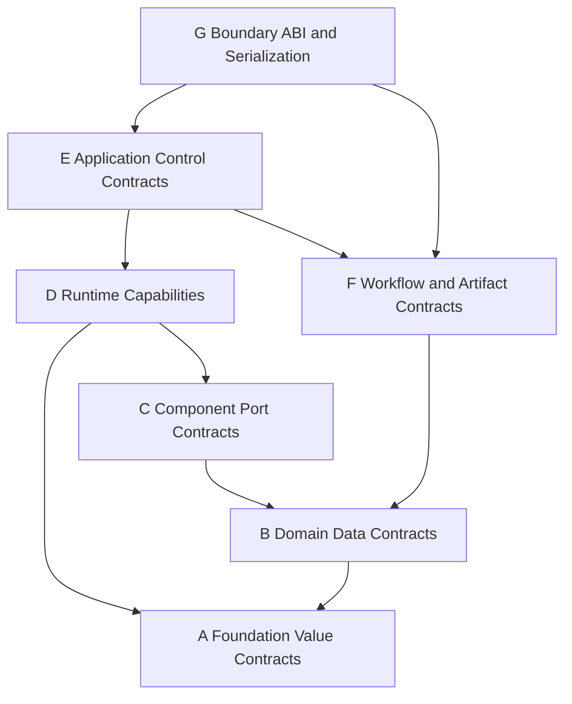
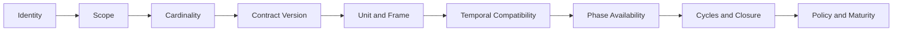

# 04｜领域契约与接口层架构

[上一册：数学与数值基础](03-mathematics-and-numerical-foundation.md) · [返回总索引](README.md) · [下一册：组件目录与 Mission 编译器](05-component-catalog-and-mission-compiler.md)

**主线定位**：本册定义跨 owner、跨阶段和跨语言传递的物理与行为语义。上游是 03 的可信值类型和 package 的领域概念；输出是 Model、Compiler、Kernel、Evidence 与 Control 都能验证的 typed contract，不承担具体算法或调度实现。

## 本册一口气读完：一条可证明的舵偏连接

`REF-YYZ-001` 中 `occ:control.elevator_command` 产生 `ElevatorCommand{value=-0.62 deg, valid_at=t_k, quality=Nominal}`，`occ:plant-output.elevator_command` 消费同一 contract。`BindingPlan` 的 edge 声明 stable port ids、`deg` 单位、body actuator 语义、`HeldLatest` 时间关系和 one-to-one cardinality。Compiler 证明类型、单位、frame、时效和 owner 路径后，Session 只使用编译 handle 读取值。

若生产端改成 rad，Compiler 插入已登记的显式 unit adapter；若端口把 N·m 错接为 deg，编译直接失败并指向 source path。`Quality` 描述数据来源与时效，`EvidenceValidity` 描述结果能否支撑结论，两者各有单独字段。[完整实例](00a-yyz-end-to-end-walkthrough.md#32-bindingplan)展示该 edge 的数据形态。

## 1. 设计目标

接口层需要把“能调用”提升为“语义兼容、生命周期明确、失败可处理、版本可演进”。目标包括：

- C++ 类型关系只负责实现层替换；
- 稳定 contract id、schema 和约束负责跨组件语义；
- 依赖绑定形成可持久化的 `BindingPlan`；
- 生命周期、所有权、线程和时效规则写入契约；
- project 内部接口可以轻量，进入稳定 package 前必须完成契约化；
- Python、LLM、蓝图和未来动态包使用同一语义目录。

## 2. 七类接口



### A：基础值契约

Time、Duration、UnitId、FrameId、EntityId、ModelDefinitionId、ModelOccurrenceId、RuntimeInstanceId、Quality、Validity、Sequence、SchemaId、Version、Outcome 等无业务流程值。

### B：领域数据契约

Truth、Measurement、Estimate、Reference、Command、PhysicalResponse、EnvironmentSample、AssetDescriptor 等带 GNC 语义的数据。

### C：模型端口契约

定义某个 CompiledModelOccurrence 消费或提供哪些 B 类数据、基数、scope、时效、采样、frame/unit 兼容和绑定选择规则；PureQuery、Closure 与 RuntimeComponent 使用各自允许的端口种类。

### D：运行时执行契约

RuntimeComponent 的 execution obligations、state projection、sampled reducer、derivative、Event、Termination、Checkpoint 和 resource/effect hooks 等由 Session 按 Execution Plan 调用；PureQuery/Closure 由各自 compiled plan 调用。RuntimeCellProfile 只在 package/compile time 展开，不形成运行接口类别。

### E：应用控制契约

CompileMission、CreateSession、Run、Step、Cancel、Query、StartExperiment、ExportArtifact 等面向 CLI/Python/UI 的命令与查询。

### F：Workflow 与 Artifact 契约

TaskDefinition、ArtifactDescriptor、TaskOutcome、Lineage、CacheKey、ToolExecution 等离线研究流程接口。

### G：ABI 与序列化边界

稳定 DTO、schema、opaque handle、C ABI、IPC 和 pybind facade，隔离 C++ 模板、STL、Eigen 和内部对象布局。

七类接口不能混放成一个“interfaces”概念。每类有独立稳定性、错误模式和测试方式。

## 3. 接口设计宪章

### I-01：语义身份独立于实现类型

稳定身份采用命名空间化 contract id，例如：

```text
gnc.domain.truth.cartesian_3dof.ecef@1
gnc.domain.navigation.local_spherical_3dof.nue@1
gnc.runtime.continuous_system@2
gnc.artifact.aerodynamic_table@1
```

`typeid`、编译器修饰名和 C++ 类名不进入 Mission IR 或 Artifact schema。

### I-02：接口按消费者最小化

读取大气样本的组件只依赖 AtmosphereQuery；需要模型元数据的工具依赖 AtmosphereDescriptor。便利函数可以由非虚扩展或适配器提供，避免一个接口积累所有查询方式。

### I-03：数据与行为分离

领域数据是可序列化值；运行时能力是行为接口。一个 navigation solution 的 schema 不依赖具体 `INavigation` C++ 对象。

### I-04：格式与领域分离

领域接口不写 ostream、不返回 CSV 行、不持有 JSON DOM。格式化通过 adapter 和 schema 完成。

### I-05：所有权和时效必须声明

每个返回值都能判断是 owned value、borrowed view、immutable shared asset 还是 handle；每个跨组件信号都能判断采样时间、有效期和质量。

### I-06：预期失败通过 Outcome

缺少可选数据、数据过期、查询域外、外部取消和暂时不可用都通过明确状态返回。异常只承担契约破坏和内部缺陷。

### I-07：适配必须显式

frame 转换、单位转换、频率匹配、数据融合和 contract 版本迁移都形成有身份的 adapter。编译器把 adapter 写入绑定图，运行时不会偷偷转换。

## 4. 基础值契约

### 4.1 稳定身份

| 类型 | 用途 | 规则 |
| --- | --- | --- |
| EntityId | vehicle、target、earth 等实体 | 在 Mission IR 内唯一 |
| ModelDefinitionId | Catalog 模型定义 | namespace + name + major version |
| ModelOccurrenceId | Mission IR 中一次模型选择 | 在 IR 内唯一，三种 execution form 都有 |
| RuntimeInstanceId | RuntimeComponent occurrence 的 plan-local cell slot | 由 ExecutionPlanDescriptor 派生；复用同一计划的 Session 使用同一 slot id，完整 cell identity 为 `(SessionId, RuntimeInstanceId)` |
| PortId | ModelDefinition 内端口 | 稳定且不可复用旧语义 |
| ContractId | 数据/行为契约 | namespace + semantic + major version |
| ArtifactId | 内容或实例产物 | 内容寻址或稳定 UUID |
| SessionId | 一次会话 | 全局唯一 |
| RunId | 一次 initialize/reset/restore run attempt | Session factory 全局分配，不从用户值自引用派生；失败 attempt 也保留 |
| CaseId | Experiment case | 由 ExperimentDefinition hash、规范参数与 replicate key 确定性派生 |

显示名称可以修改，稳定 id 保持不变。用户友好名称不能作为跨版本外键。

### 4.2 Version

版本至少包含 major/minor/patch 与可选 prerelease。兼容判断分别针对：

- contract schema；
- component definition；
- model implementation；
- package；
- Mission schema；
- Artifact schema。

这些版本不能合并为一个仓库版本号。

### 4.3 Quality 与 Validity

建议通用 Quality 枚举：

| 状态 | 含义 |
| --- | --- |
| Valid | 满足契约 |
| Degraded | 可用但精度或来源下降 |
| Suspect | 可供诊断，不能用于关键决策 |
| Invalid | 无有效值 |
| Stale | 超过有效期 |
| Unavailable | 当前未产生 |

Quality 还可携带 flags、uncertainty、source 和相关 DiagnosticId。组件不得用全零向量表示 unavailable。

## 5. 领域数据契约分类

下列契约共同构成 `I` 维度的信息权威体系。它们标记一份数据“来自世界事实、传感、估计、通信、意图还是物理响应”，并约束允许的因果转换：

```text
Truth --SensorModel--> Measurement --Estimator--> Estimate
Estimate/Decision --LinkModel--> Message
Reference/Estimate --Guidance/Control--> Command --PhysicalModel--> PhysicalResponse
Committed facts/results --Projection--> Observation/Evidence
```

任何 adapter、聚合器或通信链路都不能静默提升信息权威。例如 Message 中携带的 Estimate 经传输后仍是 Estimate claim；direct truth access 需要独立 contract 和 plan evidence。该规则与实体数量、飞行器类型和传输技术无关。

### 5.1 Truth

Truth 表达仿真权威物理状态或其只读投影。字段需要声明：

- owner entity；
- state epoch；
- frame 与参考体；
- unit；
- form family 与 fidelity；
- derived/raw；
- publication sequence。

Truth view 不拥有连续状态，也不能推进状态。派生 truth 在 publish 阶段刷新。

#### 5.1.1 多实体 truth 与跨实体访问

每个 form/state owner 只发布自己 entity 的 truth。跨实体使用通过 Model Graph 中的显式 selector 和 contract 编译：

```text
EntityTruthPublisher(entity_id, truth_contract)
    -> BindingPlan resolves EntitySelector
    -> read-only EntityTruthView<T> at a declared epoch/time relation
    -> Interaction / Sensor / Evaluation consumer
```

`EntitySelector` 可以表达 explicit entity、role、group 或关系端点。Compiler 检查 cardinality、可见性、frame、time relation 和 inactive-entity policy，再生成窄 typed collection/view。Runtime 不提供可遍历并修改所有实体的全局 WorldSnapshot，也不允许通过 service locator 临时查找 truth。

跨实体信息分三类：

| 需求 | 数据路径 | 例子 |
| --- | --- | --- |
| 物理相互作用 | entity truth -> Interaction/SolverIslandPlan -> force/event | 引力、碰撞、系绳、相对运动 |
| 仿真传感 | observer truth + target truth + environment -> Sensor -> Measurement | 雷达、导引头、视觉、星敏感器 |
| 机间通信 | producer estimate/message -> Link Model -> received Message/Measurement | 数据链、编队协同、星间链路 |

Onboard navigation/guidance 默认消费 Measurement、Estimate 或 received Message。ideal research component 若要直接读取另一个实体的 truth，必须在 definition/mission 中显式声明该 truth contract 和用途，使 plan explain 与 evidence 能识别理想化捷径。

同一 `CurrentCycle` relation 的多个 truth view 必须来自同一 state epoch。异步观测使用 `PreviousCommitted` 或 `HeldLatest`，插值与延迟由显式 adapter 声明，并记录 sample/receive time。动态实体加入 selector 集合只发生在成功的 topology commit 后。

### 5.2 Measurement

Measurement 表达传感器或输入链路输出。除值外还包含：

- sample time 与 receive/publish time；
- sensor identity；
- valid flag 与 fault mode；
- bias/noise/scale metadata 或 realization id；
- saturation、dropout、quantization flags；
- covariance 或 accuracy descriptor；
- sequence。

### 5.3 Estimate

Estimate 与 Truth 分开建模，至少包含：

- estimate epoch；
- state definition；
- covariance/uncertainty；
- reference frame；
- estimator mode 与 health；
- input cutoff time；
- source chain。

导航交班需要同时比较 state coverage、frame、时效、quality 和 uncertainty，单个 position/velocity struct 无法完成。

### 5.4 Message

Message 表达一个主体经通信链路向另一个主体传递的 typed claim、estimate、intent 或 status。它至少包含：

- sender/receiver/subject identity；
- payload contract id/version 与原始 information kind；
- issue、transmit、receive 和 expiry time；
- sequence、ordering、duplicate/correlation id；
- link latency、dropout、bandwidth/fragmentation outcome；
- authentication/integrity/quality 与 provenance。

Link Model 消费待发送 payload 和通信环境，产生 received Message 或 dropout Event。通信 adapter 不能把发送方 Estimate 提升为接收方 Truth，也不能用进程内直连绕过 latency、dropout 和 time semantics。

### 5.5 Reference

Reference 表达轨迹、姿态、速度或目标等期望量：

- target entity；
- valid interval；
- interpolation/hold semantics；
- frame/unit；
- continuity class；
- source planner 或 Artifact；
- priority 与 DecisionAuthority。

### 5.6 Command

Command 是离散或连续控制意图，包含：

- command type 与 DecisionAuthority；
- issue time、effective time、expiry；
- target component/entity；
- hold behavior；
- limits 与 mode；
- sequence/correlation id；
- acceptance outcome。

命令与直接状态赋值严格分开。外部前端只能提交 Command。

### 5.7 PhysicalResponse

气动、推进、质量和执行机构输出使用物理响应契约：

- query operating point；
- response value；
- frame/unit/reference point；
- valid domain status；
- derivative/uncertainty（可选）；
- asset/model version；
- quality 与 numerical flags。

Interaction 组合这些响应形成 form input，不持有其资产权威副本。

### 5.8 EnvironmentSample

大气、重力、地球形状、风和天体历表采用 query/result 模式。query 明确位置、frame、epoch 和所需字段；result 带模型 identity、有效域和 quality。

### 5.9 Asset

资产契约表达静态、准备后只读的数据产品，例如气动表、发动机表、质量定义、星历或地形。组件通过 typed asset handle 读取，文件路径只存在于资产装载 adapter。

### 5.10 场景干预、拉偏与模拟故障

场景干预是 `S` 维度中“外部研究意图怎样改变模型演化”的统一语法。每个 `InterventionDescriptor` 声明 stable id、target StateOwner/parameter/port、payload schema、activation/effective-time semantics、duration/recovery、DecisionAuthority、materialization mode 与 provenance。Compiler 据此选择 builder input、RunBinding、typed signal 或 command route；Session 不理解“拉偏”“阵风”“卡死”等产品词汇。

“改变一次仿真的条件”具有多种时间语义。架构按作用时刻和 owner 分类：

| 干预种类 | 权威入口 | 典型例子 |
| --- | --- | --- |
| 结构/模型变体 | CompilePatch -> canonical Model Graph | 更换气动模型、增加柔性模态、选择故障模型 |
| 初始状态与固定参数拉偏 | RunBinding + stable ParameterId | 初始姿态、质量偏差、安装误差、固定 bias realization |
| 随时间变化的物理扰动 | SampledSignal/ContinuousClosureLink | 阵风、外力、热流、平台振动 |
| 可触发模型故障 | typed Command -> owner reducer/state | 舵机卡死、发动机熄火、传感器失效、数据链中断 |
| 已发生故障事实 | Event + observation/evidence | fault activated、recovered、latched |

ModelDefinition 声明自己支持的 parameter/fault/disturbance ids、payload schema、activation time、duration/recovery、state mapping 和输出 quality 变化。Experiment 只操作稳定 id 和 typed value，不访问 C++ 成员名。新增拉偏项通常只增加模型 schema、ParameterId 和 case target mapping；Experiment executor、Session 与记录系统保持不动。

模拟故障属于有效场景输入。Framework/algorithm failure 由 Diagnostic/Outcome 描述，例如非法配置、NaN、求解失败或 I/O 错误。模型故障可以让运行质量进入 Degraded；`EvidenceValidity` 按研究目的保持 `Valid` 或变为 `ValidWithCaveats`，Session 不会仅因场景内故障自动标记为 Failed。

舵机卡死到飞行器坠毁的因果链应自然穿过物理模型：

```text
FaultCommand
-> FaultStateFragment commits
-> surface output remains stuck
-> aero/force closure changes
-> rigid-body trajectory evolves
-> terrain/contact/impact evaluator observes crash condition
-> terminal Event + RunOutcome + evidence
```

Fault injector 无权直接修改飞行器姿态、生成“坠毁”日志或跳过执行机构与动力学。该约束让故障注入与正常模型使用同一物理闭环。

## 6. 数据包封套

跨组件运行数据采用统一 Envelope 概念：

| 字段 | 必需性 | 说明 |
| --- | --- | --- |
| contract_id/version | 必需 | 负载语义 |
| producer_ref | 必需 | tagged ref：RuntimeComponent 使用 `(SessionId, RuntimeInstanceId)`；PureQuery/Closure 使用 ModelOccurrenceId；Application source 使用稳定 source id |
| subject_entity | 必需 | 数据描述对象 |
| sample_time | 必需 | 采样或计算时刻 |
| valid_interval | 按契约 | 数据有效范围 |
| sequence | 必需 | 顺序和遗漏检查 |
| quality | 必需 | 有效性和 flags |
| payload | 必需 | typed value |
| correlation | 可选 | 与命令、事件或测量关联 |
| provenance | 可选 | runtime 内紧凑引用 |

热路径可以通过编译后的 typed channel 避免通用 variant 和字符串开销。Envelope 语义仍体现在 PortDescriptor、调试快照和 Artifact 中。

## 7. PortDescriptor

### 7.1 字段

| 字段 | 含义 |
| --- | --- |
| port_id | ModelDefinition 内稳定 id |
| kind | sampled-signal/command/event/pure-query/asset-binding/continuous-closure-link |
| contract | contract id 与兼容版本范围 |
| semantic_role | truth、measurement、estimate、command 等 |
| cardinality | exactly-one、zero-or-one、one-or-more、many |
| scope_rule | same vehicle、mission、environment、explicit entity |
| binding_rule | explicit reference、by role、by declared contract tag |
| frame_constraint | exact、convertible、provider-defined |
| unit_constraint | exact dimension、normalized SI |
| temporal_contract | continuous view、sampled、held、event |
| freshness | 最大 age、允许上一周期等 |
| phase_availability | publish/update phase 后可读 |
| thread_model | session thread、read-only snapshot、concurrent |
| optionality | required/optional 与缺席语义 |
| aggregation | fan-in 时的顺序或组合器 |

### 7.2 连接种类

- **SampledSignal**：通过 typed slot 发布 sample/effective time 明确的数据；
- **Command**：提交带 DecisionAuthority、effective time、expiry 和 receipt 的行为请求；
- **Event**：发布已经发生的不可变事实，并声明 delivery point；
- **PureQuery**：以显式 operating point 查询 immutable prepared model；
- **AssetBinding**：在 prepare-time 绑定 typed immutable Artifact；
- **ContinuousClosureLink**：把 candidate state、query kernel 和 held input 编入 IntegrationScopePlan。

方向仍由 producer/consumer endpoint 表达。连接 kind 决定时间、所有权、调度和失败语义，详见 [14](14-cycle-dataflow-state-transaction-and-continuous-closure.md)。普通 consumer 无法通过返回引用修改 producer 状态。

### 7.3 基数

编译器对端口基数做静态检查：

- exactly-one 缺失或多重绑定都失败；
- zero-or-one 多重绑定失败；
- one-or-more 保留确定顺序；
- many 需要明确 aggregator 或顺序无关声明。

目标运行路径只接受 Binding Plan 产生的 typed compiled handles。`requireByName`、`bindIfPresent` 和 lookup name 在单次切换时删除。

## 8. Binding Plan

### 8.1 边对象

每条绑定边包含：

| 字段 | 含义 |
| --- | --- |
| consumer_endpoint/port | `RuntimeInstanceId \| ModelOccurrenceId \| IntegrationScopeId` 的 tagged endpoint |
| provider_endpoint/port | `RuntimeInstanceId \| ModelOccurrenceId \| ApplicationSourceId` 的 tagged endpoint |
| resolved_contract | 最终 contract 版本 |
| adapters | frame/unit/version/rate adapter 链 |
| scope_resolution | 选择理由 |
| temporal_relation | 同周期、上一发布态、sample-and-hold |
| validation_evidence | 通过的规则与 warning |
| source_reference | Mission 中显式配置位置 |

### 8.2 编译期检查顺序



检查失败产生结构化 Diagnostic。编译器可以建议候选 provider 或显式 adapter，不能自行插入会改变物理含义的转换。

### 8.3 图查询

Binding Plan 支持：

- 谁向 guidance 提供 navigation estimate；
- 某 actuator command 的完整来源链；
- 哪些端口存在上一周期延迟；
- 哪些数据经过 frame 或 rate adapter；
- 某输出 Artifact 对应哪些组件和输入；
- 导航交班链路是否在 contract、时效和 DecisionAuthority 上闭合。

## 9. form family 与表示契约

### 9.1 family 是兼容维度之一

form family 表示状态布局、truth 视图和 interaction closure 的一组稳定语义。它不能仅作为字符串标签，也不能代替 frame、fidelity 和 contract version。

建议兼容判断使用：

```text
contract + representation + frame + fidelity + time model + version
```

### 9.2 避免伪通用接口

若一个 guidance 只适用于 ECEF position 与 NUE 速度，应声明具体契约。若算法确实对坐标表示无关，应依赖更窄的不变量数据，例如 range、line-of-sight unit vector、closing speed，而非用宽泛 `NavigationState3Dof` 包含含糊向量。

### 9.3 显式 adapter

Cartesian 与 local spherical 间转换由有身份的 adapter component 或编译期 transform binding 完成。adapter 声明：

- 输入/输出 contract；
- frame graph 依赖；
- 时间和地球模型；
- 奇异域；
- 数值误差；
- maturity。

## 10. Execution form、Runtime Cell Recipe 与 obligation

`ModelDefinition.execution_form` 是 tagged descriptor：`PureQueryDescriptor`、`ClosureDescriptor` 或 `RuntimeComponentDescriptor`。前两类由 query/closure plan 直接持有，只读 PreparedModel 并调用纯 kernel；只有第三类进入 Session 实例表。RuntimeComponent 由 package 的 Runtime Cell Recipe 组合算法、StateFragment、嵌入机制、端口与 lifecycle requirements，Compiler 再展开为 execution obligations。领域 placement、execution form 与 obligations 分别校验，详见 [02](02-layered-reference-architecture.md)、[12](12-runtime-object-model-and-component-anatomy.md) 和 [13](13-behavior-composition-and-extension-mechanisms.md)。

### 10.1 构造与生命周期 hook

目标路径不保留运行期 configure/bind。Compiler/Execution Plan 先解析全部定义与 handle，再调用下列静态工厂或窄 hook：

| hook | 责任 | 调用次数 |
| --- | --- | --- |
| ModelPrepareFactory | CompiledModelOccurrence + immutable assets -> PreparedModel | plan prepare/cache miss |
| RuntimeCellFactory | descriptor + PreparedModel + compiled slot/query/state handles -> RuntimeCell | 每 Session 实例一次 |
| InstanceResourcePrepareHook | 建立 run-invariant、session-scoped 的 endpoint/resource | 声明时每 cell 一次 |
| InitialStateBuilder | typed RunBinding view -> candidate state blocks/initial outputs；无外部副作用 | 首个 run 一次 |
| ResetStateBuilder | new typed RunBinding view -> replacement candidate blocks/outputs；无外部副作用 | Resettable 时每次 reset |
| RunResourceOpenHook | 用授权 binding/checkpoint view 建立 run-scoped resource lease，并登记 rollback/close action | 每个 initialize/reset/restore attempt 一次 |
| RunFinalizeHook | 执行领域 flush 与 end-of-run protocol，返回 Outcome；不拥有 lease close | 每个已提交 run 至多一次 |
| DisposeHook | 释放 session-scoped resource；优先 RAII | 每 cell 至多一次 |

这些 hook 由 descriptor 的封闭字段引用，不通过 dynamic_cast 发现。每项都有独立 Outcome 和最小 context，算法 kernel 不继承 lifecycle 接口。CompiledModelOccurrence、PreparedModel 和 compiled handle 创建后不再注入第二次。

RunResourceOpenHook 返回的 lease 始终由 Lifecycle Coordinator 拥有。正常、终止和取消路径先调用可选 RunFinalizeHook 完成领域 flush 与 end-of-run 协议，再无条件执行 lease close；RunFinalizeHook 失败不能阻止 lease close。InitializationCommit、RestoreCommit 或 ResetCommit 前失败只执行 lease rollback/close，不调用 RunFinalizeHook。

### 10.2 Execution obligations

| Obligation | 输入 | 输出/效果 |
| --- | --- | --- |
| PublishProjection | PublishContext + committed state view | 纯投影只读发布视图 |
| BoundaryEvaluation | StepContext + state/input views | ComponentDelta，无原地 state 写入 |
| IntervalEvolution | current/post-instant state + interval inputs | interval candidate/model write |
| DerivativeEvaluation | candidate state/time + closure view | derivative/closure outcome |
| SourceFreeze | safe-point cutoff + source state | frozen input + cursor candidate |
| PostCommitEffect | committed StepOutcome/effect draft | external effect receipt/outcome |
| ResourceLease | lifecycle context | acquire/rollback/close actions |

Event、command、termination 和 checkpoint 继续使用独立领域/控制契约；Compiler 把它们路由到相应 obligation callsite 和 transaction plan。SolverIslandPlan 可以组合多个 DerivativeEvaluation/Closure entries，不增加领域专用 hook。

### 10.3 控制与检查点能力

| 能力 | 说明 |
| --- | --- |
| CommandReceiver | 校验并接受/拒绝命令 |
| TerminationEvaluator | 返回结构化 TerminationDecision |
| ConstraintMonitor | 评价 hard/soft invariants |
| Checkpointable | 保存和恢复版本化状态 |
| ObservationProjectable | descriptor 声明 state/output/telemetry/event projector；组件不提供 getter |
| Evaluator | 通过 ComponentDelta 产生结构化 metrics 与可选 TerminationDecision |

RuntimeComponentDescriptor 只声明 recipe 展开后允许的 obligations、state/port writes 和 lifecycle hooks。Session 根据 Execution Plan 建立紧凑调用表，运行时不做 RuntimeCellProfile discovery、KernelCapability discovery 或反复 dynamic_cast。

## 11. 生命周期上下文

每个阶段使用最小权限 context：

| Context | 可访问 | 禁止 |
| --- | --- | --- |
| PrepareModelContext | CompiledModelOccurrence、asset handles、cache/numerical policy | runtime command、Session state |
| InstantiateContext | PreparedModel、RuntimeInstanceId、compiled port/state/output handles、resource plan | raw JSON、registry、时间推进 |
| ResourcePrepareContext | run-invariant endpoint config、resource budget、diagnostic collector | RunBinding、领域 state、wall UI |
| InitializeContext | validated RunBinding views、derived seed streams、PreparedModel refs | 改 Execution Plan |
| RunOpenContext | pending RunId、authorized RunBinding/checkpoint view、session resource handles | committed model state、任意其他 binding 字段 |
| ResetContext | new RunBinding/run id、previous RunOutcome ref | 读取旧 run mutable resource |
| PublishContext | sim time、step、read-only committed state | 连续积分、外部写操作 |
| EvaluateContext | sim time、dt、typed input/state views、workspace | 原地写 state、写其他 owner、I/O |
| FinalizeContext | run outcome reason、run-scoped cleanup services | 抛出覆盖原始失败的异常 |
| DisposeContext | session identity、resource cleanup journal | 新建 run 或改变 RunOutcome |

Context 不能演变成任意 service bag。算法 kernel 只接收 AlgorithmDefinition、State、Input、StepInfo 与 Workspace；runtime context 留在 compiled obligation entry 与宿主 recipe 壳。

## 12. 所有权与生命周期

### 12.1 RuntimeComponent 实例

- 由 SimulationSession 拥有；
- 从 Instantiated 到 Disposed 生命周期内地址稳定；
- PortHandle 只在同一 Session 有效；
- 禁止跨 Session 共享可变 Runtime Cell；
- immutable definition、PreparedModel 与 asset 可以共享；
- 所有影响后续模型结果且需要 reset/checkpoint/replay 的可变状态由 Session `CommittedStateStore` 拥有，Runtime Cell 通过 state handle 访问；
- 外部资源连接状态和纯性能 metrics 由声明的 resource/metrics owner 管理，不得成为隐藏模型输入；
- staged state 只通过 ComponentDelta 提交。

### 12.2 返回数据

- 小型值默认按值返回；
- 高频大数据通过 immutable view + epoch token；
- consumer 不能保存跨 publish epoch 的借用 view；
- 异步记录先复制到 ObservationBatch 或取得受管理 buffer；
- Python 接口返回 copy、NumPy owned array 或生命周期绑定 capsule。

### 12.3 裸指针

内部热路径可以使用经编译验证的非 owning 指针或 handle。它们必须由 Binding Plan 建立，由 Session 生命周期保护，不作为公开接口或持久化数据。

## 13. 可变性与线程模型

每个 `RuntimeComponentDescriptor` 声明 ThreadModel：

| 模型 | 含义 |
| --- | --- |
| SessionConfined | 只由一个 Session 执行线程调用 |
| ReadOnlyShared | 初始化后只读，可跨 Session 共享 |
| Reentrant | 无共享可变状态，可并发调用 |
| ExternallySynchronized | 由指定调度器串行化 |
| RealTimeSafe | 热路径无分配、无阻塞、无非确定 I/O |

默认是 SessionConfined。没有声明和验证时，编译器不能把 RuntimeComponent 并行调度。

## 14. 采样、freshness 与多速率

### 14.1 TemporalContract

| 字段 | 含义 |
| --- | --- |
| production_mode | per-publish、periodic、event、query |
| nominal_rate | 声明频率 |
| phase | 数据何时可用 |
| hold | zero-order、first-order、none |
| latency | 模型延迟 |
| max_age | consumer 可接受 age |
| missing_policy | fail、hold-last-with-flag、unavailable |
| sequence_policy | 丢样和重复处置 |

### 14.2 编译时闭合

compiler 计算 producer/consumer 速率比、phase 顺序和最大数据 age。无法满足 max_age 时直接诊断。需要 RateAdapter 时写入 binding edge。

### 14.3 运行时验证

Session 可以在 debug/assurance 模式检查 sequence 和 freshness；高性能模式保留统计计数和关键断言。

## 15. 查询、命令与事件

### 15.1 Query

Query 是无副作用读取。结果包含 value、quality、validity 和 Outcome。环境与资产接口优先采用 query/result，避免堆积彼此不一致的便利函数。

Query 不能写 `last_result`、观测缓存或内部计数。需要观测的中间量随 QueryOutcome 返回 Telemetry，由真实 caller 记录；调用次数与积分器 stage 数量不会改变模型状态。

Query 绑定链固定为 `QueryHandleSpec -> LinkedQueryEntry -> BoundQueryHandle`。RuntimeComponent 只能获得 Descriptor 授权给其 plan callsite 的 typed handle；常规 AlgorithmKernel 接收 query response value。确需在一个算法求值中按 operating point 发起多次 query 时，由 package 的 typed evaluation composition 接收窄 `BoundQuerySet`，完成 query 后再调用不含 handle 的 core kernel。任何通用 query registry 或按名称查询都被拒绝。

### 15.2 Command

Command 会改变离散状态或未来行为。控制边界先返回 `CommandSubmissionOutcome{Enqueued | SubmissionRejected}`；Unsupported target/schema 作为稳定 rejection reason 表达。Enqueued 只说明命令进入权威队列，实际生效时间由命令和 Session 时序决定。

命令记录分三类，提交边界仍为两级：`CommandSubmissionOutcome` 记录入口结果，`CommandLedgerMaintenanceReceipt{Expired | Superseded}` 记录 safe point 的队列维护，二者都随 `CommandLedgerCommit` 提交；`CommandApplicationReceipt{Applied | Rejected | Deferred}` 由 owner 在 due tick 暂存，并随 ModelCommit 提交。只有已提交的 application receipt 能证明模型已经处理命令。

C++ 模型端使用 `Command<T>` typed port。Control、Python 和 IPC 边界只传 `CommandEnvelope{contract_id, schema_version, target_ref, timing, encoded_payload}`；ExecutionPlanImage 中由 contract id 锁定的 typed decoder 在入队前完成解码和 schema 校验。runtime 不保存跨 package giant variant，也不允许 owner 读取原始 JSON/byte payload。

### 15.3 Event

Event 是已发生的不可变事实，包含 event time、source、sequence 和 payload。Event 不充当随意消息总线，只用于已定义的状态转换、终止和观测。

## 16. 配置接口与 schema

### 16.1 ModelConfigSchema

每个 ModelDefinition 提供机器可读 schema，至少包括：

- 字段类型、required、default 来源；
- unit、range、enum、shape；
- 条件约束和互斥；
- 资产引用类型；
- deprecated 与 migration；
- 示例和简短帮助；
- 是否影响物理结论、数值策略或仅影响展示。

### 16.2 strictness

- stable builtin/package：unknown key、类型错误、required 缺失一律 compile error；
- project experimental：默认 warning，可通过 project policy 升级；
- 物理关键字段在所有等级都严格；
- deprecated 字段产生带迁移建议的 Diagnostic；
- 默认值在 compiled config 中展开并标记来源。

### 16.3 Configurable 边界

Mission Compiler 通过 ModelDefinition 的 config builder 产生 CompiledModelOccurrence 和 package-specific AlgorithmDefinition。JSON 类型判断、include 和路径解析留在 Mission Compiler；AlgorithmDefinition validator 负责模型特有的物理一致性检查，RuntimeCell 不再接收通用 config view。

## 17. 接口版本和兼容性

本节约束目标 v1 发布后的稳定 contract 演进。当前旧 C++ 接口、Mission schema、provider 路径和 CSV 不纳入 v1 reader/adapter；它们按单路径重构治理直接删除。

### 17.1 版本维度

| 维度 | 变化示例 | 兼容规则 |
| --- | --- | --- |
| Contract major | 坐标或字段语义变化 | 必须 adapter 或迁移 |
| Contract minor | 新增可选字段 | 旧 consumer 可忽略 |
| ModelDefinition | 端口/config/execution form 变化 | catalog 解析版本范围 |
| Implementation | 数值修复 | manifest 记录精确版本 |
| Serialization schema | wire/file 布局变化 | schema migration |

### 17.2 兼容判断

兼容性不只比较版本号，还比较：

- required fields；
- unit dimension；
- frame constraint；
- temporal contract；
- quality requirement；
- fidelity/maturity policy；
- ABI support matrix。

### 17.3 退役流程

1. 标记 deprecated 并给出替代 contract；
2. compiler 提供迁移诊断和可选自动转换；
3. 至少跨一个稳定里程碑保留 adapter；
4. 统计实际使用；
5. 在 major boundary 移除；
6. 保留旧 Artifact reader 或离线迁移工具。

## 18. 稳定性等级

| 等级 | 位置 | 承诺 |
| --- | --- | --- |
| Private | 单项目内部 | 无跨项目兼容承诺 |
| Experimental | 候选 package | 记录版本，可快速演进 |
| Provisional | 两个真实场景验证 | 提前通知破坏性变化 |
| Stable | framework/稳定 package | 语义版本、迁移和兼容测试 |
| Frozen ABI | 跨动态库/语言边界 | 长期 wire/ABI 承诺 |

多数 C++ 内部接口达到 Stable 即可。只有动态加载或跨语言真正需要时才承诺 Frozen ABI。

## 19. C++ 边界与 ABI

### 19.1 静态单体边界

同一构建内可使用 C++17 虚接口、模板和 Eigen view，以开发效率为主。稳定 contract id 和 schema 仍需存在。

### 19.2 动态 package 边界

目标 v1 只采用静态 package contribution，不提供动态加载入口。后续确有跨编译器或第三方二进制 package 需求时，唯一允许的原型边界是窄 C ABI：

- opaque package/component handle；
- versioned function table；
- POD/byte buffer DTO；
- host allocator 或明确 ownership；
- explicit create/destroy；
- no exception across boundary；
- ABI version negotiation。

上述 C ABI 不进入 R0–R5 目标代码；package manifest、contract schema 和静态 contribution 先完成，后续路线需用真实第三方模型证明动态加载收益后再开启独立 ADR。

### 19.3 Python 边界

pybind 绑定 Application Control DTO、Session handle、Observation schema 和 array buffer。Python 不直接继承核心 C++ RuntimeComponent 接口作为首选扩展方式。高频 Python model 需要独立 execution adapter 和性能预算。

## 20. Application Control Contract

### 20.1 命令

- LoadWorkspace / ResolvePackages；
- CompileMission / ValidateMission / LinkExecutionPlan / ExplainDiagnostic；
- CreateSession / InitializeSession / ResetSession / RestoreSession；
- RunSession / StepSession / Pause / Resume / Cancel；
- CreateExperiment / RunCases / RetryCases；
- StartWorkflow / ApproveTask / CancelTask；
- ExportArtifact / GenerateReport。

`CreateSession(image)` 只产生处于 Created 的空 Session handle；`InitializeSession(handle, RunBinding)` 打开首个 run，`ResetSession(handle, RunBinding)` 截断/结束当前 run 并事务化打开后续 run，`RestoreSession(handle, CheckpointRef)` 在空 Created Session 上打开 branch run。Created Session 不携带默认 RunBinding，restore 也不接受 binding override。

### 20.2 查询

- ListModels / GetModelDefinition；
- GetMissionSchema / GetPlanDescriptor / GetPlanGraph / GetLinkFingerprint；
- GetSessionState / GetPublishedSnapshot；
- QueryDiagnostics / QueryMetrics；
- GetArtifact / GetLineage；
- GetExperimentStatus / GetWorkflowGraph。

### 20.3 事件

- CompilationCompleted；
- SessionStateChanged；
- StepCommitted；
- DiagnosticRaised；
- ArtifactCommitted；
- TaskStateChanged；
- ApprovalRequired。

所有入口共享这些语义。CLI 可同步等待，GUI 可订阅事件，Python 可提供同步和异步 facade。

## 21. Workflow 与 Artifact 接口

Task 不接收任意路径字符串作为主要输入。它接收 typed ArtifactRef 和 Parameters，产生 declared Artifact。Tool Adapter 把 Artifact materialize 到受控工作目录，并把结果重新 ingest。

TaskDefinition 至少声明：

- task type/version；
- input/output artifact contracts；
- parameter schema；
- deterministic/cacheable；
- required tool/runtime；
- ResourcePolicy；
- timeout/retry/cancel；
- approval policy；
- failure classifications。

详细内容见 [09](09-research-workflows-and-tool-adapters.md)。

## 22. 诊断接口

任何层都可以产生 DiagnosticRecord，但只有相应 policy owner 决定继续、失败、重试或降级：

| 产生层 | 示例 | policy owner |
| --- | --- | --- |
| schema/compiler | missing field、port mismatch | Mission Compiler |
| numerical | no convergence、out of range | component/Session policy |
| component | invalid physical state | Session |
| record/artifact | disk full、schema mismatch | RunProfile/Application |
| workflow | tool exit、timeout | Workflow Engine |
| frontend | invalid command | Control Plane |

Diagnostic 结构和处置详见 [07](07-diagnostics-reliability-and-observability.md)。

## 23. 接口测试策略

### 23.1 Contract conformance

每个 stable component 自动运行：

- 所有 required port 可绑定；
- 声明的 output payload 满足 schema；
- unit/frame/time/quality 字段有效；
- lifecycle 调用顺序正确；
- reset 后状态可复现；
- missing/invalid input 遵守 policy；
- no exception 穿过 ABI 边界。

### 23.2 Compatibility fixtures

保存上一 major/minor 的 schema fixture，测试 reader、compiler 和 adapter。禁止只用当前 struct 做往返测试。

### 23.3 负向绑定测试

至少覆盖：

- form family mismatch；
- ECEF/NUE 错接；
- unit dimension mismatch；
- required port 缺失；
- exactly-one 多 provider；
- stale producer；
- phase availability 不满足；
- contract major 不兼容；
- maturity 不满足 RunProfile；
- entity selector 越权、cardinality 不符或跨 epoch 混读；
- onboard component 未声明理想 truth access；
- unsupported fault/perturbation id 或错误 payload/unit。

### 23.4 生命周期和并发测试

- ModelPrepare cache 决定性、RuntimeCellFactory 单次注入和 resource prepare cleanup；
- initialize 失败后的 finalize；
- 多 Session 不共享可变状态；
- observation view 生命周期；
- cancel 与 command race；
- RealTimeSafe 声明的分配与阻塞检查。

## 24. 当前接口的直接替换

### P0：语义清单与目标 contract

- 为所有 `i_*.hpp` 记录真实 producer、consumer、单位、frame、time、quality 和 DecisionAuthority；
- 找出 ostream、文件、JSON、RTTI、模糊 Vector3、复制聚合和 query 写副作用；
- 以 YYZ 6DoF 纵向链定义新的 contract headers、PortDescriptor 和 negative cases。

### P1：新 Catalog 与 descriptor source of truth

- 直接建立 Model/RuntimeComponent/Algorithm/Contract Descriptor；
- package contribution 导出机器可读 Catalog；
- descriptor 同时生成或校验 typed handles、observation projectors 和文档；
- NodeFactory 元数据不作为新 Catalog 的中间层。

### P2：新 Mission Compiler 与 BindingPlan

- Compiler 只针对新 contract 和 port kind 工作；
- 编译 SampledSignal、Command、Event、PureQuery、AssetBinding 和 ClosureLink；
- 生成 ExecutionRegionPlan、ObligationCallsitePlan、BoundaryDagPlan、TemporalBindingPlan 和 typed runtime handles；
- AssemblyContext 名称绑定不进入新 Session。

### P3：纵向组件重写

- 按 [15](15-reference-vertical-designs-and-object-placement.md) 拆分 YYZ contracts 与 algorithms；
- `OnboardState` copy provider 删除；
- `IObservable` getter 改为 schema projector；
- query provider 改为 PreparedModel + pure query；
- commands 改为 tagged variant。

### P4：旧接口整体删除

- 删除旧 provider RTTI、lookup name、AssemblyContext 运行绑定和 registration macro 路径；
- 删除 `IObservable`、ostream summary 与 double-only RecordSink；
- 旧 Mission 与旧 CSV 只保留在 git 历史和 scientific comparison fixture 中；
- runner、tests 和 active project 同步切换到唯一新入口。

### P5：Control/ABI

- CLI 与 Python 共同使用 Application Control DTO；
- 动态 package 和 IPC 等真实消费者出现后再冻结 ABI；
- 内部 C++ contract 在 R0–R5 可直接修正。

## 25. 完成定义

接口层达到首个稳定版时，应满足：

1. 所有公共接口均归入七类之一，并有 owner 和稳定性等级。
2. ModelDefinition 可离线列出 config schema、ports、execution form、capabilities 和 versions；RuntimeComponentDescriptor 只出现在确有 Session 身份的模型中。
3. Mission 编译结果包含完整 provider-consumer 边与 adapter 链。
4. unit、frame、time、quality 和 cardinality 参与静态兼容检查。
5. Truth、Measurement、Estimate、Message、Reference、Command 和 PhysicalResponse 有独立信息权威与因果语义。
6. 生命周期 context 最小化，组件无法通过通用 context 获取任意服务。
7. 内部裸指针只作为 Session 范围内已验证 handle。
8. Python 和未来前端无法直接依赖 NodeRegistry 或 RTTI 名称。
9. stable contract 拥有版本迁移、兼容 fixture 和负向测试。
10. 当前 `i_*` 接口都已映射到目标 contract，并从新运行路径删除。
11. RuntimeComponent 使用 committed-state-in / ComponentDelta-out，query 调用完全无副作用。
12. mode graph、state schema、output schema 与 telemetry schema 均可由 Catalog 查询。
13. 多实体 truth 通过编译后的 entity selector/view 访问，sensor/communication 与 ideal truth shortcut 有不同可查询路径。
14. fixed perturbation、dynamic disturbance、simulated fault 和 Framework failure 使用不同契约，并有端到端 conformance fixtures。
15. 新增 ParameterId/FaultId 不要求 Experiment、Session、Diagnostic 或 RecordPipeline 理解组件成员布局。
