# 05｜组件目录、模型包与 Mission 编译器

[上一册：领域契约与接口层](04-domain-contracts-and-interface-layer.md) · [返回总索引](README.md) · [下一册：仿真内核与生命周期](06-simulation-kernel-time-and-lifecycle.md)

**主线定位**：本册位于作者意图与可信执行之间。它消费 Source、Catalog、Definition、Recipe、Asset 和 Contract，完成语义证明并交付不可变 Execution Plan；下游 Session 只消费计划，本册不推进模型时间。

## 本册一口气读完：一份 source 怎样冻结成 plan

`REF-YYZ-001` 的 JSON source 经 Source Frontend 形成带位置映射的 typed tree；Catalog 将 `yyz.guidance.altitude_hold@2.1.0` 解析为 exact DefinitionRef；Runtime Cell Recipe 展开 occurrence、state、ports 和 obligations；Compiler 再形成 `CanonicalModelGraph graph:yyz-altitude-hold:6f2d`、`BindingPlan binding:yyz:27e1` 和 `ExecutionPlanDescriptor plan:yyz:8c41`。

20 Hz guidance 在 100 Hz 基频下被 lower 为每 5 tick 调用，并产生 `PlanProofRecord proof:temporal:guidance-rate:4fd0`。若改为 60 Hz，该 record 的候选断言被拒绝，编译只返回 `DiagnosticRecord GNC-SCH-0104`，不会发布 PlanRef。Descriptor、proof 和失败实例的完整字段见 [00A §3 与 §7](00a-yyz-end-to-end-walkthrough.md)。

## 1. 设计目标

目标链路把用户友好的研究配置编译成严格、闭合、可解释的 ExecutionPlanDescriptor，再 link 为 process-local ExecutionPlanImage。Mission Source 可以拆分、复用和覆盖；Simulation Session 只接收不可变 Image。

编译器需要回答：

- 哪些 package、模型版本和 RuntimeComponent 实例参与运行；
- 每个配置值从哪里来、使用什么默认值；
- 每个端口绑定到谁，是否需要 adapter；
- 组件 placement、form family、unit、frame 和时效是否兼容；
- 离散任务如何排序和降频；
- 连续状态如何分组和积分；
- 记录哪些字段、何时采样、写向哪里；
- 运行是否满足模型成熟度、确定性和安全 policy；
- 任一错误对应哪个源位置和修复动作。

### 1.1 Canonical Model Graph 的开放语汇与固定元语法

领域概念可以持续增长，Model Graph 的元语法保持小而稳定：

```text
CanonicalModelGraph {
  DefinitionRef[]       // 可选择的概念、模型、contract、asset、policy
  Occurrence[]          // 某个场景中的实例化选择
  Ownership[]           // 哪些事实由谁持有
  Relation[]            // port、query、entity relation、DecisionAuthority、selector
  EvolutionIntent[]     // equation、reducer、transition、intervention、invariant
  TemporalIntent[]      // clock、rate、event、hold、solver/transaction need
  InformationIntent[]   // truth/measurement/message access、observation、validity
  PolicyIntent[]        // numerical、resource、failure、security、maturity
}
```

“开放语汇”允许 package 添加新的 Definition、Contract、StateSchema、Algorithm 和 Asset identity；“固定元语法”要求这些概念通过 occurrence、owner、relation、evolution、time、information 与 policy 组合。Compiler core 只处理元语法和 `PlanProofRecord`，不按导弹、卫星、故障、文件格式或论文名称分派。

每个高风险 IR element 都保留 `capability_slice_ref + change_vector + source_ref + definition_ref`；普通局部变化保留 `change_card_ref`。lowering 后统一保留 `plan_proof_refs + execution_operator_refs`。由此可以从设计决策追到执行 callsite，也可以从 Kernel callsite 反查其模型语义依据。

### 1.2 Design/Plan Authority 与编译操作闭包

Mission Compiler 参与 [02](02-layered-reference-architecture.md) 定义的 Design/Plan Authority：package/catalog 提供 versioned definitions，Compiler 只通过下列有限操作族形成计划事实：

```text
Normalize -> Resolve -> Prove -> Lower -> Freeze
```

- `Normalize` 把 source encoding 和迁移差异消化为 canonical records；
- `Resolve` 固定 identity、version、binding、selector、asset 与 implementation intent；
- `Prove` 生成 identity、ownership/DecisionAuthority、causality、time/lifecycle、state/transition、resource/effect 和 evidence closure；
- `Lower` 把 graph intent 映射为 Model Authority 的 Execution Algebra、handles 和 plan sections；
- `Freeze` 只在全部 required proof 通过后产生 immutable Descriptor、proof index 与 layered hashes。

Compiler 不启动 Session、调用外部工具或提交 Artifact payload。失败只形成 Diagnostic/CompileOutcome，不发布“部分可运行”的 Execution Plan。Workflow Compiler 复用同一 Design/Plan Authority 原则和 proof 问题，但处理 Workflow Graph 与 Operation/Artifact lowering；它不复用 Canonical Model Graph 的领域 grammar，也不合并成一个万能编译器。

## 2. 作者输入拆分

当前 mission 文件中的内容按变化频率和职责拆为七类作者产物。它们可以保存在一个 source document 中，也可以跨格式、分文件组合；IR 中保持概念分离。

| 作者产物 | 负责内容 | 典型复用方式 |
| --- | --- | --- |
| ResearchQuestion | 问题、假设、验收指标 | 同一研究主题共享 |
| ScenarioDefinition | 实体、环境、初始条件声明/基线、事件 | 多算法比较共享 |
| ModelAssembly | form、input、process、output、interaction | 不同工况共享 |
| ParameterSet | 物理参数、模型资产、算法参数 | baseline/variant |
| RunProfile | dt、duration、数值策略、确定性、资源 | 多 mission 共享 |
| ObservationPlan | 字段、采样、metrics、sinks | 报告模板共享 |
| ExperimentPlan | 参数空间、case、seed、聚合规则 | 批量试验 |

单次 Simulation Session 只消费 Scenario、ModelAssembly、ParameterSet、RunProfile 和 ObservationPlan 编译得到的 ExecutionPlanImage，以及按 Descriptor schema 验证的 RunBinding。ResearchQuestion 与 ExperimentPlan 由研究工作流使用。

## 3. Model Package

### 3.1 package 是复用单元

Package 包含：

```text
package manifest
model definitions
runtime component descriptors where applicable
contract schemas
config schemas
factory/catalog contribution
static assets or asset declarations
examples and templates
verification fixtures
maturity records
license and tool requirements
```

package 可以静态编译进当前可执行文件。manifest 和 descriptor 必须能在不实例化组件的情况下读取。

### 3.2 PackageManifest

| 字段 | 含义 |
| --- | --- |
| package_id/version | 稳定身份 |
| display_name/description | 面向用户说明 |
| provider | builtin、project、lab、external |
| compatibility | framework、platform、compiler 范围 |
| dependencies | package 与 contract 版本范围 |
| contributions | models、runtime components、adapters、algorithms、artifacts |
| assets | bundled、external、generated |
| license | 代码、数据和工具许可 |
| integrity | manifest/content hash、signature（可选） |
| maturity | package 整体状态 |
| provenance | repository、commit、build |

### 3.3 package 层级

| 层级 | 用途 | 发布要求 |
| --- | --- | --- |
| Project | 单项目实验 | 最小 manifest、可复现入口 |
| Candidate | 跨两个项目试用 | schema、负向测试、版本 |
| Stable | framework 推荐 | 完整 contract、验证、迁移 |
| Qualified | 指定工程/研究基线 | 冻结资产和证据包 |

## 4. ModelDefinition 与 RuntimeComponentDescriptor

### 4.1 完整描述

| 区域 | 字段 |
| --- | --- |
| identity | ModelDefinitionId、definition version、implementation version |
| placement | scope、role、allowed placement、form family |
| model anatomy | CompiledModelOccurrence builder、PreparedModel、AlgorithmDefinition/Kernel composition |
| execution | `PureQueryDescriptor \| ClosureDescriptor \| RuntimeComponentDescriptor` |
| lifecycle | RuntimeComponent 时声明 capabilities、reset/checkpoint |
| config | schema id、defaults、migration、TunableParameterDescriptor |
| scenario intervention | stable ParameterId、Disturbance/Fault descriptors、activation/recovery/state mapping |
| ports | PortDescriptor 列表 |
| state | RuntimeComponent 时声明 discrete/continuous/mode state schema、owner、initialization |
| scheduling | RuntimeComponent 时声明 phase band、rate constraints、temporal relations、priority policy |
| continuous | closure 或 continuous component 的 strategy、state schema、group compatibility、integrator needs |
| observation | output/telemetry/event schema 与 stability |
| behavior | Runtime Cell Recipe、embedded mechanism descriptors、local/shared DecisionAuthority、commands/events |
| assets | required artifact contracts、prepare cacheability |
| qualities | deterministic、reentrant、thread、real-time declarations |
| assurance | maturity、validated domains、evidence refs |
| resource | memory、compute、external tool requirements |
| factory | prepare/query/closure/runtime cell 的稳定 factory id；Image link 到静态 package function entry |

目标 `ModelDefinition` 由 package descriptor 直接提供。`execution` 是封闭 tagged union：

```text
ExecutionFormDescriptor =
    PureQueryDescriptor
  | ClosureDescriptor
  | RuntimeComponentDescriptor {
      recipe_id / profile_provenance?
      execution_obligations[]
      lifecycle capabilities
      state/output schema declarations
      phase/rate/trigger
      delta kinds
      resource hooks
    }
```

PureQuery 与 Closure 不获得 instance state、schedule entry 或 RuntimeCell。当前 NodeFactory 字段仅用于审阅清单，不成为新 descriptor 的权威来源。对象内部构成见 [12](12-runtime-object-model-and-component-anatomy.md)。

### 4.2 模型与实例身份分离

- ModelDefinitionId 标识“是什么模型”；
- definition version 标识配置与端口语义；
- implementation version 标识具体算法实现；
- RuntimeInstanceId 是某个 ExecutionPlanDescriptor 内的 plan-local Runtime Cell slot；完整运行身份还需 SessionId；
- display name 只用于阅读。

### 4.3 模型成熟度

| 等级 | 含义 | 可用于 |
| --- | --- | --- |
| Wiring Fixture | 只验证装配和调度 | 架构测试 |
| Experimental | 研究原型，适用域有限 | 探索性实验 |
| Reference | 公式、假设和基准明确 | 教学、对照、初步研究 |
| Verified | 通过算法与数值验证 | 稳定回归和研究 |
| Calibrated | 参数与数据集完成标定 | 特定对象分析 |
| Validated | 与独立试验/高可信模型比对 | 论证基线 |
| Project Qualified | 对指定任务冻结版本和证据 | 项目结论 |

RunProfile 可以要求某类模型达到最低等级。编译器检查并报告降级使用。

## 5. Catalog 架构

### 5.1 Catalog 内容

Catalog 是只读查询模型，聚合：

- package manifests；
- ModelDefinitions；
- Contract Descriptors；
- Algorithm Descriptors；
- Adapter Definitions；
- Artifact Schemas；
- templates/examples；
- maturity 与 verification refs。

### 5.2 Catalog contribution

每个 package 提供自己的 contribution。FrameworkCatalog 组合 contribution，并执行：

- duplicate identity 检查；
- version range 求解；
- contract 冲突检查；
- factory availability 检查；
- integrity 和 policy 检查。

新 Catalog 直接组合各 package contribution；中央 builtin bootstrap 不进入目标路径。

### 5.3 查询能力

Catalog 至少支持：

- 按 role/contract/form family/execution form 查找模型；
- 查询 config schema 和示例；
- 查询某 output contract 的 provider；
- 查询可用 adapter；
- 查询模型适用域、成熟度和证据；
- 解释版本冲突；
- 输出稳定 JSON 供 CLI、Python、LLM 和蓝图使用。

## 6. Mission Source 模型

### 6.1 Source Frontend 与 source document

Source Frontend 只把一种作者编码转换为 syntax-neutral `SourceTree + SourceMap`：

```text
parseSource(
  SourceBlob { uri, media_type, bytes },
  SourceFrontendProfile
) -> ParseOutcome<SourceTree, SourceMap>
```

`SourceTree` 只含 object、array、scalar、reference 和 document metadata 等中性节点。模型类型解析、default、unit、path policy、package lookup 和 binding 继续由 Compiler pass 负责。Source Frontend 不得通过 YAML tag、INI section 名或自定义 parser hook 实例化 C++ 对象。

| Frontend | 适合的文档 | 必须声明的限制 |
| --- | --- | --- |
| JSON | 全部 source kinds、机器生成输入 | duplicate key、number lexical policy、comment policy |
| YAML | 全部 source kinds、人工维护输入 | anchor/alias merge、tag whitelist、duplicate key、scalar typing policy |
| INI | ParameterSet、RunProfile、简单 ObservationPlan；可选显式 section-to-tree mapping | 层次、数组、重复实体和引用表达能力有限；超出 mapping 时早失败 |
| GUI/Blueprint | Scenario/Assembly/Observation 等结构化编辑 | revision、stable node id、source span 与 round-trip policy |
| Programmatic API | Python/C++ builder、LLM proposal apply | typed builder version、actor、revision 与 audit refs |

完整 Mission 使用 INI 时必须选择一组版本化 mapping rules；无法无歧义表达的 graph、数组或 include 结构会在 parse/compile 阶段报告 unsupported syntax。系统不会为迁就某种格式削弱 canonical Model Graph。

跨格式等价测试固定以下性质：

```text
semantic-equivalent JSON/YAML/INI-or-builder inputs
-> same canonical SourceTree after schema normalization
-> same Mission IR / model_graph_hash
-> same execution_core_hash
```

上述等价性只覆盖各 frontend 能无歧义表达的文档语义。source syntax、注释和布局可以产生不同 source-content hash；它们不进入 semantic plan hash。

每个源文档包含：

- `schema_version`；
- document kind；
- namespace；
- imports/includes；
- definitions；
- overrides；
- metadata 和注释引用。

JSON 可以继续作为默认格式。YAML、INI、GUI 和程序化 builder 生成同一 SourceTree/SourceMap，并经过相同 schema、migration 和 compile passes。

### 6.2 SourceMap

每个 AST/IR 字段保留：

| 字段 | 含义 |
| --- | --- |
| document_uri | 源文件或编辑器文档 |
| span | 行列、JSON pointer、INI section/key 或 editor node/property path |
| include_stack | 引入链 |
| origin_kind | explicit、default、inherited、generated |
| override_chain | 被哪些层覆盖 |

Diagnostic、diff 和 LLM 解释都引用 SourceMap。

### 6.3 include 与 import

- include 表示结构合并；
- import 表示引用带 namespace 的定义；
- override 只作用于声明的扩展点；
- 多文件循环在解析期失败；
- 同层重复 key 失败；
- 合并顺序写入 compiled manifest；
- 相对、repo、project 和 user-data 路径保留，但解析结果记录规范 URI。

### 6.4 配置覆盖顺序

建议统一顺序：

```text
schema safe defaults
< package model defaults
< project baseline ParameterSet
< mission explicit values
< experiment CompilePatch
```

每个最终模型配置值记录来源，Pass 12 后不可由 Session override。运行期可调参数走 TunableParameterDescriptor/Command/ParameterState；初态和 episode 输入走 10.6 的 RunBinding。二者都不参与本配置覆盖链。

### 6.5 依赖边界

Compiler core 从 `SourceTree + SourceMap` 开始，不 include JSON、YAML 或 INI 库。Compiler application service 通过 `SourceFrontendPort` 调用由 composition root 装配的格式 adapter，再把解析结果送入 schema migration。新增格式只增加 adapter、mapping rules 和 conformance fixtures。

Source Frontend 可以发现语法错误，无法决定模型 default、物理单位、字段弃用、路径权限或 binding。对应诊断由后续权威 pass 产生，避免多个 parser 分别实现一套配置语义。

## 7. Mission 编译管线

```mermaid
flowchart LR
    S0["Load Sources"] --> S1["Parse and Source Map"]
    S1 --> S2["Schema Version Migration"]
    S2 --> S3["Expand Includes and Defaults"]
    S3 --> S4["Resolve Packages and Types"]
    S4 --> S5["Build Mission IR"]
    S5 --> S6["Validate Placement and Config"]
    S6 --> S7["Resolve Ports and Adapters"]
    S7 --> S8["Analyze Graph and Closure"]
    S8 --> S9["Plan Scheduling and Integration"]
    S9 --> S10["Plan Observation and Artifacts"]
    S10 --> S11["Apply Policies"]
    S11 --> S12["Freeze Execution Plan"]
```



每个 pass 输入和输出均不可变，诊断通过 collector 聚合。严重语法错误可以停止后续 pass；局部 model occurrence 错误尽量隔离后继续检查其他 occurrence。

## 8. 编译 pass 细节

### Pass 0：装载

- 解析 URI 与工作区根；
- 限制允许的 scheme 和根目录；
- 记录内容 hash；
- 检查文件大小、编码和重复加载；
- 建立 include stack。

### Pass 1：语法与 SourceMap

- 根据 media type/显式 SourceFrontend id 选择 Source Frontend；
- 语法、重复 key、非法数字、unsupported tag/section/mapping；
- 生成 syntax-neutral SourceTree 与格式相关 SourceMap；
- SourceTree 节点和 source span；
- 保留文档 kind 与 schema_version；
- 解析错误不保留旧配置状态。

### Pass 2：schema 迁移

R0 新 schema 首版没有 legacy reader，本 pass 直接确认 current version。保留该 pass 是为了目标架构发布后处理未来已声明版本：

- 只支持已声明迁移路径；
- 迁移产生变更记录；
- 语义不确定时要求人工处理；
- compiled result 只使用当前 IR version；
- 原源文档不被隐式覆写。

### Pass 3：展开与归一化

- include/import/override；
- default 展开；
- unit 转换到规范单位；
- URI 规范化；
- enum、shape 和数值范围检查；
- 输出 Effective Source View。

### Pass 4：package 与类型解析

- 求解 package 版本；
- 查找 ModelDefinition，并解析其 execution form；
- 验证实现 factory 可用；
- 锁定 contract/algorithm/asset schema 版本；
- 输出 Dependency Lock。

### Pass 5：Mission IR 建模

- 创建 entity、scope、model occurrence；
- 分配稳定 occurrence id；
- 保存 ModelDefinition ref 与 execution form tag；
- 解析 placement；
- 建立初始 port 和 asset 引用；
- 保留 source references。

### Pass 6：placement 与配置

- mission/environment/vehicle scope；
- role 与 placement policy；
- 可选 coarse phase band；
- form family 与 representation；
- model config schema 和物理一致性；
- 调用 ModelDefinition config builder，生成 canonical config block 与 package-specific typed AlgorithmDefinition bundle；
- 建立 `CompiledModelOccurrenceDraft`，保留 occurrence/source identity；
- unknown key 和 deprecated 处理。

### Pass 7：端口解析

- 显式 reference 优先；
- 按 role/contract 自动匹配只在唯一且 policy 允许时使用；
- 检查 cardinality、contract version、unit、frame、time；
- 选择显式 adapter；
- 写 `BindingPlan`；
- 为每条边确定 SampledSignal/Command/Event/PureQuery/AssetBinding/ClosureLink；
- 固化 CurrentCycle/PreviousCommitted/Held/Interval/Candidate temporal relation。

### Pass 8：图分析

- required dependency closure；
- 无 DecisionAuthority 的多 provider；
- 非法组合环；
- 导航—制导—控制—执行—动力学闭环；
- asset 和 environment 可达性；
- 多飞行器 ownership、entity selector cardinality 与 truth access policy；
- sensor/link/ideal-truth 路径区分；
- inactive entity activation 和 parent-to-child state mapping coverage；
- parameter/disturbance/fault target 与 model-supported id closure；
- 未消费 critical output 和未驱动 critical input；
- 形成 identity、ownership、causality 与 state 类 `PlanProofRecord`。

### Pass 9：执行规划

- 用已解析 asset bindings、scope 和 config 冻结每个 `CompiledModelOccurrence` 及 occurrence hash；
- 为全部 occurrence 建立 PreparedModelPlan；
- 为 PureQuery/Closure occurrence 建立 QueryPlan/ClosurePlan，不分配 runtime instance 或 schedule entry；
- 只为 RuntimeComponent occurrence 分配 runtime instance id、state/output handles、lifecycle entry 与 compiled obligation callsites；
- phase 内 current-cycle dependency DAG 和拓扑排序；
- priority 只作为无路径关系节点的 tie-break；
- rate_hz 转 step interval；
- freshness 与 hold 检查；
- publish order；
- state layouts 与 InstantPatch/IntervalCandidate commit class；
- entity/topology plan、group selector 与 activation routes；
- perturbation/disturbance/fault intervention plan；
- mode/configuration StateOwner/DecisionAuthority 与 transition routes；
- Frozen/Candidate/Algebraic closure plan；
- `IntegrationScopePlan`；需要 residual 联立求解时再嵌套 `SolverIslandPlan`；
- integrator KernelCapability 与 policy；
- event 和 termination 顺序；
- 为每个 grammar element 生成 Execution Algebra operator lowering refs 与 time/lifecycle 类 `PlanProofRecord`。

### Pass 10：观测规划

- 字段选择、schema 和列名映射；
- 采样频率和 phase；
- metric inputs；
- sink BackendCapability、codec id 与 EncodingPlan；
- estimated data volume；
- required critical evidence；
- output URI 与 collision policy。
- 形成 information/evidence 类 `PlanProofRecord`。

### Pass 11：policy

- minimum model maturity；
- deterministic level；
- allowed external assets；
- output failure policy；
- LLM/automation permissions；
- real-time restrictions；
- warnings-as-errors DiagnosticPolicy；
- 形成 resource/effect 类 `PlanProofRecord`。

### Pass 12：冻结

- canonical serialization；
- source/model-graph/execution-core/observation/encoding/descriptor 分层 hash；
- Dependency Lock；
- compiled values 和 source map；
- `PlanProofIndex` 与 grammar-to-operator lowering table；
- diagnostic summary；
- compiler/framework version。

Pass 12 只冻结 `ExecutionPlanDescriptor`。需要运行时，Application 随后执行无选择语义的 plan link，得到 `ExecutionPlanImage`；`--dry-run`、LLM 审批和蓝图检查可以停在 Descriptor。

## 9. Mission IR

### 9.1 IR 根对象

| 区域 | 内容 |
| --- | --- |
| header | IR version、mission id、compiler info |
| source_set | 文档 hash、source map、migration |
| dependencies | package/contract/algorithm lock |
| entities | environment、vehicles、targets |
| entity lifecycle/topology | templates、groups、relationships、inactive activation、TopologyTransaction status/intent |
| scopes | ownership 与命名空间 |
| model_occurrences | source-local identity + definition refs + normalized config |
| ports | declared endpoints |
| binding_intents | 显式或规则化连接意图 |
| RunProfile | 时间、数值、随机、resource policy |
| observation_plan | fields、metrics、sinks |
| termination | evaluator 与组合逻辑 |
| interventions | parameter targets、disturbance bindings、fault schedules/commands |
| metadata | research question、tags、author |

Mission IR 可以包含尚未完全闭合的 binding intent，Execution Plan 必须完全闭合。

`model_occurrence_id` 只标识 Source/IR 中的一次模型选择，PureQuery、Closure 和 RuntimeComponent 三类都有。Compiler 只为 RuntimeComponent occurrence 派生 `runtime_instance_id`；多个 query/closure occurrence 可以在 definition、asset、policy hash 相同时共享 PreparedModel，同时保留各自 source ref 和 binding identity。

Mission IR 的 `model_occurrences` 是可继续执行编译 pass 的 typed IR record。进入 Execution Plan 前，每条 record 固化为 [12](12-runtime-object-model-and-component-anatomy.md) 定义的 `CompiledModelOccurrence`；raw config AST、ConfigNode 和默认值推导逻辑到此终止，后续只读取 canonical config block、typed AlgorithmDefinition bundle、asset binding 与 source ref。可持久化 Plan 只保存 canonical block/schema/hash 和 implementation identity，进程内装载阶段确定性重建 typed bundle。

### 9.2 IR 稳定性

- IR 有独立 schema version；
- compiler pass 只操作 typed IR；
- GUI 和 LLM 可以读取 IR diff；
- 用户一般编辑 Source，不手写 IR；
- IR 可保存用于调试和复现；
- 目标运行路径只读取当前 IR schema；如需读取重构前留存样本，使用一次性离线转换器生成当前 Source/IR。

## 10. Execution Plan

### 10.1 `ExecutionPlanDescriptor` 内容

| 区域 | 内容 |
| --- | --- |
| identities | plan/session template id、hash |
| locked dependencies | 精确 package、model、asset、algorithm |
| prepared models | occurrence/config hash、definition/execution form、prepare factory identity、query/closure handle specs |
| runtime instances | RuntimeComponentDescriptor、recipe/RuntimeCellProfile provenance、execution obligations、scope、state/output handle layouts |
| lifecycle order | model prepare、RuntimeComponent instantiate、session resource prepare、initial/reset state build 或 checkpoint decode、run resource open、run finalize/lease close、dispose 顺序 |
| bindings | resolved port edges 与 adapters |
| entity/topology plan | EntityId/selector sets、relationships、activation/state mapping、static/deferred topology status |
| execution regions | Publish、Boundary DAG、`IntegrationScopePlan`/`SolverIslandPlan`、Commit、PostCommit 的 entry/exit 与 branch |
| obligation callsites | cell、obligation kind、compiled entry、state/slot handles、invoke ordinal |
| proof/lowering index | grammar element -> identity/owner/causality/time/state/resource/evidence `PlanProofRecord` refs -> Execution Algebra operator refs |
| boundary DAGs | phase band、current-cycle edges、topological levels、step intervals、temporal edges、priority tie-break |
| state plan | committed blocks、parameter state、instant/interval delta、held output slots |
| behavior/decision plan | embedded mechanism attribution、shared DecisionAuthority、command/event routes、snapshot outputs |
| control store plan | CommandLedger、SessionCommandQueue、EventQueue 的 layout、cutoff、receipt、consumption 与 checkpoint 规则 |
| intervention plan | parameter targets、disturbance edges、fault command routes、supported-id checks |
| continuous plan | closure strategy、state blocks、groups、integrator policies |
| transaction plan | terminal/continue/failure commit sets 与 invariants |
| event plan | detectors、root location、handlers |
| termination plan | condition tree 与 reason codes |
| observation plan | typed fields、rates、sink EncodingPlans、metrics |
| policies | failure、determinism、resource、security |
| run binding schema | initial state、seed、time origin、initial parameter/source binding slots |
| source refs | 反向定位 Mission Source |

### 10.2 Descriptor、Image 与 Session bindings

可持久化计划和进程内执行对象明确分开：

| 对象 | Owner/生命周期 | 内容 | 可持久化 |
| --- | --- | --- | --- |
| `ExecutionPlanDescriptor` | Compiler output/Artifact | 上表的 stable ids、schema/layout、factory identity、DAG、policy、source refs、plan hash | 是 |
| `ExecutionPlanImage` | Application/Catalog link cache，immutable | 已解析 package implementation entries、typed query/closure/kernel function table、numeric slot/state handles、codec entries | 否，重建 |
| `SessionRuntimeBindings` | 单个 Session | PreparedModel refs、Runtime Cells、workspace/resource handles、CommittedStateStore/CycleFrame 实例 | 否 |

概念 API：

```text
compileMission(source_set, catalog_descriptors, policy)
  -> CompilationOutcome<ExecutionPlanDescriptor>

linkExecutionPlan(descriptor, exact_package_set)
  -> LinkOutcome<ExecutionPlanImage>

createSession(shared<const ExecutionPlanImage>)
  -> SessionCreateOutcome

initializeSession(session_handle, run_binding)
  -> InitializationOutcome

restoreSession(created_session_handle, checkpoint_ref)
  -> RestoreOutcome

resetSession(session_handle, new_run_binding)
  -> ResetOutcome
```

link 阶段只按 descriptor 中的稳定 identity 查找已锁定实现并生成紧凑表；它不重新选择模型、端口、adapter 或排序。缺 implementation、ABI/locked feature set 不匹配、schema/layout hash 不一致都会产生 CAT/ABI diagnostic。Plan hash 只覆盖 Descriptor 与 Dependency Lock，不包含函数地址、cache 命中、PreparedModel pointer 或 Session identity；Image 另有 `link_fingerprint` 记录精确 binary/package build。

Session 每步只访问 Image 的固定索引和自己的 SessionRuntimeBindings，不执行 Catalog/name lookup。CLI、LLM、蓝图、报告和跨进程接口读取 Descriptor；只有同进程 runtime 消费 Image。

### 10.3 分层哈希与表示独立性

一个总 plan hash 无法解释“只换了配置语法”或“只增加了 MAT sink”是否改变物理运行。Descriptor 同时保存下列可组合 hash：

| Hash | 覆盖范围 | 典型变化 |
| --- | --- | --- |
| `source_content_hash` | 原始 source bytes、SourceFrontend id、include set | JSON 改 YAML 时变化 |
| `model_graph_hash` | schema normalization 后的 entities/models/config/binding intents | 同语义跨格式保持 |
| `execution_core_hash` | runtime cells、ports、regions、solver、transaction、numerics | 增加 sink 时保持 |
| `observation_plan_hash` | fields、sampling、sink-independent dataset schemas | 改字段或采样时变化 |
| `encoding_plan_hash` | sink set、codec id、field-to-payload mapping | CSV 改 MAT 时变化 |
| `descriptor_hash` | 全部可持久化计划与 dependency lock | 任一受计划管理的变化都会反映 |

缓存、comparison 和 Run Manifest 依据问题选择正确 hash。科学结果对比至少检查 `model_graph_hash + execution_core_hash + RunBinding hash`；文件读取兼容性另检查 observation/encoding hashes。

### 10.4 不可变性

Session 创建后 ExecutionPlanDescriptor/Image 不变。运行时可变项分三类：

- RunBinding：只填充 Descriptor 声明的 run binding slots，并写 Run Manifest；
- runtime command：通过声明 command port；
- tuning control：只有 ModelDefinition 的 TunableParameterDescriptor 明确支持时才可通过 ParameterUpdateReducer 改变 ParameterState，并产生 receipt/event。

任何结构变化都需要重新编译 plan。

### 10.5 plan 可解释性

工具应能生成：

- component tree；
- port binding graph；
- phase/rate timeline；
- continuous group graph；
- observation schema；
- dependency lock；
- assumptions 和自动选择；
- warnings 与 waiver。

### 10.6 `PlanProofRecord` 与 `PlanProofIndex`

`Prove` 必须生成可查询的结构化 records，不能退化为“检查已通过”标志。Pass 4–11 在解析或 lowering 相应语义时生成 records，Pass 12 校验 required proof coverage、稳定排序并冻结索引：

```text
PlanProofRecord {
  proof_id
  proof_kind           // Identity | Ownership | Causality | TimeLifecycle |
                       // StateTransition | ResourceEffect | Evidence
  subject_refs[]       // 被证明的 graph/plan elements
  assertion_code       // 稳定、可文档化的断言种类
  source_refs[]        // SourceMap、Definition、Contract、Policy 来源
  premises[]           // 规范化的输入事实与已引用 proof ids
  result               // Proven | Rejected | DeferredUnsupported
  diagnostic_ids[]
  lowered_operator_refs[]
  generated_by_pass
}

PlanProofIndex {
  records[]
  by_subject_ref
  by_source_ref
  by_plan_element_ref
  by_proof_kind
  required_coverage_summary
}
```

`proof_id` 由 assertion code、规范化 subject/source/premises 和 compiler proof-schema version 派生，不包含内存地址或展示文本。`Rejected` 记录只存在于 CompilationOutcome/DiagnosticBundleArtifact；Descriptor 只能冻结 required records 全部 `Proven`、明确 optional KernelCapability 为 `DeferredUnsupported` 的集合。后者必须对应稳定 unsupported diagnostic，且不能留下可调用 operator。

consumer 分工固定：`--dry-run` 和评审 UI 用索引解释 source 到 plan 的关系；plan linker 只校验 proof index/hash 与 implementation layout 一致，不重做语义选择；Session 用 `lowered_operator_refs` 做完整性守卫，不运行 proof engine；RunManifest 保存 proof index ref。YYZ 的 `GNC.PLAN.RATE.INTEGER_INTERVAL` 实例见 [00A §3.4](00a-yyz-end-to-end-walkthrough.md#34-planproofrecord)。

### 10.7 `RunBindingSchema` 与 `RunBinding`

Descriptor 明确列出每次 run 可变化的输入：

```text
RunBindingSchema {
  schema_version
  fields[]
  episode_seed_policy
}

RunBindingFieldDescriptor {
  field_id
  target_builder_or_endpoint_id
  value_type / unit / frame / range
  required / default_policy
  reset_allowed
  provenance_requirement
}

RunBinding {
  execution_core_hash
  run_binding_schema_hash
  canonical_field_values
  episode_seed
  provenance_refs
  binding_hash
}
```

首版 `fields[]` 限定为 initial-condition builder 输入、time origin、声明可绑定的初始 ParameterState、外部 replay/input ArtifactRef。`episode_seed` 是 RunBindingSchema 中的保留顶层输入，由 Application 或 Experiment 的 derived-seed 规则填充，不通过 Mission path 或普通 field target 修改。RunBinding 不能改变 ModelDefinition/AlgorithmDefinition、asset binding、`PreparedModelKey`、port/state layout、rate/phase、closure/integrator policy、Observation schema 或 failure policy；需要这些变化的 Experiment case 必须重新编译 Descriptor。

Application 在 `InitializeSession` 让 Session 进入 PreparingModels 前按 RunBindingSchema 校验并规范化值。`binding_hash` 覆盖 binding schema hash、`execution_core_hash`、canonical field values 与 episode seed；它排除 provenance URI、RunId、worker identity、observation/encoding plan 和 cache hit。Application/Session 的 RunId allocator 为每次 initialize/reset/restore attempt 另行分配全局唯一 RunId；成功 run 的 Session-local `run_sequence + descriptor_hash + binding_hash` 形成逻辑 run key，避免让用户输入参与全局唯一 id 的自引用计算。InitialStateBuilder/ResetStateBuilder 与 ExternalEndpoint `RunResourceOpenHook` 只收到各自授权的 typed binding view。每个 binding hash、值来源和实际默认展开进入 Run Manifest 与 checkpoint；reset 可以提交同 schema 的新 binding。`model_graph_hash`、`execution_core_hash`、exact implementation/link fingerprint、binding hash、已提交 runtime command stream、recorded external input 与 determinism policy 共同形成科学上的 RunFingerprint；observation/encoding identity 另行描述证据可见范围和文件可读性。

## 11. 诊断模型

CompilationOutcome 包含：

- status：Succeeded、SucceededWithWarnings、Failed；
- diagnostics；
- effective source（语法成功时）；
- partial IR（可选，仅供工具解释）；
- ExecutionPlanDescriptor（成功时）；
- plan hash；
- compiler statistics。

编译失败不能返回半有效 `ExecutionPlan`，也不能创建 Session。错误诊断带 source span、component/port subject、stable code 和 remediation。

## 12. 配置安全与路径

### 12.1 URI

统一支持并记录：

- `repo://`；
- `project://`；
- `user-data://`；
- `artifact://`；
- 相对当前 source 的 URI。

绝对路径可在本地开发 policy 下使用，manifest 标记不可移植。

### 12.2 路径安全

- resolve 后验证仍在允许根；
- 禁止 include 越界和循环；
- tool-generated source 使用受控目录；
- LLM 提案只能引用允许 scheme；
- package asset 的 hash 必须匹配 lock；
- 外部网络资源先 materialize 为 Artifact。

## 13. 自动绑定边界

自动绑定只在以下条件全部满足时允许：

1. PortDescriptor 声明允许规则绑定；
2. scope 内只有一个兼容 provider；
3. contract、unit、frame、time 和 maturity 全部兼容；
4. 无需有损 adapter；
5. 编译报告明确记录选择。

存在多个候选、需要 frame 转换、跨 entity 或涉及 DecisionAuthority 时要求显式 binding。编译器可以给出修复建议。

## 14. 图循环和闭环

### 14.1 合法循环

GNC 闭环在跨时间步意义上是合法循环。Binding Graph 需要用 phase 和 delay 标注边，检查同一计算瞬间是否形成代数环。

### 14.2 非法代数环

若 A.update 需要 B 本周期输出，B.update 又需要 A 本周期输出，且无明确求解器或延迟，编译失败。修复方式包括：

- 引入上一发布态；
- 调整 phase；
- 合并为明确 joint solver/group；
- 建立迭代求解 component；
- 重新划分职责。

### 14.3 闭环报告

闭环报告覆盖：

- truth 到 sensor/estimate；
- estimate 到 guidance/control；
- command 到 actuator/force；
- force 到 form input；
- form state 回到 truth；
- 每条边的时延、rate、quality 和 adapter。

## 15. 调度计划

### 15.1 phase 保留

首个目标版本保留 coarse 因果带：

```text
environment -> perturbation -> input -> process
-> output -> interaction -> evaluation
```

同 phase 的 current-cycle edge 形成 DAG。priority 只对同一拓扑 level 且互无依赖的节点排序；注册顺序不进入计划。PureQuery、Asset 和 compiled closure kernel 不占 scheduled phase。完整语义见 [14](14-cycle-dataflow-state-transaction-and-continuous-closure.md)。

### 15.2 rate

首个版本只接受整数 step interval，不做隐式 round。Compiler 输出：

- requested rate；
- simulation base rate；
- exact interval；
- execution offset（初期为 0）；
- hold/freshness；
- 每个 hyperperiod 的执行表。

### 15.3 未来 clock domain

传感器异步采样、总线延迟和实时 loop 通过显式 ClockDomain 与 RateAdapter 引入。它们不能改变现有单 clock mission 的语义。

## 16. ObservationPlan 编译

Observation source 不再只靠字符串前缀。每个选择解析成 FieldId，并检查：

- field 存在和 schema；
- unit/frame；
- 可用 phase；
- sample rate；
- sink 是否支持 dtype/shape；
- 预计数据量；
- field 是否属于 debug、stable 或 critical evidence；
- 名称冲突和 flatten 规则。

Compiler 可以给出“无字段命中”“高数据量”“记录频率高于生产频率”等诊断。

## 17. 编译缓存

### 17.1 Mission 编译缓存

cache key 包含：

- source set hashes；
- compiler version；
- package dependency lock；
- component/config/contract schemas；
- compiler policy hash；
- BackendCapability set（仅在影响 plan 时）。

缓存命中可复用 Mission IR 和 Execution Plan。factory instance、prepared mutable state 和输出目录不能进入编译缓存。

### 17.2 `PreparedModelKey`

PreparedModel 复用有独立 key，不能借用 source hash、plan hash 或 Session identity。全库唯一字段定义为：

```text
PreparedModelKey {
  definition_id
  definition_version
  canonical_occurrence_config_hash
  asset_set_hash
  implementation_id
  implementation_version
  numerical_policy_hash
  preparation_policy_hash
}
```

`canonical_occurrence_config_hash` 只覆盖会改变准备结果的规范配置；`asset_set_hash` 覆盖已解析内容 hash 与解释 schema；implementation 字段区分算法/预处理实现；两类 policy hash 分别保护科学数值选择和 prepare 资源/验证策略。source path、occurrence id、RunId、worker id、cache location、observation selection 和输出 URI 全部排除。两个 occurrence 可以命中同一 PreparedModel，同时保持各自 binding/source identity。06 的 prepare 生命周期只消费本定义，不再列另一套字段。

## 18. 蓝图和自然语言的统一入口

### 18.1 蓝图

蓝图节点来自 ModelDefinition，socket 来自 PortDescriptor；query、closure 与 RuntimeComponent 使用不同节点徽标和可连接规则。图编辑器保存：

- 语义图；
- parameter bindings；
- UI layout；
- annotations。

语义图编译到 Mission Source/IR。UI layout 单独保存，不进入 plan hash。

### 18.2 LLM

LLM 查询 Catalog 和 schema，提交 `MissionSourcePatch`。系统执行：

```text
proposal -> source patch -> compile -> diagnostics
-> assumptions/diff -> policy approval -> save/execute
```

LLM 无法直接创建 RuntimeComponent 实例或调用 Session 内部对象。

## 19. Mission/Compiler 的直接替换

### C0：科学 source 基线

- 选定 YYZ 6DoF 和 minimal 3DoF 作为 target source fixtures；
- 固化初始条件、资产、算法版本和需要保留的科学 outputs；
- 将偶然 priority、旧 provider 名和 CSV 列名排除出兼容承诺；
- 确认用户修订后的数学/四元数约定作为新 schema 权威。

### C1：Source Frontend、SourceTree 与 typed schema

- 新顶层 schema 从首版开始包含 schema version；
- 以 SourceFrontendPort 隔离 JSON/YAML/INI/programmatic parser；Compiler core 只读 SourceTree/SourceMap；
- include/default/override 全部进入 SourceMap；
- strict number/integer/unit/path 解析；
- model occurrence 直接编译为 CompiledModelOccurrence 与 package-specific AlgorithmDefinition，不把 ConfigNode 注入 runtime。

### C2：新 Catalog source of truth

- 以 typed static C++ descriptor 为唯一 source，为 contracts、algorithms、models 和 runtime components 建立 package descriptors；
- descriptor 包含 execution form；RuntimeComponentDescriptor 另含 recipe provenance、execution obligations、state、behavior metadata、ports、assets 和 telemetry；
- 通过确定性 exporter 导出机器可读 Catalog、schema 和文档表；
- NodeFactory/registration macro 不参与新 Catalog。

### C3：IR、Binding、Schedule 与 Closure plan

- 编译完整 provider-consumer 边；
- 生成 QueryPlan、ClosurePlan、ExecutionRegionPlan、ObligationCallsitePlan、BoundaryDagPlan、TemporalBindingPlan、StateBlockPlan、CommandRoutePlan、EventDeliveryPlan、EntityTopologyPlan、InterventionPlan、ObservationProjectionPlan 与 EncodingPlan；
- Descriptor 保存 stable handle layouts，plan linker 生成 Image typed handles，无 AssemblyContext runtime bind；
- dry-run 展示 sample age、hold、延迟、candidate group 和 commit class。

### C4：唯一 Execution Plan/Session 入口

- runner 只接受新 Compiler Descriptor 经 exact package set 成功 link 的 ExecutionPlanImage；
- tests 直接构造 Descriptor/Image fixture，或调用 compiler + linker；
- 旧 MissionAssembler、SimulationBuilder、NodeFactory、NodeRegistry 装配链整体删除；
- 不建立双路径等价层。

### C5：多作者与工具入口

- 支持 Scenario/Assembly/ParameterSet/RunProfile/ObservationPlan 分文件；
- JSON 与 YAML 全 source kinds 通过 semantic-equivalence fixture；INI 至少覆盖 ParameterSet/RunProfile 和明确 mapping 的子集；
- CLI、Python、LLM 和蓝图共享 compiler service；
- schema diff、diagnostics 与 plan explain 成为所有入口的共同能力。

## 20. 完成定义

1. Mission 有显式 schema version 和 source map。
2. 配置解析失败后不存在陈旧 config 可读状态。
3. ModelDefinition 可离线提供 schema、ports、execution form、capabilities、maturity 和 factory identity。
4. 编译器产出版本化 Mission IR、Binding Plan 和不可变 ExecutionPlanDescriptor；linker 无选择语义地产生 ExecutionPlanImage。
5. 所有运行依赖边都可查询；非 owning pointer/function entry 只存在于不可持久化 Image 或 SessionRuntimeBindings。
6. placement、contract、unit、frame、time、rate 和成熟度都参与静态检查。
7. 编译失败返回完整 Diagnostic，不创建半初始化 Session。
8. dry-run 能展示模型图、时序、连续组、观测和 dependency lock。
9. CLI、Python、LLM 和蓝图使用同一编译服务。
10. JSON/YAML 语义等价输入生成相同 `model_graph_hash` 与 `execution_core_hash`；INI 的可表达范围和失败诊断有固定 fixtures。
11. 新增 Source Frontend 不修改 ModelDefinition、Compiler semantic passes、Execution Plan 或 Kernel。
12. runner、tests 和 active project 只使用新 compiler/plan；旧 mission 和旧 assembler 退出运行路径。
13. Execution Plan 完整描述 execution form、RuntimeComponent obligations、state delta、shared DecisionAuthority、region DAG、TemporalRelation、QueryPlan、ClosurePlan、IntegrationScopePlan 和 SolverIslandPlan。
14. Entity selector、inactive activation、parameter/fault/disturbance target 与 sink EncodingPlan 在运行前闭合，并能由 dry-run 追到 source 和 owner。
