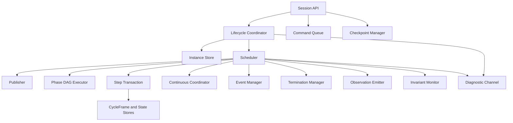
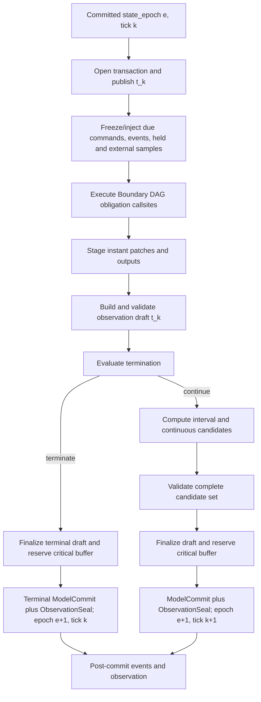

# 06｜仿真内核、时间与生命周期

[上一册：组件目录与 Mission 编译器](05-component-catalog-and-mission-compiler.md) · [返回总索引](README.md) · [下一册：诊断、可靠性与可观测性](07-diagnostics-reliability-and-observability.md)

**主线定位**：本册描述一次 Run 怎样消费 ExecutionPlanImage 与 RunBinding，经过初始化、多个 step、终止或取消，形成 RunOutcome。单个 step 的因果与事务细节由 [14](14-cycle-dataflow-state-transaction-and-continuous-closure.md) 定义；本册把这些 step 组织成完整 Session 生命周期。

## 本册一口气读完：一次 run 的权威边界

`REF-YYZ-001` 以 `plan:yyz:8c41` 和 `run:yyz:baseline:0001` 创建 Session。Initialize 验证 RunBinding、建立 owner state blocks 和 plan handles；每个 10 ms tick 执行一个 StepTransaction。`tick=2500` 的候选通过校验后形成 `commit:model:2501`，随后 seal 出绑定该 commit 的 ObservationBatch。运行在 30 s 正常结束，RunOutcome 保存 terminal reason、last commit、EvidenceValidity 和 ArtifactRefs。

若 integration 在 commit 前失败，staged journal 被丢弃，state_epoch 保持原值；若 CSV sink 在 commit 后失败，模型事实保留，RunOutcome 与 evidence validity 记录 durability failure。Session 从不解析 Mission 或选择组件。[00A §4–§6](00a-yyz-end-to-end-walkthrough.md)给出 RunBinding、step 和 CSV 的同一组数据。

## 1. 设计目标

Simulation Session 是 [02](02-layered-reference-architecture.md) 所定义 Model Authority 的唯一提交边界。它不拥有 Plan、Workflow task 或 Artifact durability。每次 initialize、reset 和 branch restore attempt 分配新的 RunId；相应 Commit 成功后该 id 成为开放 run，失败时仍用于最小 attempt outcome。同一 Session 可以顺序承载多个 run，但任一时刻只开放一个 run。它负责：

- 接收不可变 ExecutionPlanImage；
- 拥有全部运行中组件和可变状态；
- 以确定顺序执行生命周期；
- 管理仿真时钟、调度、积分、事件、终止和命令；
- 在成功、失败和取消后完成统一收尾；
- 通过端口输出 Observation、Diagnostic、Event 和 RunOutcome；
- 支持多个 Session 相互隔离地并存。

`CreateSession` 只接收 shared immutable `ExecutionPlanImage`，并以 `SessionCreateOutcome{status=Created, session_handle}` 发布 Created Session。`InitializeSession` 接收经 Descriptor RunBindingSchema 验证的 `RunBinding`，restore 从 checkpoint 取得 binding，后续 reset 可以提交同 schema 的新 binding。Session 不解析 Mission Source、不 link Catalog、不生成具体 CSV/报告，也不编排 DATCOM 或 GPOPS2。

## 2. 内核模块



| 模块 | 职责 | 不承担 |
| --- | --- | --- |
| Session API | 命令、查询、状态与 handle | Runtime Cell 具体调度细节 |
| Lifecycle Coordinator | model prepare、实例化、session resource prepare、initial/reset state build、checkpoint decode、run resource open、finalize/lease close、unwind | Mission 编译 |
| Instance Store | Runtime Cells、prepared assets、runtime handles | 全局 registry |
| Scheduler | tick、phase、rate、safe point | 数值算法实现 |
| Publisher | 刷新 committed-state views | 连续状态推进 |
| Phase DAG Executor | 按依赖拓扑调用 committed-state-in/delta-out component | 外部 Workflow |
| Step Transaction | 暂存 instant/interval/continuous delta 并统一提交 | 外部文件 durability |
| CycleFrame/State Stores | typed signal slots、committed state、held outputs | transaction candidate、名称查找、领域算法 |
| Continuous Coordinator | candidate state、group、integration commit | CSV 写入 |
| Event Manager | event detection、ordering、delivery | 任意消息总线 |
| Termination Manager | 条件树和结构化决定 | 自由文本 summary |
| Observation Emitter | 形成 typed batch | 文件格式 |
| Invariant Monitor | 状态、数值和物理约束 | 自动修复未知错误 |
| Checkpoint Manager | 状态快照和恢复 | 跨 plan 任意转换 |

目标分支直接建立上述 Session collaborators。现有 `Simulator` 只作为现状证据和 scientific comparison runner，在纵向 slice 通过后整体删除，不进入新 Session 外壳。

## 3. Session 状态机

```mermaid
stateDiagram-v2
    [*] --> Created
    Created --> PreparingModels: initialize / restore
    Created --> Disposed: dispose
    PreparingModels --> Instantiating
    Instantiating --> PreparingResources
    PreparingResources --> Initializing: initialize path
    PreparingResources --> Restoring: restore path
    Initializing --> Ready
    Restoring --> Paused: RestoreCommit
    Ready --> Running: run
    Ready --> Stepping: step
    Running --> Paused: pause at safe point
    Paused --> Running: resume / run
    Paused --> Stepping: step
    Stepping --> Paused: step committed
    Ready --> Resetting: reset
    Paused --> Resetting: reset / truncate run
    Running --> Terminating: termination decision
    Stepping --> Terminating: termination decision
    PreparingModels --> Cancelling: cancel request
    Instantiating --> Cancelling: cancel request
    PreparingResources --> Cancelling: cancel request
    Initializing --> Cancelling: cancel request
    Restoring --> Cancelling: cancel request
    Ready --> Cancelling: cancel request
    Running --> Cancelling: cancel request
    Paused --> Cancelling: cancel request
    Stepping --> Cancelling: cancel request
    Resetting --> Cancelling: cancel request
    PreparingModels --> Failing: failure
    Instantiating --> Failing: failure
    PreparingResources --> Failing: failure
    Initializing --> Failing: failure
    Restoring --> Failing: failure
    Running --> Failing: failure
    Paused --> Failing: failure
    Stepping --> Failing: failure
    Resetting --> Failing: failure
    Terminating --> Finalizing
    Cancelling --> Finalizing
    Failing --> Finalizing
    Finalizing --> RunCompleted: completed/terminated; validity frozen
    Finalizing --> Cancelled: cancellation
    Finalizing --> Failed: primary or finalization failure
    Resetting --> Ready: ResetCommit
    RunCompleted --> Resetting: reset
    RunCompleted --> Disposed
    Cancelled --> Disposed
    Failed --> Disposed
```



### 3.1 状态语义

| 状态 | 允许操作 | 查询保证 |
| --- | --- | --- |
| Created | initialize、restore、dispose | plan 可读，无实例 |
| PreparingModels | cancel | PreparedModel journal/cache refs 可诊断 |
| Instantiating | cancel | 已创建 Runtime Cell 子集可诊断 |
| PreparingResources | cancel | 已建立 resource 子集与 cleanup journal 可诊断 |
| Initializing | cancel | initialized journal 可读 |
| Restoring | cancel | checkpoint decode/validation journal 可读，尚未发布 restored state |
| Ready | run、step、reset、cancel、checkpoint | 当前 run 的 t0 committed state 已建立 |
| Running | pause、cancel、query snapshot | 只在 safe point 返回一致 snapshot |
| Paused | step、resume、reset、cancel、checkpoint | 状态停在 commit boundary |
| Stepping | cancel、query snapshot | 只推进一个 StepTransaction，成功后自动回到 Paused |
| Resetting | cancel | 新 run 尚不可见，旧 committed state 保持可诊断 |
| Terminating | query | 已有 TerminationDecision |
| Cancelling | query | 不再接受普通命令 |
| Failing | query | primary failure 已冻结 |
| Finalizing | query | 正在逆序释放资源 |
| RunCompleted | query/export/reset/dispose | 非执行失败的 RunOutcome 已冻结 |
| Cancelled | query/export/dispose | cancelled RunOutcome |
| Failed | query/export/dispose | failed RunOutcome |
| Disposed | identity/outcome query | 运行资源已释放 |

非法转换返回 CommandOutcome，不只写日志。

该生命周期逻辑属于 runtime application，不进入 Mission 模型图。领域局部行为、共享 flight phase 和物理 configuration 使用 [13](13-behavior-composition-and-extension-mechanisms.md) 的 mechanism/owner 规则。

### 3.2 run attempt 与 active run

Created Session 尚无 RunId。每次 initialize、reset 或 restore 请求先由 Lifecycle Coordinator 创建：

```text
PendingRunAttempt {
  run_id
  attempt_kind        // Initialize | Reset | RestoreBranch
  proposed_run_sequence
  canonical_binding_ref
  parent_run_id?
  parent_checkpoint_id?
  lifecycle_phase
  attempt_outcome_builder
}
```

首个 initialize 的 proposed run_sequence 为 0，reset 为当前 committed run_sequence + 1，branch restore 在新 Session 中为 0。只有 InitializationCommit、ResetCommit 或 RestoreCommit 才把它转换为 `ActiveRunContext` 并公开 run_sequence。commit 前失败或取消仍保留全局唯一 RunId，产生对应 Initialization/Reset/RestoreOutcome 与 `committed_model=false` 的最小 RunOutcome/Manifest；Session 的 state_epoch、tick 和 run_sequence 不因该 attempt 改变。reset 开始前已经冻结的旧 RunOutcome 保持 immutable。

## 4. 生命周期事务

### 4.1 Model prepare

Lifecycle Coordinator 按 ExecutionPlanImage 的 PreparedModelPlan，以 CompiledModelOccurrence 调用已 link 的 `ModelPrepareFactory`，或取得已验证的 immutable cache entry。cache lookup 只使用 [05 §17.2](05-component-catalog-and-mission-compiler.md#172-preparedmodelkey) 定义的 `PreparedModelKey`；本册不复制字段。命中后仍校验 key、schema、domain evidence 和 immutable payload hash。失败时释放本次取得的临时资源，不创建 Runtime Cell。

### 4.2 Runtime Cell 实例化

Lifecycle Coordinator 按 Execution Plan 创建 Runtime Cell，并记录 journal：

- instance id；
- factory/implementation version；
- creation status；
- owning scope；
- destroy action。

创建失败后逆序销毁已创建实例，Session 进入 Failed。

Compiler 已完成配置校验和绑定解析。`RuntimeCellFactory` 一次接收 PreparedModel、RuntimeInstanceId、compiled port/state/output/query handles 与 resource plan；新 Session 不调用 ConfigNode configure、AssemblyContext bind 或 runtime 名称解析，也不进行第二次注入。

### 4.3 instance resource prepare

只有声明 `InstanceResourcePrepareHook` 的 cell 进入该阶段，用于建立 run-invariant、session-scoped 的 socket facade、进程宿主、共享内存区和设备连接等不可共享资源。每个成功动作登记 cleanup 或交给 RAII owner；该 hook 看不到 RunBinding，无权建立领域 state、读取仿真时间或修改 PreparedModel。失败后按 journal 逆序清理已建立资源。replay 文件、每 run endpoint subscription 和由 binding 选择的输入流留到 RunResourceOpenHook。

### 4.4 initialize

initialize 先用无副作用 InitialStateBuilder 建立候选可变状态、确定性随机流状态和初始发布态；Session control manager 依据 plan 建立候选 CommandLedger/SessionCommandQueue/EventQueue。随后通过声明的 RunResourceOpenHook 建立 binding-specific run resource lease，每个 lease 在 journal 中携带 rollback/close action。只有全部 required component、初始 output、control store、run resource 与 invariant 均成功后，Session 才原子形成 `InitializationCommit(state_epoch=0)` 并进入 Ready；若 ObservationPlan 选择 InitialAtT0，其 draft 校验和 critical buffer reservation 位于 commit 前，ObservationSeal 与 InitializationCommit 同步形成。任一失败不暴露半初始化 model snapshot，并逆序释放已经打开的 run lease。

### 4.5 restore

restore 只允许在新建的 Created Session 上发起。恢复请求使用 checkpoint 内的 canonical RunBinding，任何外部 binding override 都被拒绝；系统先校验 checkpoint header、plan hash、binding/schema/layout/package lock，再沿 PreparingModels、Instantiating 和 PreparingResources 建立相同运行骨架。Restoring 阶段把 checkpoint payload 解码到候选 CommittedStateStore、CommittedOutputStore、CommandLedger、SessionCommandQueue 与 EventQueue，使用 source cursor 和 external-effect idempotency receipt view 调用 RunResourceOpenHook，并完成 invariant 与 source-cursor 检查。全部成功后形成 `RestoreCommit(restored_state_epoch, tick)` 并进入 Paused；失败不发布任何 restored snapshot，并关闭本次已打开的 run lease。

目标 v1 固定为 branch restore：Session factory 先建立只有新 SessionId 的 Created Session，`RestoreSession` 发起时再由 Lifecycle Coordinator 为 PendingRunAttempt 分配新 RunId；attempt 记录 parent RunId/checkpoint id 和 parent run_sequence，保留 checkpoint 的物理 state_epoch、tick、time origin 与 RunBinding。新 Session 的 local run_sequence 从 0 开始。旧 RunOutcome/Artifact immutable，新 run 的 observation sequence 从零开始，并可封存 `RestoredAtCheckpoint` batch。原地覆盖活动 Session、续写旧 Artifact 和跨 Descriptor migration 不进入 v1。

CommandLedger 以 checkpoint ledger sequence 作为新分支基线，下一次 ledger commit 从该值递增。历史 `CommandSubmissionOutcome`、`CommandLedgerMaintenanceReceipt` 和 `CommandApplicationReceipt` 保留 parent RunId；仍有效且未消费的 queue entry 复制到新分支，增加 `branch_run_id=new RunId` 并保留 `origin_run_id/origin_command_id`，其 logical effective time 与 expiry 不变。已经 Applied、Rejected、Expired 或 Superseded 的 command 不重新入队。RestoreCommit 前拒绝新 command submission，避免外部命令与 checkpoint cutoff 交错。

### 4.6 finalize

finalize 关闭当前 run 的 observer、sink 与 run-scoped resource，Session plan 和可共享 PreparedModel 保留到 dispose。它满足：

- 对每个已通过 InitializationCommit、RestoreCommit 或 ResetCommit 打开 run 的 Runtime Cell，RunFinalizeHook 每 run 至多调用一次；
- 按 run resource 打开顺序的逆序执行 RunFinalizeHook；
- 每个可选 RunFinalizeHook 返回后，无论结果如何，Lifecycle Coordinator 都执行对应 lease close；
- 单个 finalize 失败不阻止其他组件清理；
- 清理诊断附加在 primary outcome 后；
- finalize 不能覆盖原始失败；
- 输出管线 flush/close 与组件 finalize 分开记录；
- 完成后冻结 RunOutcome。

若失败或取消发生在本次 InitializationCommit、RestoreCommit 或 ResetCommit 前，系统不生成 run finalize；Lifecycle Coordinator 先按 run-open journal rollback/close lease，再按 session-resource/instance journal 逆序执行 cleanup/DisposeHook。进入 Cancelled 或 Failed 时，本次 run lease 必须关闭，随后按终态策略释放 session-scoped resource；RunCompleted 可以保留 descriptor 声明为 reusable 的 session-scoped resource 供 reset。

### 4.7 reset

reset 适用于 RL episode 和重复运行，只有全部 `RuntimeComponentDescriptor` 声明 Resettable、所有模型状态可重建且外部资源给出重建/清理策略时才能启用。它只从 Ready、Paused 或 RunCompleted 接受；Running/Stepping 必须先到达 committed boundary。Paused/Ready 上的 reset 会先按 run finalization 规则 flush/close 当前 run-scoped sink/resource，并把 RunOutcome 冻结为 `Truncated`，reason 固定为 `ResetRequested`；任一 critical finalization 失败会阻止新 run 打开。RunCompleted 的既有 RunOutcome 已完成该过程，保持不变。

Resetting 使用独立事务建立下一 run，包含：

- 全部 continuous/discrete/Mode/Parameter/SourceRuntime state blocks 与 RNG streams；
- CommittedOutputStore 的初始 held outputs；
- CommandLedger、SessionCommandQueue 与 EventQueue；
- termination state；
- observation sequence；
- metrics；
- time/tick；
- RunBinding、run id 与派生 seed streams。

ResetStateBuilder 先建立候选 blocks/outputs，Session control manager 再按 v1 固定 ResetPolicy 建立空 CommandLedger/SessionCommandQueue/EventQueue，新的 command ledger sequence 从 0 开始；随后 RunResourceOpenHook 依据新 binding 建立新的 run lease。旧 run lease 已在前置 finalization 中关闭。新 lease 打开失败时执行逆序 rollback，不复活旧 run resource。旧 run 的 queued command/event 不跨 reset 携带，Resetting 期间的新 submission 返回 rejected outcome；Experiment command schedule 在 ResetCommit 后按新 RunId 注入。

成功时形成 `ResetCommit`：`run_sequence` 增加，tick 归零，`state_epoch` 增加一次，新的初态和初始 output 原子可见；InitialAtT0 的 draft/reservation/seal 使用与初始化相同的配对边界。失败或取消时不暴露半重置状态，旧 committed state 保持可诊断，Session 进入 Failed 或 Cancelled。历史 RunOutcome 不被覆盖。

无法可靠 reset 的组件要求创建新 Session。

## 5. 时间模型

### 5.1 整数 tick 权威

固定步长模式以 `tick` 为权威，时间由 `time_origin` 和 dt 计算：

```text
t_k = time_origin + tick * base_dt
```

避免通过重复浮点加法累积时间。StepContext 同时携带 tick、SimulationTime 和 Duration。

`state_epoch` 是独立的 committed-state 版本号，不能用来计算仿真时间。首次 `InitializationCommit` 建立 `(state_epoch=0, tick=0)`；每个成功 ModelCommit 令 state_epoch 增加一次。continue step 同时令 tick 增加，terminal instant commit 保持 tick，ResetCommit 把 tick 置零并增加 run_sequence。失败与 ModelCommit 前取消保持 state_epoch、tick 和 run_sequence 全部不变。

### 5.2 duration 对齐策略

RunProfile 必须显式选择：

| 策略 | 行为 |
| --- | --- |
| ExactGrid | duration 必须是 dt 整数倍，否则 compile error |
| StopBefore | 运行到不超过 duration 的最后 grid point |
| StopAfter | 运行到覆盖 duration 的首个 grid point |
| FinalPartialStep | 后续 KernelCapability；最后一步使用较短 dt，需独立时间点与事务语义 |

目标 v1 接受 ExactGrid、StopBefore 和 StopAfter，默认 ExactGrid，避免 `llround` 隐式改变结束时间。FinalPartialStep 会破坏 `time_origin + tick * base_dt` 的固定网格恒等式；在 SegmentTransaction/time-point mapping ADR 完成前，Compiler 对它报 unsupported KernelCapability。

### 5.3 五类时刻

- cycle start `t_k`；
- data sample time；
- data valid time；
- event time；
- wall deadline。

调度、数据契约和观测计划分别使用相应类型。

## 6. 固定步长语义

保留 t_k 发布与 terminal 先观测的科学语义，同时把离散和连续状态纳入统一事务：



### 6.1 发布阶段

Truth/state projector 从 committed state 生成 CycleFrame 的 t_k sample。Projector 是纯函数，不推进状态，也不调用 mutable component。环境等只读派生量通过编译后的 PureQuery handle 求值；form input 的物理闭合由 ClosurePlan 在声明的 sample/candidate point 求值。

### 6.2 Boundary DAG region

Boundary DAG 内保留 coarse 因果带：

```text
environment -> perturbation -> input -> process
-> output -> closure -> evaluation
```

每个 phase band 内由 current-cycle dependency DAG 拓扑排序。编译后的 obligation callsite 读取 committed own state 与 typed InputFrameView，返回 `ComponentDelta`。Delta 可包含 `InstantPatch@t_k`、`IntervalCandidate@t_{k+1}`、sampled output、interval model、event、telemetry 和 diagnostic。组件不能原地写 committed state 或其他 owner。

### 6.3 记录与终止

触发终止条件的 t_k truth、当周期 output、transition 和 decision 进入 ObservationBatch。Terminal branch 提交 t_k 的 InstantPatch 与 held output，丢弃 IntervalCandidate 和 continuous candidate，simulation time 保持 t_k。

### 6.4 连续积分

所有 integration scope 从同一 committed state set 计算候选下一状态。Frozen/Candidate/Algebraic closure 由 Execution Plan 指定。全部 discrete interval 与 continuous candidate 成功且通过约束后，与 InstantPatch、held output、command/event consumption 一起统一提交。任一失败使当前 step 全部 model delta 回滚。

## 7. StepTransaction

### 7.1 StepOutcome

| 字段 | 含义 |
| --- | --- |
| tick/time_before | 本步开始 |
| region/callsite_reached | 最后成功区域与调用点 |
| status | Committed、Terminated、Cancelled、Failed |
| component_deltas | 已求值、暂存与提交的 delta 摘要 |
| base/committed_epoch | 事务基线与结果 epoch |
| observation_batch | 已形成的数据引用 |
| termination | 可选决定 |
| integration | 各 scope outcome |
| events | 本步事件 |
| diagnostics | 本步诊断 refs |
| time_after | 成功提交后的时间 |

### 7.2 commit 点

内核区分四个概念，其中前两个组成一次无失败窗口的内存原子操作：

1. **ModelCommit**：InstantPatch、适用分支的 IntervalCandidate/continuous candidate、held output、tick 与队列消费原子成为新 state_epoch；每次成功恰好增加一次；
2. **ObservationSeal**：与该 commit 对应的 t_k batch 和 journal 同步冻结；所有 schema 校验和 CriticalEvidence buffer reservation 已在此之前完成；
3. **ExternalEffectCommit**：可选 ExternalEndpoint effect facet 执行已经暂存的 HIL、网络或引擎效果；
4. **EvidenceCommit**：记录后端将 batch/manifest 持久化。

ModelCommit/ObservationSeal 采用预校验后的 no-fail swap；若最终 invariant 检查仍失败，两者均不发生。ExternalEffectCommit 与 EvidenceCommit 位于该原子边界之后，各自产生 Outcome；失败可以终止或 invalidate run，无法通过倒退物理状态伪造回滚。二者的等待与顺序由 Execution Plan 声明，缺省可独立执行。

### 7.3 失败位置

| 失败位置 | state | observation | Session |
| --- | --- | --- | --- |
| Publish/Boundary 前 | 保持 base state_epoch e | failure diagnostic 独立保存 | Failed |
| Boundary obligation 中 | instant/interval staged delta 全丢弃 | 不发布 partial model batch | Failed |
| termination evaluator | staged delta 全丢弃 | failure diagnostic 可保存 | Failed |
| interval/integration candidate | instant/interval/continuous delta 全丢弃 | unsealed draft 丢弃 | Failed |
| critical buffer reservation | 保持 state_epoch e | 不形成 model batch | Failed |
| model commit invariant | 保持 state_epoch e | validated draft 不 seal | Failed |
| noncritical display sink | state 可继续 | 丢弃计数 | 依 policy |
| post-commit external effect | state 已提交 | sealed observation 保留 | Failed/Terminated，依 endpoint policy |
| post-commit critical durable write | state 已提交 | evidence durability failure | `Partial` 或 `Invalid`，由 EvidenceCriticality 与 policy 决定 |

## 8. 编译区域执行器

### 8.1 编译后的调用表

Session 不在每步扫描 registry 或 dynamic_cast。Execution Plan 提供：

- ExecutionRegionPlan；
- ObligationCallsitePlan；
- BoundaryDagPlan 与 phase-band levels；
- compiled step interval/offset；
- continuous scopes；
- event detectors；
- termination evaluators；
- observation samplers。

### 8.2 确定排序

排序键依次为：

1. execution region；
2. phase band；
3. dependency topological order；
4. explicit priority；
5. stable instance id。

注册顺序不进入计划。priority 只打破同一拓扑 level 且互无路径关系的节点顺序。

### 8.3 多速率

固定基频下，task 在 `(tick - offset) % interval == 0` 时执行。TemporalContract 决定未执行周期的输出：hold-last、unavailable 或 provider-defined。consumer freshness 在运行时可监测。

### 8.4 回调

当前 before/after callback 迁移为 typed SessionObserver 或 EventSubscriber。回调声明是否允许失败、是否影响运行、线程模型和性能预算。任意 lambda 不应获得内部可变对象访问权。

## 9. `CommittedStateStore`、连续闭合与积分

### 9.1 `CommittedStateStore`

`CommittedStateStore` 管理：

- committed state blocks；
- discrete/continuous/mode/configuration state schema；
- ParameterState 与 ExternalEndpoint SourceRuntimeState；
- EntityLifecycleState、relationship state 与 topology revision；
- StateLayout hashes；
- 影响模型结果的 RNG cursor 与 owner counter state；
- initial state；
- checkpoint serialization；
- state invariant metadata。

`StepTransaction` 独占 instant patch、interval candidate 与 continuous candidate buffers；`CommittedOutputStore` 独立保存 held samples。组件通过 typed state handle 只读自己的 committed block，并通过 ComponentDelta 提议变化。Truth projector 只读取 committed epoch；downstream 无法读取 transaction candidate，只读取 CycleFrame output。

### 9.2 `IntegrationScopePlan`

每个已编译 integration scope 可以是单系统或连续多 member 集合，包含：

- scope id；
- member state blocks；
- derivative evaluator；
- integration definition/policy；
- workspace；
- constraints；
- event sources；
- diagnostic subject。

每个 scope 还声明 closure strategy：FrozenInterval、CandidateState 或 AlgebraicSolve。完整对象见 [14](14-cycle-dataflow-state-transaction-and-continuous-closure.md)。

### 9.3 RK 子步语义

在一个 `IntegrationScopePlan` 内，derivative evaluator 读取该 scope 的候选 state；其他 scope 的状态保持 `x_k` 发布值。若两个系统在 RK 子步需要共享候选状态，它们必须属于同一 IntegrationScopePlan。

FrozenInterval closure 使用 t_k 明确求得的 interval input。CandidateState closure 在每个 RK stage 通过 pure query/closure kernel 重算气动、推进、质量等 response。需要共享 candidate state 的 StateOwner 必须属于同一 `IntegrationScopePlan`；只有 residual/constraint 需要联立求解时才建立嵌套 `SolverIslandPlan`。Closure kernel 不调用 RuntimeComponent，也不保存 `last_result`。

### 9.4 候选检查

- shape/layout；
- finite；
- hard invariants；
- integration error/status；
- group member completeness；
- optional projection amount；
- state delta guard（仅监测或按 policy）。

全部通过后，StepTransaction 原子提交 discrete instant/interval blocks、continuous candidates、held outputs 与 tick；`CommittedStateStore` 不单独提前交换某一类状态。

## 10. 事件模型

### 10.1 事件来源

| 类型 | 示例 |
| --- | --- |
| ScheduledEvent | 指定仿真时刻切换阶段 |
| StateEvent | 高度过零、燃料耗尽 |
| ComponentEvent | 锁定、分离、故障 |
| CommandEvent | 外部命令生效 |
| DeadlineEvent | 实时超限 |

### 10.2 事件排序

同一时刻按以下顺序决定：

1. safety/hard invariant；
2. termination；
3. mission phase transition；
4. component event；
5. observation-only event；
6. stable event id tie-break。

实际顺序进入 ADR 和测试。任意 event handler 不能在积分中间直接修改未提交 state。

### 10.3 状态事件定位

固定步长目标 v1 的状态改变与 termination 只支持：

- `AtGrid`：只在发布点判断并进入普通 StepTransaction；
- `InterpolateObservation`：可用 dense/root estimate 改善证据时间，只产生 observation/event estimate，不改变状态、tick 或 termination point。

`BracketAndLocate` 可先由 IntegrationStepOutcome 报告 root bracket/location evidence。任何在步内 root 上执行 jump、mode/configuration transition、terminal partial commit 或继续剩余子区间的能力，必须先引入 `SegmentTransaction`、partial-time commit、event reducer 和 observation 语义；目标 v1 Compiler 对此类 EventDescriptor 直接报 unsupported KernelCapability。策略写入 RunProfile 和 EventDescriptor。

### 10.4 实体 activation 与拓扑 revision

目标 v1 支持 plan 中预声明的 inactive entity。分离、级间抛离或载荷释放事件只激活已经 link 的 entity occurrence，Compiler 预先给出 parent/child state、frame、impulse、mass/inertia、configuration、relationship 和 observation mapping。StepTransaction 在一个 ModelCommit 中提交 parent change、child initial state、active flag 与 topology revision；child 从下一 Publish Region 开始发布 entity-scoped truth。

事件处理器无权现场创建 Runtime Cell、扩大 `CommittedStateStore` 或重写调用表。运行中出现未知实例数量、未知 package/type 或新的 solver membership 时，进入独立 `TopologyTransaction` KernelCapability gate。该能力需要完整 graph/state/schedule/solver/observation diff、资源预算、原子校验、rollback 与 safe-point 设计。

### 10.5 接地、接触与动力学 regime

接地事件本身只报告事件和候选约束。目标 v1 可用持续 6DoF + landing-gear/contact force 运行滑跑、起飞和着陆，也可通过编译完整 state mapping 在 taxi/airborne form 间于网格点切换。精确 touchdown、bounce、impact jump 和剩余子区间推进进入 `SegmentTransaction`。碰撞或冲出跑道由 committed physical state 与 evaluator 生成 TerminationDecision，Kernel 不增加 aircraft/ground 专用分支。

## 11. 终止模型

### 11.1 TerminationDecision

| 字段 | 含义 |
| --- | --- |
| action | Continue、Complete、Abort、Invalidate |
| reason_code | 稳定代码 |
| trigger_time | 仿真时刻 |
| subject | evaluator/entity/component |
| priority | 多条件同时触发时排序 |
| metrics | 终止相关值 |
| message_key/params | 显示文案 |

### 11.2 组合逻辑

TerminationPlan 支持 all/any/priority 和 hard safety 条件。编译器检查条件输入是否在 evaluation phase 前可用。

### 11.3 结束状态

- 正常 duration 完成；
- mission condition 完成；
- safety abort；
- invalid physics；
- user cancellation；
- runtime failure。

这些状态分别进入 RunOutcome，不能全部压缩成自由文本 reason。

## 12. 命令与暂停

### 12.1 命令队列

外部命令先进入 SessionCommandQueue，包含：

- command id；
- target；
- submit wall time；
- requested sim effective time；
- expiry；
- DecisionAuthority；
- payload schema；
- correlation id。

命令子系统分成两个提交边界：

1. `CommandLedgerCommit`：提交入口校验 schema、target、DecisionAuthority 和 capacity，safe point 处理 expiry/supersession；它更新 `command_ledger_sequence` 与队列，不增加 model state_epoch，并产生 `CommandSubmissionOutcome` 或 `CommandLedgerMaintenanceReceipt`；
2. ModelCommit：有效 due command 进入 StepTransaction，owner 的 Applied/Rejected/Deferred application receipt 与其 state/output 影响一起提交。

CommandLedgerCommit 携带 RunId、ledger sequence、观察到的 tick/time 与原因，进入 checkpoint、replay 和 Run Manifest。StepTransaction 打开后失败或取消会丢弃 staged application receipt，due command 保持队列中的未消费状态。外部 caller 只有看到 committed application receipt 才能认定命令已经作用于模型。

### 12.2 pause

pause 请求在当前 StepTransaction 完成后生效。Paused 状态停在 committed boundary，允许一致 snapshot 和 checkpoint。

### 12.3 cancel

cancel 是幂等命令。它在以下 safe point 检查：

- 生命周期阶段之间；
- 每个离散 task 之间（可配置粒度）；
- integration scope 之间；
- 数值算法显式 cancellation point；
- workflow/record flush 等待期间。

cancel 不能异步破坏组件栈或直接终止线程。

取消提交规则固定为：

- 在 lifecycle callback 之间观察到取消：停止启动后续 callback，逆序清理已建立资源，进入 `Cancelled`；
- 在 StepTransaction 打开后、ModelCommit 前观察到取消：丢弃本步全部 instant/interval/continuous delta、output、event 和 receipt，committed epoch/tick 不变，生成 `StepOutcome::Cancelled`；
- 在 ModelCommit 后观察到取消：刚提交的 step 保留，在下一个 committed boundary 进入 `Cancelling`；
- post-commit external effect 或 critical sink 已开始时，先按各自 cancellation/durability policy 得到 ExternalEffectOutcome/EvidenceOutcome，再形成最终 RunOutcome；
- terminal decision 已提交后，termination 优先，后到 cancel 返回 rejected/superseded CommandOutcome。

pause 与 cancel 使用不同语义：pause 等待当前事务完成并停在新 committed boundary；cancel 可以在声明的 transaction safe point 中止当前未提交 step。

## 13. Observation 通道

### 13.1 发布快照与记录批次

- PublishedSnapshot 面向同周期组件和低延迟查询；
- ObservationBatch 面向记录、metrics、Python 和前端；
- 两者共享 FieldDescriptor 和时戳语义；
- debug snapshot 标记 ephemeral，不进入稳定 schema 承诺。

### 13.2 backpressure

| 策略 | 适用场景 |
| --- | --- |
| BlockAtSafePoint | 离线研究关键证据 |
| BoundedBufferThenFail | 默认文件记录 |
| DropNonCritical | 实时显示 |
| DecimateDisplay | 高频可视化 |
| SpillToTemporaryArtifact | 大批量离线 |

critical evidence 不允许静默丢弃。丢弃计数和时间范围进入 RunOutcome。

## 14. Checkpoint 与恢复

### 14.1 checkpoint 内容

checkpoint 只在 Ready/Paused 的 `CheckpointBarrier` 创建：无开放 StepTransaction，全部 required ExternalEffectCommit 已得到 ack，ExternalEndpoint 无未决非幂等效果，critical RecordSink 已返回 checkpoint token。barrier 失败返回 CheckpointOutcome，不写半有效 checkpoint。

- ExecutionPlanDescriptor hash 与 link fingerprint；
- SessionId、RunId、run sequence、canonical RunBinding values/hash/provenance refs、state_epoch、tick 与 time origin；
- 所有 state blocks 和 layout hash；
- CommittedOutputStore、ParameterState 和 ExternalEndpoint source cursors；
- RNG stream states；
- command ledger sequence/queue 与 event queues；
- termination evaluator state；
- observation sequence 与 sink checkpoint；
- external effect idempotency/ack receipts；
- model/package/asset lock；
- schema version 和完整性 hash。

### 14.2 恢复规则

- v1 要求相同 Descriptor plan hash、schema/layout hash 与 exact implementation lock；
- link fingerprint 变化默认拒绝；未来 package patch 恢复需要明示兼容声明和独立 migration ADR；
- state layout 变化在 v1 直接拒绝；
- 外部不可重放资源使 Session 标记 non-restorable；
- restore 不重发 checkpoint 前已经 ack 的 external effect；缺少 idempotency/ack 证明时拒绝恢复；
- restore 在候选 store 上完成 invariant check，再以 RestoreCommit 进入 Paused；
- 新 RunId、parent checkpoint、restored epoch/tick 与全部诊断进入 Run Manifest。

分层 hash 为后续“只更换 observation/encoding plan 后从 checkpoint 分支”保留窄升级路径：要求 `model_graph_hash`、`execution_core_hash`、state layout、RunBinding 和 implementation lock 兼容，创建新 Descriptor/RunId 并打开全新 sink/Artifact。该能力在 v1 仍关闭，未来只扩展 restore compatibility policy 和 evidence provenance，不改 `CommittedStateStore` codec、物理 commit 或模型 kernel。

### 14.3 replay

可重放运行还需要保存 runtime commands、外部输入样本和非确定事件。Replay 模式禁用实时来源，以记录流驱动相同端口。

## 15. 多 Session 与并发

### 15.1 隔离

每个 Session 独占：

- component instances；
- mutable state/workspaces；
- RNG streams；
- clocks/queues；
- diagnostics context；
- observation buffers。

可共享内容只包括 immutable ExecutionPlanImage、PreparedModel/cache entry、definitions 和 assets。Application 可以共享只读 Catalog，Session 热路径不获得 Catalog handle。

### 15.2 Session 内并行

首个稳定版本保持 phase 内确定性串行。并行执行只有在编译器证明：

- 无依赖边；
- 组件声明 reentrant/thread model；
- 输出分别写入独占缓冲；
- 合并顺序确定；
- 诊断顺序可稳定化。

并行只是执行优化，不改变逻辑 schedule。

### 15.3 Experiment 并行

优先并行独立 Session/case，隔离更简单、收益更大。case 结果通过 Artifact 汇聚。

## 16. 确定性

Session 确定性依赖：

- plan 固定排序；
- tick-based time；
- RNG 子流身份；
- 无全局 mutable singleton；
- 输出合并稳定顺序；
- 数值模式和算法版本；
- 命令和外部输入完整记录；
- 并行 reduction 明确顺序；
- wall time 不参与物理状态。

RunOutcome 记录实际达到的确定性等级和任何降级原因。

## 17. 实时模式

### 17.1 模式

| 模式 | 时间权威 | 超限策略 |
| --- | --- | --- |
| Unpaced | 仿真 tick | 尽快运行 |
| SoftRealTime | wall pacing | 记录 lag，可追赶 |
| InteractiveLockstep | 外部帧/step 命令 | 等待外部推进 |
| ExternalClock | 外部权威 clock | 按适配策略同步 |

硬实时需要内存、阻塞、调度和平台认证，属于后续独立资格。`RealTimeSafe` 组件声明必须经过工具验证。

### 17.2 前端隔离

前端读取 immutable render snapshot，提交 timestamped command。渲染帧率和仿真频率可以不同：

- 插值只影响显示；
- 命令在 safe point 生效；
- UI 卡顿不能阻塞离线仿真；
- 实时模式根据 backpressure policy 丢弃显示帧；
- 物理 committed state 始终由 Session 拥有。

## 18. 资源预算

Execution Plan 可估算：

- state dimension；
- per-step allocations（目标为零或固定）；
- observation throughput；
- prepared asset memory；
- event/command queue capacity；
- expected component cost；
- real-time deadline budget。

运行时记录每 phase wall time、最大/分位延迟、buffer high-watermark 和积分评估次数。性能 metrics 不进入物理状态。

## 19. RunOutcome

| 区域 | 内容 |
| --- | --- |
| identity | session/run/plan ids |
| final_status | Completed、Terminated、Truncated、Cancelled、Failed |
| evidence_validity | `Valid \| ValidWithCaveats \| Partial \| Invalid \| Unknown` |
| termination | structured decision |
| time | run sequence、initial/final tick、state epoch range、requested duration、wall duration |
| lifecycle | reached states、finalize status |
| numerical | steps、rejects、flags、max errors |
| diagnostics | primary、related、counts |
| observations | batches、drops、durability |
| artifacts | manifest 和 committed refs |
| determinism | requested/achieved |
| resources | performance summary |

`final_status` 的映射固定：自然 duration 完成或 `TerminationDecision::Complete` 为 Completed；受控领域/安全停止 `Abort` 为 Terminated；reset 或外部 episode 截断为 Truncated；用户取消为 Cancelled；执行、数值或生命周期无法完成为 Failed。`Invalidate` decision 或关键证据失效记录为 terminal reason，`EvidenceValidity` 独立使用统一五值枚举。

RunOutcome 在 finalize 后冻结。即使初始化失败，也产生一个最小 outcome 和 diagnostic artifact。

## 20. 新内核的直接建设顺序

### K0：科学 oracle 与事务规范

- 固化 t_k truth/record/terminal 科学语义和 reference outputs；
- 明确 InstantPatch、IntervalCandidate、ContinuousCandidate；
- 写出 StepTransaction 状态表和全部 framework failure-point injection cases；
- 旧 Simulator 行为只作为差异来源，不构成 API/调度兼容目标。

### K1：空模型新 Session skeleton

- 建立 SessionState、LifecycleCoordinator、`CommittedStateStore`、CycleFrame、StepJournal 与 RunOutcome；
- 建立 model/evidence 两类 commit；
- 先用 fixture cells 验证 success、terminal、failure、cancel 与 finalize；
- 不包装现有 Simulator。

### K2：编译调用表与 ComponentDelta

- Session 只消费新 ExecutionPlanImage；
- 实现 ExecutionRegionPlan、ObligationCallsitePlan、Boundary DAG、typed slot、instant/interval state delta 和 held output；
- tick 成为权威时间；
- runtime 无 registry 扫描、dynamic_cast 和 direct bind fallback。

### K3：YYZ 6DoF 纵向 slice

- 先实现 FrozenIntervalClosure；
- 按 [15](15-reference-vertical-designs-and-object-placement.md) 迁移 truth、sensor、navigation、guidance、control、physical models、closure 与 evaluation；
- 比较 scientific outputs 并分类修复、模型选择和预期数值变化；
- slice 通过后 runner 直接切换新 Session。

### K4：批量迁移与旧内核删除

- 其余 builtin/project component 按 Runtime Cell Recipe 与 obligation set 批量迁移；
- AutoDataLogger/SimulationSummary 改由 Observation/RunOutcome 外侧适配；
- 删除 Simulator、SimulationNode、NodeRegistry、旧 runtime provider interface 和 provider getter 路径；
- tests 只保留新 Plan/Session fixture。

### K5：Candidate closure、reset 与扩展能力

- CandidateState `IntegrationScopePlan` 与高保真 6DoF reference；
- Resettable/Checkpointable、多 Session、replay input stream；
- EventPlan；形成独立 ADR 后再实现 SegmentTransaction/ContinuousLocated state event；
- soft real-time、lockstep 和 render snapshot；
- 每项能力在新内核上单路径建设。

## 21. 测试矩阵

| 领域 | 必需测试 |
| --- | --- |
| 生命周期 | 每个阶段注入失败、逆序 finalize、primary cause 保留 |
| 时间 | duration 对齐、tick 精度、终止状态先记录 |
| 调度 | execution region、obligation callsite、Boundary DAG、priority tie-break、rate、freshness、temporal relation |
| 事务 | instant/interval/continuous commit、terminal 分支、全位置 rollback |
| 连续 | Frozen/Candidate closure、group、NaN、维度错误、约束投影 |
| 命令 | accept/reject/expiry、pause/cancel race |
| 实体/拓扑 | inactive activation、parent/child 原子 mapping、topology revision、unknown dynamic topology 拒绝 |
| 接触/regime | grid contact、state mapping、impact evaluator、SegmentTransaction gate 拒绝 |
| observation | backpressure、disk failure、critical/noncritical |
| checkpoint | 同 plan 恢复、hash mismatch、RNG 重放 |
| 并发 | 多 Session 隔离、共享 immutable asset |
| 实时 | pacing、lag、display frame drop、命令时戳 |
| determinism | 相同 plan/seed/commands 的回放比较 |

## 22. 完成定义

1. Session 有完整且可查询的状态机，包含 Failed 与 Cancelled。
2. 任一阶段失败都会执行适当收尾并产生 RunOutcome。
3. 正常、终止、取消、失败和证据失效具有不同结果状态。
4. 固定步长循环明确 `t_k` 发布、delta 求值、terminal commit 和区间/连续推进语义。
5. 时间以整数 tick 为权威，duration 对齐无隐式取整。
6. Session 每步使用编译后的调用表，不扫描 registry。
7. 全部 instant、interval、continuous delta 通过事务规则统一提交或回滚。
8. observation 后端通过端口连接，文件系统不属于内核职责。
9. 多 Session 不共享可变模型状态、RNG 或工作目录。
10. reset、checkpoint、命令、实时模式各有明确能力声明和测试边界。
11. query/closure 调用没有隐藏状态写入，RK stage telemetry 与 published sample 分离。
12. 旧 Simulator/SimulationNode 运行路径已经删除，runner 只有一个 Session 入口。
13. 多实体 committed truth 与已知 entity activation 复用普通 `CommittedStateStore`、Plan 和 ModelCommit；运行期无可写全局 truth 容器。
14. 接地/接触可由 6DoF closure 或显式 state mapping 表达；步内 jump 与未知动态拓扑保留独立 KernelCapability gate。
