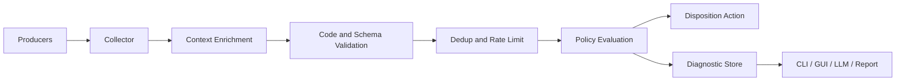
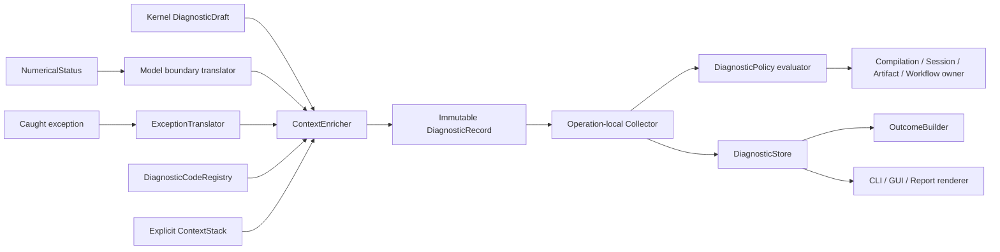

# 07｜诊断、可靠性与可观测性架构

[上一册：仿真内核与生命周期](06-simulation-kernel-time-and-lifecycle.md) · [返回总索引](README.md) · [下一册：数据、产物与研究证据](08-data-artifacts-and-research-evidence.md)

**主线定位**：本册贯穿 Design/Plan、Model、Operation 与 Artifact 四类权威域，规定问题怎样从发现点进入 policy、Outcome、因果链和用户呈现。它接收各 owner 的结构化问题事实，把可持久化结果交给 08，并避免建立隐藏的全局控制流。

## 本册一口气读完：60 Hz 配置为何被拒绝

`REF-YYZ-001` 把 guidance 从 20 Hz 改为 60 Hz 后，schedule pass 产生 `DiagnosticDraft`。编译上下文补入 operation、source path 和 AuthorityDomain，形成不可变 `DiagnosticRecord{code=GNC-SCH-0104}`；transaction 将它收入 `DiagnosticBatch`。`DiagnosticPolicy` 随后产生 `PolicyDecision{severity=Error, disposition=FailOperation, validity_effect=Invalid}`，Compiler owner 据此提交失败的 `CompilationOutcome`。CLI 和 Studio 从同一 record 与 decision 各自生成 `RenderedDiagnostic`。

这条记录不拥有处置权，也不写日志；Compiler owner 提交失败 Outcome，08 册再把 records、batch、policy decisions 和可选渲染快照持久化为 `DiagnosticBundleArtifact`。稳定字段实例见 [00A §7](00a-yyz-end-to-end-walkthrough.md)。本册后文定义 code registry、cause graph、policy、waiver、Outcome 和 safe point 的完整关系。

## 1. 设计目标

当前错误多以硬编码文本、`std::runtime_error`、布尔返回和日志表达。目标架构把失败处置建设成一套独立且横贯所有层的系统，使任何问题都能回答：

- 发生了什么；
- 在哪个源位置、组件、端口、阶段、Session 和仿真时刻发生；
- 原因属于用户输入、模型适用域、数值算法、运行时、I/O、外部工具还是内部缺陷；
- 当前结果是否仍有效；
- 系统采取了继续、降级、重试、终止、取消或隔离中的哪一种动作；
- 用户可以怎样修复；
- 哪些后续诊断由它引起；
- 这次失败留下了哪些可审计证据。

诊断系统服务于研究可信度、开发调试、自动化、LLM 和前端，不能只被当成日志美化工具。

## 2. 六个不同概念

| 概念 | 定义 | 示例 |
| --- | --- | --- |
| Diagnostic | 对问题的结构化描述 | 配置字段缺失、表越界 |
| Outcome | 一次操作的最终状态和产物 | CompilationOutcome、RunOutcome |
| Exception | 进程内控制流机制 | 契约破坏、意外第三方异常 |
| LogEvent | 时间顺序上的运行叙事 | Session 进入 Running |
| Metric | 可聚合的数值观测 | extrapolation_count、region_latency |
| Trace | 跨阶段/任务的因果与耗时 | compile pass、tool invocation |

Diagnostic 可以被记录成日志，也可以附在 Outcome 中。异常可以被捕获并转换成 Diagnostic。Metric 和 Trace 提供趋势与性能证据，不能替代问题分类。

## 3. 设计原则

### D-01：稳定 code 与显示文案分离

自动化、测试和 policy 依赖 stable diagnostic code。中文或英文文案由 `message_key + parameters` 渲染，可以改进措辞而不破坏调用方。

### D-02：severity 与处置分离

同一个问题在探索模式可能 warning，在 qualification 模式可能令运行失效。Diagnostic 描述事实，Policy 决定 disposition。

### D-03：保留首要原因

后续 cleanup、sink close 或 summary 失败作为 related diagnostic 附加，不能覆盖触发失败的第一原因。

### D-04：预期失败是值

配置不合法、端口不匹配、求解不收敛、工具退出和用户取消都属于可预期 outcome。异常用于编程契约破坏、未知第三方异常和无法构造普通结果的内部错误。

### D-05：边界负责翻译

数值层返回 NumericalStatus，组件补充物理上下文，Session 转成运行处置，Control Plane 再渲染用户文案。低层不猜测高层行动。

### D-06：失败也要产生产物

只要进程仍可工作，失败的编译、Session 和 Workflow 都产生最小 outcome、`DiagnosticBundleArtifact` 和可用上下文。

### D-07：继续运行必须有依据

任何 Clamp、fallback、degrade、drop 或 retry 都由显式 policy 授权，并写入 metrics、diagnostics 和 manifest。

### D-08：模拟故障与框架失败分轨

舵机卡死、传感器偏置、电源退化等模拟故障是场景中的合法模型事实，通过 typed command、宿主 `FaultStateFragment` 或窄物理 `StateOwner`、普通物理输出和 Event/Observation 留证。配置错误、unsupported fault payload、数值失败、资源失败与 I/O 失败才进入 Diagnostic/Outcome。模型中的撞击、解体或失控由 `Evaluator` 根据 committed physical state 判定，诊断策略无权替代物理因果链。

## 4. DiagnosticRecord

### 4.1 核心字段

| 字段 | 含义 |
| --- | --- |
| diagnostic_id | 本次实例唯一 id |
| code | 稳定分类代码 |
| category | configuration、binding、numerical 等 |
| authority_domain | Design/Plan、Model、Operation、Artifact；指出哪个权威边界正在处理问题 |
| message_key | 可本地化消息模板 |
| parameters | 结构化模板参数 |
| stage | parse、compile、prepare、step、finalize 等 |
| region/callsite | 可选 execution region、phase band 与 obligation callsite |
| subject | package/model/runtime instance/port/field/task/artifact |
| scope | mission/environment/vehicle/entity |
| source_location | document URI、syntax-neutral field path、format-specific span |
| operation_context | compile/run/task 等 operation id、attempt 与提交边界 |
| simulation_context | session、run、tick、sim time |
| workflow_context | experiment、case、task、attempt |
| commit_context | 可选 plan/model/operation/artifact commit、base revision 与 receipt refs |
| evidence | offending value、expected range、residual 等 typed facts |
| cause_ids | 直接原因诊断 |
| related_ids | 相关但非因果诊断 |
| remediation | 建议动作列表 |
| repeat | count、first/last occurrence |
| tags | maturity、安全、用户可见性等 |

canonical `DiagnosticRecord` 不保存权威渲染句子。`DiagnosticBundleArtifact` 为离线阅读可以附加 `RenderedDiagnostic { locale, template_version, text, effective_severity?, disposition? }`；它由 record、DiagnosticCodeSpec 与可选 PolicyDecision 派生，渲染结果不参与 record identity、policy 或自动化判断。

### 4.2 `GNC-SCH-0104` 参考实例

```yaml
diagnostic_code_spec:
  code: GNC-SCH-0104
  message_key: schedule.rate_requires_integer_interval
  parameter_schema: [base_rate_hz, requested_rate_hz, ratio]
  evidence_schema: [required_integer_interval]
  default_severity: Error
  default_disposition: FailOperation
  waiver_policy: Prohibited
  documentation_ref: diagnostic://GNC-SCH-0104

diagnostic_record:
  diagnostic_id: diag:compile:0007
  code: GNC-SCH-0104
  category: scheduling
  authority_domain: DesignPlan
  stage: schedule-lowering
  subject: occ:guidance
  parameters: {base_rate_hz: 100, requested_rate_hz: 60, ratio: 1.6666666667}
  source_location: mission:yyz-altitude-hold:1#/vehicles/0/components/1/rate_hz
  operation_context: {operation_ref: compile:yyz:attempt-02}
  evidence: {required_integer_interval: true}
  cause_ids: []

policy_decision:
  decision_id: policy-decision:compile:0007
  diagnostic_id: diag:compile:0007
  policy_rule_set_id: qualification@1
  matched_rule_id: plan-error-fails-compile
  severity: Error
  disposition: FailOperation
  validity_effect: Invalid
  action_payload: {outcome_status: Failed}
```

DiagnosticCodeSpec 由静态 registry 拥有，record 由本次 compile operation 拥有，decision 由所选 policy rule-set 派生。三者通过 code、diagnostic id 和 rule id 建立可审计关系，各自保持独立生命周期与 identity。后续小节编号顺延时不改变该关系。

### 4.3 SourceLocation

SourceLocation 支持：

- Mission 文档 URI + SourceMap field path；具体 span 可为 JSON pointer、YAML line/column、INI section/key 或 editor node/property；
- include/override source chain；
- package manifest/schema 字段；
- asset URI + row/column/cell；
- C++ source location（内部缺陷）；
- external tool stdout/stderr line reference；
- generated Artifact field path。

### 4.4 SubjectRef

Subject 使用稳定 id：

```text
model definition/implementation version
model occurrence / Runtime Cell
port/field
entity/scope
algorithm/table
artifact/task/tool
session/case
```

名称可以附加显示，不能作为唯一标识。

### 4.5 Evidence

Evidence 使用小型 typed map，避免把全部事实拼进一句话。例如插值越界记录 axis id、query value、min/max、policy、returned flag；求根失败记录 residual、iterations、last bracket。

## 5. Diagnostic code 体系

### 5.1 格式

建议格式：

```text
GNC-<DOMAIN>-<NNNN>
```

code 一旦发布不改变含义，也不回收给新问题。

### 5.2 namespace

| 前缀 | 类别 | 示例问题 |
| --- | --- | --- |
| CFG | 配置语法与 schema | 缺字段、错误类型、重复 key |
| SRC | include/import/source map | 循环、越界 URI、覆盖冲突 |
| CAT | package/catalog | 版本冲突、重复 ModelDefinitionId |
| CMP | Mission 编译 | placement、policy、plan freeze |
| BND | 端口与依赖绑定 | provider 缺失、frame mismatch |
| LFC | 生命周期 | prepare/init/finalize 失败 |
| SCH | 时间与调度 | 非整数 rate、数据过期 |
| NUM | 数值 | 不收敛、奇异、NaN、容差不可达 |
| PHY | 物理域与不变量 | 负质量、超模型适用域 |
| EVT | 事件与终止 | 冲突、事件定位失败 |
| OBS | 观测与记录 | 字段缺失、buffer overflow |
| ART | Artifact 与谱系 | hash、commit、schema 失败 |
| EXP | Experiment | case materialization、聚合失败 |
| WFL | Workflow | DAG、cache、task transition |
| TOL | 外部工具 | exit code、timeout、协议错误 |
| SEC | 权限与安全 | 未授权命令、路径越界 |
| ABI | 语言/进程边界 | 版本协商、buffer ownership |
| INT | 内部缺陷 | 不变量破坏、未知异常 |

每个 namespace 由明确模块 owner 维护 registry 和文档。

### 5.3 code 文档

每个 stable code 记录：

- 含义和触发条件；
- 默认 severity；
- 可能阶段；
- evidence schema；
- 默认 disposition；
- remediation；
- 测试 fixture；
- 首次引入版本；
- deprecated/replacement（如有）。

## 6. Severity、Validity 与 Disposition

### 6.1 Severity

| 等级 | 含义 |
| --- | --- |
| Info | 有用事实或受控选择 |
| Warning | 偏离推荐状态，结果可能仍有效 |
| Error | 当前操作无法按原计划成功 |
| Fatal | 进程或核心不变量可能不安全 |

### 6.2 `EvidenceValidity`

`EvidenceValidity = Valid | ValidWithCaveats | Partial | Invalid | Unknown` 是 Observation、Outcome 和 Artifact 共用的唯一有效性枚举。

| 状态 | 含义 |
| --- | --- |
| Valid | 可用于声明的研究目的 |
| ValidWithCaveats | 有明确限制，报告必须披露 |
| Partial | 只有明确子集完成或可用，消费者必须检查 required coverage |
| Invalid | 运行或分析完成，但结论不可用 |
| Unknown | 无法评估有效性 |

本枚举与 [02 §1.4](02-layered-reference-architecture.md#14-各权威域的封闭操作语言) 及 [08](08-data-artifacts-and-research-evidence.md) 共用。`Invalidated` 只描述有效性从其他值转为 Invalid 的事件/reason，`Incomplete` 只描述 coverage 原因；二者不进入枚举。

### 6.3 Disposition

| 动作 | 使用边界 |
| --- | --- |
| Continue | 信息或可接受 warning |
| ContinueDegraded | 降级且留下 flag |
| SkipSubject | 跳过非关键字段、case 或 task |
| Retry | 只用于声明幂等和可重试的操作 |
| InvokeRecoveryReducer | 调用模型预先声明的 typed recovery/safe-mode reducer |
| PauseForApproval | 需要人工判断 |
| TerminateGracefully | 条件终止或安全 abort |
| FailOperation | 当前 compile/run/task 失败 |
| FailProcess | 内存破坏等无法隔离的 fatal |

DiagnosticPolicy 以 `code/category + stage + policy rule-set id + EvidenceCriticality` 决定 disposition。

## 7. Outcome 家族

### 7.1 通用结构

所有 Outcome 共享：

- operation id；
- AuthorityDomain 与 owner id；
- status；
- validity；
- primary diagnostic；
- related diagnostics；
- produced artifacts；
- timings；
- policy decisions；
- commit/receipt refs；
- partial result availability。

### 7.2 具体 Outcome

| Outcome | 状态示例 |
| --- | --- |
| ParseOutcome | Parsed、Failed |
| CompilationOutcome | Succeeded、SucceededWithWarnings、Failed |
| LinkOutcome | Linked、Failed |
| PreparationOutcome | Prepared、Partial、Failed、Cancelled |
| SessionCreateOutcome | Created、Failed |
| InitializationOutcome | Ready、Failed、Cancelled |
| RestoreOutcome | Paused、Failed、Cancelled |
| ResetOutcome | Ready、Failed、Cancelled |
| StepOutcome | Committed、Terminated、Failed、Cancelled |
| CheckpointOutcome | Committed、Failed、Cancelled |
| FinalizationOutcome | Succeeded、Failed |
| CommandSubmissionOutcome | Enqueued、SubmissionRejected |
| CommandLedgerMaintenanceReceipt | Expired、Superseded |
| CommandApplicationReceipt | Applied、Rejected、Deferred |
| RunOutcome | Completed、Terminated、Truncated、Cancelled、Failed；另带 EvidenceValidity |
| RecordOutcome | Committed、Partial、Failed |
| TaskOutcome | Succeeded、Cached、Skipped、Failed、Cancelled |
| WorkflowOutcome | Completed、Partial、Failed、Cancelled |

状态名在 schema 中稳定，不能依赖异常类型或进程 exit code 猜测。

## 8. 异常使用规则

### 8.1 可以使用异常的场景

- 违反内部 API 前置条件；
- impossible state 或不变量破坏；
- 标准库/第三方库抛出且本层无法返回正常结果；
- 构造对象失败，调用方边界会立即翻译；
- 分配失败等进程级问题。

### 8.2 使用 Outcome 的场景

- 用户配置错误；
- provider 或 contract 不兼容；
- 数值不收敛或域外；
- 资产缺失、格式不符；
- 文件无法写入；
- 外部工具非零退出、超时；
- 用户取消；
- 模型健康度下降；
- command 被拒绝。

### 8.3 catch 边界

必须存在的翻译边界：

| 边界 | 责任 |
| --- | --- |
| Component lifecycle invocation | 补充 instance/stage/source context |
| Component kernel/derivative invocation | 补充 algorithm、tick、region/callsite、port 和 state epoch context |
| Session command boundary | 保证 Session 状态一致 |
| Worker thread/process boundary | 防止异常逃逸导致无 outcome |
| Tool process adapter | 翻译 exit/timeout/stdout/stderr |
| C ABI/Python boundary | 禁止 C++ 异常穿越边界 |
| Top-level runner | 生成最终 exit status 和 crash artifact |

catch 后不能只拼接 `e.what()`。原始文本作为 evidence，stable code 由翻译边界分配。

### 8.4 未知异常

未知异常转换为 `GNC-INT-*`，标记 InternalFailure 和 Unknown validity。若 Session 可安全收尾，继续 finalize；若内存完整性无法保证，写最小 crash marker 后结束进程。

### 8.5 Kernel、obligation entry 与 policy 的分工

- AlgorithmKernel 返回 `DiagnosticDraft`，只携带稳定 code、数值 evidence 和领域 subject；
- 编译后的 obligation entry 与 Runtime Cell shell 补充 component instance、algorithm version、tick、region、phase band、port 和 committed epoch；
- StepTransaction 把 draft 与 ComponentDelta 放入同一 journal；
- Session policy 决定继续、拒绝 command、进入显式 safe transition、终止或失败；
- renderer 根据 message key/params 生成 CLI、GUI 和报告文案。

Kernel 不直接记录日志，也不通过异常或隐藏成员切换 behavior。局部 mode/fault transition 由 [13](13-behavior-composition-and-extension-mechanisms.md) 的 embedded mechanism 与 owner reducer 表达，失败时与宿主 state delta 一起回滚。

### 8.6 AlgorithmInvocationOutcome 与受控恢复

obligation entry 接收的算法调用结果采用封闭状态：

```text
AlgorithmInvocationOutcome<T> =
    Succeeded { result: T, diagnostic_drafts[] }
  | DegradedCandidate { result: T, diagnostic_drafts[] }
  | Failed { diagnostic_drafts[] }
```

处置顺序固定：

1. 壳将 drafts enrichment 为 records；
2. DiagnosticPolicy evaluator 对 records 产生 PolicyDecision；
3. `Succeeded` 只有在 decision 允许 Continue 时才组装 ComponentDelta；
4. `DegradedCandidate` 只有在 decision 明确 ContinueDegraded 时才组装 delta，output quality、validity impact 和 policy rule id 同步写入；
5. `Failed` 没有可提交 result，默认触发 StepTransaction rollback；
6. decision 为 InvokeRecoveryReducer 时，壳调用该 ModelDefinition 预先声明的 typed `RecoveryReducer`；
7. RecoveryReducer 成功时返回新的 AlgorithmResult、safe-mode transition event 和 recovery telemetry，并与原 records/decision 一起进入同一 ComponentDelta；
8. RecoveryReducer 失败、缺失或产生非法 delta 时，整步 rollback 并冻结原 primary cause。

概念签名：

```text
recover(
    prepared_model,
    committed_owner_state,
    typed_input,
    RecoveryDirective { code, rule_id, target_recovery_id },
    workspace
) -> AlgorithmInvocationOutcome<AlgorithmResult>
```

全局 policy 无权拼装 state patch、选择任意 ModeId 或写 output slot。RecoveryReducer 只能写本 owner 已声明的 state/output/event，并且其支持的 code/recovery id 在 ModelDefinition 中可查询。INT、不变量破坏、state corruption 和未声明 failure 默认禁止恢复。

## 9. 因果链与上下文堆栈

### 9.1 因果链

示例：

```text
NUM: trim solver did not converge
  caused by PHY: aerodynamic query outside validated Mach range
    caused by CFG: initial velocity produced Mach 8.2
```

每层新增 context 和本层 code，保留低层 evidence。UI 默认展示最相关的顶部问题，可展开原因。

### 9.2 相关诊断

同一 primary failure 后出现的 sink close、finalize 和 cleanup 问题使用 related link。它们影响资源或证据完整性，但不会取代第一原因。

### 9.3 context propagation

Context 通过显式 DiagnosticContext 传递，包含 operation/session/case/component/region/phase-band/callsite/tick。禁止使用进程全局“当前组件”变量，避免多 Session 串线。

## 10. DiagnosticPipeline



### 10.1 Collector

支持 compile 期聚合与 runtime 流式提交。每条记录在进入 store 前验证 code、必需 evidence 和 context。

### 10.2 去重

高频表越界或 stale 数据不能每步产生完整记录。`DiagnosticAggregationPolicy` 定义 dedup key、bucket、首次/阈值/摘要发射规则；key 可由 code、subject、field 和 range bucket 组成，summary 记录首次、末次、次数和最严重 evidence。

### 10.3 顺序

多线程诊断按逻辑 key 稳定排序：sim tick、region、phase band、callsite、component id、local sequence。wall arrival order 仅作 trace。

### 10.4 policy action

Policy 返回 disposition、validity impact、是否用户可见、是否需要 checkpoint、是否需要提升观测等级。

### 10.5 权威对象与可变性

| 对象 | Owner/生命周期 | 内容 | 禁止承担 |
| --- | --- | --- | --- |
| `DiagnosticCodeSpec` | package/static registry，immutable | code、message key、参数/evidence schema、默认 severity/disposition、waiver policy、文档链接 | 当前 Session context、处置执行 |
| `DiagnosticDraft` | 单次 kernel/compiler/tool 调用，call-local | code、typed params/evidence、local subject、cause draft refs | 渲染文案、最终 severity、Session 行动 |
| `DiagnosticContextFrame` | 调用边界栈，value object | operation/session/model/instance/region/callsite/tick/source refs | 全局 current context |
| `DiagnosticRecord` | Enricher 产生后 immutable | 4.1 的完整字段与稳定 id | 后续原地追加上下文 |
| `DiagnosticBatch` | Compilation/Step/Task transaction | 稳定顺序的 record ids 与 primary candidate | durable 文件写入 |
| `PolicyDecision` | DiagnosticPolicy evaluator 的纯结果 | matched rule、severity、disposition、validity effect、action payload | 直接修改 mode/state |
| `OutcomeEnvelope<T>` | operation owner | status、result、primary/related record ids、validity、artifacts | 复制完整自由文本错误链 |
| `DiagnosticStore` | Workspace/Application | immutable record 查询、dedup summary、retention | 决定 Session 是否继续 |
| `DiagnosticRenderer` | CLI/GUI/report adapter | 从 record、DiagnosticCodeSpec 与可选 decision 生成 locale/template/style 渲染 | 改 code、evidence、policy decision |

`DiagnosticRecord` 一旦获得 id 就不再修改。外层需要补充语义时创建新的 record，并用 `cause_ids` 指向底层 record。这样可以保持并发顺序、hash、审计和跨进程传输稳定。

### 10.6 函数边界

```text
makeDraft(code, typed_params, typed_evidence, local_subject)
  -> DiagnosticDraft

translateException(exception_ptr, boundary_kind)
  -> DiagnosticDraft

enrich(draft, context_stack, code_registry, logical_sequence)
  -> DiagnosticRecord

collect(record, batch_policy)
  -> CollectResult { stored_id, dedup_summary, primary_candidate }

evaluatePolicy(record, operation_state, diagnostic_policy)
  -> PolicyDecision

applyPolicyDecision(decision, operation_owner)
  -> PolicyActionOutcome

buildOutcome(status, value?, record_ids, policy_decisions, artifact_refs)
  -> OutcomeEnvelope<T>

render(record, policy_decision?, code_registry, locale, presentation_style)
  -> RenderedDiagnostic
```

边界规则：

- `makeDraft` 由纯 kernel、Definition validator、Compiler pass 或 ToolAdapter parser 调用；
- `translateException` 只存在于 8.3 列出的 catch boundary；未知类型固定映射到 INT code；
- `enrich` 是 total function；draft/code schema 自身损坏时生成固定的 diagnostic-subsystem INT record，并保留原 draft 作为受限 evidence；
- `evaluatePolicy` 只读 record 与 DiagnosticPolicy，不调用 logger、Session 或 component；
- `applyPolicyDecision` 由 Compilation、Session、Artifact 或 Workflow owner 分别实现；safe transition 只能形成 typed command/event/delta 输入，不能直接写 owner state；
- renderer 从 record 和 code registry 生成文本，运行控制流不读取渲染结果。

### 10.7 信息流与源码落位



目标源码责任：

```text
framework/include/gnc/diagnostics/
  diagnostic_code.hpp          # stable id/value
  diagnostic_code_spec.hpp     # params/evidence schema
  diagnostic_draft.hpp         # low-level call-local value
  diagnostic_context.hpp       # explicit context frames
  diagnostic_record.hpp        # immutable enriched record
  diagnostic_batch.hpp         # operation-local aggregation
  exception_translator.hpp     # catch-boundary contract
  code_registry.hpp            # immutable lookup/validation
  collector.hpp                # ordering/dedup/primary candidate
  policy.hpp                   # policy/rule input
  policy_decision.hpp          # pure decision value
  policy_evaluator.hpp         # pure policy evaluation
  outcome.hpp                  # OutcomeEnvelope and record refs
  outcome_builder.hpp          # operation outcome assembly
  renderer.hpp                 # rendering port only

adapters/diagnostics/
  console_renderer.*
  json_renderer.*
  diagnostic_store_local.*

packages/<package>/diagnostics/
  code_specs.*                 # package-owned code contribution
  messages.zh-CN.*
  messages.en-US.*
  fixtures/
```

该落位遵守当前 framework header-only 约束。若未来编译时间或 ABI 证据促使框架改为编译库，应先形成独立构建边界 ADR；诊断对象与信息流不随物理编译单元变化。

Foundation numerics 只返回 `NumericalStatus` 与数值 evidence value，不 include diagnostics。Model/Compiler/Tool 边界负责映射 stable code。Session 热路径使用 operation-local Collector，禁止访问进程全局 mutable registry 或全局 current context。

## 11. DiagnosticPolicy

### 11.1 预置规则集

| Rule set | 特点 |
| --- | --- |
| Development | 更多断言、stack/source、快速失败内部问题 |
| Exploration | 允许经批准的降级，完整记录 caveats |
| Regression | warning 受控，确定性和输出严格 |
| Qualification | maturity、域外、丢数据全部严格 |
| RealTimeDisplay | display 丢帧可接受，物理关键错误严格 |

### 11.2 policy rule

规则可匹配：

- code/category；
- operation stage；
- component/package/maturity；
- field criticality；
- occurrence threshold；
- simulation time window；
- RunProfile；
- user waiver。

### 11.3 waiver

放行 warning 或降级需要 waiver：

- waiver id；
- diagnostic code/subject 范围；
- 理由；
- owner；
- expiry；
- applicable experiment；
- approval record。

waiver 写入 Run Manifest 和报告 caveats。

数据级参考实例：DiagnosticCodeSpec `GNC-PHY-0212` 表示“气动查询在已验证包线外 1% 以内使用有界外推”，并声明为 bounded-waivable。某次探索性气动外推已经由研究负责人接受，允许本 case 继续降级运行，同时把结论有效性上限锁为 `ValidWithCaveats`：

```yaml
waiver:
  waiver_id: waiver:yyz:aero-extrapolation:0003
  diagnostic_code: GNC-PHY-0212
  subject_ref: occ:plant-output/aero-query
  scope: {experiment_id: experiment:yyz-envelope:04, case_id: case:mach-2p05}
  reason: exploratory envelope boundary characterization
  accepted_risk: aerodynamic coefficients use bounded extrapolation up to 1 percent
  owner: researcher:owner
  approval_ref: approval:yyz:2026-08-03:17
  policy_rule_set_id: exploration@2
  allowed_disposition: ContinueDegraded
  validity_ceiling: ValidWithCaveats
  expires_at: 2026-09-01T00:00:00Z
  evidence_refs: [artifact:aero-validation:yyz@sha256:312a]
```

Policy evaluator 先验证 code、subject、experiment/case、期限、批准者和 risk bounds，再把 waiver id 写入 PolicyDecision。waiver 只能放宽 DiagnosticCodeSpec 明确声明为 waivable 的规则；`GNC-SCH-0104` 代表无法构造整数 schedule，DiagnosticCodeSpec 将其标记为 non-waivable，提交同类 waiver 仍得到 `FailOperation`。

## 12. 配置与编译失败

### 12.1 聚合原则

语法解析成功后，编译器尽量聚合独立问题：unknown keys、missing required、type、placement、binding 和 observation。由同一根因产生的大量下游错误应折叠，并说明多少检查被跳过。

### 12.2 字段诊断

理想错误包含：

```text
code: GNC-CFG-xxxx
path: vehicles[0].form.components[0].config.initial_state.altitude_m
source: project://.../mission.json:42
expected: finite number in [0, ...] m
actual: "1000m"
origin: explicit
suggestion: use 1000 or a supported unit object
```

### 12.3 未使用字段

unused key 由 schema 判定，不依赖 ConfigNode 的访问副作用。builtin 稳定组件默认 error；project experimental 由 DiagnosticPolicy 决定 warning/error。

### 12.4 陈旧状态防护

每次 parse/compile 都产生新 Outcome。失败对象不暴露旧 successful result；调用方必须通过 operation id 明确选择已完成结果。

## 13. 数值与物理失败

### 13.1 翻译层次

```text
NumericalStatus
-> Component Diagnostic Context
-> Session Failure Policy
-> RunOutcome Validity
```

例如 `OutOfRange` 在显示插值中可能只是 warning，在气动系数主表中可能令本步失败。

### 13.2 非有限值

Diagnostic evidence 包含：

- first field/state variable；
- input/candidate/output；
- algorithm/component；
- last finite value；
- tick/time；
- upstream diagnostic refs；
- policy action。

禁止只报告“NaN detected”。

### 13.3 不变量

hard invariant 失败通常使 step fail；projection invariant 记录修正量；soft monitor 产生 metric。若同一 projection 持续发生并超过阈值，policy 可升级。

### 13.4 模型适用域

模型域越界与数学域错误分开：Mach 超出气动数据验证域属于 PHY，插值算法无法处理重复轴属于 NUM/ART。报告分别指向物理资产和算法。

### 13.5 模拟故障、物理后果与运行有效性

一次 fault activation 可产生 `FaultActivated` Event、owner state revision 和带 quality/fault metadata 的模型输出，同时让 Session 继续 Running。后续轨迹进入撞击条件时，`Evaluator` 产生物理 `TerminationDecision`；最终 RunOutcome 可以表示成功执行且结论有效的故障场景。只有命令不受模型支持、参数超 schema、模型求值失败或证据失效时，才产生相应 Diagnostic/Outcome。

Experiment 汇总分别统计 scheduled、accepted、rejected、activated、recovered、physical termination、model failure、numerical failure 和 infrastructure failure，防止把“成功复现事故”误报成框架执行失败。

## 14. 生命周期失败

### 14.1 prepare 失败

记录 component、asset、cache key、已完成准备项和可清理资源。其他独立组件是否继续 prepare 由 Compilation/Preparation policy 决定，Session 不进入 initialize。

### 14.2 initialize 失败

冻结 primary diagnostic，先按 run-open journal 逆序关闭已取得的 resource lease，再按 session-resource/instance journal 执行 cleanup 与 DisposeHook，销毁剩余实例，输出 InitializationOutcome 与最小 Run Manifest。InitializationCommit 尚未形成时不调用 RunFinalizeHook。

### 14.3 component kernel/derivative 失败

离散 kernel、closure、导数求值、积分器或候选校验任一失败时，`StepTransaction` 统一执行整步回滚：

- `CommittedStateStore`、`CommittedOutputStore`、tick、仿真时间与 configuration revision 保持原值；
- 本步所有 `InstantPatch`、`IntervalCandidate`、continuous candidate、held output、event 和 staged CommandApplicationReceipt 全部丢弃；
- due command 保持未消费并留在队列；schema/target/DecisionAuthority/capacity 的 submission rejection 与 safe-point expiry/supersession 通过独立 CommandLedgerCommit 留证，不能借 step failure 偷偷消费 command；
- primary diagnostic 从 journal 复制到 `RunOutcome`，随后进入统一 failing/finalize 路径；
- RuntimeComponent 不得声明非事务能力，也不得在 kernel 内修改 transaction 外的模型状态。

需要跨步保存的外部效果遵循 ModelCommit/ExternalEffectCommit 双边界，由 ExternalEndpoint effect facet 在 safe point 暂存并在 model commit 后执行；记录后端独立遵循 ModelCommit/EvidenceCommit。该规则与 [14｜周期数据流、状态事务与连续闭合](14-cycle-dataflow-state-transaction-and-continuous-closure.md) 保持一致。

### 14.4 finalize 失败

继续清理其他组件，记录每个 cleanup diagnostic；每个 RunFinalizeHook 返回后仍由 Lifecycle Coordinator 执行 lease close。若原运行成功，RuntimeComponent/ExternalEndpoint 领域 finalize 失败形成 Failed；critical evidence sink 的 flush/close durability 失败把 EvidenceValidity 置为 Invalid，并可按交付 policy 令整体 operation Failed。若已有 primary failure，finalize 问题作为 related diagnostics。

## 15. I/O 与 Artifact 失败

### 15.1 分类

- permission denied；
- path invalid；
- no space；
- serialization/schema error；
- partial write；
- flush/close failure；
- hash mismatch；
- artifact collision；
- remote unavailable。

### 15.2 criticality

[08 §7](08-data-artifacts-and-research-evidence.md) 是 `EvidenceCriticality` 的字段权威。本册 policy 直接消费统一五值：

- `CriticalEvidence`：缺失会使目标结论 Invalid，交付 operation 可以 Failed；
- `RequiredMetricInput`：缺失令依赖指标 Partial 或 Invalid；
- `OperationalTelemetry`：影响运行监控与诊断完整度，按 policy 降级；
- `BestEffortDisplay`：允许丢弃并计数；
- `DebugOnly`：不影响研究结论。

### 15.3 原子提交

Artifact 先写 staging，再校验 hash/schema，最后提交 manifest。失败残留标记为 Partial，可被诊断工具检查和清理。

## 16. 外部工具失败

Tool Adapter 需要区分：

- executable missing；
- license unavailable；
- version mismatch；
- invalid input deck；
- nonzero exit；
- timeout；
- cancelled；
- output missing；
- parser/schema failure；
- scientifically invalid result。

stdout/stderr 作为 Artifact 保存，Diagnostic 引用有限片段和行号。只有幂等且 policy 允许的 temporary failure 可以 retry。

## 17. 用户取消与正常终止

取消属于独立 outcome，不记录为 Error。取消过程中出现的 cleanup 失败仍是 Error。mission termination condition 通常形成 Completed/Terminated；safety abort 可以形成 Terminated + ValidWithCaveats 或 Invalid，取决于研究目的。

## 18. 日志架构

### 18.1 结构化 LogEvent

| 字段 | 内容 |
| --- | --- |
| timestamp | wall time |
| logical_time | 可选 sim tick/time |
| level | trace/debug/info/warn/error |
| event_name | 稳定事件名 |
| message | 可读文本 |
| context | operation/session/component/task |
| diagnostic_id | 可选关联 |
| fields | typed key-values |

### 18.2 logger 边界

- math/domain 不依赖 logger；
- AlgorithmKernel 通过返回值产生 draft，obligation/application boundary 提交 record，不依赖全局 sink；
- Session 与 Workflow 各有 scoped logger；
- 多 Session 日志通过 id 隔离；
- sink failure 自身不能无限递归记录；
- secret、token 和敏感路径按 policy 脱敏。

### 18.3 文案

日志用于叙事，可以包含友好说明。稳定自动化不能解析日志句子判断结果。

## 19. Metrics

### 19.1 系统 metrics

- compile pass duration、diagnostic count；
- step/region/callsite/component wall time；
- derivative evaluation count；
- buffer occupancy/drop count；
- artifact bytes/commit latency；
- task retries/cache hit；
- real-time lag/deadline miss。

### 19.2 研究健康 metrics

- table extrapolation/clamp count；
- stale measurement count；
- quaternion normalization correction；
- state invariant margin；
- solver residual/iteration；
- actuator saturation duration；
- navigation covariance/health transition。

Metrics 有 schema、unit、aggregation 和 validity，最终可进入报告。

## 20. Trace

Trace spans 用于低频操作：source load、compile pass、prepare asset、Session lifecycle、Workflow task、external tool。每个 span 带 parent/correlation id、start/end、status 和 diagnostic refs。

每个仿真 step 的全量 tracing 默认关闭，性能分析模式可以采样。逻辑顺序仍由 tick/region/callsite event 提供。

## 21. 用户呈现

### 21.1 CLI

默认展示：primary problems、source path、expected/actual、suggestion、相关数量。`--diagnostics json` 输出完整记录；`--explain <code>` 查询 code 文档。

### 21.2 GUI/蓝图

- 节点和端口直接标红；
- 点击展开 cause chain、source 和 evidence；
- 支持按 effective severity/category/region/phase-band 筛选；
- 修复建议生成受控 patch；
- 相同高频问题合并计数。

### 21.3 LLM

LLM 接收 structured diagnostic 和允许的 remediation actions。模型生成解释或 patch proposal，stable code 和 evidence 仍是权威。LLM 不能用自然语言覆盖 EvidenceValidity。

### 21.4 报告

报告自动列出：

- 影响有效性的 diagnostics；
- warnings 和 waivers；
- 数值降级与模型域外；
- 丢失观测和 Artifact 问题；
- 成熟度不足；
- cleanup/finalization caveats。

## 22. 安全与隐私

- Diagnostic parameters 不记录凭据和完整 secret；
- 外部工具命令行中的 token 脱敏；
- path 可按导出 policy 转成 workspace URI；
- crash artifact 默认不含任意内存 dump；
- LLM 可见诊断经过权限过滤；
- 远程 Artifact 错误不暴露内部服务细节；
- 用户提供的模型/数据许可信息随 Artifact 权限传播。

## 23. 断言与内部不变量

### 23.1 契约断言

用于开发期捕捉：重复 state owner、无效 lifecycle transition、buffer shape 错误、跨 Session handle、double finalize 等。发布构建仍需保留会影响内存与物理正确性的检查。

### 23.2 失败隔离

可以安全隔离的内部问题转为 Session/Task Failed；可能破坏进程完整性的错误触发 FailProcess。Worker 进程模式可以进一步隔离第三方模型和工具崩溃。

### 23.3 crash marker

top-level fatal handler 尽量写入最小 crash marker：operation id、last state、last diagnostic、plan hash、build id。它不承诺完整 manifest。

## 24. 框架失败点与模型故障测试

### 24.1 编译域

- parser 每个阶段失败；
- include 循环/缺失/越界；
- schema 和 port 多错误聚合；
- diagnostic source map；
- message 文案改变时 code 稳定。

### 24.2 Session 域

- 每个 lifecycle callback 抛异常；
- Publish、每个 Boundary level/obligation callsite、DerivativeEvaluation、event、termination 失败；
- NaN/Inf 和 state invariant；
- cancel 与 failure 同时发生；
- finalize 多重失败；
- primary cause 不被覆盖。

### 24.3 I/O 域

- 目录不可写；
- 磁盘空间耗尽模拟；
- partial write/flush/close；
- sink buffer overflow；
- manifest hash mismatch。

### 24.4 Workflow 域

- executable/license 缺失；
- timeout/cancel；
- retry 后成功；
- output parser failure；
- cached Artifact 损坏；
- 人工审批拒绝。

### 24.5 多 Session

- diagnostics 不串 session id；
- 并发顺序稳定；
- logger sink failure 不影响其他 Session；
- case failure 按 Experiment policy 隔离。

### 24.6 模型故障因果链

- 合法 fault command 只生成 owner application receipt/event，不生成 Error；
- unsupported payload 形成 stable command rejection code；
- actuator stuck 通过 surface、aero、rigid-body/contact 与 evaluator 形成物理终止；
- injector 无法直接写其他 owner state、修改姿态或创建 termination；
- 模型故障场景与相同位置的框架 failure injection 产生可区分的 Outcome/Manifest。

## 25. 目标诊断系统建设顺序

### E0：错误清单与 code registry

- 扫描 `throw`、LOG_ERROR/WARNING、bool failure 和 errors strings；
- 按 namespace 分配首批 code；
- 建立 DiagnosticRecord 与 JSON schema；
- 保持现有文案作为 message template。

### E1：编译与配置

- 新 Mission Source loader 返回 `ParseOutcome`；
- 新 Compiler 的 normalize、resolve、validate、plan 各阶段返回 typed `DiagnosticSet`；
- PreparationPlan 的 asset load、校验与预处理返回 `PreparationOutcome`；
- 测试改为断言 code 和 source path；
- unknown key 与 deprecated 进入 policy。

### E2：Session lifecycle

- 建立完整 `SessionState` reducer、`StepTransaction` 与 lifecycle journals；
- 在 application、lifecycle、step、external sink 边界设置 catch boundary；
- 所有终态生成 `RunOutcome`；
- 失败也提交最小 manifest；
- 完成目标路径切换后删除 direct throw/LOG/bool failure 运行通道。

### E3：数值与物理

- NumericalOutcome 映射；
- 插值越界、NaN、求解失败和不变量 code；
- 高频 dedup/metrics；
- Qualification policy rule set。

### E4：I/O 与 Artifact

- sink write/close 返回 Outcome；
- criticality policy；
- transactional Artifact commit；
- partial evidence 状态。

### E5：Workflow、UI 与 LLM

- tool failure taxonomy；
- diagnostic query/explain API；
- GUI 定位与 patch proposal；
- audit/waiver 流程。

## 26. 完成定义

1. 所有公开失败都映射到稳定 Diagnostic code。
2. 文案、code、evidence 和处置策略相互分离。
3. Parse、Compile、Prepare、Initialize、Step、Run、Record、Task 都有明确 Outcome。
4. Session 对异常和用户取消分别进入 Failed 与 Cancelled，并完成统一 finalize。
5. primary cause、cause chain 和 cleanup diagnostics 均被保留。
6. 数值、物理域、I/O、工具和内部缺陷有独立分类。
7. warning 升级、Clamp、retry、drop 和 waiver 全部由 policy 驱动并记录。
8. CLI、GUI、Python、LLM 和报告消费同一 Diagnostic schema。
9. 日志不再充当唯一失败通道，自动化也不解析自由文本判断成功。
10. 框架失败点注入覆盖每个生命周期和关键外部边界。
11. 模拟故障、物理终止、command rejection 与框架失败拥有可机器区分的 Event、Diagnostic、Outcome 和 Manifest 语义。
