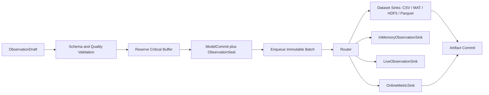
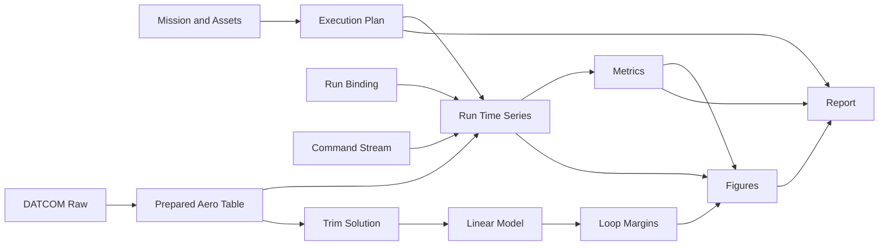

# 08｜数据、产物与研究证据架构

[上一册：诊断、可靠性与可观测性](07-diagnostics-reliability-and-observability.md) · [返回总索引](README.md) · [下一册：研究工作流与工具适配](09-research-workflows-and-tool-adapters.md)

**主线定位**：本册位于 Model/Operation commit 与研究加工之间。它消费 Observation、Outcome、Diagnostic 和 artifact intent，提交带 schema、hash、validity 与 lineage 的 ArtifactRef/Evidence Graph，供 09 的 Workflow 和各类前端使用。

## 本册一口气读完：一行 CSV 怎样支撑结论

`REF-YYZ-001` 在 `tick=2500` 先形成 `ObservationDraft`，成功 ModelCommit 后 seal 为 `observation:run-0001:2500`，其中 epoch pair 为 `(base=2500, committed=2501)`、高度 1001.73 m、舵偏 -0.62°。CSV DatasetSink 依据 EncodingPlan 写出同一语义的一行；切换 MAT sink 只改变编码 artifact。

分析任务从 dataset 计算 6.4% 俯仰超调，Artifact commit coordinator 在提交 metric 时同时写入 `LineageEdge lineage:metric:pitch-overshoot:0001`。RunManifest 记录 source、plan、binding、package、build、NumericalPolicy、last commit 和 outputs。数据结构见 [00A §6 与 §8](00a-yyz-end-to-end-walkthrough.md)；本册负责它们的 identity、schema、atomic commit、validity 与 lineage 规则。

## 1. 设计目标

GNCZMKN 的输出需要从“若干 CSV 和 summary 文件”提升为可查询、可验证、可复现的研究证据系统。目标包括：

- 运行字段拥有稳定 schema、单位、frame、时间和质量；
- 记录后端失败可以传播到 RunOutcome；
- 每个文件或数据集都有 ArtifactDescriptor、hash 和 producer；
- 任一图表、指标和报告可以追溯到输入、模型、算法、运行与模板；
- 单次失败、取消和部分结果也能留下明确证据；
- Artifact 既支持本地目录，也为未来批量 worker 和远程存储保留端口；
- CSV、MAT、HDF5、Parquet 和数据库通过 `DatasetSink` 消费同一 `ObservationBatch`；进程内训练/交互视图由 `InMemoryObservationSink` 消费该 batch；
- Origin、MATLAB、Python、Word 和 Excel 通过模板与 adapter 消费相同 typed Artifact。

## 2. 数据分层

| 层次 | 数据 | 权威位置 |
| --- | --- | --- |
| D0 Source | Mission、ParameterSet、模板、原始资产 | workspace/package |
| D1 Compiled | Effective Source、Mission IR、Execution Plan、lock | compilation bundle |
| D2 Runtime | published snapshot、observation batch、event | Session 内存 |
| D3 Recorded | time series、events、diagnostics、checkpoints | run artifacts |
| D4 Derived | metrics、trim、linearization、margins、statistics | workflow artifacts |
| D5 Presentation | figures、tables、Word/Excel/PDF | report artifacts |
| D6 Evidence Bundle | manifest、lineage、waivers、all refs | research package |

下游只消费上游已提交 Artifact。临时工作文件不能直接成为稳定输入。

## 3. Observation 模型

### 3.1 FieldDescriptor

| 字段 | 含义 |
| --- | --- |
| field_id/version | 稳定身份 |
| display_name | 用户名称 |
| source | committed state/output slot/telemetry/event/derived metric |
| semantic | altitude、velocity、command 等 |
| dtype | float64、int64、bool、enum、string |
| shape | scalar、vector、matrix、variable array |
| unit | 规范单位 |
| frame | 适用时的坐标系 |
| time_semantics | sample/publish/valid time |
| quality_schema | quality 与 flags |
| stability | stable、experimental、debug |
| privacy | public、project、restricted |
| description | 含义与物理假设 |

FieldId 不依赖 CSV 列名。标量展开只是某个 sink 的 flatten 规则。

### 3.2 ObservationSample

每个 sample 逻辑上包含：

- session/run/case identity；
- subject EntityId 与 topology revision；
- tick 和 simulation time；
- field identity；
- value；
- quality/flags；
- source sequence；
- optional correlation/event id。

高性能实现按同 schema 批量列式存储，不要求每个值创建通用对象。

### 3.3 ObservationBatch

Batch 是一个发布点或采样窗口内的原子观测单元：

| 字段 | 含义 |
| --- | --- |
| batch_id | 唯一 id |
| schema_id/hash | 字段集合 |
| time_range | 单 tick 或窗口 |
| row_count | 行数 |
| columns/buffers | typed buffers |
| validity | `Valid \| ValidWithCaveats \| Partial \| Invalid \| Unknown` |
| diagnostics | 与本批次相关的问题 |
| sequence | sink 顺序检查 |
| plan/model commit | plan hash、base/committed epoch、ModelCommit id |
| topology revision | 本批字段与 entity selector 对应的 committed topology |
| observation_kind | InitialAtT0、CycleAtTk、RestoredAtCheckpoint |

`ObservationKind = InitialAtT0 | CycleAtTk | RestoredAtCheckpoint` 是 `observation_kind` 的唯一枚举定义。新增成员需要同时说明 commit 形成点、epoch/tick 语义和 sink discriminator。

Batch 由 `ObservationProjectionPlan` 从真实 `CommittedStateStore`、CycleFrame result 和 StepJournal 构造。它不通过组件 getter 或重新调用 query/kernel 取值。`ObservationPlan` 保存作者的选择、采样和关键度意图；`ObservationProjectionPlan` 是 Compiler 解析 FieldId、handles、projectors、schema 与 commit binding 后形成的子计划。

projector 在 ObservationSeal 前把选中值物化到 batch-owned typed buffers；large immutable buffer 只能通过显式 retained ref 延长生命周期。ObservationBatch 和异步 sink 不持有 CycleFrame/InputFrameView/span，frame arena 可在 transaction 关闭后立即复用。

## 4. 目标观测时间语义

目标新 schema 固定下列科学语义：

- `CycleAtTk` 的每一行 `time` 表示周期开始 `t_k`；
- `CycleAtTk` 的 form/dynamics/truth 字段来自 `t_k` 发布态 `x_k`；
- `CycleAtTk` 的 input/process/guidance/output 字段来自本周期 component delta 求值后写入 CycleFrame 的正式 sampled output；
- 触发终止条件的 `CycleAtTk` 状态先记录，再终止；
- `InitialAtT0` 使用 run time origin，`RestoredAtCheckpoint` 使用 checkpoint 保存的 sample time；
- 是否记录初态由 ObservationPlan 明确声明。

每个 batch 强制携带 `observation_kind`、RunId、logical sequence、tick、sample time、base/committed state_epoch 与 commit id。首版 kind 至少包含：

| kind | 形成点 |
| --- | --- |
| `InitialAtT0` | InitializationCommit/ResetCommit，首个 discrete cycle 前 |
| `CycleAtTk` | 正常或 terminal StepTransaction 的 ModelCommit |
| `RestoredAtCheckpoint` | branch RestoreCommit |

epoch 对在三类边界上具有固定写法：首次 InitialAtT0 为 `(base=None, committed=0)`；ResetCommit 的 InitialAtT0 为 `(base=e, committed=e+1)`；RestoredAtCheckpoint 为 `(base=parent checkpoint e, committed=e)`，并携带 parent checkpoint id。`CycleAtTk` 使用普通或 terminal ModelCommit 的 base/committed epoch。

无有效 model commit 的初始化、恢复和 step failure 只形成独立 Diagnostic/Outcome batch，不伪装成上述 model observation kind。同时选择 InitialAtT0 与 EveryPublish 时，t0 会有 InitialAtT0 和 CycleAtTk 两个有序 batch。CSV sink 必须输出 kind/sequence/epoch discriminator，或由 ObservationPlan 拆成不同 dataset；Compiler 拒绝会把两者折叠成无法区分同时间行的 sink 配置。下游 metric/join 不得假定 `time` 唯一。

`ObservationSeal` 与 ModelCommit 同步形成：正常 continue step 的 t_k batch 关联 `(state_epoch e, tick k) -> (e+1, k+1)` commit；terminal step 的 t_k batch 关联 `(e, k) -> (e+1, k)` instant commit；ModelCommit 前失败或取消不发布 model batch，只产生独立 Diagnostic/StepOutcome evidence。时间关系写入 dataset metadata，避免下游仅凭列名猜测采样顺序。

若 ObservationPlan 选择初态，每个 run 恰有一个 `InitialAtT0` batch：首个 run 在全部 initialization/initial-output invariant 通过后，与 `InitializationCommit(state_epoch=0)` 同步封存；后续 run 与原子建立新 run id、递增 state_epoch 并重置 tick 的 `ResetCommit` 同步封存。两类事务都先完成 draft schema 校验和 CriticalEvidence buffer reservation。初始化或 reset 失败只留下相应 Outcome/Diagnostic evidence，不发布貌似有效的初态 model batch。

branch restore 不生成 `InitialAtT0`。ObservationPlan 选择恢复点时，系统在候选 checkpoint state 通过 schema/invariant 校验和 buffer reservation 后，与 `RestoreCommit` 同步封存 `RestoredAtCheckpoint` batch；batch 携带新 RunId、parent checkpoint、原 state_epoch/tick/sample time 和 observation kind，避免与从 t0 初始化的样本混淆。

## 5. ObservationPlan

### 5.1 选择规则

支持：

- 精确 FieldId；
- component/port/semantic selector；
- package 提供的 named field set；
- stable fields all；
- debug fields 显式 opt-in；
- derived metric inputs。

编译器把 selector 固化为字段列表。运行期间字段 schema 不随名称匹配动态改变。

静态或预声明 activation 场景可以预编译 entity-indexed fields，并用 active/quality 标记生命周期。未来 TopologyTransaction 若允许动态实例，ObservationPlan 必须预先选择 entity-long dataset、bounded prototype columns 或 topology-segmented dataset strategy；sink 不能凭新出现的实体临时改变已有 dataset 含义。每个 segment/batch 记录 topology revision。

### 5.2 采样规则

| 规则 | 说明 |
| --- | --- |
| EveryPublish | 每个 `t_k` |
| FixedInterval | base tick 整数倍 |
| OnChange | 带 tolerance/hysteresis |
| OnEvent | 事件前后窗口 |
| FinalOnly | 最终发布态 |
| DebugBurst | 诊断触发的短时高频 |

### 5.3 `EvidenceCriticality`

`EvidenceCriticality = CriticalEvidence | RequiredMetricInput | OperationalTelemetry | BestEffortDisplay | DebugOnly` 是字段与 sink policy 共用的唯一关键度枚举。

| 值 | 对结果的作用 | 默认 buffer/drop 规则 |
| --- | --- | --- |
| `CriticalEvidence` | 直接支撑声明的研究结论 | commit 前必须预留；缺失令 EvidenceValidity=Invalid |
| `RequiredMetricInput` | 某项 required metric 的必要输入 | commit 前按 metric coverage 预留；缺失令 metric Partial/Invalid |
| `OperationalTelemetry` | 运行监控、诊断和性能解释 | 允许受控降采样；必须记录缺口 |
| `BestEffortDisplay` | 交互显示便利 | 允许 drop/decimate 并计数 |
| `DebugOnly` | 临时排查 | 默认关闭，不影响结论 |

本表是全库字段关键度的权威定义；[07 §15.2](07-diagnostics-reliability-and-observability.md#152-criticality) 的 policy 直接消费这些值。criticality 决定 buffer、drop 和 sink failure policy，不能替代 EvidenceValidity。

### 5.4 数据量估算

Compiler 根据字段 shape、采样率、duration 和 case 数估算：

- rows/samples；
- raw bytes；
- format overhead；
- buffer memory；
- total Experiment storage。

超出 ResourcePolicy 时给出 warning/error 和降采样建议。

## 6. RecordPipeline



### 6.1 RecordSink 契约

`RecordSink` 是异步记录端口；四类首版 consumer 有明确边界：

| sink | 输出 | durability/用途 |
| --- | --- | --- |
| `DatasetSink` | EncodingPlan + staged dataset payload | durable，ArtifactCommit 后发布 ArtifactRef |
| `InMemoryObservationSink` | 有界 batch/ring buffer 或 NumPy-compatible view | process-local；训练和交互读取，不自动形成 Artifact |
| `LiveObservationSink` | 带 schema/time/sequence 的传输帧 | best-effort 或 operational；供实时显示，不拥有模型状态 |
| `OnlineMetricSink` | 按 MetricDefinition 累积的 MetricResult draft | seal/finalize 后经 ArtifactCommit 形成 metric Artifact |

它们共享 batch/outcome/backpressure 语义。只有 DatasetSink 产生数据集 EncodingPlan；OnlineMetricSink 的结果使用 Metric schema，不能伪装成观测字段。

每个 sink 提供：

- sink/encoding id 与 codec version；
- supported dtypes/shapes；
- open outcome；
- schema negotiation；
- FieldId 到 dataset path/variable/column 的 mapping descriptor；
- batch write outcome；
- flush/checkpoint；
- close/commit outcome；
- durability level；
- backpressure capabilities；
- partial artifact recovery。

write/close 不能返回 void。

### 6.2 schema negotiation

在 Session Ready 前确定最终 schema。CSV sink 会定义 flatten 规则；MAT/HDF5 sink 可保留 vector/matrix 与层次；columnar sink 可保持列式 shape；内存 sink 可直接映射 NumPy buffers。每个 sink 返回 `EncodingPlan`，包含字段映射、数据集布局、append/chunk 能力、预估开销和不支持原因。无法支持的字段在编译期诊断。

### 6.3 backpressure

研究默认策略偏向保全证据。CriticalEvidence sink 在 ModelCommit 前按已知 batch shape 预留 buffer；预留失败使尚未提交的 step fail。ModelCommit 后只把 sealed immutable batch 入队，durable write 失败不能倒退物理状态；EvidenceOutcome 使用 `Partial` 或 `Invalid` 并记录 durability reason，RunOutcome 保留模型终态并引用该 evidence outcome。实时 display 可以 drop/decimate，并记录范围和计数。

### 6.4 sink 隔离

多个 sink 独立返回 Outcome。display sink 失败不影响 critical file sink；关键证据 sink 在 commit 后失败会令 EvidenceValidity=Invalid，并可按交付 policy 令 operation Failed；commit 前 reservation 失败使当前 step Failed。

## 7. 输出格式策略

| 格式 | 用途 | 限制 |
| --- | --- | --- |
| CSV | 人工检查、小规模数据交换 | dtype/shape/schema 表达弱 |
| MATLAB MAT | MATLAB/Simulink 分析、矩阵与结构体交换 | v5/v7.3 能力、append、字符串/可变数组映射需要显式 codec |
| JSON/JSONL | manifest、events、diagnostics | 大时序效率低 |
| Parquet/Arrow | 批量时序、Python 分析 | 需要稳定 schema/tooling |
| HDF5 | 大矩阵、层次化科学数据 | 依赖和并发策略较重 |
| Binary checkpoint | 快速恢复 | 强版本绑定 |
| PNG/SVG/PDF | 图表与页面 | 派生产物，需要谱系 |
| DOCX/XLSX | 报告与表格 | 模板和工具版本需记录 |

首期实现基于新 FieldDescriptor 的 CSV production sink、最小 MAT conformance sink 与 JSON manifest，列名和顺序按新 schema 设计，无旧 CSV 等价要求。MAT 首先覆盖固定 shape 的核心 reference dataset，用来证明编码接缝；更完整的 MAT codec、HDF5 和 Arrow/Parquet adapter 根据真实消费链增加。领域 schema 与具体格式解耦。

### 7.1 MATLAB `.mat` 映射

`.mat` 是 `time-series`、`event-log` 或其他 typed Artifact 的一种 payload encoding。它不创建新的 Runtime observation 类型。MAT sink 在 schema negotiation 时选择 codec id，例如 `mat-v5` 或 `mat-v7.3`，并固定：

- sample dimension 与 time/sequence/epoch vectors；
- scalar/vector/matrix 的数组布局；
- enum dictionary、quality flags、unit/frame metadata；
- variable-length 字段、events 和 diagnostics 的 struct/cell/table mapping；
- MATLAB variable name 与稳定 FieldId 的双向映射；
- append、chunk、compression、flush 和 partial recovery 能力；
- codec/library version 与读取示例。

MATLAB 变量名只用于该 encoding。下游 workflow 依据 Artifact schema/FieldId 选择数据，避免将 `altitude_m` 一类变量名升级为领域契约。MAT codec 无法表达某字段时，Compiler 可以拆分 dataset、选择 v7.3/HDF5 codec 或报告 sink BackendCapability mismatch。

### 7.2 编码独立性

一个 ObservationPlan 可以同时连接 CSV、MAT 和 live sinks。Router 只分发 sealed immutable batches；任一 sink 无权要求模型增加专用缓存或 getter。编码等价测试从同一 batch 读取各格式，再比较 FieldId、shape、time、quality 和数值容差。byte hash 可以不同，semantic dataset hash 应按规范化字段流计算。

## 8. Artifact 模型

### 8.1 ArtifactDescriptor

| 字段 | 含义 |
| --- | --- |
| artifact_id | 内容 id 或实例 id |
| artifact_type | typed contract |
| schema_id/version | 数据布局 |
| payload_encoding/codec_version | CSV、MAT-v5、MAT-v7.3、HDF5、Parquet 等物理编码 |
| schema_mapping_ref | FieldId 到 payload path/variable/column 的确定映射 |
| content_hash | 内容完整性 |
| size/media_type | 存储信息 |
| logical_name | 用户可读名称 |
| producer | run/task/tool/template |
| inputs | ArtifactRef 列表 |
| parameters | 规范化参数 hash/ref |
| created_at | wall time |
| validity | `Valid \| ValidWithCaveats \| Partial \| Invalid \| Unknown` |
| diagnostics | 相关问题 |
| tool/model versions | 精确生产环境 |
| storage_uri | 物理位置 |
| retention/security | 生命周期和权限 |

### 8.2 Artifact 类型

建议首批类型：

- effective-mission；
- mission-ir；
- execution-plan；
- dependency-lock；
- run-manifest；
- time-series；
- event-log；
- diagnostic-bundle；
- metrics；
- checkpoint；
- aerodynamic-table；
- trim-solution；
- linear-model；
- stability-derivatives；
- loop-margin-result；
- trajectory-optimization-result；
- figure；
- report；
- external-tool-log。

其中 `diagnostic-bundle` 的语义对象固定为 `DiagnosticBundleArtifact`：它保存 immutable `DiagnosticRecord[]`、`DiagnosticBatch` 顺序、对应 `PolicyDecision[]`、`DiagnosticCodeSpec` refs，以及为离线阅读生成的可选 `RenderedDiagnostic[]`。消费者以 record id 和 decision id 判断事实与处置，不能从渲染文本反推控制语义。

### 8.3 immutable 与 mutable

Committed Artifact 不可变。更新产生新 artifact id 和 lineage edge。运行中的 staging object 有 mutable 状态，但不能被下游引用为 Complete。

### 8.4 Artifact Authority 与提交语言

Artifact Store 只通过有限操作族取得证据权威：

```text
BeginStage
-> Produce/EncodePayload
-> ValidateArtifact
-> CommitArtifact(with lineage)
-> PublishRef
```

`CommitArtifact` 原子固定 payload hash、schema、validity、producer、输入 refs 和 lineage edges；输入只能引用已提交或明确 Partial 的 Artifact。`PublishRef` 暴露稳定引用或形成外部 export receipt，不回写已有科学语义。需要另一种编码时创建新的 staging payload 和 Artifact identity，并用 lineage 连接。ModelCommit、TaskOutcome 和 ArtifactCommit 是可分别查询的结果，任何一项成功都不能隐式宣告另外两项成功。

这些名称定义 [02](02-layered-reference-architecture.md) 的 Artifact Authority 语义，无需为每一步建立独立服务对象。本地首版可以由 staging directory、validation function、atomic rename/index update 和 manifest record 实现。

## 9. Artifact Store

### 9.1 端口

- begin staging；
- write/append payload；
- validate schema；
- compute/verify hash；
- commit；
- abort/mark partial；
- resolve ArtifactRef；
- query metadata/lineage；
- materialize 到受控路径；
- garbage collect unreferenced staging。

### 9.2 本地实现

首个实现可使用普通目录和 JSON index：

```text
user/outputs/
  runs/<run-id>/
  experiments/<experiment-id>/
  artifacts/<type>/<hash-prefix>/<hash>/
  index/
```

目录结构是存储适配细节。上层引用使用 ArtifactId/URI。

### 9.3 内容寻址

适合内容寻址的对象：静态资产、effective mission、IR、plan、不可变 dataset、figure/report。Session/run identity 本身仍使用 RunId，并在 manifest 中引用内容 hashes。

### 9.4 canonical hashing

- JSON 采用规范 key 顺序、数字表示和 UTF-8；
- 二进制数据 hash 原始规范 buffer；
- 大数据支持 chunk hash 和 root hash；
- path、wall timestamp 等非语义字段不进入语义 cache key；
- tool nondeterministic output 可以同时记录 byte hash 与 semantic hash。

## 10. Run Bundle

### 10.1 建议布局

```text
run-<id>/
  run-manifest.json
  source/
    source-set.json
    effective-mission.json
  compiled/
    mission-ir.json
    execution-plan.json
    dependency-lock.json
  records/
    timeseries.csv|mat|h5|parquet
    events.jsonl
    diagnostics.jsonl
  metrics/
    metrics.json
  checkpoints/
  logs/
  artifacts.json
  COMPLETE | FAILED | CANCELLED | PARTIAL
```

标记文件只是便捷提示，Run Manifest status 才是权威。

### 10.2 Run Manifest

| 区域 | 必需内容 |
| --- | --- |
| identity | run/session/case/experiment ids |
| status | RunOutcome、validity、termination |
| source | document URIs/hashes、effective source |
| compiled | canonical IR、model graph/execution core/observation plan/encoding plan/descriptor hashes、PlanProofIndex ref/hash、compiler version、package lock、link fingerprint |
| binding | RunBinding values/hash、defaults、provenance、run sequence |
| commands | frozen command stream hash、submission/ledger/application receipts、ParameterState changes |
| dependencies | package/component/contract/algorithm lock |
| code | repository commit、dirty state、build id |
| platform | OS、arch、compiler、libraries、float mode |
| time | dt、duration policy、ticks、sim/wall times |
| numerics | integrators、tolerances、extrapolation、determinism |
| randomness | root/case/stream seeds 和算法 |
| assets | artifact ids、hashes、maturity |
| observations | schema、sampling、sinks、drops、durability |
| diagnostics | primary、counts、waivers、caveats |
| outputs | artifact refs 与 hashes |
| performance | phase timing、resource high-watermarks |
| recovery | checkpoint/restart/replay 信息 |

### 10.3 dirty worktree

若源码存在未提交修改，manifest 记录：

- base commit；
- dirty flag；
- patch artifact 或工作树内容 hash（按 policy）；
- 构建时间；
- binary hash。

无法捕获 patch 时，validity 标记可复现性 caveat。

## 11. Artifact 谱系



`LineageEdge` 是可提交数据，不能只靠 ArtifactDescriptor.inputs 反推：

```text
LineageEdge {
  edge_id
  input_ref
  output_ref
  role                    // primary-input | generated-from | calibrated-by |
                          // validated-against | summarized-from | rendered-from | supersedes
  producer_operation_ref
  plan_ref?
  task_ref?
  run_ref?
  parameter_hash
  commit_ref
  created_at
}
```

Task/Session/renderer 在 staging journal 中提出 edge drafts；Artifact commit coordinator 是唯一 writer。`ValidateArtifact` 检查 input refs 已提交、output identity 与 payload descriptor 一致、禁止自环/循环、required role 齐全；`CommitArtifact(with lineage)` 把 payload descriptor、edges 和 ArtifactCommit receipt 原子写入本地 index/manifest。下游只在 PublishRef 后查询 edge。

本地首版把 edge 放在 Artifact index 的 append-only commit records，并在 RunManifest/EvidenceBundle 保存相关 edge ids；索引可从 manifests 重建。YYZ metric 的完整实例见 [00A §8](00a-yyz-end-to-end-walkthrough.md#8-结果怎样成为证据)。

## 12. Provenance

### 12.1 producer identity

producer 可以是：

- Mission Compiler；
- Simulation Session；
- Workflow Task；
- external tool adapter；
- human import/approval；
- report template renderer。

### 12.2 参数

Task/producer 参数以规范化文档保存，包含默认展开和单位转换。command line 仅作日志，不充当参数权威模型。

### 12.3 环境

外部工具记录 executable hash/version、环境变量 allowlist、license mode、working directory artifact、locale 和 numeric options。敏感字段只记录存在性或脱敏 hash。

### 12.4 人工操作

手工修订资产、选择数据段、接受 caveat 或修改报告都产生 provenance event，包括操作者、时间、理由和输入输出 refs。

## 13. Metrics 架构

### 13.1 MetricDefinition

| 字段 | 含义 |
| --- | --- |
| metric_id/version | 稳定身份 |
| inputs | Field/Artifact contracts |
| unit/shape | 结果语义 |
| window | 全程、阶段、事件前后 |
| algorithm | id/version/parameters |
| validity rules | 缺测、域外、sample count |
| thresholds | pass/warn/fail |
| aggregation | case/experiment 统计 |

### 13.2 online 与 offline

- online metric 在 Session 观测流上增量计算，用于终止或实时监控；
- offline metric 作为 Workflow Task 消费 recorded Artifact；
- 同一 metric id 的两种实现需有一致性测试；
- 影响终止的 metric 版本写入 Execution Plan。

### 13.3 MetricResult

结果包含 value、unit、validity、coverage、threshold outcome、algorithm、input refs 和 diagnostics。报告直接引用 MetricResult，不从 summary 文本提取数字。

## 14. Experiment 数据

### 14.1 CaseManifest

每个 case 记录：

- case identity 与参数 hash；
- derived seed；
- normalized parameter values 与 `CaseParameterTarget` mapping version；
- canonical CompilePatch set/hash、effective source/IR 与 Descriptor outcome/hash；
- RunBinding values/hash；
- RuntimeCommandSchedule Artifact/hash；
- package lock 与实际 worker link fingerprint；
- worker/attempt；
- RunOutcome；
- artifacts；
- retries 与失败分类。

### 14.2 ExperimentManifest

- ResearchQuestion 和 hypothesis refs；
- parameter space definition；
- CompilePatch、RunBindingPatch、RuntimeCommandSchedule 的 target map；
- sampling method/version；
- case set 与状态；
- aggregation policy；
- excluded cases 和理由；
- statistical methods；
- aggregate artifacts；
- completion/validity。

### 14.3 失败样本

物理条件终止、数值失败、工具故障和 worker 崩溃分开统计。聚合器不能把所有失败都当成命中或脱靶。

## 15. 图表模板

### 15.1 FigureSpecification

| 字段 | 内容 |
| --- | --- |
| template_id/version | 图表模板 |
| data_queries | Artifact/Field/Metric 查询 |
| transforms | filter、normalize、align、unit conversion |
| layout | panels、axes、legend、style |
| annotations | events、thresholds、caveats |
| output | PNG/SVG/PDF/Origin project 等 |
| validation | missing data、range、label/unit checks |

### 15.2 后端

- Python/matplotlib；
- MATLAB；
- Origin；
- 未来 Web/Plotly。

不同后端可以渲染同一语义 specification，允许后端专有扩展。输出 Artifact 记录 renderer、版本、字体和模板 hash。

### 15.3 图表可信度

- 轴标签从 FieldDescriptor 获取 unit；
- 数据过滤和对齐步骤进入 provenance；
- 自动标注缺测、外推和 invalid 区间；
- 阈值线引用 MetricDefinition；
- 图注包含 run/case/plan identity；
- 人工修改的 Origin 文件标记为派生新版本。

## 16. Word 与 Excel 报告

### 16.1 ReportSpecification

- template id/version；
- section structure；
- required metrics/tables/figures；
- conditional sections；
- evidence citations；
- caveat and diagnostic policy；
- output formats；
- reviewer/approval fields。

### 16.2 模板变量

模板变量只能引用 typed query：

```text
run.manifest.*
metric:<id>
artifact:<type>
figure:<id>
diagnostics:affecting-validity
model:maturity
```

自由脚本可以作为受控 transform task 存在，必须产生明确 Artifact。

### 16.3 Excel

- 单元格值与 unit/schema 绑定；
- 公式或图表模板版本记录；
- 输入数据放独立只读 sheet；
- 手工编辑区域和生成区域分离；
- 重新生成时不覆盖人工批准区；
- workbook 完成后进行公式与视觉校验。

### 16.4 Word

- 段落、表格、图、交叉引用由模板 slot 控制；
- 图表引用 ArtifactId 和 caption；
- 数值结论引用 MetricResult；
- diagnostics、waivers 和复现信息自动生成附录；
- 生成后执行页面渲染与视觉 QA。

## 17. Evidence Bundle

### 17.1 内容

一个可交付研究证据包包含：

- ResearchQuestion 与假设；
- source set、effective mission、plan；
- dependency lock 和源码/构建信息；
- 原始与准备后资产；
- Run/Experiment manifests；
- time series、events、diagnostics；
- metrics、分析和验证结果；
- figures/reports；
- waivers、approvals、review notes；
- lineage graph 和完整性清单。

### 17.2 复现等级

| 等级 | 内容 |
| --- | --- |
| Traceable | 能找到输入、版本和结果 |
| Re-runnable | 当前环境可重新执行 |
| Portable | 带依赖锁与可移植资产 |
| IndependentlyVerifiable | 带参考数据、验证方法和明确 caveats |

每个研究交付声明目标等级。

## 18. schema 演进

本节从目标 Evidence schema v1 首次冻结后生效。旧 CSV、summary 和 ObservableField 不作为 v1 的历史 schema 版本。

### 18.1 规则

- schema id 与 major version 稳定；
- 新增 optional field 可以 minor 演进；
- unit/frame/semantic 改变需要 major；
- reader 支持明确版本范围；
- migration 产生新 Artifact 并保留原件；
- manifest 永远引用实际读取/写出的 schema version。

### 18.2 长期可读性

Evidence Bundle 中保存：

- schema definitions；
- migration tool version；
- human-readable field dictionary；
- format-independent checksums；
- 必要时的 CSV/JSON 兼容导出。

## 19. 数据质量

### 19.1 质量传播

Derived Artifact 的 validity 由输入 validity、coverage、algorithm status 和 policy 决定。下游不能自动把 Invalid 输入升级为 Valid。

### 19.2 缺测

缺测策略显式选择：fail、exclude-with-count、interpolate-with-flag、hold-last、unknown。图表和统计报告必须披露覆盖率。

### 19.3 时间对齐

多源数据对齐 Task 声明：

- target time grid；
- interpolation/hold；
- max gap；
- event discontinuity；
- frame/unit conversion；
- output quality。

## 20. 缓存

### 20.1 cache key

Task cache key 由：

- task type/version；
- input content hashes；
- normalized parameters；
- tool/algorithm version；
- relevant environment；
- schema versions；
- deterministic declaration。

### 20.2 不可缓存情况

- nondeterministic 且未记录 seed/state；
- 依赖外部实时服务；
- 人工交互结果未形成 Artifact；
- 工具版本无法确定；
- 输入包含未哈希的外部路径。

cache hit 本身产生 TaskOutcome 和 lineage，不隐藏执行来源。

## 21. 安全、权限与保留

- ArtifactDescriptor 带 classification 与 owner；
- 导出 Evidence Bundle 时执行 URI 重写和敏感字段过滤；
- LLM 只读取被授权的 schema 与 Artifact；
- 外部工具 staging 与长期 store 分离；
- retention policy 区分 debug、raw、derived、report；
- 删除采用引用检查和可恢复 trash/staging cleanup；
- package license/数据许可沿 lineage 传播到报告；
- content hash 用于完整性，签名只在真实协作需求出现时启用。

## 22. 查询与索引

首个本地索引支持：

- 按 run/experiment/project/time 查询；
- 按 artifact type/schema 查询；
- 按 package/model version 查询；
- 按 Diagnostic code/validity 查询；
- 获取上游/下游 lineage；
- 找到生成某一 figure/report 的输入；
- 比较两个 Run Manifest。

索引可以重建，Artifact 内容和 manifest 才是权威。早期无需引入独立数据库服务。

## 23. 目标证据系统建设顺序

该阶段只建立在 [路线 R3：Transactional Kernel](roadmap/r3-r5-kernel-and-research.md) 的唯一新 Session 上，不包装 ObservableField、IRecordSink、AutoDataLogger、旧 summary 或旧 CSV。

### A0：ObservationProjectionPlan 与 transaction seal

- 从 StateSchema、OutputSchema、TelemetrySchema 和 EventSchema 编译 FieldDescriptor/projector；
- StepTransaction 从真实 delta/journal 建立 `ObservationDraft`；
- normal、terminal、failure、cancel 四条分支按第 4 节封存或丢弃 model batch；
- 用 fixture 验证 query 调用次数、观测选择和 sink 数量不会改变物理结果。

### A1：新 RecordSink 与双提交边界

- 从空接口建立 typed RecordSink、buffer reservation 与 RecordOutcome；
- 首批实现 memory sink、new-schema CSV sink 和 diagnostics/events JSONL；
- open/reserve/enqueue/write/flush/close 每个位置注入失败；
- RunOutcome 同时记录 ModelCommit 和 EvidenceCommit 状态。

### A2：ArtifactDescriptor 与本地 store

- 所有 durable 输出通过 staging/validate/hash/commit；
- 建立 ArtifactRef、index、partial quarantine 和 lineage；
- store 路径由 Workspace 管理，Session/model 不接触文件名。

### A3：Run/Case Manifest

- 记录 Source/IR/ExecutionPlan、package/model/algorithm/asset identity；
- 记录 numerical/closure/seed/command/termination/diagnostic/evidence outcome；
- 成功、终止、取消、模型失败和证据失效均生成最小 manifest；
- manifest 可驱动选定 reference case 重建。

### A4：Experiment lineage

- Experiment 生成 CaseManifest；
- 参数、三类 materialization、seed、compiled source、Descriptor、binding、command stream 与 run refs 闭合；
- 聚合结果成为 Artifact；
- 物理终止、数值失败、基础设施失败和取消分别统计。

### A5：图表和报告模板

- 建立 FigureSpecification/ReportSpecification；
- 首先支持 Python + DOCX/XLSX；
- 再接 MATLAB/Origin；
- 生成物记录模板、工具版本和完整数据谱系。

### A6：附加 Dataset encoding 与远程 store

- 按真实消费链引入 MAT、HDF5、Parquet/Arrow 或数据库 sink；
- 每种 encoding 提供 schema negotiation、round-trip 与 unsupported-field fixtures；
- worker 使用 ArtifactRef 交换；
- 保持 Artifact/RecordSink contract，不改变 Session model transaction。

## 24. 测试矩阵

| 类别 | 必需验证 |
| --- | --- |
| schema | dtype/shape/unit/frame、版本迁移 |
| CSV | `t_k` 语义、初态、终止行、列映射 |
| MAT | v5/v7.3 codec、FieldId/variable mapping、matrix shape、time/quality metadata、round-trip |
| encoding independence | 同一 ObservationBatch 经两个 sink 后 semantic dataset 等价，模型结果与 `execution_core_hash` 不变 |
| transaction | normal/terminal/failure/cancel 的 seal/drop、buffer reserve、Model/Evidence commit |
| sink | open/write/flush/close 每点故障 |
| Artifact | staging、atomic commit、hash、partial recovery |
| manifest | source/plan/model/numerics/seed 全字段 |
| lineage | 上下游闭合、循环禁止、人工修订 |
| metrics | coverage、invalid propagation、阈值 |
| experiment | case failure 分类、聚合排除规则 |
| report | 数据引用、模板版本、视觉与公式 QA |
| security | path、redaction、classification、export |
| reproducibility | 从 bundle 重跑并比较声明等级 |

## 25. 完成定义

1. 每个稳定观测字段都有 FieldId、schema、unit、frame、time 和 quality。
2. ObservationPlan 在编译期固定字段与采样，并估算数据量。
3. sink 的 open/write/flush/close 均返回 Outcome，关键证据不会静默丢失。
4. 每次运行无论成功、失败或取消都产生最小 Run Manifest。
5. compiled source、IR、plan、数据、metrics、图表和报告都以 Artifact 表达。
6. Artifact 使用 staging、校验、commit 和 Partial 状态。
7. 任一报告结论可以追溯到 Metric、Run、Plan、模型、资产和源配置。
8. Experiment 的 case 参数、seed、失败类型和聚合规则完整记录，旧 SimFlow 运行入口不进入证据系统。
9. 图表和 Word/Excel 报告由版本化 specification/template 生成并验证。
10. 新增 MAT/HDF5/Parquet 等 Dataset Sink 时不修改模型、Runtime Cell、StepTransaction 或 FieldId。
11. 一个选定的纵向案例达到 R2 Portable 复现等级。
12. ModelCommit、TaskOutcome 与 ArtifactCommit 分别可查；所有持久化证据都经过 BeginStage、Produce/EncodePayload、ValidateArtifact、CommitArtifact(with lineage) 与 PublishRef 闭合。
