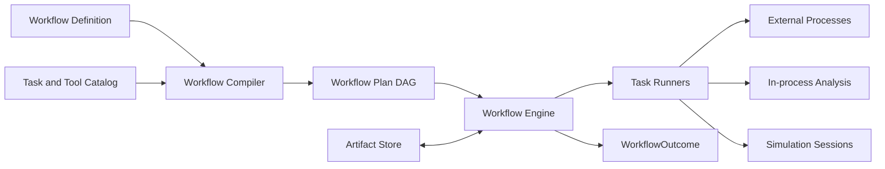
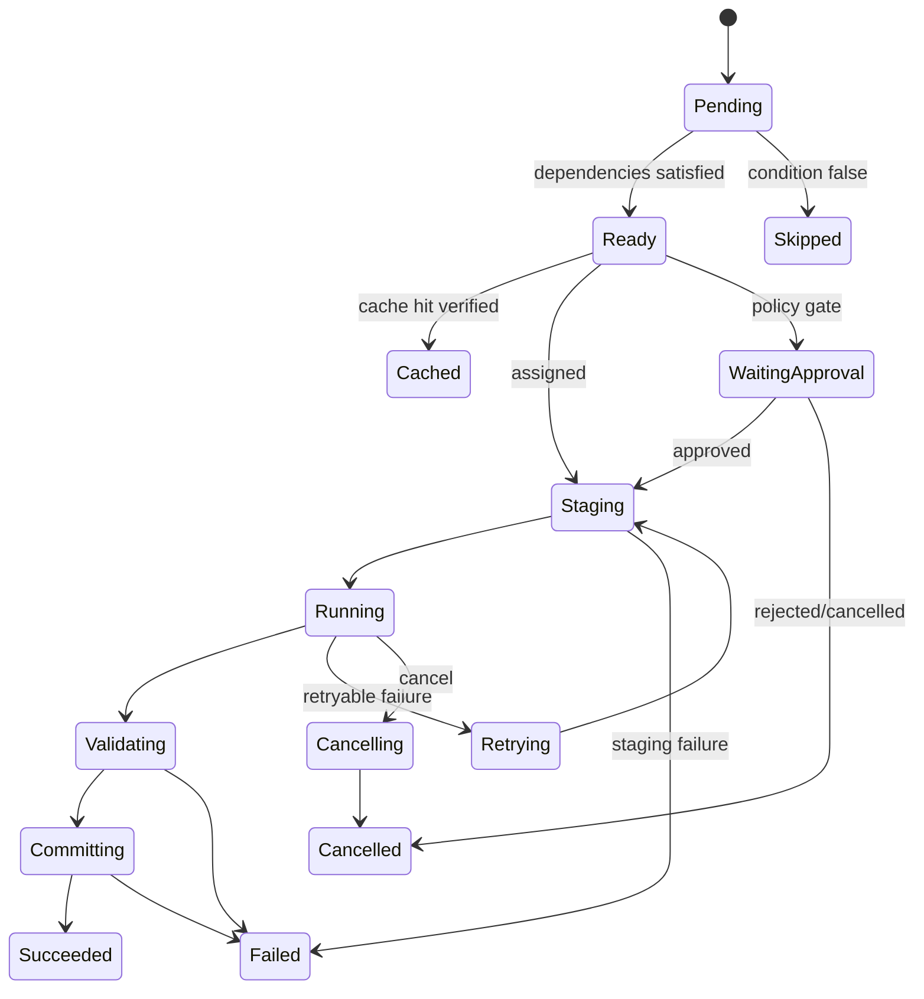
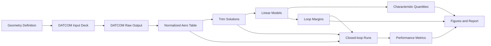

# 09｜研究工作流与外部工具适配架构

[上一册：数据、产物与研究证据](08-data-artifacts-and-research-evidence.md) · [返回总索引](README.md) · [下一册：扩展包、多语言与前端](10-packages-multilanguage-and-frontends.md)

**主线定位**：本册构成外层研究迭代。它消费 committed ArtifactRef 与 Workflow Plan，编排外部工具、批量运行、分析、图表和报告，再提交新的 Artifact 与 TaskOutcome；它通过 Session operation 调用仿真，不进入模型 step。

## 本册一口气读完：DATCOM 到报告的任务链

YYZ 气动链的一个 WorkflowPlan 包含 `validate_geometry -> render_datcom_deck -> execute_datcom -> parse_raw -> normalize_table -> validate_coverage -> trim -> linearize -> margins -> simulate -> report`。`execute_datcom` 使用 InstallationProbe、InvocationBuilder、ProcessRunner 和 OutputCollector；`parse_raw` 使用 OutputParser；`normalize_table` 与 `validate_coverage` 分别使用 Normalizer 和 ScientificValidator。每个 task 只读 committed ArtifactRef，并在 ArtifactCommit 后向下游发布新 ref。

外部进程退出码为 0 只说明工具 invocation 完成，气动覆盖校验仍可能拒绝产物。TaskOutcome 保存 attempt、diagnostics、validity 和 output refs；WorkflowOutcome 按 required outputs 判断整条研究链。§5 与 §6 给出 TaskDefinition 和状态到 Operation/Artifact operator 的具体映射。

## 1. 设计目标

研究工作流把 GNC 理论人员经常重复的“准备数据—调用工具—校核—仿真—分析—报告”固化成可复用 DAG。每个任务消费和产生 typed Artifact，记录参数、工具版本、诊断和谱系。

Workflow Task 位于单次仿真外侧。Session 内的 RuntimeComponent 只参与编译计划规定的时间推进与物理闭环；DATCOM、GPOPS2、MATLAB、Origin、Word、Excel 等外部过程由 Workflow Engine 管理。

目标是让研究者能够替换算法或研究假设，同时复用可靠的工具适配、数据转换、验证、绘图和报告链路。

## 2. Workflow 核心模型



### 2.1 WorkflowDefinition

包含：

- workflow id/version；
- research purpose；
- typed input slots；
- task nodes；
- Artifact edges；
- parameters 和 defaults；
- conditions/branches；
- approval gates；
- resource policy；
- failure policy；
- expected outputs；
- validity/completion rules。

### 2.2 WorkflowPlan

Compiler 完成 task type/version 解析、Artifact contract compatibility、参数 schema、DAG 检查、cacheability、工具可用性和资源检查后生成不可变 Plan。Plan 同时保存 `PlanProofIndex`、Operation/Artifact operator lowering、resource/approval policy、required outputs 与预期 commit/receipt；`--explain` 可以从任一 task/edge 反查上述链路。

### 2.3 权威状态

Workflow Engine 拥有 task 状态和调度；Artifact Store 拥有数据；外部进程目录只是 staging；Simulation Session 拥有单次运行状态。

### 2.4 Workflow 的封闭操作语言

Workflow 属于 [02](02-layered-reference-architecture.md) 定义的 Operation + Artifact 权威域。开放的 TaskDefinition 和 Tool Adapter 必须由 Workflow Compiler 降级为有限操作族：

```text
Operation:
  Admit -> Authorize -> Reserve -> Invoke -> Observe -> Cancel/Finalize

Artifact:
  BeginStage -> Produce/EncodePayload -> ValidateArtifact
  -> CommitArtifact(with lineage) -> PublishRef
```

- `Admit/Authorize` 处理条件、输入有效性、权限和 approval；
- `Reserve` 取得 worker、CPU/GPU、许可证、staging 和预算；
- `Invoke` 只调用 WorkflowPlan 已绑定的 runner；
- `Observe` 收集进度、stdout/stderr、Session Outcome 和外部 receipt；
- `Cancel/Finalize` 形成唯一 TaskOutcome 并无条件关闭资源；
- Artifact 操作保证 staging payload 在编码、schema、科学有效性、hash 和 lineage 校验完成后才取得稳定身份。

Scheduler 不按 DATCOM、GPOPS2、Word 或报告名称分派。新增工具通常只增加 TaskDefinition、adapter 与 Artifact contract。若需求引入现有操作无法表达的通用审批、分布式租约或外部效果一致性，缺口进入 Workflow operator gate，不扩充 Simulation Kernel。

Workflow 调用仿真时提交 `PlanRef + RunBinding + Command/Input refs`，只消费 `RunOutcome + committed ArtifactRef`。它无权读取 `CommittedStateStore`、CycleFrame 或 Runtime Cell；Session 也无权直接推进 task 状态或认定 Artifact 已持久化。

## 3. TaskDefinition

| 区域 | 字段 |
| --- | --- |
| identity | task type/version、implementation |
| inputs | Artifact contracts、cardinality、validity |
| outputs | Artifact contracts、completion rules |
| parameters | typed schema、unit、defaults |
| execution | in-process、subprocess、session、human |
| determinism | deterministic、seeded、nondeterministic |
| cache | cacheable、key inputs、semantic hash |
| resource | CPU、memory、GPU、license、wall time |
| lifecycle | prepare/run/validate/commit/cleanup |
| retry | allowed classifications、attempt limit、backoff |
| cancellation | safe points、process termination policy |
| diagnostics | expected codes、stdout/stderr handling |
| assurance | maturity、verification suite、qualified tools |
| security | path/network/command/secret permissions |

Task 参数不以任意命令行字符串作为权威表示。Adapter 根据 typed parameters 生成命令或脚本。

YYZ DATCOM 执行任务的规范实例：

```yaml
task_definition:
  task_type: gnc.workflow.execute_datcom
  version: 1.0.0
  inputs:
    deck: {contract: datcom-input-deck@1, cardinality: one, validity: Valid}
    tool_environment: {contract: tool-environment@1, cardinality: one, validity: ValidWithCaveats}
  outputs:
    raw_bundle: {contract: datcom-raw-bundle@1, required_for_success: true}
    invocation_log: {contract: external-tool-log@1, required_for_success: true}
  parameters:
    timeout_s: {type: integer, default: 120, range: [1, 1800]}
  execution: subprocess
  determinism: deterministic_for_locked_tool
  cache: {cacheable: true, key_inputs: [deck, tool_environment, timeout_s]}
  resource: {cpu: 1, memory_mb: 512, license: datcom}
  retry: {classifications: [TemporaryLicenseUnavailable], attempt_limit: 2}
  cancellation: {safe_points: [before_invoke, process_poll], terminate_tree: true}
  security: {network: denied, executable: from_tool_descriptor, workdir: staging_only}
```

`required_for_success` 是 TaskOutcome 的本地完成契约。WorkflowOutcome 另有 required task/output set；可选 inspection figure 失败可以令 WorkflowOutcome=Partial，缺少 normalized aero table 会令 WorkflowOutcome=Failed。两层规则都在 WorkflowPlan 中冻结。

## 4. Task 状态机



Cached、Skipped、Cancelled 和 Failed 有独立 TaskOutcome。cache hit 仍进行 Artifact 完整性和 policy 校验。

### 4.1 Task 状态到封闭算子的映射

| Task 状态/转换 | Operation 算子 | Artifact 算子 | 权威结果 |
| --- | --- | --- | --- |
| Pending → Ready | `Admit`；检查 dependencies/conditions | 校验输入 ArtifactRefs | admission receipt |
| Ready → WaitingApproval/Ready | `Authorize` | 无 | approval receipt 或 rejected TaskOutcome |
| Ready → Staging | `Reserve` | `BeginStage` | resource lease + staging id |
| Staging → Running | `Invoke` | 可 materialize inputs | invocation receipt |
| Running | `Observe` | `Produce/EncodePayload` | progress/tool receipts、staged payload |
| Running → Validating | `Observe` 完成 | `ValidateArtifact` | validation outcome |
| Validating → Committing | `Finalize` 前置检查 | validation 已通过 | completion candidate |
| Committing → Succeeded | `Finalize` | `CommitArtifact(with lineage) -> PublishRef` | TaskOutcome + committed ArtifactRefs |
| Ready → Cached | `Finalize` | 校验 existing refs/lineage | Cached TaskOutcome |
| 任一 active → Cancelling/Failed | `Cancel/Finalize` | abort stage 或按 contract commit Partial | Cancelled/Failed TaskOutcome |

Workflow Engine 维护 Task 状态；Artifact commit coordinator 维护 staging 与 ArtifactCommit。一个 task 状态不能替代 Artifact durability，Committing 失败也不能发布未提交 ref。

## 5. Artifact 边

每条 edge 指定：

- producer output slot；
- consumer input slot；
- Artifact contract/version；
- required validity；
- fan-in/fan-out；
- selector（如某 case 集）；
- optional converter task；
- provenance role。

工具格式转换通过独立 task 表达，避免一个 adapter 同时完成生成、解析、物理归一化和验证。

## 6. Tool Adapter

### 6.1 组成

| 部件 | 职责 |
| --- | --- |
| ToolDescriptor | 工具身份、版本、平台、许可证、能力 |
| InstallationProbe | 查找 executable/runtime，验证版本 |
| InputRenderer | typed Artifact -> 工具输入文件 |
| InvocationBuilder | 生成安全 argv/env/workdir |
| ProcessRunner | 启动、监控、超时、取消、资源限制 |
| OutputCollector | 收集 stdout/stderr/文件 |
| OutputParser | 文件 -> typed raw Artifact |
| ScientificValidator | 物理/数值完整性检查 |
| Normalizer | unit/frame/convention -> framework contract |

每个部件可独立测试。ProcessRunner 不理解气动或控制语义。

### 6.2 DATCOM task 与 adapter 部件映射

| DATCOM task | 使用的 adapter 部件 | task 自己承担的领域责任 |
| --- | --- | --- |
| `ValidateGeometry` | `ScientificValidator` | 检查几何 contract、单位和适用域 |
| `RenderDatcomDeck` | `InputRenderer` | 按 DATCOM method/version 形成输入 deck |
| `ExecuteDatcom` | `InstallationProbe`、`InvocationBuilder`、`ProcessRunner`、`OutputCollector` | 选择已锁工具、形成 invocation receipt/raw bundle |
| `ParseDatcomRaw` | `OutputParser` | 解析为 typed raw aerodynamic Artifact |
| `NormalizeAeroConventions` | `Normalizer` | 轴系、符号、参考量和单位转换 |
| `ValidateAeroCoverage` | `ScientificValidator` | 网格覆盖、连续性、导数趋势和缺测判定 |
| `BuildPreparedAeroTable` | in-process task runner + table builder | 生成 PreparedModel 可消费的只读资产 |
| `GenerateAeroInspectionFigures` | figure task/renderer adapter | 只消费 normalized/validation Artifacts |
| `ApproveAeroAsset` | human task adapter | 记录 decision、scope、waiver 和 evidence refs |

部件是 adapter 内的窄实现角色，task 是 WorkflowPlan 中拥有 lifecycle/Outcome 的节点。复用同一 ScientificValidator 不会把两项 task 合并。

### 6.3 工作目录

每次 attempt 使用独立 staging 目录：

```text
task-<id>/attempt-<n>/
  inputs/
  work/
  outputs/
  logs/
  invocation.json
```

输入从 Artifact materialize；输出验证后 ingest。清理策略依据 TaskOutcome 和 debug policy。

### 6.4 命令安全

- 使用 argv 数组，不拼接 shell 文本；
- executable 来自 ToolDescriptor/allowlist；
- 环境变量使用 allowlist；
- 工作目录限制在 staging；
- 网络访问按 policy；
- timeout、进程树终止和退出码显式；
- secret 不进入 manifest；
- LLM 无法提交任意命令。

### 6.5 版本与许可证

Probe 结果形成 ToolEnvironment Artifact，记录版本、binary hash、license mode 和 capabilities。许可证不可用属于独立 Diagnostic，可等待、重试或要求用户处理。

## 7. 工作流编译与调度

### 7.1 编译检查

- DAG 无非法循环；
- input/output contract 兼容；
- required tool 可用或明确 deferred；
- 参数 schema 和单位；
- cache key 完整；
- approval gate 完整；
- output collision；
- resource 总量；
- security policy；
- expected evidence closure。

### 7.2 调度

优先并行无依赖 task，受以下资源约束：

- CPU/memory/GPU slots；
- MATLAB/GPOPS2/DATCOM license slots；
- Artifact I/O；
- user-configured concurrency；
- task affinity 与平台。

调度顺序不影响 deterministic task 结果；非确定任务必须声明 seed 或禁止缓存。

### 7.3 重试

允许重试：temporary license unavailable、worker lost、transient I/O、显式可重试服务错误。模型无解、输入不合法、数值不收敛和科学验证失败默认不重试，除非上层生成新的参数或求解策略。

## 8. 首条纵向链路

建议首个完整工作流选择“气动数据—配平—线性化—特征量—控制分析—闭环仿真—报告”：



这条链路覆盖外部工具、数值求解、模型资产、仿真、指标、图表和报告，可以验证整体架构是否真正减轻研究琐事。

## 9. DATCOM 气动数据工作流

### 9.1 输入 Artifact

`VehicleAerodynamicGeometry` 至少描述：

- body、wing、tail、control surface 几何；
- reference area/length/span；
- moment reference point；
- mass/CG envelope 引用；
- Mach、altitude、alpha、beta、control deflection 网格；
- atmosphere/viscosity model；
- DATCOM 方法和版本选项；
- 几何来源与单位。

### 9.2 task 拆分

1. ValidateGeometry；
2. RenderDatcomDeck；
3. ExecuteDatcom；
4. ParseDatcomRaw；
5. NormalizeAeroConventions；
6. ValidateAeroCoverage；
7. BuildPreparedAeroTable；
8. GenerateAeroInspectionFigures；
9. ApproveAeroAsset（可选人工门）。

### 9.3 convention 归一化

必须显式处理：

- body/stability/wind axes；
- force/moment 正方向；
- coefficient reference area/length/span；
- angle 和角速度无量纲化；
- derivative 变量定义；
- moment reference point 与 CG 转换；
- control surface sign；
- alpha/beta/deflection unit；
- DATCOM 缺失或方法切换标志。

Normalize task 输出转换矩阵、公式版本和对照样点 Artifact。

### 9.4 数据校验

- 网格单调和覆盖；
- NaN/缺测；
- 对称性和零侧滑约束；
- 小扰动导数符号合理性；
- 相邻网格突变；
- 控制效率连续性；
- 静稳定趋势；
- 与已有数据/经验模型对比；
- 外推硬域。

校验结果决定资产 maturity，不能由解析成功直接认定可用。

### 9.5 输出

- raw DATCOM bundle；
- normalized aerodynamic dataset；
- prepared table；
- convention report；
- coverage/quality metrics；
- inspection figures；
- approval/waiver。

## 10. 气动配平工作流

### 10.1 TrimProblem

| 区域 | 内容 |
| --- | --- |
| operating condition | Mach、altitude、qbar、mass、CG、flight path |
| unknowns | alpha、beta、deflections、thrust、attitude 等 |
| equations | force/moment/kinematic residuals |
| constraints | bounds、actuator、load、thermal |
| model refs | aero、mass、propulsion、gravity、atmosphere |
| solver policy | method、scales、tolerances、initial guesses |
| continuation | 邻近点初值和扫描顺序 |

### 10.2 求解过程

1. MaterializeOperatingPoint；
2. ValidateModelDomains；
3. BuildResidualModel；
4. SolveTrim；
5. VerifyResidualAndConstraints；
6. ComputeLocalSensitivities；
7. ClassifySolution；
8. BuildTrimEnvelope。

### 10.3 TrimSolution

输出包含：

- unknown values 和 unit；
- residual vector 与 scale；
- feasibility；
- active constraints；
- iteration/solver status；
- model domain flags；
- sensitivity/condition estimate；
- initial guess provenance；
- operating point and asset refs；
- validity/maturity。

`converged=true` 不能单独证明配平有效。

### 10.4 包络

对 Mach/altitude/mass/CG 网格使用 continuation，输出成功域、无解域、饱和边界、残差和敏感性图。失败点保留分类，不用零值填补。

## 11. 线性化与气动特性量

### 11.1 LinearizationProblem

- nonlinear model/Session snapshot；
- trim operating point；
- state/input/output descriptors；
- perturbation method 和 step policy；
- continuous/discrete target；
- frame/unit/scaling；
- included/excluded dynamics；
- validation excitations。

### 11.2 LinearModel Artifact

- A/B/C/D；
- state/input/output schema；
- operating point；
- dimensional/nondimensional derivative tables；
- eigenvalues/eigenvectors/modes；
- controllability/observability；
- conditioning；
- linearization algorithm/version；
- nonlinear comparison metrics。

### 11.3 c1、c2、b1、b2 等特征量

这些符号在不同教材、专业方向和状态定义中可能含义不同。架构要求每个 CharacteristicDefinition 提供：

- stable quantity id；
- 显示符号；
- 公式和参考文献；
- 所需气动导数和状态定义；
- dimensional/nondimensional convention；
- axis/frame/sign convention；
- reference quantities；
- unit；
- applicable flight regime；
- verification example。

这一任务族用于自动完成姿态控制系统的气动参数特性分析，并可扩展到纵向、侧向、滚转、俯仰和偏航通道的模态与控制效能指标。具体指标由 CharacteristicDefinition 选择，避免把某一套教材符号固化为全局唯一公式。

任务输出 CharacteristicSet，记录公式版本和每个输入来源。报告可以显示 `c1/c2/b1/b2`，内部不能只用这些短符号作为稳定身份。

### 11.4 验证

- finite difference step convergence；
- 正负扰动对称性；
- 线性与非线性短时响应；
- 模态频率/阻尼对照；
- MATLAB 或 Python 交叉计算；
- 单位与无量纲化 round-trip；
- 状态排列和符号 convention 检查。

## 12. 回路裕度工作流

### 12.1 LoopDefinition

| 字段 | 含义 |
| --- | --- |
| plant | LinearModel 或频响 Artifact |
| controller | controller definition/version |
| loop_break | 明确输入输出端口和符号 |
| sample/delay | 离散采样、ZOH、计算和传输延迟 |
| operating_point | trim/flight condition |
| uncertainty | 参数、模型、工况集合 |
| frequency_grid | unit、范围、密度 |
| margin_policy | crossing 选择和阈值 |

### 12.2 分析结果

- open/closed-loop frequency response；
- gain crossover、phase crossover；
- gain/phase/delay margin；
- sensitivity/complementary sensitivity；
- bandwidth 和 resonant peak；
- disk/multiloop margin（后续能力）；
- Nyquist encirclement；
- unstable pole handling；
- uncertainty envelope；
- threshold pass/fail/caveat。

### 12.3 常见陷阱检查

- loop break 符号错误；
- Hz 与 rad/s 混用；
- 连续/离散频率映射；
- 多次 crossover 选择；
- 开环不稳定时传统 margin 误导；
- sensor/actuator dynamics 遗漏；
- 采样和计算延迟遗漏；
- 单个 trim 点替代全包络。

### 12.4 闭环确认

频域结果与非线性 Session 的阶跃、扰动、饱和和工况扫描配对。报告明确频域近似与非线性验证的关系。

## 13. 导航器件交班与链路闭合

### 13.1 HandoverDefinition

- source navigator/sensor suite；
- target navigator/guidance consumer；
- state coverage；
- frame/unit/epoch；
- covariance/quality；
- DecisionAuthority 和 mode；
- entry/exit guards；
- hysteresis/dwell；
- overlap window；
- failure/fallback；
- timing/latency/freshness requirements。

### 13.2 静态闭合分析

Compiler/Workflow 生成矩阵：

| 检查 | 示例 |
| --- | --- |
| Contract coverage | position/velocity/attitude 是否齐全 |
| Representation | ECEF、NUE、body 等是否可转换 |
| Time | sample age、latency、clock domain |
| Quality | covariance、health、validity |
| DecisionAuthority | 谁在何时成为主导航源 |
| Transition | guard 是否可达，是否有空窗或双主 |
| Fallback | 目标源失败后的合法路径 |
| Consumer | guidance/control 对 estimate 的要求 |

### 13.3 状态机检查

将导航 mode/handover 建模成有限状态图，检查：

- unreachable states；
- guard overlap；
- 无 outgoing failure transition；
- chatter 风险；
- dwell/timeout 冲突；
- DecisionAuthority ambiguity；
- command/estimate freshness 闭合。

### 13.4 动态验证

自动生成场景：正常交班、延迟、dropout、bias、quality degrade、目标源失效、fallback。输出交班瞬态、误差峰值、协方差一致性、控制冲击和恢复时间。

### 13.5 论证 Artifact

- contract closure matrix；
- transition graph；
- assumption list；
- generated mission set；
- run outcomes/metrics；
- failure coverage；
- unresolved gaps；
- approval record。

## 14. 快速制导闭环论证

采用 fidelity ladder，研究者可以逐级替换：

1. kinematic truth + ideal navigation + ideal acceleration tracking；
2. 3DoF form + atmosphere/gravity + ideal sensors；
3. guidance + autopilot transfer function；
4. actuator/aero/mass/propulsion；
5. 6DoF + navigation errors；
6. uncertainty/Monte Carlo；
7. real-time or HIL candidate。

每一级有固定接口、验收指标和差异报告。算法问题与低层模型问题可以分层定位。

Workflow 模板包括：

- AssembleBaselineMission；
- CompileAndCheckClosure；
- RunNominalScenarios；
- SweepInitialConditions；
- InjectSensor/ActuatorErrors；
- ComputeMiss/Load/ControlMetrics；
- CompareFidelityLevels；
- GenerateGuidanceArgumentReport。

## 15. GPOPS2 轨迹优化工作流

### 15.1 OptimalControlProblem Artifact

- phases；
- states/controls/parameters；
- dynamics contract；
- path/event constraints；
- objective；
- bounds/scales；
- mesh policy；
- initial guess；
- units/frame/time；
- model/asset refs；
- solver options。

### 15.2 adapter 流程

1. ValidateOptimalControlProblem；
2. RenderMatlab/GPOPS2Package；
3. ProbeMATLABAndLicense；
4. ExecuteGPOPS2；
5. ParseSolverResult；
6. ValidateFeasibilityAndOptimality；
7. NormalizeTrajectory；
8. ResampleReference；
9. BuildMissionParameterSet；
10. ClosedLoopReplayAndCompare。

### 15.3 结果

- objective value；
- state/control trajectories；
- constraint residuals；
- mesh history；
- solver termination；
- multipliers（可用时）；
- scaling；
- tool/MATLAB/GPOPS2 version；
- raw log/workspace；
- normalized TrajectoryReference；
- closed-loop tracking comparison。

### 15.4 边界

GPOPS2 只在 Workflow 中运行。运行时 guidance 消费已准备 TrajectoryReference 或工程化在线算法，不依赖 MATLAB 进程。

## 16. 前沿论文复现与工程化

### 16.1 ReproductionPackage

| 内容 | 说明 |
| --- | --- |
| citation | 论文身份、版本、来源 |
| claims | 要复现的具体结论 |
| equations | 规范化公式和符号表 |
| assumptions | 论文显式及推断假设 |
| scenarios | 初始条件、参数、边界 |
| reference data | 图表数字化、附录、作者代码 |
| algorithm | 伪代码、离散化、求解策略 |
| discrepancies | 论文缺失信息和选择 |
| verification | 单元、基准、图表对照 |
| engineering wrapper | framework contracts/config schema |
| maturity | reproduction/verified/engineered |

### 16.2 三阶段

1. **Faithful reproduction**：尽量保持论文假设和数值方法；
2. **Independent verification**：解析性质、另一实现、扰动和边界测试；
3. **Engineering adaptation**：接入单位/frame/time/diagnostic，增加限幅、失效和配置校验。

三个阶段分别产生 Artifact，工程修改不能覆盖复现基线。

### 16.3 差异登记

每个论文未明确项记录 Decision：采样率、初值、坐标、饱和、滤波、求解器、参数来源。报告自动列出这些差异。

### 16.4 模板生成

可提供 project scaffold：

```text
paper metadata
symbol dictionary
reference equations/tests
project component
mission scenarios
comparison metrics
figure templates
reproduction report
```

## 17. 图表与报告工作流

### 17.1 Figure tasks

DataQuery -> Align/Transform -> Validate -> Render -> VisualQA -> Commit。Origin、MATLAB、Python renderer 共享 FigureSpecification。

### 17.2 Report tasks

CollectEvidence -> EvaluateCompleteness -> RenderTables/Figures -> FillTemplate -> RenderPreview -> VisualQA -> Approve -> Commit。

### 17.3 人工修改

允许研究者在 Origin、Word 或 Excel 中手工调整。导入时形成新 Artifact，记录 base artifact、操作者、修改说明和 diff 能力。后续自动生成不能静默覆盖人工版本。

## 18. Human-in-the-loop

建议审批点：

- 新气动资产通过物理检查后；
- 配平包络存在无解/外推区域时；
- 线性模型与非线性偏差超过阈值时；
- 回路裕度有多 crossover 或不稳定极点时；
- 导航交班仍有未闭合项时；
- GPOPS2 可行性或网格质量可疑时；
- LLM 修改物理配置或模型选择时；
- 研究报告发布前。

Approval Artifact 记录 decision、scope、evidence、reviewer、time 和 conditions。

## 19. Workflow 模板与参数化

模板提供默认 DAG 与参数 schema，实例化时绑定具体 Artifact 和 ParameterSet。模板版本变化进入 lineage。

建议首批模板：

- `aero-datcom-to-table@1`；
- `trim-envelope@1`；
- `linearize-and-characterize@1`；
- `loop-margin-analysis@1`；
- `navigation-handover-assurance@1`；
- `guidance-closed-loop-argument@1`；
- `gpops2-optimize-and-replay@1`；
- `paper-reproduction@1`；
- `simulation-report@1`。

## 20. 脚本扩展

Python/MATLAB 脚本作为 Task implementation，需要：

- task descriptor；
- locked environment；
- typed input/output adapter；
- no undeclared workspace reads；
- stdout/stderr capture；
- timeout/cancel；
- tests；
- source hash/version。

一次性 notebook 可以作为探索 Artifact，晋升为稳定 workflow task 前需提取参数、输入输出和验证。

## 21. 缓存与增量重算

变更传播按 Artifact hash：

- 修改图表 style 只重跑 render/report；
- 修改 controller 只重跑 margin、closed-loop、metrics 和 report；
- 修改气动 geometry 使 DATCOM 下游全部失效；
- 修改报告文字模板不重跑仿真；
- 修改 solver tolerance 只影响声明依赖该 policy 的 tasks。

Workflow Plan 可以解释“为什么此 task 需要重跑”。

## 22. 失败与部分完成

WorkflowOutcome 明确：

- Completed：全部 required outputs valid；
- CompletedWithCaveats：有批准 caveat；
- Partial：部分分支成功，required closure 不完整；
- Failed：无法产生 required outputs；
- Cancelled：用户取消；
- BlockedForApproval：等待人工输入。

并行 case/task 失败按 policy 隔离，不能把部分成功伪装成整体完成。

## 23. 测试策略

### 23.1 Task contract

- 输入 schema mismatch；
- 参数单位/范围；
- cache key 完整；
- output validity；
- cancel/timeout/retry；
- staging cleanup；
- Artifact lineage。

### 23.2 Tool adapter

- golden input deck；
- parser fixture；
- version differences；
- nonzero exit/stdout/stderr；
- missing/partial output；
- locale/decimal separator；
- path with spaces；
- license unavailable。

### 23.3 科学验证

- DATCOM 对照点和 convention round-trip；
- trim 解析/已知解；
- linearization step convergence；
- margin 与 MATLAB/Python 对照；
- handover failure scenarios；
- GPOPS2 constraint residual；
- 论文图表/表格误差阈值。

### 23.4 端到端

选定一个小型 3DoF/6DoF 项目，完整生成 aero asset、trim、linear model、margins、closed-loop runs、figures 和 report，并从 Evidence Bundle 重跑。

## 24. 建设顺序

### W0：Artifact task runner

- TaskDefinition、TaskOutcome、staging、Artifact inputs/outputs；
- 本地串行 DAG；
- Python/in-process task；
- 无通用远程调度。

### W1：首个外部适配器

- 选择 DATCOM 或 MATLAB；
- 完成 probe、render、execute、parse、validate；
- 测试失败分类和 provenance；
- 引入 ToolEnvironment Artifact。

### W2：纵向气动—控制链

- DATCOM -> AeroTable -> Trim -> Linearization -> Characteristics -> Margins；
- 统一 unit/frame/convention；
- 图表和报告；
- 人工 approval。

### W3：仿真与 Experiment

- `CaseId` 由 ExperimentDefinition hash、规范化参数值与 replicate key 确定性派生；它是跨物化、执行、聚合和证据链的唯一 case 身份；
- task 在 worker link `ExecutionPlanDescriptor` 后创建空 Session，再以 `RunBinding` initialize，并注入 frozen command stream；
- case materializer 将参数 target 明确归入 CompilePatch、RunBindingPatch 或 RuntimeCommandSchedule；
- executor 按 CompilePatch/Descriptor hash 编译分组，按 worker link fingerprint 管理 Image cache；
- binding-only case 复用 Descriptor/Image/PreparedModel，case 间 Session 可变状态保持隔离；
- CaseManifest 记录三类物化结果、cache identity、CommandLedger/Application receipts 和 aggregation eligibility；
- guidance closed-loop 与 navigation handover 模板。

### W4：GPOPS2 与论文复现

- MATLAB/GPOPS2 adapter；
- OptimalControlProblem contract；
- ReproductionPackage scaffold；
- closed-loop replay。

### W5：资源与远程扩展

- resource scheduler/license slots；
- worker isolation；
- remote Artifact Store；
- 仅在本地模式遇到真实瓶颈后推进。

## 25. 完成定义

1. Workflow 使用 typed Artifact DAG，外部工具不进入 RuntimeComponent 或 step graph。
2. Task 有版本、schema、资源、缓存、失败、取消和验证契约。
3. 外部命令通过 Tool Adapter 与安全 ProcessRunner 执行。
4. DATCOM 数据经过 convention 归一化、覆盖检查和资产成熟度评定。
5. 配平结果同时表达收敛、可行性、约束和模型适用域。
6. c1/c2/b1/b2 等量使用稳定定义、公式和 convention identity。
7. 回路裕度记录 loop break、采样、延迟、工况和多 crossover。
8. 导航交班具有静态闭合矩阵、状态机检查和动态故障场景。
9. GPOPS2 结果可转换为 TrajectoryReference 并进行闭环 replay。
10. 论文复现、工程化修改和报告证据保持分层谱系。
11. 图表与 Word/Excel 报告由版本化模板消费同一 Artifact。
12. 至少一条气动到闭环报告的纵向工作流达到可移植复现等级。
13. 每个 task 都能从 Workflow Graph 追到 `PlanProofRecord`、Operation/Artifact operator、TaskOutcome 与 ArtifactCommit，scheduler 无工具或产品名称分支。
14. Workflow 与 Simulation Session 只通过 PlanRef、RunBinding、Command/Input refs、RunOutcome 和 committed ArtifactRef 交接。
