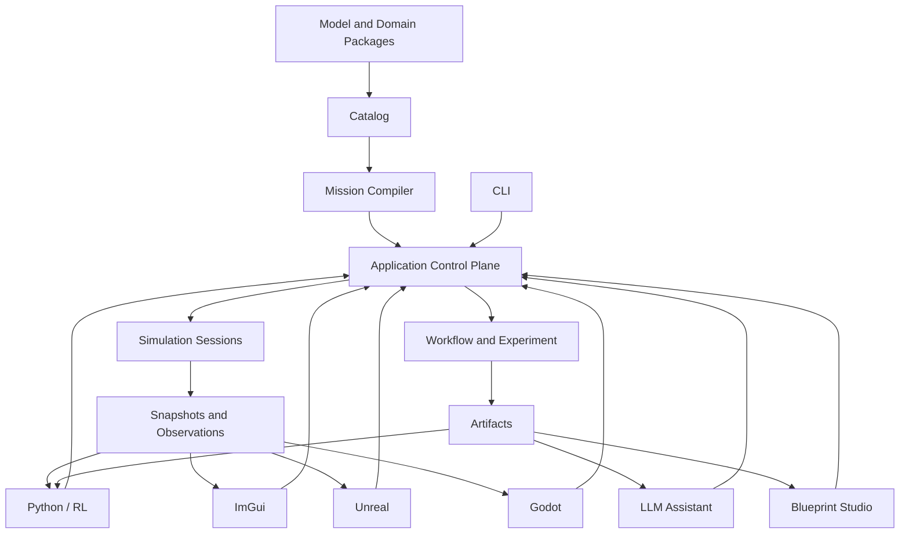
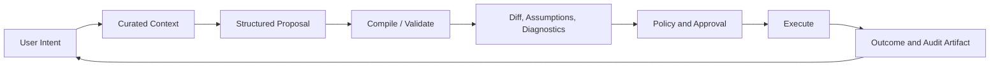

# 10｜扩展包、多语言与交互前端架构

[上一册：研究工作流与工具适配](09-research-workflows-and-tool-adapters.md) · [返回总索引](README.md) · [下一册：路线图总览](11-roadmap-overview.md)

**主线定位**：本册位于系统边缘，说明新领域 package 与 CLI、Python、LLM、蓝图、ImGui、UE、Godot 等消费者怎样接入既有 Authoring、Control 和 Observation 边界。它复用 Compiler、Session、Workflow 与 Evidence 的权威结果，不建立入口专用语义。

## 本册一口气读完：Python 与 LLM 使用同一控制面

Python 客户端调用 `compile(source_ref) -> OperationReceipt`，再以 operation id 查询携带 `PlanRef` 的 `CompilationOutcome`；`create_session(plan_ref) -> SessionCreateOutcome`、`reset(handle, RunBinding) -> ResetOutcome` 和 `step(handle, command_batch) -> StepOutcome` 复用同一套结构化结果。客户端只持有 opaque handle 与 immutable DTO。LLM 若想把目标高度改为 1200 m，只能提交 `ResearchProposal`，其中含 base source、EvidenceRefs、typed `MissionSourcePatch` 和 requested action。approval 后的 source 仍由 Compiler 生成新 plan。

ImGui、UE 和 Godot 通过 command receipt 与 `RenderSnapshot` 观察 committed state。它们没有 `CommittedStateStore` 写入口。具体 proposal 见 [00A §9](00a-yyz-end-to-end-walkthrough.md)；本册后文把 package、language binding、Application API、安全和 backend 接缝落到明确扩展类型。

## 1. 设计目标

未来的 Python 智能体、外部 LLM、蓝图编辑器、ImGui、UE 和 Godot 都应建立在同一套 Mission、Session、Artifact 与 Control Plane 上。扩展机制需要兼顾：

- 当前单人研究和静态 C++ 构建的低复杂度；
- 项目组件向稳定模型包晋升；
- Python/Lua 算法快速迭代；
- 多 Session 与批量训练；
- 图形编辑和自然语言设计；
- 实时渲染和交互；
- 导弹、卫星、火箭、飞机等不同领域语义；
- 权限、确定性、性能和故障隔离。

逻辑 package、稳定 Control API 和数据边界是近期基础。动态插件市场、远程多租户和通用游戏引擎能力属于按需扩展。

## 2. 扩展面总览



## 3. 扩展类型

| canonical 类型 | 加入内容 | AuthorityDomain | 首选边界 | 首个建设门/状态 |
| --- | --- | --- | --- | --- |
| `ProjectModelExtension` | 私有模型/算法与可选 RuntimeComponent | Design/Plan + Model | C++ Model SDK、project package | R1/R2，V1 |
| `ModelPackageExtension` | 稳定组件、资产和验证 | Design/Plan | Package Manifest + Catalog | R1，V1 |
| `DomainPackageExtension` | 一类飞行器/任务的契约与模板 | Design/Plan | Contract + Model Packages | X2，按真实项目增加 |
| `NumericalExtension` | 算法后端 | Design/Plan；运行结果进入 Model/Artifact | Numerical Descriptor | N1–N5，V1 |
| `WorkflowTaskExtension` | 分析、工具、报告 | Operation + Artifact | TaskDefinition + Artifact | W0，V1 |
| `ToolAdapterExtension` | DATCOM/MATLAB/GPOPS2 等 | Operation + Artifact | ToolAdapter 窄部件 | W1，V1 |
| `LanguageAdapterExtension` | Python/Lua | Operation；可选受限 Model | Application API/RuntimeCell Adapter | X1，V1 |
| `FrontendAdapterExtension` | CLI/GUI/game engine | Operation + Artifact read model | Control API + stream | X4/X5，PressureOnly |

先判断能力属于哪种扩展，再选择机制。把所有扩展都做成 RuntimeComponent 会破坏内核边界，也会把离线工具、控制面和实时闭环混入同一生命周期。

## 4. Package 组合

### 4.1 PackageSet

一个项目编译或运行时选择明确 PackageSet：

- framework core packages；
- selected domain packages；
- lab stable packages；
- active project package；
- external adapters；
- exact versions/locks。

PackageSet 可以继续由 CMake 静态组合。Mission Compiler 只看到 Catalog contribution。

### 4.2 依赖约束

- domain package 可以依赖基础 contract/model package；
- framework 不能依赖具体 `user/<project>`；
- package 不能通过 include 偷用另一个 package 的 private header；
- assets 通过 Artifact contract 引用；
- 环形 package dependency 在 catalog resolve 阶段失败；
- optional feature 通过 manifest 中稳定的 feature id 与显式 contract contribution 声明，不通过编译宏改变 contract 语义。

### 4.3 package 入口

首期使用静态 `contributeCatalog()` 概念替代中央逐项注册。manifest 离线可读，C++ factory 只负责实例化。

### 4.4 动态加载决策门

只有出现以下真实需求时推进动态 package：

- 无法重新链接宿主；
- 第三方独立交付；
- Python/GUI 需要运行时安装；
- 许可证要求隔离；
- 进程级故障隔离。

届时采用窄 C ABI/IPC，不跨边界暴露 STL、Eigen、异常和对象布局。

## 5. Domain Package

### 5.1 内容

Domain Package 提供：

- domain contracts；
- ModelDefinitions 与 RuntimeComponentDescriptors；
- form families；
- standard assets/schemas；
- scenario/assembly/run templates；
- metrics 与 termination definitions；
- workflow templates；
- validation suites；
- UI node palette/inspectors；
- glossary 和 reference documentation。

### 5.2 common 与 specialized

公共能力如地球、大气、坐标、刚体、传感器基础、执行机构基础可以被多个 domain package 复用。领域特有流程以 package 组合表达，不向 Kernel 增加 missile/satellite/aircraft 分支。

## 6. 导弹领域包

### 6.1 核心概念

- launch platform、missile、target；
- seeker、IMU、satnav、navigation fusion；
- midcourse/terminal guidance；
- autopilot/control allocation；
- actuator、aero、mass、propulsion；
- target tracking 与 line-of-sight；
- launch/boost/cruise/terminal/fuze phases；
- intercept/miss-distance metrics。

### 6.2 模板

- ideal 3DoF guidance baseline；
- 6DoF autopilot closure；
- seeker handover；
- target maneuver sweep；
- Monte Carlo hit probability；
- control margin envelope；
- real-time player/AI target scenario。

### 6.3 特殊约束

target truth 与 ownship truth 必须用 EntityId 区分；LOS frame 和 rate 有明确契约；fuze/impact 是 event/termination；局部 stage/mode 变化由宿主 recipe 内的 behavior mechanism 与 command/event 表达，跨组件共享阶段由单一 `DecisionAuthority` RuntimeCell 持有。

### 6.4 多飞行器 sensing、interaction 与通信

- 每个飞行器 form 只拥有自己的 state/truth；
- relative geometry、碰撞和引力等物理关系由 interaction/query 消费编译授权的 entity truth views；
- radar/seeker/vision 使用 observer truth、target truth 和 environment 生成 Measurement；
- cooperative guidance 接收 Link Model 传来的 Estimate/Message，link 明确 latency、bandwidth、dropout、clock 和 authentication/quality；
- ideal target-truth guidance 作为显式 experimental model definition，Plan/Manifest 标记理想化 access；
- team/group selector 在 Compiler 中解析并检查 cardinality，Runtime 无全局 truth registry 查询。

## 7. 卫星领域包

### 7.1 核心概念

- orbit state、ephemeris、attitude、angular momentum；
- inertial/ECEF/orbital/body/sensor frames；
- gravity harmonics、third-body、drag、SRP；
- star tracker、sun sensor、gyro、GNSS；
- reaction wheel、thruster、magnetorquer；
- orbit determination、attitude determination/control；
- eclipse、visibility、maneuver、wheel saturation events。

### 7.2 数值要求

卫星长时传播可能需要自适应/高阶积分、事件定位和时间尺度（UTC/TAI/TT/TDB）。这些能力通过 Numerical/Time contracts 扩展，不能用 double seconds 和地球飞行默认假设硬套。TimePoint 明确 epoch、scale 与转换 provenance；leap-second/time-scale adapter 停留在 time/ephemeris package。

### 7.3 星座与天体系统架构

- 使用 entity template + parameterized instances 表达大量同构卫星，单星 ModelDefinition/Recipe 不复制；
- constellation/group/neighbor selector 进入 Mission IR，Compiler 生成 bounded entity views 和并行 plan；
- central body、third-body、ephemeris、eclipse 和 visibility 通过带 body/frame/time-scale identity 的 query contract 提供；
- 独立轨道传播可以形成多个 `IntegrationScopePlan`；相互引力、编队约束或系绳场景进入明确 `SolverIslandPlan`；
- 星间链路由 communication topology/link models 表达，链路重构使用 event 或未来 TopologyTransaction；
- observation 使用 entity-long 或分组 dataset，避免为每颗卫星手写一套字段；
- 大规模邻接查询可以由 Compiler/PreparedModel 建立空间索引，Kernel 不增加 constellation 专用调度器。

### 7.4 工作流

- orbit design/optimization；
- sensor visibility；
- ADCS linearization/margins；
- momentum management；
- Monte Carlo navigation covariance；
- ephemeris import/export。

## 8. 火箭领域包

### 8.1 核心概念

- multistage vehicle；
- propulsion phases、throttle、mixture；
- propellant/mass/CG/inertia evolution；
- staging、fairing、engine events；
- ascent guidance、navigation、attitude control；
- atmosphere/wind/load/q-alpha constraints；
- launch site、range safety、impact footprint。

### 8.2 架构映射

- stage separation 使用 Event 与已编译的 entity activation/configuration plan；
- mass/propulsion 是 `vehicle.output` 能力；
- ascent mode 属于 `vehicle.process`；
- 已知级数与子体在 v1 预编译为 inactive entities，分离 mapping 原子提交 parent mass/configuration、child initial state、relative transform 和 separation impulse；
- 未知数量 payload、碎片或运行期新模型实例需要 `TopologyTransaction` `KernelCapability`，不能由 Session callback 直接创建组件；
- GPOPS2 轨迹作为 Workflow Artifact 输入。

### 8.3 工作流

- ascent trajectory optimization；
- guidance law replay；
- load envelope；
- engine-out/failure branches；
- stage sizing parameter sweep；
- range safety report。

## 9. 飞机与起降领域包

### 9.1 核心概念

- atmosphere/weather/turbulence；
- aerodynamic configuration、flap/gear；
- propulsion、fuel、mass balance；
- flight control laws/modes；
- pilot/AI/autopilot commands；
- runway、terrain、landing aids；
- ground contact、landing gear、braking；
- taxi/takeoff/climb/cruise/approach/flare/landing phases。

### 9.2 地面接触

接触动力学与普通 airborne form 有不同约束、事件和数值刚性。runway/terrain 是带 frame、surface、法向、摩擦和有效域的 Asset/PureQuery；landing gear、轮胎、刹车和转向拥有自己的 state/model；contact interaction 把 gear/terrain/rigid-body candidate state 组成约束力或冲量。

轻量模型可以让 6DoF form 始终运行并叠加 contact force。简化 taxi/ground-roll form 与 airborne form 并存时，transition 需要完整 state mapping、continuity、command hold、observation 和 failure policy。AtGrid transition 可用于首版；精确 touchdown、bounce 和冲击需要 SegmentTransaction。Kernel 只执行通用 solver/event/transaction plan，无 aircraft-ground 分支。

舵机卡死、刹车失效、爆胎或阵风等故障通过各模型 owner state 改变正常输出，随后由接触/刚体物理产生冲出跑道、失控或坠毁状态。terminal evaluator 根据 committed contact、位置、载荷和姿态判定 crash/overrun/landing outcome。

### 9.3 工作流

- trim/linearization across envelope；
- gain scheduling；
- handling qualities；
- takeoff/landing performance；
- gust/turbulence response；
- autoland guidance/control assurance；
- intelligent flight agent training。

## 10. Python Control API

### 10.1 对象模型

Python 首选暴露：

| 对象 | 能力 |
| --- | --- |
| Workspace | package/catalog/artifact 根 |
| Catalog | 查询 model/contract/schema/template |
| Compiler | compile/validate/dry-run/diff |
| ExecutionPlanDescriptor | portable immutable metadata/hash/graph |
| PlanRef | immutable plan descriptor/image identity 的稳定引用 |
| Session | initialize/run/step/reset/cancel/query |
| Experiment | materialize/run/status/aggregate |
| Workflow | execute/approve/cancel/query |
| ArtifactRef | load/query/lineage/materialize |
| Diagnostic | stable structured record |

Python 不持有内部 `CommittedStateStore`、`RuntimeCell`、`StepTransaction` 或裸指针。

### 10.2 Session API

Session 操作返回 Outcome 或抛出只表示 API 误用的 Python exception。运行失败仍可查询 RunOutcome 和 diagnostics。

目标 Python facade 的规范签名：

```python
def compile(source_ref: ArtifactRef, options: CompileOptions) -> OperationReceipt: ...
def compilation_outcome(operation_id: OperationId) -> CompilationOutcome: ...
def create_session(plan_ref: PlanRef) -> SessionCreateOutcome: ...
def initialize_session(handle: SessionHandle, binding: RunBinding) -> InitializationOutcome: ...
def step_session(handle: SessionHandle, commands: CommandBatch) -> StepOutcome: ...
def run_session(handle: SessionHandle, until: RunUntil) -> OperationReceipt: ...
def run_outcome(operation_id: OperationId) -> RunOutcome: ...
def reset_session(handle: SessionHandle, binding: RunBinding) -> ResetOutcome: ...
def checkpoint_session(handle: SessionHandle) -> OutcomeEnvelope[ArtifactRef]: ...
def restore_session(checkpoint_ref: ArtifactRef) -> OutcomeEnvelope[SessionHandle]: ...
def cancel_operation(operation_id: OperationId) -> OperationReceipt: ...
def dispose_session(handle: SessionHandle) -> OutcomeEnvelope[None]: ...
```

`SessionHandle`、`OperationId` 和 ArtifactRef 是 opaque value；`StepOutcome` 引用本次 sealed ObservationBatch 或 snapshot DTO，不暴露 CycleFrame。compile/run 这类长操作先返回 receipt，再通过 operation id 查询最终 Outcome；initialize/step/reset 是同步有界调用，backend 也可将它们包装成 operation 而不改变结果 schema。

关键操作：

- create from PlanRef；Application 在受控 link/cache 边界解析对应的 immutable ExecutionPlanImage；
- initialize(RunBinding)；
- step(action/commands)；
- run(until/observer)；
- reset(new RunBinding)；
- get snapshot/schema；
- subscribe observations/events；
- checkpoint；restore_session(checkpoint) 创建新的 branch Session；
- cancel/dispose。

### 10.3 buffer

- 小值转 Python value；
- 时序批次优先 Arrow/NumPy compatible buffer；
- zero-copy 需要只读、生命周期 token 和明确 owner；
- Python 保存跨 epoch view 时自动复制或拒绝；
- GIL 在长时间 C++ run 时释放，callback 路径重新获取；
- callback 频率和耗时进入 policy。

## 11. 强化学习环境

### 11.1 EnvDefinition

- ObservationSpace：来自 FieldDescriptors；
- ActionSpace：来自 CommandDescriptors；
- reset parameters/distribution；
- reward MetricDefinition；
- termination/truncation；
- episode seed derivation；
- frame skip/action hold；
- normalization/scaling；
- safety shield；
- info fields 和 diagnostics policy。

### 11.2 reset/step 语义

```text
reset(seed, options)
-> initialized committed snapshot at t0

step(action)
-> validate command
-> apply at declared safe point
-> advance N simulation ticks
-> observation, reward, terminated, truncated, info
```

terminated 表示 mission/physical terminal condition，truncated 表示时间限制、外部取消或训练 policy。运行失败进入 info/outcome，并由训练 adapter 决定抛出或终止 episode。

### 11.3 VectorEnv

多个环境使用独立 Session。优先进行 case/session 级并行：

- immutable plan/assets 共享；
- mutable CommittedStateStore/RNG/buffer 隔离；
- action batch 按 session id 分发；
- observations 使用批量 buffer；
- 一个 Session 失败不污染其他环境；
- seed 与 worker 顺序无关。

### 11.4 训练与评估分离

`TrainingProfile` 可以降低 display/output 和确定性等级；评估运行使用冻结的 `RunProfile`、seed set、指标和证据输出。策略模型本身作为 Artifact，记录训练数据、代码和超参数谱系。

## 12. Python 算法扩展

按性能和可信度提供三条路径：

1. **Offline Task**：首选，Python 消费/产生 Artifact；
2. **Out-of-process Policy**：通过 command/observation IPC，以显式延迟运行；
3. **In-process Python RuntimeComponent Adapter**：用于低频原型，必须提供 RuntimeComponentDescriptor，并声明 GIL、deadline、determinism、state/reset 和 failure policy。

高频飞控和动力学成熟后优先迁移 C++ 或受验证运行时。Python callback 超时不能阻塞无界时间。

## 13. Lua 脚本扩展

Lua 可用于游戏/任务逻辑和快速算法原型。`LuaRuntimeComponentAdapter` 需要：

- 预声明 ports/config/state schema；
- sandboxed VM；
- 禁止任意文件、网络和 OS 命令；
- deterministic library subset；
- per-step instruction/time budget；
- explicit RNG stream；
- script hash/version；
- reset/checkpoint 支持；
- runtime error -> Diagnostic；
- hot reload 只在 Paused safe point，并创建新 plan/session revision。

Lua 适合离散逻辑与中低频算法；连续动力学 callback 需要额外性能和确定性验证。

## 14. Application Control Plane

### 14.1 分层

| 语义角色 | 责任 | v1 具体落点 | 建设阶段 |
| --- | --- | --- | --- |
| command admission | 校验 PermissionGrant、幂等、schema 和 operation state | 薄 handler + CommandLedger | X0 |
| operation coordinator | 协调 compiler/session/workflow，持有 operation lifecycle | Application host 中的显式 use-case function | X0 |
| query/read model | 返回 immutable DTO/read models | 由 Catalog、Session、Diagnostic、Artifact query 组合 | X0；X4 增加 GUI 投影 |
| application event port | 发布 operation/receipt/read-model invalidation 事件 | 首版进程内 typed subscriber；无全局 event bus | X0；X5 增加 transport adapter |
| policy evaluator | 授权、审批、资源与安全 | 纯规则 + PermissionGrant/PolicyDecision | X0；X3 增加 LLM approval rules |
| audit artifact writer | 记录命令、提案、批准和 Outcome | 经 Artifact Store 提交 audit Artifact | X0；X3 增加 proposal lineage |

### 14.2 idempotency

Create/Run/Cancel 等命令携带 request id。重复提交返回同一 operation 或明确冲突，避免 UI/LLM 重试造成重复运行。

### 14.3 长操作

Compile、Run、Experiment、Workflow 返回 OperationId。入口通过 query/event 获取进度，取消也以命令处理。

### 14.4 read model

为不同入口提供稳定 DTO：CatalogView、MissionGraphView、SessionStatusView、ObservationSchemaView、ArtifactLineageView、DiagnosticView。内部对象变化不传播到前端。

### 14.5 Operation Authority 与命令闭包

Application Control 使用 [02](02-layered-reference-architecture.md) 的 Operation Authority。每个写操作都沿同一闭合协议：

```text
typed proposal/command
-> Admit + Validate
-> Authorize
-> idempotent ledger commit
-> Dispatch to bound Compiler/Session/Workflow operation
-> application receipt / operation outcome
-> audit evidence
```

Control owner 只提交提案、命令与 operation lifecycle。Mission Compiler、Simulation Session、Workflow Engine 和 Artifact Store 继续拥有各自 Plan、Model、Task 与 Artifact 事实。前端、LLM 和 Application 层不能直接写这些内部状态；长操作通过 OperationId、receipt、query 和 event 观察。

`Admit/Authorize/Dispatch/Observe/Cancel/Finalize` 是语义操作族，无需各自对应一个 service class。首版可由薄 command handler 和显式函数组合实现，避免建立可随处调用的应用服务网络。

## 15. LLM 设计与仿真接口

### 15.1 LLM 能力范围

- 查询 model、contract、schema、模板和已有 Artifact；
- 把自然语言目标转换成 ResearchQuestion 草案；
- 生成 MissionSourcePatch、WorkflowPlan 或 ParameterSet 提案；
- 调用 compile/dry-run；
- 根据 Diagnostic 提出修复 patch；
- 解释模型图、时间语义、假设和结果；
- 生成图表/报告 specification 草案；
- 在批准后启动 operation。

### 15.2 安全环



### 15.3 Proposal

提案必须是 typed operation：

- target AuthorityDomain 与目标 owner；
- target source/version；
- patch operations；
- expected effect；
- expected commit/receipt type；
- assumptions；
- unresolved questions；
- requested `PermissionGrant`；
- evidence references。

自由文本只作为解释，不能直接进入执行器。

YYZ 目标高度调整的 concrete proposal：

```json
{
  "proposal_id": "proposal:yyz-altitude-1200:0002",
  "actor": {"kind": "llm", "id": "local-assistant", "model_ref": "model:approved-local"},
  "target_authority_domain": "DesignPlan",
  "target_owner": "workspace:active-project",
  "base_source_ref": "artifact:mission-source:yyz@sha256:3d0a",
  "operations": [
    {
      "kind": "MissionSourcePatch",
      "op": "replace",
      "path": "/vehicles/0/components/1/config/command_altitude_m",
      "value": 1200.0,
      "unit": "m"
    }
  ],
  "expected_receipt_type": "CompilationOutcome",
  "assumptions": ["existing altitude-hold definition remains selected"],
  "unresolved_questions": [],
  "requested_permission_grants": ["Compile"],
  "evidence_refs": ["artifact:report:yyz-baseline@sha256:991c"],
  "requested_action": "compile-dry-run",
  "approval_state": "PendingReview"
}
```

Compiler 的 diff、PlanProofRecord 和 DiagnosticRecord 决定该提案是否可执行；proposal 自身没有 Plan 或 Model 提交权。

### 15.4 权限等级

| 等级 | 允许行为 |
| --- | --- |
| Read | 查询文档、catalog、artifact |
| Propose | 创建 patch/workflow 草案 |
| Compile | 运行无副作用编译/dry-run |
| ExecuteLocal | 启动受限 Session/Workflow |
| ExternalTool | 使用特定工具/license |
| Publish/Export | 生成或导出正式报告 |

物理参数、模型成熟度降级、外部命令和 destructive artifact 操作需要明确 policy/approval。

### 15.5 防幻觉机制

- 只能引用 Catalog 中存在的 type/field/contract；
- 所有数值字段通过 schema；
- 自动假设单独列出；
- 不确定定义时查询 glossary/CharacteristicDefinition；
- compile 结果为权威；
- 结果解释引用 Artifact/Metric；
- 无证据的结论标记为推断。

## 16. 蓝图式 Studio

### 16.1 两个画布

1. **Simulation Graph**：组件、端口、scope、phase、rate、form family；
2. **Research Workflow Graph**：task、Artifact、branch、approval、cache。

两类图可以交叉引用 Run Task 和 Artifact，不能混成同一执行语义。

### 16.2 图模型

- semantic graph：可编译权威内容；
- layout graph：位置、颜色、分组、折叠；
- annotations：说明、公式、假设；
- template/subgraph：可复用模块；
- version/diff：协作和 LLM 提案。

layout 不进入 Execution Plan hash。

### 16.3 节点与 socket

Simulation Graph 节点 palette 来自 ModelDefinition，并用 execution form 区分 PureQuery、Closure 与 RuntimeComponent；Workflow Graph 节点来自 TaskDefinition。socket 来自 Port/Artifact contract。Studio 实时检查：

- contract/unit/frame；
- cardinality；
- scope；
- time/rate；
- maturity；
- loop closure；
- config schema。

### 16.4 可解释视图

- phase timeline；
- data freshness；
- continuous groups；
- closed-loop path；
- model maturity heatmap；
- Artifact lineage；
- diagnostics overlay；
- estimated resource/storage。

## 17. ImGui 前端

ImGui 适合轻量本地调试与实时研究面板：

- catalog/mission inspector；
- Session controls；
- live plots/metrics；
- model/runtime-instance diagnostics；
- event timeline；
- parameter command panel；
- render snapshot 3D view（可选）。

ImGui adapter 只使用 Control API 和 snapshot stream。调试状态修改也必须走 CommandDescriptor。

## 18. UE 与 Godot 前端

### 18.1 集成模式

| 模式 | 优点 | 代价 |
| --- | --- | --- |
| Embedded | 低延迟、简单部署 | 工具链和崩溃域耦合 |
| Local IPC | 故障隔离、独立构建 | 序列化和同步成本 |
| Remote | 多机/训练/展示 | 网络延迟与部署复杂度 |

首个原型优先 local IPC 或边界清晰的 embedded adapter，依据实际帧率测量选择。

### 18.2 RenderSnapshot

Snapshot 包含：

- session/tick/sim time；
- entity transforms 和 frame；
- visual state（舵面、发动机、阶段）；
- event markers；
- display telemetry；
- interpolation hints；
- validity。

视觉资产 id 与物理 model id 分开。mesh、材质和动画不进入物理 plan hash。

### 18.3 输入

玩家、操纵杆、AI 或游戏逻辑产生 timestamped Command。映射 adapter 负责 deadzone、scaling、rate limit，并把命令发往计划锁定的 `DecisionAuthority` target。前端不能直接写刚体 state。

### 18.4 时间同步

- renderer 可在两个 committed snapshot 间插值；
- 仿真可以 unpaced、soft real-time 或 lockstep；
- frame drop 只影响显示；
- 暂停发生在 Session safe point；
- network jitter 由 command buffer policy 处理；
- replay 使用记录命令和 snapshots。

## 19. GNC 作为游戏玩法

可把算法设计、任务规划和仿真结果变成核心玩法：

- 玩家搭建 sensor-navigation-guidance-control 链；
- 调整参数并观察闭环、裕度和饱和；
- 使用 C++、Lua 或 Python 编写算法；
- 通过蓝图检查 unit/frame/时序连接；
- 任务以命中、轨迹、燃料、稳定性和可靠性 metrics 评分；
- replay 和报告解释失败原因；
- 逐步解锁更高 fidelity 和故障场景。

游戏评分由 MetricDefinition 驱动，物理模式和娱乐简化模式分别声明 `FidelityLevel` 与 `RunProfile`。简化资产不能被误标为工程验证模型。

## 20. 热加载与迭代

### 20.1 参数热调

只有 ModelDefinition 声明 TunableParameterDescriptor，且 RuntimeComponentDescriptor 将对应 ParameterState 绑定到唯一 `StateOwner` 的参数可以通过 command 修改；命令同时携带范围、生效时刻和 audit identity，并按 [12](12-runtime-object-model-and-component-anatomy.md) 的 ParameterUpdateReducer 形成事务 patch。该 `StateOwner` 独占提交权。PlanStructural 变化要求重新编译并创建 Session。

### 20.2 算法热加载

代码或脚本变化需要：

- pause at safe point；
- compile/validate new definition；
- 检查 state migration；
- 创建 plan revision；
- 成功迁移后恢复，或创建新 Session；
- 保留前后版本和命令记录。

实时替换不能跳过接口与状态兼容检查。

## 21. 安全模型

### 21.1 威胁面

- LLM 生成任意路径/命令；
- Python/Lua 脚本访问系统；
- 动态 package 执行未知代码；
- 外部工具读写工作区；
- 远程前端发未授权命令；
- Artifact/模型含敏感或受限数据。

### 21.2 控制

- typed `PermissionGrant`，限定 actor、action、resource、scope、expiry 与 approval ref；
- package/tool allowlist；
- script sandbox 和 resource limits；
- Control API authentication（远程时）；
- command DecisionAuthority/target validation；
- workspace/Artifact URI confinement；
- audit log；
- secrets provider；
- worker process isolation；
- report/export classification check。

本地单用户模式可以使用轻量 policy，语义仍保持一致。

### 21.3 安全控制与建设阶段映射

| 建设阶段 | 当期必须落地的安全控制 | 验收证据 |
| --- | --- | --- |
| X0 | `PermissionGrant` 校验、CommandLedger 审计、workspace/Artifact URI confinement、最小 package/tool allowlist | 越权 command、路径逃逸、重复 request fixture 均产生稳定 Diagnostic/receipt |
| X1 | Python buffer 生命周期、GIL 边界、callback deadline、脚本资源限制 | 跨 epoch view、超时 callback、双 Session 隔离测试 |
| X2 | Domain Package 资产 provenance、manifest hash 与受限数据分类 | package resolve、asset hash、export classification fixture |
| X3 | LLM proposal scope、人工 approval ref、patch allowlist、proposal lineage | 未批准 proposal 无法物化；批准链可从 Artifact 追溯 |
| X4 | 本地前端 actor identity、typed command target、read-model-only 投影 | UI 无 CommittedStateStore 写入口；命令均有 receipt 与 audit Artifact |
| X5 | transport authentication、command sequence/buffer policy、snapshot bandwidth 与 deadline budget | 重放、乱序、抖动、断连和 deadline miss 测试 |
| X6 | ABI/IPC allowlist、worker process isolation、secret provider、远程认证与兼容策略 | 未知 package、协议降级、secret redaction、worker crash fixture |

阶段升级只能增加控制和证据，不能弱化已生效的边界。某阶段未通过对应安全 gate 时，其扩展状态保持 `PressureOnly` 或 `Deferred`。

## 22. 性能边界

### 22.1 高频路径

- C++ Session step；
- state/port access；
- observation buffer；
- render snapshot publish。

不经过 JSON、字符串 catalog 查询、LLM 或文件系统。

### 22.2 低频路径

- Mission compile；
- package discovery；
- diagnostics explain；
- workflow scheduling；
- report generation；
- UI graph editing。

可以使用富 schema 和通用 DTO。

### 22.3 预算

每个语言和前端 adapter 需要基准：

- step latency；
- observation copy/zero-copy cost；
- command latency；
- session count；
- snapshot bandwidth；
- GIL/script overhead；
- IPC serialization；
- real-time deadline miss。

## 23. 测试矩阵

| 扩展 | 必需测试 |
| --- | --- |
| package | version resolve、duplicate、missing dependency、manifest hash |
| domain pack | template compile、contract closure、maturity policy |
| Python | multi Session、reset/step、buffer lifetime、GIL、failure outcome |
| RL | seed、terminated/truncated、VectorEnv isolation、reward schema |
| Lua | sandbox、budget、reset/checkpoint、runtime error |
| LLM | nonexistent type、invalid patch、permission、approval、audit |
| Blueprint | round-trip、layout separation、port mismatch、diff |
| ImGui | command path、snapshot consistency、display drop |
| UE/Godot | embedded/IPC protocol、time sync、frame conversion、replay |
| security | path escape、arbitrary command、secret redaction、unauthorized action |

## 24. 建设顺序

### X0：Catalog 和 Application Control API

- 机器可读 Model/Contract Catalog；
- Compile/Link/CreateSession/Initialize/Restore/Run/Query application services；
- CLI 只调用同一 Application Control API；
- 无动态加载。

### X1：Python Session

- opaque Session handle；
- typed reset/step/run；
- NumPy observation；
- two-session isolation；
- Gym-style adapter 作为外层。

### X2：Domain package 与模板

- 先整理 missile/现有 3DoF/6DoF；
- 建立 package contribution；
- 卫星、火箭、飞机在真实项目出现时添加；
- Kernel 保持领域无关。

### X3：LLM proposal loop

- read/catalog；
- typed `MissionSourcePatch`；
- compile/diff/diagnostics；
- approval/audit；
- 限制为本地、低风险 operation。

### X4：Blueprint/ImGui

- Simulation Graph viewer；
- schema-driven inspector；
- editable graph -> compiler；
- Session monitor；
- Workflow canvas 后续加入。

### X5：实时/game prototype

- RenderSnapshot + Command 协议；
- 一个 3DoF/6DoF 场景；
- soft real-time/lockstep；
- Godot/UE 选择由原型成本决定；
- 性能和故障隔离验证。

### X6：动态/远程扩展

- 只有真实 package 分发、worker 或远程前端需求出现后推进；
- 冻结 C ABI/IPC；
- 安全、版本和兼容测试升级。

## 25. 完成定义

1. package manifest、catalog contribution、ModelDefinition 和 RuntimeComponentDescriptor 可以离线读取。
2. framework 不依赖具体 user/domain package，领域差异不进入 Kernel 分支。
3. Python 通过 Control/Session API 工作，多 Session 相互隔离。
4. RL reset/step 的 action、observation、reward、termination 和 seed 语义完整。
5. Lua/Python 运行时算法具有明确 sandbox、性能和确定性边界。
6. LLM 只能提交 typed proposal，经 compile、diff、policy 和 audit 后执行。
7. Blueprint 的 semantic graph 与 UI layout 分离，并编译到同一 Mission IR。
8. ImGui、UE、Godot 使用 command/snapshot 边界，无法直接写内核状态。
9. 导弹、卫星、火箭和飞机能力以 Domain Package 组合，拥有各自模板和验证。
10. 实时和游戏模式声明 fidelity，工程证据与娱乐简化结果清楚区分。
11. 所有写入口沿 Operation Authority 的 admit/authorize/ledger/dispatch/receipt/audit 路径运行，前端无 Plan、Model、Task 或 Artifact 越权写入。
