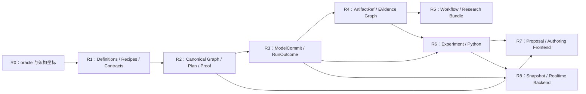

# 11｜架构演进路线总览

[上一册：扩展包、多语言与前端](10-packages-multilanguage-and-frontends.md) · [返回总索引](README.md) · [下一册：运行对象模型与组件内部构成](12-runtime-object-model-and-component-anatomy.md)

## 本册一口气读完：同一 YYZ 纵向链怎样跨过九个 gate

`REF-YYZ-001` 在 R0 冻结科学与旧行为 oracle，R1 获得 package/contract，R2 编译出带 `PlanProofIndex` 的 `ExecutionPlanDescriptor`，R3 由唯一新 Session 生成 committed-state sequence。R4 把 `ObservationBatch`、`RunOutcome` 和 lineage 提交为证据，R5 让 DATCOM—配平—控制分析—闭环仿真—图表—报告形成可复现 Workflow。R6–R8 依次增加 Experiment/Python、LLM/蓝图和实时前端消费者；这些入口始终复用已闭合的 Plan、Control 与 Evidence 接缝。

每个阶段都以可执行 fixture、失败路径和 artifact 为退出条件。阶段编号表达依赖顺序，不代表可以只完成接口声明。完整对象样本见 [00A](00a-yyz-end-to-end-walkthrough.md)，各 gate 的交付物与拒绝条件见本册后文。

详细分册：

- [R0–R2：架构主轴、模型生态与语义编译](roadmap/r0-r2-foundations.md)
- [R3–R5：事务内核、证据与研究闭环](roadmap/r3-r5-kernel-and-research.md)
- [R6–R8：Experiment、自动化入口与实时适配](roadmap/r6-r8-platform-and-frontends.md)
- [直接重构、治理与验收](roadmap/migration-governance-and-acceptance.md)

### 能力交付状态

路线和详细分册统一使用 `CapabilityStatus`，状态描述交付承诺，阶段编号描述依赖顺序：

`CapabilityStatus = Stable | V1 | PressureOnly | Deferred | Legacy` 是全库唯一交付状态枚举。

| 状态 | 路线含义 |
| --- | --- |
| `Stable` | 当前与目标路径都必须保持的架构/科学约束 |
| `V1` | 第一代目标实现和验收范围 |
| `PressureOnly` | 只用未来场景验证接缝与边界，不承诺当期实现 |
| `Deferred` | 已记录开启条件和 gate，当前执行路径必须拒绝或保持不可达 |
| `Legacy` | 只作为迁移来源、行为 oracle 或删除台账证据 |

同一能力的状态只在 [术语注册表](reference-glossary.md) 登记一次；路线分册引用该状态并补充具体 gate，不能用章节篇幅暗示更高成熟度。

## 路线主叙事｜先闭合一条研究链，再扩大消费者

路线按 [02](02-layered-reference-architecture.md) 的端到端主线建设系统。每个阶段完成一次新的权威交接，并用真实纵向场景证明上游边界已经稳定；后续阶段消费这些公开结果，不回到内部对象中补接捷径。

```text
科学基线与架构坐标
-> 可版本化模型供给
-> 可证明的不可变计划
-> 唯一的 committed-state sequence
-> 可追溯运行证据
-> 可复用研究工作流
-> 批量与 Python 消费者
-> LLM/蓝图作者入口
-> 实时与领域前端
```

### A. 三个可感知里程碑

| 里程碑 | 覆盖阶段 | 完成后研究者可以做什么 | 已固定的架构主线 |
| --- | --- | --- | --- |
| M1：可信单次仿真 | R0–R3 | 用新 Mission 路径运行 YYZ，获得与科学 oracle 可解释一致的状态、诊断和 Outcome | Model/Package → Compiler → Plan → Session → ModelCommit |
| M2：可复现研究闭环 | R4–R5 | 从气动资产出发完成配平、分析、闭环仿真、图表和报告，并追溯全部输入 | ModelCommit/Outcome → ArtifactRef → Workflow → Evidence Bundle |
| M3：统一多入口工作台 | R6–R8 | 批量打靶、Python/RL、LLM、蓝图和实时前端复用同一编译、运行与证据语义 | Control/Authoring/Observation adapters → 既有主线 |

M1 解决“单次运行是否可信”，M2 解决“研究过程是否可复现”，M3 解决“不同消费者是否共享同一系统”。这三个问题存在明确依赖顺序。

### B. 一条 YYZ 纵向链怎样随阶段生长

R0 先冻结四元数、坐标、时间和代表轨迹的科学 oracle，并用未来场景检查架构接缝。此时形成判断新旧结果的依据，也形成每个对象应归属哪条主线的坐标。

R1 将 YYZ 的 form、environment、sensor、guidance、controller、actuator、aero、mass、propulsion 和 closure 拆成 contracts、ModelDefinition、AlgorithmKernel、Runtime Cell Recipe 与 assets。算法可以独立测试，局部状态机和限幅器嵌入唯一 owner。

R2 让同一 YYZ Mission 从 Source Frontend 进入 Compiler。所有 occurrence、binding、time relation、obligation、region、solver、transaction 和 observation 选择在运行前闭合，产出可解释的 Execution Plan。

R3 让新 Session 只消费该计划。每个 step 从 committed state 出发，候选求值通过统一 transaction 提交，YYZ 完整运行后完成 runner 硬切换并删除旧运行路径。M1 在这里成立。

R4 把 ModelCommit、Observation、Diagnostic 和 RunOutcome 投影为带 schema、hash 与 lineage 的 Artifact。失败运行同样形成可判断有效性的证据，文件格式不再定义数据语义。

R5 用同一套 Artifact 将 DATCOM、气动校核、配平、线性化、裕度分析、闭环仿真、图表和报告连成 Workflow。M2 在首条真实研究链通过后成立。

R6 将普通 Plan、RunBinding、Session 和 Artifact 组合成 Experiment、Monte Carlo、Python reset/step 与 RL 环境。规模变化由 worker/backend 承担。

R7 让 LLM 和蓝图编辑器读取 catalog/schema、生成 proposal/source、消费 Compiler diagnostics，并经过审批调用既有 Application API。它们不直接装配运行对象。

R8 增加 command/snapshot、pacing 和 endpoint adapters，使 ImGui、UE、Godot、HIL 和实时游戏消费者接入 committed snapshot。M3 在多个入口证明语义一致后成立。

### C. 阶段依赖来自产物依赖



箭头表达可消费的权威产物。R4 需要 R3 的 commit 与 outcome；R5 需要 R4 的 ArtifactRef；R7 需要 R2 的 schema/diagnostics 和 R6 的稳定应用操作；R8 需要 R3 的 snapshot 边界与 R6 的多 Session 经验。阶段不能凭界面完成度跨越这些依赖。

### D. 每个阶段都按同一方式交付

每个工作包都要完成一个纵向 slice：

```text
research need
-> authoritative input
-> implementation seam
-> compiled/executable path
-> authoritative result
-> success and failure evidence
-> removal of superseded path
```

阶段进度按可运行链路、科学 oracle、失败证据和删除量判断。孤立类、预留接口、未接入主线的 manager 和只有 happy path 的 demo 不计入架构完成度。下面各节是该主叙事的门禁与交付明细。

## 1. 路线目标

本路线交付一套能够长期吸收变化的架构主轴。总原则是“开放语义、分区封闭执行、证据闭环”；所有能力先沿同一条语义主干获得计划、提交和证据：

```text
intent encoding
-> canonical intent / graph
-> immutable plan
-> bounded executor
-> authoritative commit + receipt
-> evidence projection
```

该主干按 Design/Plan、Model、Operation 和 Artifact 四类 AuthorityDomain 实例化。Model Ecosystem、Semantic Compiler、Transactional Kernel、Evidence Workflow 与 Application/Adapter 分别拥有明确变换；Plan Firewall、Commit Firewall 和 Artifact/Control Firewall 隔离相邻权威。JSON、YAML、INI、蓝图和 API 是输入编码，CSV、MAT、HDF5、数据库与实时流是观测编码。编码变化不得渗入领域模型与执行内核。

阶段完成的判断依据包括：

1. 新能力能分解为 AuthorityDomain + 七维 ChangeVector，并沿 [02](02-layered-reference-architecture.md) 的接缝进入；
2. 每个切片能降级为所属权威域的 grammar、proof、closed operators 和 commit；
3. 跨域交接只使用 typed intent/ref/receipt/Outcome；
4. 计划明确指出哪些稳定区域保持零修改；
5. failure、rollback、evidence 与 resource lifetime 有闭合结果；
6. 纵向场景证明架构关系，旧路径随后删除。

当前仓库没有外部用户和兼容负担。R0–R3 采用单分支、单目标、单运行路径的直接重构。旧实现仅用于科学 comparison evidence，不成为新架构的 adapter 或 facade。

## 2. 先固定架构主轴，再展开对象细节

R0–R3 实现同时服从下列设计权威：

| 分册 | 权威内容 |
| --- | --- |
| [02](02-layered-reference-architecture.md) | AuthorityDomain + 七维 ChangeVector、分区封闭操作语言、三道防火墙、五个架构分区、九类扩展接缝、A–F 变化分流和 Kernel 准入门 |
| [12](12-runtime-object-model-and-component-anatomy.md) | ModelDefinition、Runtime Cell、Recipe、State、AlgorithmKernel 和 execution obligations |
| [13](13-behavior-composition-and-extension-mechanisms.md) | 组件内部组合、embedded mechanism、StateFragment 和 shared DecisionAuthority promotion |
| [14](14-cycle-dataflow-state-transaction-and-continuous-closure.md) | execution regions、port timing、CycleFrame、StepTransaction、IntegrationScopePlan 和 SolverIslandPlan |
| [15](15-reference-vertical-designs-and-object-placement.md) | YYZ/CAVH 纵向设计与未来压力场景的接缝验证 |

局部 ADR 可以决定 C++ 模板、layout、arena、codec 和文件命名。ADR 若改变防火墙、扩展接缝、因果方向、state ownership 或 commit 语义，需要先更新上述设计并重新运行压力测试。

## 3. 阶段结构

| 阶段 | 架构主题 | 主要证明 | 应保持零修改的区域 |
| --- | --- | --- | --- |
| R0 | 架构闭合与科学基线 | 表示、模型、实体、因果、时间和证据压力均可分流，旧行为有科学 oracle | 暂无实现承诺 |
| R1 | Model Ecosystem 与 Behavior Composition | 新算法、局部工具、实体关系、场景干预和共享 DecisionAuthority 能在 package/SDK 内表达 | Kernel、Artifact、Frontend |
| R2 | Semantic Compiler 与 Plan Firewall | authoring/package 变化被降级为 closed plan，输入编码与规范语义分离 | Session 热路径、Workflow、Frontend |
| R3 | Transactional Kernel 与硬切换 | generic regions/obligations 推进 YYZ，失败具有唯一 commit 结果 | 领域 package 内部公式、Artifact format、Frontend |
| R4 | Observation、Artifact 与证据防火墙 | 运行结果可追溯、失败运行也有可信 evidence | 模型和 Kernel 状态语义 |
| R5 | Research Workflow | 气动—控制—仿真—报告纵向链通过 Artifact 组合 | 单次 Session 语义 |
| R6 | Experiment 与 Python | 批量、reset/step、RL 复用普通 Session | Model Packages、Kernel regions |
| R7 | LLM 与 Blueprint authoring | 新入口只生成 proposal/source 并经过 Compiler | Runtime Cell internals |
| R8 | Realtime 与领域前端 | command/snapshot/backend 接缝支撑实时消费者 | state ownership、commit、evidence identity |

每阶段先稳定最小接缝，再实现一个真实 consumer。没有 consumer 的通用插件、动态 ABI、分布式事务和通用图解释器不进入近期核心。

## 4. 阶段依赖

本册开头“阶段依赖来自产物依赖”的图是唯一阶段 DAG。本节补充实施时允许的局部交替和禁止反向打开的边界。

R1 与 R2 可以小步交替：package recipe 暴露真实编译需求，Compiler 反向检验 recipe 是否过度依赖运行时。R3 只消费冻结的 plan semantics。R4–R8 不得重新打开 Model Package 与 Kernel 的内部耦合。

## 5. R0：架构闭合与压力测试

R0 的目标是证明架构形态，不编写一长串未来类名。

### 5.1 交付

- 三道防火墙和五个分区的 dependency map；
- `ChangeCard` 与 `<AuthorityDomain, Delta<V,G,S,T,I,R,X>>` 分级需求模板；
- Design/Plan、Model、Operation、Artifact 四类封闭操作语言，以及 Model Authority 的 `Publish/Invoke/Advance/Stage/Validate/Commit/Seal/Effect` lowering 规则；
- identity、ownership/DecisionAuthority、causality、time/lifecycle、state/transition、resource/effect 与 evidence 七类 `PlanProofRecord` schema；
- A–F 变化分类与九类扩展接缝；
- 当前源码到新分区的 ownership/deletion map；
- `REF-YYZ-001`、minimal 3DoF、YYZ 6DoF 和 CAVH scientific oracle bundle；
- 旧行为 oracle manifest 与自动测试，覆盖 publish 不推进状态、固定 phase 顺序、同步候选提交、`IContinuousGroup` 到 `IntegrationScopePlan` 的迁移、CSV `t_k` 语义、停止前记录和 SimFlow 外置边界；
- 术语注册表 conformance checker：检查新增 CamelCase/代码词、退出词、共享 enum/key 重复定义和断链引用，带明确 allowlist；
- 可序列化 PlanProofRecord/PlanProofIndex schema、YYZ proof fixture 与 dry-run 查询样例；
- 十三个长期压力面的 route/untouched-area 表；
- 表示兼容矩阵与代表性因果走查，覆盖 Source Frontend、Dataset Sink、多实体 truth、场景干预、实体 activation、地面接触和天体星座；
- v1 明确排除的 Kernel semantics：SegmentTransaction、TopologyTransaction、动态 package ABI；
- architecture fitness functions。

### 5.2 退出门 G0：架构压力闭合

G0 首先验证抽象闭包：普通单域 A–E 变化能填写 ChangeCard；F 类、跨域或关键语义变化能拆成 CapabilitySlice。每个高风险切片都能声明 AuthorityDomain 与七维 ChangeVector，并落到该域的 canonical grammar、PlanProofRecord、closed operator、AuthorityDomain commit 和 Evidence route；跨域 handoff 全部可追踪；没有以产品名命名的 Kernel 分支。

随后用一组跨维度样本做反证测试：JSON/YAML/受限 INI 输入、CSV/MAT/HDF5 输出、新制导律、复杂控制器内部行为、新拉偏项、舵机卡死到坠毁、多飞行器 truth/传感/通信、已知子体分离、飞机起降和地面异常、卫星星座与天体运行、强耦合高保真模型、Monte Carlo、RL、LLM、蓝图、报告、HIL、实时游戏前端。样本只验证同一套推导规则，不生成同数量的架构机制。

当前压力样本中，未知拓扑和步内 jump 已明确暴露未来 Model Authority operator 缺口；它们有清楚的延后边界，不以临时 callback 或全局容器实现。后续 withheld scenario 仍可能发现新的通用缺口，必须重新经过 F-Model 准入门，不能据此宣称 Kernel 语义已经穷尽。

### 5.3 退出门 G1：科学 oracle 可用

- 用户修订后的四元数约定有性质测试；
- minimal 3DoF 与 YYZ 6DoF 有独立初值/轨迹/终止 reference；
- CAVH 公式中间量有 MATLAB/Python 或论文表格对照；
- 旧行为被标记为保留、修正或删除；
- reference 不依赖旧 Node 数量、provider 名或 CSV 列顺序；
- `REF-YYZ-001` source、PlanProofRecord、step journal、ObservationBatch、CSV 和 DiagnosticRecord 通过 schema/conformance test；
- 术语 checker 对目标架构分册和路线文档通过，专家原始意见作为只读输入排除。

## 6. R1：Model Ecosystem 与 Behavior Composition

R1 建立高变化领域代码的承载方式：

```text
ModelDefinition
  + RuntimeCellRecipe
    + AlgorithmKernel(s)
    + EmbeddedMechanism(s)
    + StateFragment(s)
    + Adapter / Projection / Invariant
  -> RuntimeComponentDescriptor
```

### 6.1 交付

- package contribution 与 stable identities；
- Domain Contract 和 typed Asset；
- Algorithm Definition/State/Input/Output/Telemetry/Kernel；
- RuntimeCellRecipe、StateFragment composition 和 common SDK profiles；
- execution obligation descriptors；
- shared DecisionAuthority promotion rule；
- entity-scoped truth contract、EntitySelector 和跨实体 sensing/interaction/link contract；
- ParameterId、扰动、模拟故障、activation mapping 与 owner-local intervention contract；
- model/package verification harness。

状态机作为 behavior SDK 的一个 mechanism fixture 实现。R1 还需使用滤波/滞回、抗饱和或故障锁存等至少一种不同机制证明组合规则具有普遍性。

### 6.2 退出门 G2：高变化区域与 Kernel 解耦

- 新制导律只增加 package Definition/Kernel/Recipe；
- Guidance phase mechanism 与 Controller anti-windup mechanism 共享嵌入规则；
- mechanism state 合并到宿主 owner block；
- shared flight phase/configuration 通过 StateOwner/DecisionAuthority cell + typed snapshot 表达；
- 多实体消费者只取得编译后的窄 truth/measurement/message view，系统无可写全局 truth 容器；
- 拉偏、扰动和模拟故障进入声明 owner 的普通输入、状态与物理输出，系统无可跨 owner 改写状态的通用故障管理器；
- Kernel 不按 RuntimeCellProfile、placement、vehicle type 或 mechanism type 分派；
- package kernel 测试不依赖 Session、Mission、registry、logger 和 filesystem。

## 7. R2：Semantic Compiler 与 Plan Firewall

R2 把可变 authoring/package 模型降级为固定执行语言：

```text
SourceBlob -> Source Frontend -> SourceTree/SourceMap
+ Catalog Contributions
-> canonical IR
-> binding/topology/StateOwner/DecisionAuthority checks
-> obligation and region lowering
-> portable ExecutionPlanDescriptor
-> exact implementation link
-> ExecutionPlanImage
```

### 7.1 交付

- versioned SourceTree/IR/SourceMap 与 SourceFrontendPort；
- JSON/YAML frontend 和受限 INI mapping rule set 的语义等价规则；
- Catalog view 与 package lock；
- Runtime Cell Recipe expansion；
- state/port/asset/resource binding；
- EntityTopologyPlan、EntitySelector binding、InterventionPlan 与 activation mapping；
- temporal DAG、clock/rate/hold/freshness；
- Publish/Boundary/Solver/Commit/PostCommit region plan；
- observation、EncodingPlan、diagnostic、control store 与 lifecycle plan；
- `model_graph_hash`、`execution_core_hash`、`observation_plan_hash`、`encoding_plan_hash` 等分层 hash；
- dry-run explain 和稳定 Descriptor hash。

### 7.2 退出门 G3：Plan 完全闭合

dry-run 对每个 Runtime Cell 展示 StateOwner、state blocks、ports、obligations、region callsites、DecisionAuthority、entity selector、intervention route、resource lease 和 observation projection，并能从任一 Model Graph element 追到七类 PlanProofRecord 与 Execution Algebra operator。linker 只解析 exact implementation，不重新选择模型、adapter、排序或 solver membership。Session 热路径没有 Mission Source、Catalog/name lookup、输入格式判断和 RuntimeCellProfile discovery。表达同一语义的 JSON/YAML source 产生相同 `model_graph_hash` 与 `execution_core_hash`；切换 CSV/MAT sink 只改变 observation/encoding/descriptor 相关 hash。

## 8. R3：Transactional Kernel 与硬切换

R3 实现最小执行基底：

```text
immutable Image + RunBinding
-> Session lifecycle
-> compiled regions
-> read-only committed views
-> candidate/delta journals
-> ModelCommit + ObservationSeal
-> PostCommit effect/observation ports and receipts
```

### 8.1 交付

- Create/Initialize/Reset/Restore/Dispose 生命周期；
- state/output/control stores 与 compiled handles；
- CycleFrame 和 bounded workspace；
- execution region executor；
- ComponentDelta/StateReplacement/StepTransaction；
- IntegrationScopePlan、SolverIslandPlan 与 FrozenInterval YYZ reference；
- command、event、cancel、checkpoint 和 resource lease；
- entity-scoped committed truth、predeclared inactive entity activation 和 topology revision；
- typed perturbation/fault command 到 owner state、物理响应与 evaluator 的完整链路；
- Diagnostic/Outcome 主路径；
- runner/active project 切换与旧 runtime 删除。

### 8.2 退出门 G4：事务语义闭合

normal、terminal、component failure、integration failure、cancel-before-commit、cancel-after-commit、critical sink failure 和 external effect failure 均有唯一 state epoch、tick、observation 和 outcome。

### 8.3 退出门 G5：纵向架构证明

YYZ 6DoF 从 package recipe 经 Compiler 进入 generic Kernel：

- guidance 内部阶段工具不形成 Session node；
- shared configuration 使用 StateOwner/DecisionAuthority cell；
- aero/mass/propulsion/actuator 通过 typed contracts、IntegrationScopePlan/SolverIslandPlan 和 FrozenInterval 连接；
- 多实体 fixture 证明 truth selector、模拟传感和通信链路各自保持因果语义；
- 舵机卡死 fixture 通过 actuator、aero、刚体/接触和 evaluator 得到物理终止；
- 已知子体 fixture 证明 activation mapping 与 parent/child state change 同步提交；
- same-phase priority 改动不影响依赖链；
- scientific difference 都能由 model identity、time semantics 或 bug fix 解释。

### 8.4 退出门 G6：硬切换完成

- runner、tests、active project 只调用新 Compiler/Session；
- 旧 Mission schema 停止解析；
- Simulator、SimulationNode、NodeFactory、NodeRegistry、AssemblyContext、IObservable 和 registration macro 运行路径删除；
- repository guards 证明无旧内部依赖；
- 新路径没有 compatibility facade、dual schema 或 hidden adapter。

## 9. R4–R5：证据与研究工作流

### G7：Evidence Firewall 闭合

- ObservationBatch 不持有 CycleFrame view；
- Run Manifest 从 source 追到 plan、package、algorithm、asset、binding、command 和 numerical policy；
- failure/partial durability 有结构化 EvidenceOutcome；
- RecordSink 和 ArtifactStore 失败不改变已提交物理状态；
- CSV 与 MAT sink 消费同一 ObservationBatch/schema，round-trip fixture 得到语义等价数据集；
- 增加编码 sink 不修改 ModelDefinition、Runtime Cell、StepTransaction 或 FieldId。

### G8：首条研究闭环

选择一个真实研究问题贯通：

```text
aero asset/DATCOM
-> trim and linearization
-> characteristic quantities / margins
-> mission and closed-loop runs
-> metrics, figures and report
-> reproducible evidence bundle
```

每个 task 只交换 Artifact，不读取 Session 内部对象。工作流暴露的问题反向修正 package/contract，不能把外部流程塞入 Runtime Cell。

## 10. R6–R8：消费者验证

### G9：Experiment/Python 验证可重入性

- 多 Session 共享 immutable plan/prepared model，状态隔离；
- case 变化被严格分为 CompilePatch、RunBindingPatch 和 RuntimeCommandSchedule；
- Python reset/step/vector env 使用 Application API；
- worker backend 复用 portable Descriptor、binding hash 和 RunOutcome。

### G10：自动化与实时验证边界

- LLM/蓝图只生成 proposal/source，经过 Compiler、diff、policy 和 approval；
- 实时前端只使用 Command、PublishedSnapshot 和明确 data transport；
- pacing、lag、drop 和 render interpolation 由 backend/adapter 处理；
- domain package、state ownership 和 commit 语义保持零修改。

## 11. 架构工作包模板

单一 AuthorityDomain 内、沿既有接缝完成且不改变 identity/owner/time/commit/rollback/effect/shared contract 的 A–E 类工作包填写 ChangeCard：requirement story、AuthorityDomain、change class、input、authoritative output、primary seam、failure/evidence、untouched areas 和 escalation triggers。

F 类、跨域或命中任一 escalation trigger 的工作包必须回答：

1. 真实需求可拆出的 CapabilitySlice；
2. 每个切片的 AuthorityDomain 与 `<V,G,S,T,I,R,X>` ChangeVector；
3. 每个非零维度新增或复用的 canonical grammar；
4. identity、StateOwner/DecisionAuthority、contract、time、information access 和 failure boundary；
5. 对应 Compiler 需要形成的 PlanProofRecord；
6. 降级到本域哪些既有 closed operators，并形成何种 commit/receipt；
7. 跨域 typed intent/ref/receipt/Outcome 路径；
8. A–F 实现类别、目标扩展接缝和权威产物；
9. success/failure/cancel/evidence 场景；
10. scientific oracle 或用户价值证据；
11. 应保持零修改的稳定模块；
12. 删除的旧对象、隐式关系或重复实现；
13. architecture guard 与文档更新。

若工作包通过增加全局 registry、万能 context、任意 callback 或新 Kernel domain branch 获得便利，应退回接缝设计。

## 12. 变化预算

| 需求类型 | 正常修改范围 | 超出范围时的处理 |
| --- | --- | --- |
| 新算法 | 一个 project/package + reference | 若需改 Kernel，重新检查 owner/recipe |
| 新局部行为工具 | mechanism + 宿主 recipe | 若需独立调度，评估 Runtime Cell promotion |
| 新领域模型 | package contracts/definitions/assets | 若改 compiler core，检查 descriptor 是否缺语义 |
| 新连接/DecisionAuthority | contracts + Mission graph + compiler checks | 若产生新原子性，进入 F 类评审 |
| 新输入语法 | Source Frontend + SourceMap/mapping rules | 禁止 parser 直接创建运行对象或拥有领域默认值 |
| 新数据编码 | Dataset Sink + EncodingPlan/conformance fixture | 禁止给模型增加格式 getter 或显示缓存 |
| 新观测/报告 | projection/workflow/template | 禁止给模型增加显示缓存 |
| 新 Workflow Task/工具 | TaskDefinition + adapter + Artifact contracts | 若需改 scheduler，先检查 Operation/Artifact lowering |
| 新故障/拉偏 | stable id + owner contract + campaign descriptor | 若直接改写其他 owner state，退回因果链设计 |
| 新实体关系 | selector/link/interaction + compiler checks | 若改变实例集合，评估 TopologyTransaction gate |
| 新 frontend | adapter/application DTO | 禁止暴露 Runtime Cell pointer |
| 新 execution backend | region executor/transport | 若改变结果顺序，增加明确 `BackendCapability` 与 determinism contract |
| 新域内执行语义 | 所属 AuthorityDomain executor + Compiler + full evidence | 必须通过对应语义准入门；只有 F-Model 触碰 KernelCapability |

“正常修改范围”并非硬性文件数量限制。ChangeCard 用于普通局部变化，CapabilitySlice 用于跨域或关键语义变化；两者都检查架构泄漏。一个复合需求可以组合多个局部改动，每个切片仍应停留在自己的主要接缝，并通过 typed handoff 与其他切片连接。

## 13. 横向架构守卫

### 13.1 Dependency guards

- packages/model SDK 不依赖 compiler、kernel、workflow 或 adapters；
- Kernel 不依赖 vehicle/domain packages、Artifact format 或 frontend；
- Workflow 不读取 `CommittedStateStore`/CycleFrame/Runtime Cell；
- Adapter 不绕过 Application API 和 Compiler；
- project code 不被 framework 反向 include。

### 13.2 Semantic guards

- 每个 mutable state 有唯一 owner；
- 每个 cross-owner value 有 typed contract 和 temporal relation；
- 每个 Runtime Cell 有至少一个独立 boundary reason；
- embedded mechanism 没有 RuntimeInstanceId；
- RuntimeCellProfile 展开为 obligations，Kernel 无 RuntimeCellProfile switch；
- ModelCommit 前无不可逆 effect；
- observation selection 不改变物理路径；
- 输入编码选择不改变 Canonical Model Graph 语义；
- 输出编码选择不改变 `execution_core_hash` 或已提交模型状态；
- entity truth 由对应 entity state owner 投影，跨实体访问必须声明 selector、时间与可见性；
- 模拟故障属于模型事实，框架失败属于 Diagnostic/Outcome；
- Diagnostic/Outcome/evidence 不退化成自由文本。

### 13.3 Evolution guards

- 新 `KernelCapability` 带真实 F 类场景和准入证据；
- stable SDK mechanism 至少有两个真实宿主；
- dynamic package、TopologyTransaction 和 SegmentTransaction 在明确 gate 前无半实现；
- 新前端不新增第二套 authoring/runtime semantics；
- 每个阶段都有 deletion delta，旧路径数量持续下降。

## 14. 主要风险

| 风险 | 触发信号 | 架构响应 |
| --- | --- | --- |
| 路线再次变成名词清单 | 交付按类数量计数 | 用接缝、稳定区和压力场景验收 |
| Runtime Cell 数量膨胀 | 滤波器、状态机和 limiter 都成为节点 | 回到 Runtime Cell Recipe/embedded mechanism |
| RuntimeCellProfile 演变成 Kernel 类型枚举 | scheduler 出现 RuntimeCellProfile switch | Compiler 展开 obligations，删除运行分支 |
| Compiler 只做 JSON parser | 依赖、时间和 DecisionAuthority 在运行时发现 | 强制 Plan Firewall 与 dry-run proof |
| 输入格式渗入 Compiler core | schema pass 出现 YAML/INI 分支 | Source Frontend 统一生成 SourceTree/SourceMap |
| 数据格式渗入模型 | model 暴露 CSV/MAT 专用字段 | FieldId projection + EncodingPlan + Dataset Sink |
| Kernel 继续吸收领域逻辑 | 出现 guidance/aero/vehicle switch | 移回 package contract/recipe |
| 多实体演化成全局 truth | 任意模型可遍历或改写全部实体状态 | entity-scoped projection + compiled selector/narrow view |
| 故障注入演化成越权修改 | injector 直接写姿态、舵面或终止状态 | typed command + owner state + physical chain + evaluator |
| Workflow 侵入单步推进 | component 启动 DATCOM/报告 | Artifact/Workflow Firewall |
| 前端反向设计模型 API | component 增加 UI getter | Authoring/Control/Observation adapters |
| SolverIslandPlan 变成全局 world | 任意组件访问所有 candidate state | compiler-declared membership + narrow views |
| 未来能力提前半实现 | callback 模拟 topology/jump | 延后并保留清楚 unsupported diagnostic |
| 直接重构失去科学参照 | 只能比较最终 CSV | R0 oracle 和 R3 formula-level telemetry |

## 15. 第一代完成定义

1. 02 的稳定主轴和扩展接缝在源码依赖图中可见。
2. Model Package 通过 Recipe/Algorithm/mechanism 承载高变化逻辑。
3. Kernel 只执行 compiled obligations/regions，无 domain/RuntimeCellProfile switch。
4. Compiler 是 authoring/package 与 Runtime 之间唯一语义入口。
5. State ownership、port timing、IntegrationScopePlan、SolverIslandPlan 和 commit 形成闭合执行模型。
6. YYZ 纵向链与表示格式、多实体、故障/拉偏、实体 activation、地面接触和天体星座压力场景证明稳定区零修改。
7. Diagnostic、Outcome、Observation、Artifact 分别承担问题、状态、数据和证据。
8. DATCOM—控制—仿真—报告链通过 Workflow/Artifact 组合。
9. Experiment/Python、LLM/Blueprint 和 realtime frontend 沿 Application/Adapter 接缝接入。
10. 旧 runtime、schema、provider path 和结构性节点删除。
11. SegmentTransaction、TopologyTransaction 和 dynamic package 等后续能力有清楚准入门，无临时替代路径。
12. 普通新需求先填写 ChangeCard；跨域/关键语义需求按 AuthorityDomain + 七维 ChangeVector 分解，再按 A–F 分类并获得唯一主要扩展接缝。
13. Source Frontend、Canonical Model Graph、Execution Plan、committed Model State、Evidence Graph 和 Dataset Sink 形成一条可追踪转换链。
14. JSON/YAML 语义等价、CSV/MAT 数据语义等价及分层 hash 已由自动测试证明。
15. 多实体 truth、模拟故障、已知实体 activation、地面接触与星座运行均有明确 v1 表达；高精度步内 jump、未知动态拓扑与高级天文能力各有独立状态/gate。
16. 任一新增能力都能由 ChangeCard 或 CapabilitySlice 追到 canonical grammar、PlanProofRecord、closed operator、AuthorityDomain commit、跨域 handoff 和 Evidence route；具体场景名称不进入 Kernel vocabulary。

## 16. 路线维护

每完成一个 gate：

- 把已实现架构事实写入 `doc/`；
- 在分册记录接缝、稳定区和压力测试结果；
- 用 ADR 记录窄实现决策和 KernelCapability/BackendCapability 证据；
- 删除旧对象、临时 spike 和重复语义；
- 重新运行 dependency/semantic/evolution guards；
- 根据真实研究 consumer 调整后续优先级，保持 Kernel 扩张克制。
