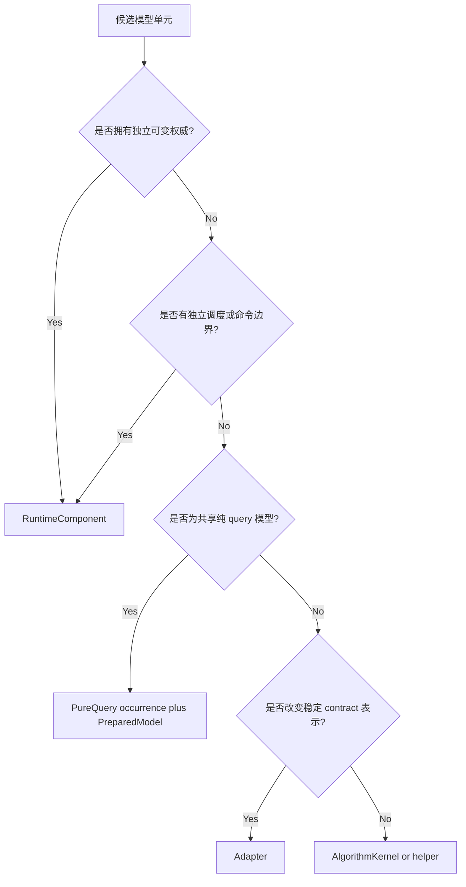
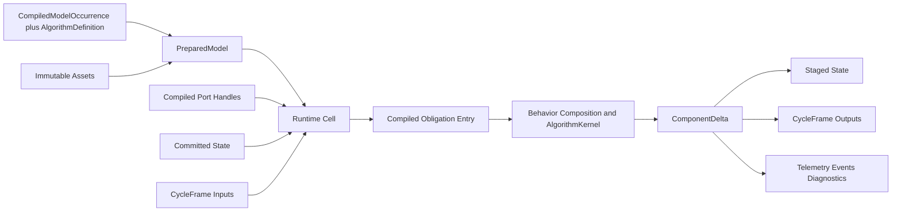
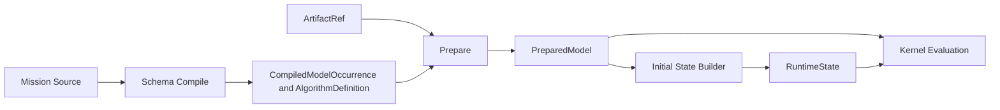

# 12｜运行对象模型与组件内部构成

[上一册：演进路线总览](11-roadmap-overview.md) · [返回总索引](README.md) · [下一册：行为组合、嵌入机制与共享权威](13-behavior-composition-and-extension-mechanisms.md)

**主线定位**：本册放大“模型、算法与资产怎样成为可编译供给”。它接收 03/04 的基础契约，定义 Definition、Occurrence、Recipe、AlgorithmKernel、State 与 Runtime Cell 的身份和 ownership，并把 descriptor/obligation 声明交给 05。

## 本册一口气读完：一个控制器怎样成为 Runtime Cell

`yyz.control.pitch_autopilot@3.0.0` 是 ModelDefinition；`occ:control` 是它在 `REF-YYZ-001` 中的 ModelOccurrenceId；Runtime Cell Recipe 组合纯 `PitchAutopilotKernel`、anti-windup mechanism、state fragments、typed ports 和 `SampledUpdate` obligation。Compiler 展开 recipe 后形成 RuntimeComponentDescriptor，Session 再为 occurrence 建立带 RuntimeInstanceId 的 Runtime Cell 和唯一 state block。

Kernel 接收 definition、current state、estimate、pitch command 与 workspace，返回 `ComponentDelta`；它不读取 JSON、Catalog、logger 或 filesystem。anti-windup 没有 RuntimeInstanceId，也没有独立调度。只有其状态需要跨组件共享或出现独立 clock/resource 时，设计才评估新的 Runtime Cell。[00A §2–§5](00a-yyz-end-to-end-walkthrough.md)展示 occurrence 到 step 的完整路径。

## 1. 本册结论

目标架构把“可在 Mission 中选择的模型”“参与 Session 的运行实体”和“执行数学计算的算法”分成三个层次。三者可以组合，身份与生命周期各自独立。

核心决策如下：

1. `ModelDefinition` 是 Catalog 中可选择、可配置、可版本化的模型单元。
2. `RuntimeComponent` 只授予拥有独立运行权威、调度边界或资源生命周期的模型。
3. `AlgorithmKernel` 只处理定义、当前状态与显式输入，返回下一状态、输出、遥测和事件。
4. 配置解析、名称绑定、节点注册、观测枚举和日志输出退出算法代码。
5. 所有影响未来模型结果、需要 reset/checkpoint/replay 的可变状态进入 Session 拥有的 `CommittedStateStore`，组件执行时只产生 `ComponentDelta`；外部资源句柄和纯性能 metrics 使用独立显式 owner。
6. 模型的领域 placement、execution form 与 execution obligations 分别描述领域归属、运行身份和时间/副作用语义；禁止继续用 `process/output/form` 推断调用方式。
7. 共享静态资产、准备结果和算法定义可跨 Session 复用；可变状态、随机游标和 workspace 按 Session 隔离。
8. 结构性代码由 Runtime Cell Recipe、`RuntimeCellProfile`、静态 descriptor 和编译后的 handle 承担；RuntimeCellProfile 在编译期展开为 obligations，Kernel 不依赖其名称。

这套对象模型是后续 Mission IR、Execution Plan、StepTransaction、Checkpoint、Python 环境和蓝图编辑器共同使用的词典。

## 2. 从源码得到的结构性证据

代表性源码暴露出同一根因：当前 `SimulationNode` 同时充当配置对象、依赖容器、调度参与者、算法对象、状态容器、输出 provider 和观测源。

### 2.1 结构代码压过模型代码

在 framework、YYZ 6DoF 项目和 CAVH 项目的代表性注册头中，大部分组件同时包含：

- `ConfigReader` 或手写 JSON 校验；
- lookup name 字符串；
- `bind()` 与裸指针成员；
- `initialize()`，其中大量实现通过伪造零步长 `update()` 建立初值；
- 原地修改成员的 `update()`；
- `IObservable` lambda 枚举；
- 注册宏和重复 role/phase 元数据。

这些代码把一个简单增益律扩展成完整节点类，也让复杂算法文件继续堆叠数百行结构职责。

### 2.2 定义、状态、结果和遥测混放

`cavh_glide_range_guidance.hpp` 同时保存配置参数、依赖、气动搜索方法、有限差分、公式分支、命令输出和大量仅供观测的中间量。`output_aerodynamics.hpp` 同时保存文件路径、查表资产、加载逻辑、查询算法、扰动、当前工况和可观测结果。

后果包括：

- 算法很难脱离 Session 做性质测试或 MATLAB/Python 对照；
- immutable 参数无法安全共享；
- 为增加一个观测字段而修改算法对象布局；
- prepare-time 计算与 step-time 计算混淆；
- 一个组件的复制语义、reset 语义和 checkpoint 范围无法判断。

### 2.3 运行边界被便利聚合放大

YYZ 的 `OnboardStateProcess` 只把 navigation、air data 和 phase 复制到一个新 struct。它没有新的物理权威，也没有独立算法语义，却引入新的调度顺序、状态副本、provider 接口和观测代码。

同类聚合应优先由编译器生成 `InputBundleView`。只有产生新的估计、融合结果、质量判定或独立权威时，聚合逻辑才形成运行组件。

### 2.4 查询接口存在隐藏写操作

`ForceMomentInteraction6Dof::computeYyzC6Input(...) const` 为支持观测写入 `mutable last_input_`。同一个 query 可能在 publish、RK 子步或调试查询中被调用，调用次数会改变被观测结果。

目标架构规定 query 纯读取；需要观测的结果由实际调用方显式返回到 telemetry 或 closure result。

### 2.5 role 无法表达执行形态

当前 `Output` 同时包含：

- 无状态气动查询；
- 有连续燃料状态的推进；
- 有离散内部状态的执行机构；
- 常量质量参数；
- 受构型事件影响的物理状态。

一个 `DiscretePhase::Output` 无法说明它是否有状态、是否能 query、输出对应哪个时间、失败能否回滚、能否加入连续闭合组。目标模型先用 execution form 区分 query、closure 与运行组件，再由 execution obligations 补齐 Session 调用、状态提交和外部效果语义。

## 3. 权威对象词典

### 3.1 `ModelDefinition`

Catalog 中的可选择模型定义，描述：

- 稳定模型 id 和版本；
- 配置 schema；
- 领域 placement 约束；
- 输入输出契约；
- execution form；若选择 RuntimeComponent，再包含 Runtime Cell Recipe identity 与可展开的 execution obligations；
- state、mode、telemetry 和 asset schema；
- factory 或 composition 入口；
- 适用域、成熟度和验证证据。

`ModelDefinition` 是编译期对象。它不持有某次 Session 的状态，也不保存 Mission 中的显示名称。

### 3.2 `CompiledModelOccurrence`

Mission Compiler 为 Source/IR 中每次模型选择生成一个不可变 occurrence：

```text
CompiledModelOccurrence {
  model_occurrence_id
  model_definition_ref
  scope / placement / subject_entity
  config_schema_id
  canonical_config_block
  typed_algorithm_definition_bundle
  asset_bindings
  source_ref
  occurrence_hash
}
```

`canonical_config_block` 是 schema-backed、可稳定序列化与 hash 的规范值；`typed_algorithm_definition_bundle` 是同一配置在进程内的 package-specific C++ 物化，包内 `FooDefinition` 表示某个 kernel 的 `AlgorithmDefinition`。Config builder 必须以 canonical block 为唯一输入确定性地产生 typed bundle，并通过 schema id/config hash conformance test 防止两份语义漂移。持久化 Execution Plan 保存 canonical block 和 implementation identity，装载时重建 typed bundle，不序列化 RTTI/STL 对象。

Mission 参数不会写回 Catalog ModelDefinition。CompiledModelOccurrence 也没有 RuntimeInstanceId、状态或 schedule entry；只有其 execution form 为 RuntimeComponent 时，Execution Plan 才从它派生运行实例。

### 3.3 `PreparedModel`

由 CompiledModelOccurrence、其中的 AlgorithmDefinition 与 immutable assets 经过 prepare 形成的只读运行模型，例如：

- 气动表的规范化网格和索引；
- 控制器离散化后的矩阵；
- 制导律使用的预计算包络；
- 地球模型常数和派生系数；
- 插值器所需的只读系数。

其 cache identity 只使用 [05 §17.2](05-component-catalog-and-mission-compiler.md#172-preparedmodelkey) 的 `PreparedModelKey`。通过验证后可以跨 Session 共享；source/display/occurrence id 不影响数值内容时不进入 key，但仍由 compiled handle 保留归因身份。

### 3.4 `RuntimeComponent` 与 Runtime Cell

`RuntimeComponent` 表示模型 occurrence 的独立运行边界及其 descriptor 语义。ExecutionPlanDescriptor 为它分配 plan-local RuntimeInstanceId、state/port handles 和 obligation callsites。Session 再把该计划槽物化为 Runtime Cell，完整 cell identity 为 `(SessionId, RuntimeInstanceId)`。

Runtime Cell 由 compiled obligation entries、handles、prepared model、state block access 和可选 resource lease 组合而成。它只是 RuntimeComponent 的 Session 实例称谓，不形成额外的模型分类。

Runtime Cell 负责：

- 在计划指定的时刻被调用；
- 读取自己的 committed state 与被授权的 CycleFrame 输入；
- 调用一个或少量内聚 kernel；
- 返回 `ComponentDelta`；
- 接受 Session 对 descriptor 已声明的 reset、checkpoint 和 finalize lifecycle 管理。

它不解析 JSON，不按名称查依赖，不直接写其他组件状态，也不自行决定记录后端。

### 3.5 `AlgorithmKernel`

表达一段可测试的模型计算。典型概念签名：

```text
evaluate(
    prepared_model,
    current_state,
    typed_input,
    step_info,
    workspace
) -> Outcome<AlgorithmResult>
```

`AlgorithmResult` 包含：

```text
instant_patches[] // InstantPatch；无即时状态变化时为空
interval_candidates[] // IntervalCandidate；无区间状态演化时为空
outputs[]         // 本次调用产生的 typed value，尚未绑定 runtime slot
telemetry         // 中间量与解释信息
events[]          // 已发生事实
diagnostic_drafts // 数值或领域问题
```

kernel 可以是无状态函数、带显式状态的 reducer、连续导数 evaluator 或纯 query evaluator。它不会获得 registry、logger、ConfigNode、文件系统或任意 service bag。

### 3.6 `RuntimeState`

某个 Session 中可随仿真推进变化、需要 reset/checkpoint/replay 的最小权威值。示例：

- PID 积分项和滤波状态；
- 导航滤波器状态与协方差；
- 指导阶段和进入时刻；
- 执行机构位置、速度与故障锁存；
- 剩余燃料和质量积分状态；
- RNG 游标和 dropout 计数；
- 外部输入源的 replay cursor、已消费 sequence 和质量水位。

所有 `RuntimeState` 都有 schema、owner、初始化函数和 invariant。Session 的 `CommittedStateStore` 只保存权威 committed blocks；`StepTransaction` 保存 instant/interval/continuous candidate buffers，避免形成可被任意组件读取的全局 staged state。

### 3.7 `PublishedOutput`

组件向其他组件公开的当周期值。它存放在 CycleFrame 的 typed slot 中，带 producer、sample/effective time、sequence、quality 和 temporal relation。

“最后一次输出”只有在跨周期 hold 契约要求时才进入 committed output store。算法无需再用同名成员保留一份观测副本。

### 3.8 `Telemetry`

解释一次算法求值的中间结果，例如 L/D 极值、保护分母、误差项、饱和标志、迭代次数。Telemetry 有静态 schema，由 `AlgorithmResult` 产生，由 ObservationPlan 选择。

Telemetry 不参与下游物理决策。若下游组件需要读取某个量，该量必须提升为正式 output contract。

### 3.9 `Workspace`

热路径临时内存和求解器 scratch。其存储由 Session 或 integration scope 独占并可跨调用复用；其中的内容和 view 只在一次 invocation 内有效，下次调用可以覆盖。Workspace 不承载语义状态，不进入 checkpoint、telemetry 或端口。

### 3.10 `PureQueryDescriptor` execution form

由 Mission 选择和配置、运行时只提供纯 query 的模型，例如只读大气、重力、气动系数表或坐标变换服务。该 model occurrence 的 `ModelDefinition.execution_form` 为 `PureQueryDescriptor`，运行期只持有 `PreparedModel` 与 compiled query handle，不建立 `RuntimeComponent`。

若查询模型拥有时间演化状态、外部采样队列或独立失效模式，它升级为 `RuntimeComponent`，通过 sampled output 提供查询所需快照。

### 3.11 `Adapter`

显式改变 contract 表示的纯转换单元，例如 frame、unit、版本或速率适配。Adapter 可在编译期折叠为 handle 链，也可因独立速率或状态形成 RuntimeComponent。它必须声明误差、时效和有效域。

### 3.12 `Asset`

带 schema、hash 和谱系的只读数据产品。文件路径只属于 source/Artifact adapter；运行模型使用 typed asset handle。

## 4. 模型单元与运行组件的判定

一个模型满足以下任一条件时，建立独立 `RuntimeComponent`：

1. 拥有需要独立 reset/checkpoint 的可变权威状态；
2. 拥有独立采样率、clock domain、deadline 或触发条件；
3. 具有独立命令 DecisionAuthority、跨调用保持的 failure mode 或终止责任；
4. 作为多个消费者共同依赖的权威状态发布者；
5. 生命周期中持有不可并入 owner 的外部运行资源。

下列情形优先留在 component 内部：

- 只被一个组件使用的纯数学函数；
- 仅为代码复用存在的 helper；
- 无新语义的 struct 拼装；
- 只为观测保存的中间值；
- 同一一致性边界内的局部状态机；
- 只依赖 immutable asset 的查表核；
- 与 owner 同频、同失败域、同生命周期的子算法。

判定顺序：



Mission 独立选择、替换或配置只会建立独立 CompiledModelOccurrence，不自动产生 RuntimeComponent。若模型没有上述五类运行语义，它应采用 PureQuery/Closure execution form，或作为 owner occurrence 的嵌套 AlgorithmKernel/Adapter。

## 5. 三步分类与编译降级

### 5.1 领域 placement 轴

placement 回答“这项权威在 GNC 领域中属于哪里”：

| Placement | 典型权威 |
| --- | --- |
| `mission.process` | 多飞行器协调、任务阶段、交战规则 |
| `environment` | 世界模型或随时间发布的环境状态 |
| `vehicle.perturbation` | case 物化后的飞行器拉偏状态 |
| `vehicle.input` | 传感、测量、输入链路 |
| `vehicle.process` | 导航、制导、控制、估计、局部协调 |
| `vehicle.output` | 执行机构、推进、质量、构型等物理能力 |
| `vehicle.form` | 连续运动状态及导数方程 |
| `interaction/closure` | form 输入的物理闭合定义 |
| `evaluation` | 约束、终止、在线指标 |

### 5.2 execution form 轴

execution form 先回答“模型由哪个计划持有、是否进入 Session 实例表”：

| Execution form | Session identity | 调用者 | 典型例子 |
| --- | --- | --- | --- |
| `PureQueryDescriptor` | 无 | QueryPlan/compiled query handle | 大气、重力、静态气动表 |
| `ClosureDescriptor` | 无 | ClosurePlan/IntegrationScopePlan | force-moment closure、candidate-state coupling |
| `RuntimeComponentDescriptor` | 有 | Schedule/Lifecycle/Transaction | 导航、制导、控制、StateOwner、DecisionAuthority、外部 source/sink |

该字段是封闭 tagged union。Compiler 只为 `RuntimeComponentDescriptor` 分配 instance id、state/output handles、lifecycle entry 与 schedule entry。PureQuery/Closure 只绑定 immutable PreparedModel、纯 kernel、workspace layout 和调用契约。

### 5.3 Execution obligation 轴

obligation 回答“Session 在哪个时间边界调用什么，以及结果可以产生哪类影响”：

| Execution obligation | 时间边界 | 允许结果 |
| --- | --- | --- |
| `PublishProjection` | committed boundary | truth/view/sample projection |
| `BoundaryEvaluation` | publish 后的 DAG region | output、instant delta、event、diagnostic |
| `IntervalEvolution` | `[t_k,t_{k+1}]` region | interval candidate/model write |
| `DerivativeEvaluation` | IntegrationScopePlan/SolverIslandPlan candidate stage | derivative/closure outcome |
| `SourceFreeze` | safe point | frozen input + cursor candidate |
| `PostCommitEffect` | ModelCommit 后 | external effect receipt/outcome |
| `ResourceLease` | session/run lifecycle | acquire/rollback/close action |

`SampledTransform`、`DiscreteStateProcessor`、`ContinuousStateOwner`、`Coordinator`、`Evaluator` 和 `ExternalEndpoint` 保留为 model SDK 的常用 `RuntimeCellProfile`。RuntimeCellProfile 只是 Runtime Cell Recipe 的便捷组合，Compiler 将其展开为 state schema、ports 和 obligation entries；Kernel 不保存封闭枚举，也不按名称分派。

一个 `vehicle.output` 模型可以采用 PureQuery execution form，也可以形成声明多个 obligations 的 RuntimeComponent。`interaction/closure` 通常采用 Closure form。Compiler 分别检查 placement policy、execution form、obligation combination、owner 和 temporal contract。

## 6. RuntimeComponent 的固定内部构成



每个 runtime cell 只保存：

- instance identity；
- `shared_ptr<const PreparedModel>` 或等价只读 handle；
- compiled input/output/state handles，以及 descriptor 授权的 BoundQueryHandle set；
- kernel 值或只读函数表；
- obligation entries 所需的固定 workspace handle；
- resource owner（仅声明 ResourceLease/ExternalEndpoint RuntimeCellProfile 时需要）。

它不保存 lookup name、ConfigNode、source path、观察 getter、任意 provider 裸指针集合或自由文本 logger。

## 7. 算法包的六件套

每个可独立测试的算法采用下列构成，空项可以省略：

| 对象 | 内容 | 可变性 |
| --- | --- | --- |
| `AlgorithmDefinition` | 参数、选择的公式、限制、数值策略引用 | immutable |
| `State` | 积分项、滤波器、mode、历史、RNG cursor | Session mutable |
| `Input` | 本次求值所需的最小 typed view | call-local read-only |
| `Output` | 下游正式消费的 typed contract | result value |
| `Telemetry` | 解释、中间量、饱和和迭代信息 | result value |
| `Kernel` | validation-independent numerical/domain computation | stateless code |

可选补充：

- `prepare(compiled_occurrence, assets, policy) -> PreparedModel`；
- `initialState(prepared, initial_conditions, random_stream) -> State`；
- `validateDefinition(...) -> DiagnosticSet`；
- Runtime Cell Recipe、embedded mechanism definitions/state fragments 与 owner reducer；
- `StateSchema/OutputSchema/TelemetrySchema`；
- 独立 reference oracle 与 verification cases。

算法作者应能在无 Mission、无 Session、无 JSON 的测试中直接构造 AlgorithmDefinition/Input/State 并调用 Kernel。

## 8. `ComponentDelta` 与无原地写约束

概念结构：

```text
ComponentDelta {
  owner_cell_ref { session_id, runtime_instance_id }
  run_id
  base_state_epoch
  invocation_id
  instant_state_patches[]
  interval_state_candidates[]
  sampled_output_writes[]
  interval_model_writes[]
  emitted_events[]
  staged_command_application_receipts[]
  telemetry_records[]
  diagnostic_drafts[]
}
```

`runtime_instance_id` 在单个 plan 内定位 cell slot，`session_id` 把该 slot 绑定到具体 Session；`run_id` 再定位这次调用所属的 run。Session 内部可用紧凑 slot handle，跨边界记录必须展开为上述稳定引用。

目标 v1 的 `InstantPatch` 与 `IntervalCandidate` 都携带一个 owner state block 的完整 typed replacement，不采用任意字段地址或反射式 byte patch：

```text
StateReplacement {
  state_block_handle { block_index, schema_hash, owner_runtime_instance_id }
  commit_class       // InstantAtTk | IntervalAtTk1
  base_state_epoch
  predecessor_instant_id? // interval candidate 依据 staged instant state 时必需
  typed_value_box
}
```

`ExecutionPlanImage` 为每种 block 提供 `StateCodecEntry{size, alignment, clone, noexcept_swap, validate, encode, decode, project}`；Session 为每个 cell 分配独立 committed box，StepTransaction 只为被写 block 建立 candidate box。全部 clone/validate 在 commit 前完成，ModelCommit 只执行 `noexcept_swap` 并最后发布新 epoch。若同一 block 同时有 instant 与 interval 变化，owner reducer 先形成 post-instant replacement，再以它为基线形成 interval replacement；terminal branch 只提交前者。未来只有性能证据充分时才增加生成式 field-diff codec，语义仍保持完整 replacement 等价。

AlgorithmResult 仍使用算法自己的 typed State/Output；recipe 生成或手写的 obligation entry 按 descriptor 把 result 组装为带 state/slot handle 的 ComponentDelta。连续状态 candidate 由 integration coordinator 写入 IntegrationScopePlan candidate set，不混入离散组件 delta。

约束：

1. kernel 求值期间 committed state 保持只读；
2. delta 只能引用 descriptor 声明过的 state/output/event id；
3. Session 校验 delta 后才写入当前 StepTransaction 的 owner-scoped candidate buffer；
4. downstream 读取已发布的 output slot，无法读取其他组件 staged state；
5. 任一失败导致本步 staged state 和 output 一同丢弃；
6. telemetry 与 output 分离，观测选择不会改变物理图；
7. `initialize()` 使用独立 initial-state builder，不再伪造 `update({0,0,0})`。

## 9. Execution form 与常用 `RuntimeCellProfile`

PureQuery/Closure 是没有 RuntimeInstanceId 的 execution form。9.3–9.9 是 model SDK 的 RuntimeCellProfile，用于快速构造 RuntimeCellRecipe；它们不形成 Kernel 类型层次。package 可以组合 obligations 建立更窄 RuntimeCellProfile，只要通过 Compiler 的 owner、time、effect 和 lifecycle 校验。

### 9.1 `PureQueryDescriptor`

```text
query(prepared_model, query_input, workspace?)
  -> QueryOutcome<response, telemetry>
```

Descriptor 中的 `QueryHandleSpec` 保存 ModelOccurrenceId、contract ids 与 workspace layout；ExecutionPlanImage 的 `LinkedQueryEntry` 保存已解析 kernel entry；SessionRuntimeBindings 在 Model prepare 后把两者与 immutable PreparedModel ref 组合为 `BoundQueryHandle`。调用方另传 sample/query time 和 subject；diagnostic/telemetry 由 caller 使用 occurrence id 与 invocation id 归因。共享 PreparedModel 不合并 Mission occurrence 身份。

- 无 Session 可变状态；
- 无 scheduled update；
- 无隐藏 cache 写入；
- query operating point 全部显式；
- 首版只允许 prepare-time immutable cache；运行时 memoization 需要独立 cache contract、线程/内存预算和 ADR，不能藏在 query object 内。

### 9.2 `ClosureDescriptor`

```text
evaluateClosure(
    prepared_model,
    closure_input,
    candidate_context?,
    workspace
) -> ClosureOutcome<form_input_or_residual, telemetry>
```

Closure 使用同一三级结构：`ClosureHandleSpec`、Image 内 `LinkedClosureEntry`、Session 内 `BoundClosureHandle`。Bound handle 才持有 PreparedModel ref；ClosurePlan/IntegrationScopePlan 提供 invocation context。三者都沿用 ModelOccurrenceId，不生成 RuntimeInstanceId。

- 无 Session identity、state block 和 scheduled invocation；
- 只由 `ClosurePlan` 或 `IntegrationScopePlan` 调用；
- descriptor 声明 FrozenInterval、CandidateState 或 AlgebraicSolve 适用性；
- 输入显式携带 sample/candidate time、configuration revision 与有效域信息；
- 不能读取 RuntimeCell、mutable CycleFrame writer 或任意 provider registry；
- 求值次数只影响统计，不改变物理状态与 published observation。

### 9.3 RuntimeCellProfile：`SampledTransform`

```text
evaluate(prepared_model, input_frame, sample_context)
  -> Outcome<output, telemetry, events>
```

- 无 state block；
- 未到执行 tick 时由 temporal contract 决定 hold/unavailable；
- 适合无状态导航变换、增益律和显式 adapter。

### 9.4 RuntimeCellProfile：`DiscreteStateProcessor`

```text
evaluate(prepared_model, current_state, input_frame, step_context)
  -> Outcome<state_effects, output, telemetry, events>
```

- state effect 使用完整 owner-block typed replacement，并由 descriptor 声明 Instant/Interval commit class；
- 输出的 sample/effective time 由 definition 声明；
- mode state、滤波器、计数器和 RNG cursor 一并进入 state；
- reset/checkpoint 由 state schema 自动覆盖。

### 9.5 RuntimeCellProfile：`ContinuousStateOwner`

分成三项能力：

```text
projectTruth(committed_state, publish_context) -> TruthOutput
evaluateDerivative(candidate_state, closure_view, time) -> DerivativeOutcome
projectState(candidate_or_committed_state) -> StateProjection
```

状态布局由 `StateSchema` 编译为 offset。未知字段访问产生编译或查询诊断，禁止回退为零。

### 9.6 ContinuousStateOwner 的 AtGrid 组合

需要 mode 与连续状态协作时，在同一 Runtime Cell Recipe 中为 `ContinuousStateOwner` 组合：

- mode state；
- AtGrid event predicate；
- 网格点 jump/reinitialization reducer；
- transition guard；
- 离散 transition policy。

连续导数、AtGrid transition 和 jump/reinitialization reducer 各自独立求值。这组能力不形成新的 RuntimeCellProfile。目标 v1 只在 committed grid safe point 提交 transition；积分器发现的 ContinuousLocated estimate 只能进入 telemetry/diagnostic，不能触发 reducer 或局部时间提交。后续版本若引入 SegmentTransaction，再扩展 continuous event descriptor、jump observation 与剩余区间重积分契约。

### 9.7 RuntimeCellProfile：`Coordinator`

Coordinator RuntimeCellProfile 在 DiscreteStateProcessor recipe 上增加共享 DecisionAuthority 约束：

- output 是 typed snapshot，而非字符串广播；
- 每次 transition 产生稳定 transition event；
- 多 command 冲突有显式 DecisionAuthority/priority policy；
- 只管理一个内聚的共享概念，禁止演变成全局任务大状态机。

### 9.8 RuntimeCellProfile：`Evaluator`

Evaluator 读取 CycleFrame，产生 `EvaluationResult`、metrics、termination decision 或 event。它不修改被评价对象。需要累积窗口时拥有自己的离散 state。

### 9.9 RuntimeCellProfile：`ExternalEndpoint`

一个 ExternalEndpoint 只拥有一个外部资源生命周期，并通过两个互相独立的窄 facet 声明能力。source-only、effect-only endpoint 无需实现另一侧接口。

```text
freezeInputAtSafePoint(
    resource_handle,
    committed_source_state,
    cutoff
) -> ExternalInputFreezeOutcome {
       frozen_batch,
       source_state_candidate,
       events,
       telemetry,
       diagnostic_drafts
     }

onInputModelCommit(frozen_batch, committed_state_epoch) -> ExternalAckOutcome
onInputRollback(frozen_batch) -> CleanupOutcome

stageEffect(step_outcome_draft) -> StagedExternalEffect
commitEffectAfterModel(staged_effect, committed_state_epoch) -> ExternalEffectOutcome
onEffectRollback(staged_effect) -> CleanupOutcome
```

- socket、进程句柄和纯 transport metrics 由 cell resource owner 持有；它们不得被模型 kernel 读取；
- 已消费 sequence、replay cursor、去重水位和任何影响下一批 payload/quality 的状态进入 `SourceRuntimeState`，随 ModelCommit 提交；
- 当前 step 只消费 safe point 已复制并冻结的 batch，外部线程不能直接写 CycleFrame；rollback 不推进 source cursor；
- session-scoped transport 由 InstanceResourcePrepareHook 建立；binding/checkpoint-specific stream、subscription 和 replay cursor 由 RunResourceOpenHook 建立并以 lease 管理；
- 连接变化若会影响物理输入，必须形成显式 sample quality/event 并进入记录；replay 由已记录 input stream 驱动；
- 外部效果先 stage，ModelCommit 后经独立 `ExternalEffectCommit` 执行；失败写入 ExternalEffectOutcome/RunOutcome，不伪造模型回滚；
- 支持 checkpoint 的 effect facet 必须提供 stable effect id、ack/idempotency receipt 与 quiescence hook；无法证明时 descriptor 声明 NonRestorable；
- 每个 adapter 声明阻塞、线程、超时、重连、丢弃和背压策略。

## 10. 变量归属矩阵

| 当前常见变量 | 目标归属 | 原因 |
| --- | --- | --- |
| JSON 字段、lookup name | Mission Source / BindingIntent | 只服务作者输入与解析 |
| occurrence 归一化配置 | CompiledModelOccurrence | 保留 source/placement/config identity |
| kernel 参数与公式选择 | AlgorithmDefinition | 可 hash、共享、直接单测 |
| 已加载原始表 | Asset | 有 schema、hash、谱系 |
| 插值网格、索引、预计算系数 | PreparedModel | prepare 后只读共享 |
| PID 积分项、滤波状态 | RuntimeState | reset/checkpoint 必需 |
| 当前 mode、进入时刻 | RuntimeState.ModeState | 决定未来行为 |
| 燃料质量、执行机构位置 | RuntimeState | 物理权威状态 |
| 当前端口输出 | CycleFrame output slot | 下游读取的正式值 |
| 跨周期 hold 值 | CommittedOutputStore | temporal contract 要求 |
| 算法中间项 | Telemetry | 解释求值，无物理写权限 |
| 临时矩阵、搜索数组 | Workspace | 调用后失效 |
| provider 裸指针 | compiled PortHandle | 由 Execution Plan 建立 |
| `mutable last_input_` | 删除；调用结果进入 telemetry/output | query 保持纯读取 |
| 随机数发生器内部状态 | RuntimeState.RandomCursor | 可重放、可 checkpoint |
| 纯性能计数 | RuntimeMetrics | 不影响物理状态 |
| debounce/hysteresis 计数 | RuntimeState | 会影响未来 transition |
| 错误字符串 | DiagnosticDraft 参数 | 文案由外层渲染 |
| 文件路径 | SourceRef / AssetRef | 热路径不接触路径 |
| UI 选择与布局 | Frontend project | 不进入物理 plan hash |

判断一个成员是否属于 State：若它改变下一次相同输入下的结果，它通常属于 State；若它只解释刚才的计算，它属于 Telemetry；若它只节省分配，它属于 Workspace。

## 11. 函数归属矩阵

| 函数职责 | 目标对象 |
| --- | --- |
| JSON parse、include、类型检查 | Mission syntax/compiler |
| schema 默认值展开与 source map | Mission compiler |
| 模型参数物理校验 | Definition validator |
| 文件装载、hash、格式转换 | Asset adapter / prepare task |
| 查表索引预计算 | PreparedModel builder |
| 导航、制导、控制公式 | AlgorithmKernel |
| 求根、优化、插值 | foundation numerical kernel |
| mode guard 与 transition 选择 | Mode transition evaluator |
| enter/exit 后的领域状态更新 | owner algorithm transition reducer |
| 命令组装 | Algorithm output mapper |
| frame/unit 转换 | explicit Adapter |
| 依赖选择与基数检查 | Mission compiler |
| 每步调用排序 | Schedule compiler/runtime scheduler |
| state delta 暂存与 commit set | StepTransaction |
| committed state 存储与只读 view | CommittedStateStore |
| observation field 投影 | compiled ObservationPlan |
| 注册和 catalog metadata | package contribution/descriptor |
| 日志与文案格式化 | Diagnostic consumer adapter |
| CSV/Parquet 写入 | Record sink adapter |
| 外部工具启动 | Workflow ToolAdapter |

## 12. 配置、准备与运行的硬边界



### 12.1 compile-time

- 解析 JSON 和 include；
- 展开默认值与单位；
- 校验字段、条件和 placement；
- 解析 port 和 asset 引用；
- 固化 CompiledModelOccurrence 与 package-specific AlgorithmDefinition。

### 12.2 prepare-time

- 读取 Artifact；
- 校验数据域、schema 和 hash；
- 建立插值器、矩阵分解和只读索引；
- 运行可缓存的预计算；
- 输出 immutable PreparedModel。

### 12.3 initialize-time

- 根据授权的 typed RunBinding view 建立 RuntimeState；
- 分配独占 workspace；
- 派生 RNG 子流；
- 建立 committed output 初值；
- 校验初始 invariant。

### 12.4 step-time

- 只读取 compiled handle、prepared model、committed state 和 CycleFrame；
- 不做 schema 解析、文件 I/O、字符串查找、catalog 查询和日志格式化；
- 返回 delta，由 Session 统一校验和提交。

### 12.5 runtime tuning

AlgorithmDefinition、CompiledModelOccurrence 和 PreparedModel 始终 immutable。允许热调的 ModelDefinition 必须声明：

```text
TunableParameterDescriptor {
  parameter_id
  value_type / unit / range
  decision_authority_id
  effective_point
  update_class: DirectState | TypedReducer | PlanStructural
  audit_and_observation_fields
}

ParameterState {
  revision
  current_values_or_derived_block
  last_command_id
  effective_tick
}
```

`DirectState` 适合增益、阈值和限幅等可直接进入 RuntimeState 的值。`TypedReducer` 由模型提供纯 `ParameterUpdateReducer`，把 command 与 committed ParameterState 转成携带完整 ParameterState replacement 的 InstantPatch、ParameterChangedEvent、CommandApplicationReceipt 和 telemetry；派生矩阵也放在该 owner 的 RuntimeState 中。`PlanStructural` 覆盖资产、端口、state layout、算法公式、数值策略与任何需要重建 PreparedModel 的变化，Session 必须拒绝热调并要求重新编译/创建 Session。

kernel 读取由 immutable AlgorithmDefinition 与 committed ParameterState 组成的 `EffectiveParameterView`。全局 tuning policy 只能校验 DecisionAuthority、范围和生效时刻，不能修改 AlgorithmDefinition、CompiledModelOccurrence、PreparedModel 或 state。多个组件确需共享同一可调量时，由窄职责 Parameter StateOwner cell 拥有 ParameterState 并发布 typed ParameterSnapshot；各组件不得保存私有副本。所有成功更新随 ModelCommit 递增 state_epoch，并进入 checkpoint、replay、Observation 和 Run Manifest。

## 13. Observation 从对象内部退出

目标 Observation source 有四类：

| Source | 读取位置 | 例子 |
| --- | --- | --- |
| committed state field | StateSchema + handle | 质量、积分项、mode |
| published output field | OutputSchema + CycleFrame slot | command、estimate、force |
| invocation telemetry field | AlgorithmResult | 误差、饱和、L/D 搜索结果 |
| event/diagnostic field | StepTransaction journal | transition、domain violation |

`ObservationPlan` 在编译期把 FieldId 解析为固定 projector。组件不实现 `getObservableFields()`，算法也不保存只供 getter 使用的成员。

某个中间量被选中记录时，kernel 始终按其 descriptor 决定是否计算：

- 计算本来就是算法必需项：直接写 telemetry；
- 计算代价较高且只供调试：由 `TelemetryLevel` 编译成 kernel policy；
- 计算会改变物理路径：该量必须进入正式算法定义，不能由观测开关控制。

## 14. 结构性代码的收敛方式

目标不采用一个涵盖全部行为的巨型 `GenericComponent<T...>`。QueryPlan 与 ClosurePlan 各自持有纯模型；RuntimeComponent 由 Runtime Cell Recipe 组合 behavior，并由 Compiler 展开成少量 execution obligations。RuntimeCellProfile 减少样板，领域差异保留在 typed composition 中，Kernel API 不随其数量增长。

### 14.1 静态 descriptor

每个模型定义提供一份可离线导出的 descriptor，作为下列信息的单一来源：

- identity/version；
- placement/execution form/execution obligations，以及可选 RuntimeCellProfile provenance；
- config schema；
- ports；
- state/output/telemetry schema；
- behavior recipe 与 embedded mechanism descriptors；
- asset requirements；
- algorithm factory/composition；
- maturity/evidence。

C++ package contribution、Catalog JSON、文档表和蓝图 socket 从 descriptor 生成或校验，避免注册宏、文档和代码分别维护一份。

### 14.2 typed composition

项目侧概念写法：

```text
GuidanceComponent = RuntimeCellRecipe(
    runtime_cell_profile = discrete_state_processor,
    definition = GlideGuidanceDefinition,
    state = GlideGuidanceState,
    input = GlideGuidanceInput,
    output = GuidanceCommand,
    telemetry = GlideGuidanceTelemetry,
    kernel = GlideGuidanceKernel,
    mechanisms = [guidance_phase, command_limiter],
    obligations = [BoundaryEvaluation],
    descriptor = glide_guidance_descriptor
)
```

实现可以采用显式类、窄模板或生成代码。架构要求固定对象关系与测试契约，不强制某一种 C++ 元编程风格。

### 14.3 生成边界

适合生成：

- schema 常量和 field ids；
- catalog contribution；
- typed port/state handles；
- observation projector；
- 文档骨架与 Mission 配置提示。

保持手写：

- 物理与算法公式；
- 模型特有 invariant；
- mechanism guards、协议和 owner reducer；
- prepare-time 数据转换；
- 验证 oracle 与适用域说明。

## 15. 目标源码布局

目录名是目标职责定位，可在单次重构分支内直接建立：

```text
framework/
  include/gnc/
    model/
      definition.hpp
      execution_form.hpp
      prepared_model.hpp
      algorithm_result.hpp
      query_outcome.hpp
      query_descriptor.hpp
      closure_descriptor.hpp
    model_sdk/
      descriptor.hpp
      runtime_cell_recipe.hpp
      execution_obligation.hpp
      profiles/
        sampled_transform.hpp
        discrete_state_processor.hpp
        continuous_state_owner.hpp
        coordinator.hpp
        evaluator.hpp
        external_endpoint.hpp
      behavior/
        state_fragment.hpp
        mode_graph.hpp
        conditioning.hpp
        fault_latch.hpp
      state_schema.hpp
      port_schema.hpp
      telemetry_schema.hpp
    runtime/
      state_store.hpp
      output_store.hpp
      cycle_frame.hpp
      component_delta.hpp
      step_transaction.hpp
      schedule_executor.hpp
      continuous_closure.hpp
    mission/
      ir/
      compiler/
      execution_plan/

packages/
  builtin-6dof/
    contracts/
    algorithms/
    components/
    assets/
    package_manifest.json

user/<project>/
  contracts/
  algorithms/
    <algorithm>/
      definition.hpp
      state.hpp
      input.hpp
      output.hpp
      telemetry.hpp
      kernel.hpp
      behavior_recipe.hpp  # 需要时
  components/
    <component>_definition.hpp
  assets/
  config/
  verification/
```

`components/` 只保留组合、descriptor 和项目 placement 选择。复杂公式进入 `algorithms/`，跨组件 contract 进入 `contracts/`，数据产品进入 `assets/`。

## 16. 现有代表对象的目标落位

| 当前对象 | 目标拆分 |
| --- | --- |
| `GuidanceProcess` | DiscreteStateProcessor RuntimeCellProfile recipe + Guidance Definition/State/Input/Output/Telemetry/Kernel |
| `GlideRangeGuidance` | runtime guidance kernel + prepare-time AeroEnvelope builder + numerical derivative helper + typed telemetry |
| `SequencerProcess` | 局部时成为宿主 behavior mechanism；跨组件共享时成为 FlightPhaseDecisionCell，内部使用 mode/protocol mechanism |
| `OnboardStateProcess` | 优先删除，改为 compiled InputBundleView；存在融合/health 权威时改为 OnboardStateEstimator |
| `ActuatorOutput` | 由 BoundaryEvaluation/IntervalEvolution/DerivativeEvaluation obligations 组合；limit mechanism、dynamics kernel 与 actuator state 分离 |
| `PropulsionOutput` | Prepared propulsion model + PropulsionState owner + typed enable/config command |
| `MassPropertiesOutput` | MassState owner + MassProperties projection + burn/separation transition reducer |
| `AerodynamicsOutput` | Aero Asset + PreparedAeroModel + pure AeroQuery；有滞后/热状态时增加独立 state owner |
| `ForceMomentInteraction6Dof` | pure ClosureKernel，进入 IntegrationScopePlan；结果直接进入 closure telemetry |
| `RigidBody6Dof` | ContinuousStateOwner RuntimeCellProfile recipe + StateSchema + truth projector + derivative kernel |
| `IObservable` lambdas | ObservationPlan projector |
| lookup name + provider pointer | BindingIntent + compiled PortHandle |
| registration macro | package descriptor contribution |

## 17. 对 SOLID 的具体约束

### SRP

- Definition 因参数语义变化而变；
- Kernel 因算法变化而变；
- State schema 因记忆语义变化而变；
- Component descriptor 因装配契约变化而变；
- obligation/region contract 只因通用时间、原子性或副作用语义变化而变；
- RuntimeCellProfile/recipe 因常见组合方式变化而变。

### OCP

新增制导律通常增加 Definition/Kernel/recipe，Session、Scheduler 和 Observation 代码保持不动。新增常见组合只增加 RuntimeCellProfile；新增执行语义需要先证明现有 obligations/regions 无法表达，再通过 ADR 扩充 `KernelCapability`。

### LSP

替换模型需要同时满足 port contract、time semantics、state/reset 声明、valid domain 和 maturity policy。共同继承某个 C++ 接口只构成实现条件。

### ISP

kernel 输入由该算法实际消费的字段组成。禁止为便利把整个 vehicle context、registry 或万能 onboard state 注入算法。

### DIP

算法依赖 typed domain input 和 pure query contract。配置、文件、日志、Mission、Session 与前端都处于算法外侧。

## 18. 架构守卫

首个目标版本需要自动检查：

- component kernel include graph 中无 ConfigNode、AssemblyContext、NodeRegistry、logger、filesystem；
- runtime component 无 lookup name 字符串成员；
- query contract 的实现无可观察写副作用；
- state schema 覆盖全部影响未来结果的成员；
- workspace 和 telemetry 字段未进入 checkpoint；
- output contract 与 telemetry contract 不交叉绑定；
- initialize path 不调用 scheduled update；
- RuntimeComponentDescriptor、recipe 与 package contribution 只有一个元数据来源；
- Kernel 不按 RuntimeCellProfile、placement 或领域 role 分派；
- Mission 编译后运行热路径无字符串 provider 查找；
- 同一 prepared model 可被两个 Session 共享且状态完全隔离。

## 19. 完成定义

本对象模型达到可实施状态时，应满足：

1. 任意新增变量都能按本册矩阵确定唯一 owner。
2. 任意新增函数都能确定属于 compiler、prepare、kernel、transition、runtime 或 adapter。
3. 每个现有注册模型都完成 placement × execution form 分类；所有 RuntimeComponent 再声明 StateOwner、execution obligations 与可选 RuntimeCellProfile。
4. 选定的 6DoF 纵向案例中，算法文件不包含 JSON、绑定、注册和观测枚举代码。
5. 算法可在无 Session 测试中直接求值，成功、失败与 telemetry 都可验证。
6. RuntimeState 可完整 reset/checkpoint，PreparedModel 可跨 Session 共享。
7. 纯 query 的调用次数不会改变模型状态或观测结果。
8. 编译后的 port/state/output handle 成为热路径唯一访问方式。
9. ObservationPlan 能读取 state、output、telemetry 和 event，无需组件 getter lambda。
10. 旧 `SimulationNode + ConfigReader + bind + update + IObservable + registration macro` 结构从目标运行路径整体移除。
