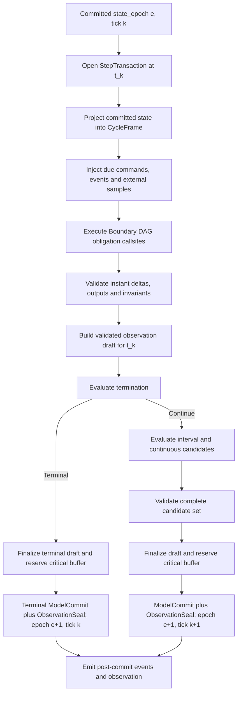

# 14｜周期数据流、状态事务与连续闭合

[上一册：行为组合、嵌入机制与共享权威](13-behavior-composition-and-extension-mechanisms.md) · [返回总索引](README.md) · [下一册：纵向参考设计与对象落位](15-reference-vertical-designs-and-object-placement.md)

**主线定位**：本册放大单个 committed step。它消费 05 编译出的 port、region、solver 与 transaction plans，规定 `t_k` 发布态怎样经过候选求值、连续闭合、校验和原子提交形成 `t_{k+1}`，随后把 commit-linked Observation 交给证据边界。

## 本册一口气读完：`tick=2500` 的整步事务

`REF-YYZ-001` 在 `t_k=25.00 s` 从 epoch 2500 committed state 建立发布视图。BoundaryDagPlan 调用 navigation、guidance、control 与 plant-output；`IntegrationScopePlan scope:yyz-rigid-body` 使用 FrozenInterval closure 和 RK4 计算连续候选；StepJournal 收集 owner patches、held outputs、events 和 observation draft。验证通过后一次 Commit 生成 epoch 2501，随后 ObservationSeal 绑定同一 commit。

若任何导数为非有限值，Validate 拒绝整份 journal，所有 `InstantPatch` 与 `IntervalCandidate` 一起回滚。`SolverIslandPlan` 只在 scope 内需要联立 residual 求解时出现；普通 YYZ fixture 没有该子计划。完整时序与数值见 [00A §5–§6](00a-yyz-end-to-end-walkthrough.md)。

## 1. 本册结论

目标运行时采用编译后的 typed dataflow 和整步状态事务。每个周期从 committed state 建立只读发布帧，组件通过纯求值返回 delta，Session 将离散状态、连续候选、held output、命令回执、事件和观测作为一个逻辑 step 管理。

关键决策：

1. 同周期依赖边参与拓扑排序，`priority` 只打破无依赖节点的顺序。
2. 组件不能原地修改 committed state；downstream 只能读取 CycleFrame output，不能读取 upstream staged state。
3. 状态变化区分 `InstantPatch@t_k` 与 `IntervalCandidate@t_{k+1}`。
4. terminal step 提交 t_k 的即时离散反应和观测，不推进区间状态或连续状态。
5. integration 失败时，当前 step 的即时与区间 state delta 全部回滚。
6. query 保持纯读取；RK 子步需要随 candidate state 变化的物理闭合进入 `IntegrationScopePlan` 的 `ClosurePlan`。
7. Observation 读取真实 result/journal，不通过 getter 再次调用模型。
8. 文件、网络和外部进程不参与 model state transaction；其 durability 由独立 evidence commit 表达。

## 2. 当前数据流的实际缺口

### 2.1 同 phase 依赖由手工 priority 表达

当前 Scheduler 对同一 discrete phase 只按 priority 和注册顺序排序。YYZ mission 用 0、10、20、30 等数值手工建立：

```text
actuator -> propulsion -> mass -> aerodynamics
```

源码中的 provider-consumer 边没有进入排序算法。修改 priority、注册顺序或新增组件都可能改变某个 consumer 读到的版本。

### 2.2 离散状态原地写入

Actuator、Propulsion、Mass、Navigation、Guidance 等组件在 `update()` 中直接改成员。后续组件立即读取这些成员。一旦后续算法、积分或记录失败，连续 state 仍可保持旧值，离散 state 已经前进，Session 进入混合 epoch。

### 2.3 query 调用次数参与观测

Interaction 在 const query 中写 `last_input_`。Form 的 publish 和每个 RK stage 都可能调用 query，最终观测值取决于调用顺序与积分器评估次数。

### 2.4 物理闭合的 fidelity 隐含

当前 6DoF form 在 derivative 中重新调用 Interaction，但 Interaction 读取的是离散 phase 已算好的 aero/propulsion/mass output。RK candidate state 变化时，气动工况通常保持 t_k 的结果。这实际形成 zero-order hold，却没有在 model definition、plan 或 Run Manifest 中声明。

## 3. 六类运行连接

目标 PortDescriptor 不再只用 input/output/query 方向描述全部连接。

### 3.1 `SampledSignal`

生产者在某个 logical sample point 发布 immutable value，消费者通过 typed slot 读取。

必备语义：

- sample time；
- effective interval；
- sequence；
- quality/freshness；
- hold behavior；
- current-cycle 或 previous-commit relation。

示例：NavigationEstimate、GuidanceCommand、ActuatorSample、ConfigurationSnapshot。

### 3.2 `Command`

表达改变未来行为的请求，进入 DecisionAuthority 的 command queue。它有 effective time、expiry、decision_authority_id、correlation id 和 receipt。Command 不通过普通 signal 引用直接改状态。

Port kind 由因果语义决定，不能从 payload 类型名推断。周期产生并由下游持续消费的 `GuidanceCommand`、`MomentCommand`、`ActuatorCommand` 通常属于 `SampledSignal<T>`；外部或上游向唯一 DecisionAuthority 提交、可被拒绝且需要 receipt 的 `ConfigurationCommand`、`ModeTransitionRequest` 才使用 `Command<T>`。

### 3.3 `Event`

表达已经发生的事实，进入 StepJournal。Event 声明 delivery point：同周期后续 phase、下一 tick 或 post-commit subscriber。多个 consumer 读取同一 immutable event。

### 3.4 `PureQuery`

消费者以显式 query input 调用 prepared model，获得 `QueryOutcome<Response, Telemetry>`。Query 不拥有时序缓存，不写 model state，不产生任意外部副作用。

示例：AtmosphereQuery、GravityQuery、AeroCoefficientQuery、FrameTransformQuery。

### 3.5 `AssetBinding`

prepare-time 绑定 immutable Artifact/PreparedModel。AssetBinding 不进入每步 schedule。

### 3.6 `ContinuousClosureLink`

声明某 derivative evaluator 在 RK candidate stage 需要哪些 state block、query kernel 和 held input。它进入 IntegrationScopePlan/ClosurePlan，区别于普通 scheduled port。

## 4. TemporalRelation

每条 sampled/closure 边必须从下列关系中选择：

`TemporalRelation = CurrentCycle | PreviousCommitted | HeldLatest | IntervalModel | CandidateStateQuery | EventAtOrBefore` 是 compiled binding 的唯一数据时序枚举。

| Relation | consumer 读到的值 | 典型用途 |
| --- | --- | --- |
| `CurrentCycle` | 本 tick 已由 upstream 发布的 y_k | nav -> guidance -> control |
| `PreviousCommitted` | 上一个成功 step 的输出 | 显式一拍延迟 |
| `HeldLatest` | producer 最近一次有效样本 | 多速率 zero-order hold |
| `IntervalModel` | 对 `[t_k,t_{k+1}]` 有效的参数/函数 | mass flow、command hold |
| `CandidateStateQuery` | RK stage time/candidate state 对应结果 | 高保真 aero/actuator closure |
| `EventAtOrBefore` | 指定 delivery point 前的事件集 | phase/config transition |

Compiler 将 relation 写入 BindingPlan。任何“依靠代码顺序自然读到新值”的关系都不进入目标运行路径。

## 5. 四个模型/周期存储

SessionCommandQueue、CommittedCommandLedger 与 EventQueue 属于控制存储，分别由 Command/Event manager 拥有并可 checkpoint。它们不伪装成组件 state block；StepTransaction 只通过预先冻结的 cutoff view 读取，并在 ModelCommit 中协调提交 application receipt/consumption。

### 5.1 `CommittedStateStore`

保存上一个成功 commit 后的权威状态：

- continuous state blocks；
- discrete state blocks；
- ModeState 与 configuration revision；
- RNG cursors；
- 会影响模型结果的 owner counter state、ParameterState 与 SourceRuntimeState。

每个 block 有 StateSchema、owner instance、epoch、layout hash 和 invariant descriptor。

Descriptor 持久化 FieldId、schema hash、type/shape/unit/frame 和 codec identity，不持久化 C++ offset 或函数地址。Image link 后形成 `StateCodecEntry`，包含 size/alignment、clone、`noexcept_swap`、validate、encode/decode 和 projector entry。`StateBlockHandle{block_index, schema_hash, owner_runtime_instance_id}` 在同一 plan 的所有 Session 中稳定；每个 Session 分配自己的 aligned committed box，跨 Session 不共享可变 block。

### 5.2 `CommittedOutputStore`

只保存跨 tick 仍需使用的 output：

- hold-last sampled signals；
- last sequence/sample time/quality；
- external input snapshots；
- reset 时的初始 output。

当周期临时 output 只存在于 CycleFrame。无 hold 契约的 output 不进入 committed store。

### 5.3 `CycleFrame`

一次 step 内的 typed slot table，创建后只允许按 compiled writer token 写入。它包含：

- t_k truth/state projections；
- 从 CommittedOutputStore 注入的 held samples；
- due external input samples；
- upstream 当前周期 outputs；
- staged shared snapshots；
- interval models；
- quality/freshness metadata。

CycleFrame 没有按字符串查询的通用 API。每个 Runtime Cell entry 只获得编译器授予的 `InputFrameView` 和 `OutputWriterSet`。前者是 Session 内部的 slot-handle 只读视图；entry 再把它投影为算法签名所需的领域 typed `InputBundleView`。后者只开放 Descriptor 声明的 writer tokens。

目标 v1 的 slot 布局固定为：

```text
PortSlotHandle { slot_index, contract_hash, layout_hash }
SlotHeader      { presence, sequence, sample_time, effective_interval, quality }
SlotCodecEntry  { size, alignment, copy_or_move, validate, project }
```

Descriptor 保存 contract/layout identity 与 bounded shape，Image 计算 slot offset、alignment、writer token 和 codec entry。Session 为一次开放的 StepTransaction 预分配 SlotHeader 表与 aligned frame arena；small fixed payload 直接存入 slot，bounded variable payload 使用 frame arena span，immutable large payload 使用带明确 lifetime 的 read-only buffer ref。未声明上界的动态 payload 不能进入实时 CycleFrame。所有 InputFrameView 在 transaction 关闭时失效；需要跨 tick 的值必须在 ModelCommit 前深拷贝到 CommittedOutputStore，Observation projector 必须物化到 batch-owned buffer 或 retained immutable ref，任何 frame span 都不能进入 State、checkpoint 或异步 sink。

### 5.4 `StepJournal`

记录当前 step 已形成但尚未对外宣布的事实：

- ComponentDelta 摘要；
- mode/config transitions；
- events；
- staged CommandApplicationReceipt；
- telemetry records；
- DiagnosticDraft；
- termination decision；
- integration outcomes；
- observation batch draft。

Journal 随 transaction commit 封存，失败时保留 failure diagnostic 的独立副本供 RunOutcome 使用。

### 5.5 `state_epoch`、`tick` 与 `run_sequence`

三者具有不同权威语义：

| 量 | 含义 | 成功 continue | terminal instant commit | ResetCommit |
| --- | --- | --- | --- | --- |
| `state_epoch` | committed model version | `e -> e+1` | `e -> e+1` | `e -> e+1` |
| `tick` | 当前 run 的时间网格索引 | `k -> k+1` | 保持 `k` | 置为 `0` |
| `run_sequence` | Session 内 run 身份 | 保持 | 保持 | `r -> r+1` |

仿真时间只由 `time_origin + tick * base_dt` 计算。所有 ComponentDelta、snapshot 和 checkpoint 携带 state_epoch；CommandLedger receipt 携带观察到的 state_epoch，CommandApplicationReceipt 携带实际 committed state_epoch。跨 reset 需要同时携带 run id/run_sequence。ModelCommit 前失败或取消不改变这三个量。

## 6. 两类状态 delta

单个 `next_state` 无法同时表达模式即时切换和物理区间演化。目标结构明确区分：

### 6.1 `InstantPatch@t_k`

由 t_k 的 sample、command 或 event 触发，在当前 logical tick 生效：

- guidance/controller mode transition；
- 数字滤波器处理 t_k 样本后的 memory；
- command 驱动的 owner state transition；
- phase/configuration transition；
- fault latch；
- estimator measurement update。

它可以影响同周期正式 output，但 downstream 仍通过 output slot 读取，不能直接读取 patch。

### 6.2 `IntervalCandidate@t_{k+1}`

表示在 `[t_k,t_{k+1}]` 推进后的状态：

- 离散执行机构积分；
- sampled fuel burn；
- thermal/ablation step；
- 以差分方程推进的延迟链。

只有时间成功前进到 t_{k+1} 时才提交。连续积分 candidate 具有相同端点语义，存放在 `IntegrationScopePlan` 对应的 candidate set，由 Session integration coordinator 生成和校验，不进入 `ComponentDelta.interval_state_candidates`。

### 6.3 `IntervalModelWrite@[t_k,t_{k+1}]`

`IntervalModelWrite` 为本事务的后续区间求值提供只读参数或纯 callable，例如 mass-flow、command hold、执行机构 stage model 与 frozen form input。它至少包含：

```text
IntervalModelWrite {
  slot_handle
  producer_ref // RuntimeCellRef | ModelOccurrenceId | IntegrationScopeId
  valid_from
  valid_to
  source_sequences[]
  immutable_payload_or_kernel_handle
}
```

payload 必须拥有完整值，或只引用生命周期覆盖当前 transaction 的 immutable PreparedModel/CycleFrame sample；禁止捕获 RuntimeComponent 可变成员。RuntimeComponent 通过 `ComponentDelta.interval_model_writes` 提议写入，Closure Coordinator 将 `ClosureOutcome` 转换为同一写入类型。Session 校验 writer token、有效区间和依赖序列后，把它放入 CycleFrame 的 interval slot。它不进入 `CommittedStateStore` 或 `CommittedOutputStore`，terminal branch、rollback 和 cancel-before-commit 都会丢弃；需要跨 tick hold 的信息应另行发布正式 SampledSignal。

### 6.4 `ComponentDelta` 精化

```text
ComponentDelta {
  owner_cell_ref { session_id, runtime_instance_id }
  run_id
  base_state_epoch
  invocation_id
  instant_state_patches[]
  interval_state_candidates[]
  sampled_output_writes[]
  interval_model_writes[]
  emitted_events[]
  staged_command_application_receipts[]
  telemetry_records[]
  diagnostic_drafts[]
}
```

Descriptor 声明组件可以产生哪类 delta。Session 拒绝 base epoch 过期、未声明 handle、跨 owner 写入、重复 single-writer slot 或错误 commit class。连续 candidate 属于 IntegrationScopePlan candidate set，由 Session integration coordinator 管理。

目标 v1 中每个 instant/interval entry 都是 [12](12-runtime-object-model-and-component-anatomy.md) 定义的完整 owner-block `StateReplacement`。同一 block 的 interval entry 若基于本 tick instant 结果，必须携带 predecessor instant id；StepTransaction 先验证链，再分别写入 terminal 与 continue commit set。字段级 patch、裸 offset 写和 component 自定义 swap 均不进入 v1。

`invocation_id` 是确定性结构键 `{run_id, tick, plan_callsite_id, invocation_ordinal}`；plan_callsite_id 在 Descriptor 中固定，ordinal 只在同一 callsite/tick 多次合法触发时递增。它不使用 wall-clock UUID、线程到达顺序或注册顺序。PureQuery/Closure 的 invocation key 另加入 caller callsite、IntegrationScopePlan/stage/evaluation ordinal。

## 7. 固定步长 StepTransaction

### 7.1 完整时间线



### 7.2 Open

Transaction 固定：

- run id/run sequence；
- base committed epoch；
- tick、t_k、dt；
- plan hash；
- scheduled invocation set；
- cancellation snapshot；
- command ledger/event cutoff sequence；
- 每个 ExternalEndpoint source facet 的 input cutoff 与 freeze token。

### 7.3 Publish projection

State owner 的 truth projector 从 committed state 生成 t_k view。Projector 是纯函数，不调用其他 mutable component。环境等只读派生量使用显式 pure query；form input 派生量由 ClosurePlan 在指定 sample/candidate point 求值，结果写入 CycleFrame/telemetry。

### 7.4 Boundary region execution

每个 scheduled obligation callsite：

1. 按 `plan_callsite_id` 定位 Runtime Cell 与 obligation entry；
2. 读取该 cell 的 committed state 和编译后的 `InputFrameView`；
3. 调用 recipe 绑定的 kernel、adapter 或 projection；
4. 按 obligation contract 校验 Outcome/Delta；
5. 暂存 owner-block state delta；
6. 把 sampled output 写入 CycleFrame；
7. 把 event/telemetry/diagnostic 写入 Journal。

RuntimeCellProfile 已在编译期展开。执行器只解释 region、callsite 和 obligation contract，不依据 guidance、controller、sensor 或 RuntimeCellProfile 名称分派。

同周期 downstream 可以立即读取 output slot。它无法观察 upstream state 是否将被 commit。

### 7.5 Termination branch

若 termination 在 t_k 触发：

- t_k truth、当周期 sampled outputs、transition 和 terminal decision 进入 ObservationBatch；
- `InstantPatch@t_k` 与需要 hold 的当周期 output 提交；
- `IntervalCandidate@t_{k+1}` 与 continuous candidate 丢弃；
- terminal decision 进入 draft，CriticalEvidence buffer reservation 成功后才执行 ModelCommit/ObservationSeal；
- state_epoch 从 e 增至 e+1，tick 与 simulation time 保持 k/t_k；
- Session 进入 Terminating/Finalizing。

该规则表达“t_k 的离散反应已经发生，后续时间区间没有展开”。

### 7.6 Continue branch

若继续：

- 根据 ClosurePlan 形成 interval/candidate closure；
- 计算所有 discrete interval candidate 和 continuous candidate；
- 校验 shape、finite、invariant、epoch 和 closure completeness；
- 把 integration outcome 补入 draft，并完成 schema 校验与 CriticalEvidence buffer reservation；
- 一次提交 instant patches、interval candidates、continuous states、held outputs、command consumption 与 tick advance；
- state_epoch 从 e 增至 e+1，tick 从 k 增至 k+1；
- 随后发布 StepCommitted event 和 sealed ObservationBatch。

### 7.7 Rollback

publish、discrete、termination、closure、integration 或 validation 任一阶段失败：

- CommittedStateStore 不变；
- CommittedOutputStore 不变；
- due command 保持未消费并留在队列；只有 StepTransaction 外侧已经完成的 CommandLedgerCommit 可以独立保留；
- CycleFrame 和 staged delta 丢弃；
- primary Diagnostic 从 Journal 复制到 RunOutcome；
- Session 进入 Failing，执行统一 finalize。

### 7.8 Cancellation branch

cancel token 在编译计划声明的 safe point 采样：

- ModelCommit 前观察到取消时，执行与 rollback 相同的 model delta 丢弃，committed epoch/tick 不变，结果为 `StepOutcome::Cancelled`，不生成 Error diagnostic；
- ModelCommit 后观察到取消时，已提交 step 保留，Session 在下一个 committed boundary 进入 Cancelling；
- pause 不走该分支，它等待当前 StepTransaction 正常完成；
- terminal decision 已提交后，后到 cancel 只形成 rejected/superseded CommandLedger receipt。

取消与失败同时可见时，以最早冻结的 primary cause 决定 RunOutcome；internal failure 已发生后不能通过 cancel 改写为正常取消。完整 lifecycle 规则见 [06](06-simulation-kernel-time-and-lifecycle.md)。

## 8. Model commit 与 Evidence commit

内存状态原子提交和外部文件持久化是两个边界：

| 边界 | 内容 | 失败语义 |
| --- | --- | --- |
| ModelCommit | state、held outputs、tick、event consumption | 可在内存中原子交换 |
| ObservationSeal | 不可变 batch 与 lineage refs | 与 ModelCommit 同步形成 |
| ExternalEffectCommit | HIL/network/engine staged effect | 失败不回滚模型，进入独立 outcome |
| EvidenceCommit | CSV/Parquet/Artifact durable write | 失败会使 EvidenceValidity 变为 Partial 或 Invalid |

ModelCommit 与 ObservationSeal 是同一个预校验内存原子边界的两个结果；系统不会发布“已 seal、未 commit”的 model batch。组件 kernel 内禁止文件写入、网络发送和不可逆外部调用。`ExternalEndpoint` RuntimeCellProfile 编译为独立的 `SourceFreeze` 与 `PostCommitEffect` obligation callsite，并通过 source/effect facet 与 transaction 协作：

- source facet：`freezeInputAtSafePoint` 从 committed source cursor 冻结 batch，并返回下一 cursor candidate；ModelCommit 前 rollback 不消费输入；
- effect facet：`stageEffect` 只建立待执行效果，`commitEffectAfterModel` 在 ModelCommit 后执行；
- 两个 facet 各有 rollback/ack/finalize Outcome，任一连接状态若影响模型输入都要转成显式 quality/event；
- Evidence sink 继续使用 RecordSink/EvidenceCommit，不借用 ExternalEndpoint 接口。

External effect 或 critical evidence sink 在 ModelCommit 后失败时，物理状态无法倒退；RunOutcome 分别保留 ExternalEffectOutcome 或 EvidenceOutcome、committed final tick 与缺口。

## 9. Execution Region、Boundary DAG 与排序

### 9.1 固定 region 主线

每个 step 的高层次序由 transaction 语义固定：

```text
Publish Region
-> Boundary DAG Region(s)
-> IntegrationScopePlan / SolverIslandPlan Region(s)
-> ModelCommit + ObservationSeal
-> PostCommit Region
```

`SourceFreeze` 在计划标明的 safe point 执行，并把冻结输入加入 transaction snapshot。terminal branch 可以在 Boundary DAG 后直接进入 Commit，跳过 interval 与 solver regions。

### 9.2 Boundary DAG 的 coarse phase band

首个目标版本保留便于理解的因果带：

```text
environment -> perturbation -> input -> process
-> output -> closure -> evaluation
```

这些名称只充当 Boundary DAG 内的排序带，不构成 Kernel 组件分类。PureQuery occurrence、Asset 和 compiled closure kernel 无需占用 scheduled phase。

### 9.3 排序键

Compiler 对每个 Boundary region/phase band 建立 current-cycle sampled/event dependency DAG。逻辑顺序为：

1. phase band；
2. dependency topological level；
3. explicit priority，仅用于同 level 且无路径关系的节点；
4. stable RuntimeInstanceId。

注册顺序完全退出 Execution Plan。

### 9.4 边合法性

| 情形 | 编译结果 |
| --- | --- |
| provider 在更早 phase | 合法 CurrentCycle |
| provider 与 consumer 同 phase且无环 | 拓扑排序 |
| provider 在更晚 phase，consumer 要 current sample | error |
| 显式 PreviousCommitted/HeldLatest | 合法，写明延迟 |
| same-instant cycle，无 solver | algebraic-loop error |
| cycle 属于 declared solver/closure group | 交给 group plan |

### 9.5 priority 的边界

priority 无法创建数据依赖，也无法覆盖依赖边。用户修改 priority 时，Compiler explain 应展示其只影响哪些独立节点。

## 10. 多速率与 hold

producer 未到执行 tick 时，output slot 的行为由 TemporalContract 决定：

| HoldPolicy | 行为 |
| --- | --- |
| `ZeroOrderHold` | 复制最近 committed sample，sample_time 保持原值 |
| `Unavailable` | value absent，quality=Unavailable |
| `ExtrapolateByAdapter` | 显式 adapter 产生新 sample 与误差标记 |
| `EventOnly` | 无新事件即为空集 |

CycleFrame 每次读取都能得到 age/freshness。Consumer descriptor 声明 max age 和 missing policy。Compiler 对周期关系做静态检查，runtime assurance mode 检查实际 sequence/quality。

## 11. 编译后的 InputBundleView

多个输入组合不需要额外复制节点。Compiler 为 guidance 等 consumer 从 `InputFrameView` 生成领域只读 view：

```text
GuidanceInputView {
  nav: SampleRef<NavigationEstimate>
  target: SampleRef<TargetEstimate>
  air_data: OptionalSampleRef<AirDataEstimate>
  phase: OptionalSampleRef<FlightPhaseSnapshot>
}
```

它只保存 slot handles，不复制 payload，不拥有状态，也不形成新的 schedule entry。若需要数据融合、quality arbitration 或派生估计，则实现真实 AlgorithmKernel/RuntimeComponent，并发布新的 contract。

## 12. PureQuery 规则

### 12.1 允许行为

- 读取 PreparedModel；
- 使用 caller-owned workspace；
- 返回 response、quality、numerical flags 和 telemetry；
- 对显式 query input 做有效域检查；
- 使用与结果无关的只读共享索引。

### 12.2 禁止行为

- 更新 `last_query`、`last_result` 或统计成员；
- 依赖调用次数生成物理结果；
- 读取 Session current time，query time 必须在输入中；
- 隐式读取某个 component current state；
- 写 Observation；
- 记录自由文本日志；
- 通过异常表达正常域外状态。

性能统计由 query caller/integration coordinator 记录。需要缓存时使用显式 `QueryCache` workspace，cache key 覆盖全部语义输入，命中与否不改变 Outcome。

## 13. 三种连续闭合策略

`ClosureStrategy = FrozenInterval | CandidateState | AlgebraicSolve` 是 `ClosurePlan` 的唯一策略枚举；三种成员分别在下列小节定义，其他分册只引用该枚举。

### 13.1 `FrozenInterval`

在 t_k 计算一次 interval input，并在整个 `[t_k,t_{k+1}]` 保持：

```text
ClosureSample(t_k, x_k, cycle outputs)
  -> FrozenFormInput valid over [t_k, t_k+1]
```

适用：

- 轻量固定步长原型；
- 控制/执行/气动本身采用 sampled-data 假设；
- dt 足够小且有收敛证据；
- 研究者希望复现特定 zero-order-hold 模型。

Plan/Manifest 必须记录 hold 位置与 closure version。

### 13.2 `CandidateState`

每个 RK stage 使用 candidate time/state 重算依赖：

```text
evaluateClosure(
  candidate_context,
  held_cycle_inputs,
  bound_query_handle_set,
  workspace
) -> ClosureOutcome<FormInput, Telemetry>
```

适用：

- 气动力随姿态、速度、攻角显著变化；
- actuator、mass、propulsion 与 form 强耦合；
- RK order 需要完整共享 candidate state；
- 事件定位依赖连续 response。

需要共享 candidate state 的所有 StateOwner 加入同一个 `IntegrationScopePlan`。

### 13.3 `AlgebraicSolve`

同一时刻存在互相依赖的代数量时，在 IntegrationScopePlan 内建立显式 `SolverIslandPlan`：

- unknown vector/schema；
- residual kernel；
- initial guess policy；
- convergence policy；
- failure Outcome；
- telemetry 和 evidence。

Compiler 禁止普通 port cycle 伪装成求值顺序。

## 14. `IntegrationScopePlan` 对象

```text
IntegrationScopePlan {
  scope_id
  member_state_blocks[]
  derivative_kernels[]
  closure_plan_ref
  bound_query_handles[]
  held_input_handles[]
  integrator_definition
  solver_island_plans[]
  event_detectors[]
  invariant_set
  workspace_layout
}
```

RK stage 的 `CandidateContext` 只包含：

- stage time；
- member candidate state views；
- non-member committed state views（明确 frozen）；
- held cycle inputs；
- Descriptor 授权给该 scope callsite 的 BoundQueryHandle set；
- caller-owned workspace。

scope 内 derivative evaluator 不能访问 RuntimeComponent 实例或 CycleFrame mutable writer。`SolverIslandPlan` 只获得声明的 unknown/residual/constraint handles；它是 scope 内的可选子计划，不能扩张成全局 candidate-state 容器。

## 15. Closure telemetry 与观测

RK4 会多次调用 closure。把“最后一次调用结果”当作 t_k 观测会混淆 stage。目标区分：

| 数据 | 来源 | 观测语义 |
| --- | --- | --- |
| `PublishedClosureSample@t_k` | publish 后显式求值一次 | t_k 物理 response |
| `IntegratorEvaluationStats` | Session integration coordinator | 评估次数、失败、最大域外量 |
| `AcceptedEndProjection@t_{k+1}` | candidate commit 后投影 | 下一 publish 可见 |
| stage debug trace | assurance/debug buffer | 显式 stage index，默认不记录 |

Query/closure kernel 返回 telemetry value；它不保存 member cache 供 IObservable getter 读取。

## 16. 6DoF 轻量闭环的明确时间语义

YYZ 首条纵向 slice 固定采用下列 `FrozenInterval` strategy：

```text
t_k committed rigid-body state
  -> TruthProjection@t_k
  -> Sensors/Navigation/Guidance/Control@t_k
  -> ActuatorSample@t_k
  -> AeroQuery(truth_k, airdata_k, actuator_k, config_k)
  -> PropulsionResponse@t_k
  -> MassProperties@t_k
  -> ClosureSample@t_k
  -> hold FormInput over [t_k,t_k+1]
  -> integrate rigid body to x_k+1
```

Actuator、mass 和 fuel 若采用 interval evolution：

- 当前 sample `a_k/m_k` 参与本区间 closure；
- command/mass-flow 产生 `a_{k+1}/m_{k+1}` candidate；
- 与 rigid-body x_{k+1} 一同提交；
- t_{k+1} publish 才公开新物理 state。

该选择避免 command 在同一个 logical instant 穿过 controller、actuator dynamics 和 form。若项目需要当前 tick 立即生效的理想 actuator，使用单独 `IdealMemorylessActuator` SampledTransform，并在 contract 中声明零延迟。

## 17. 高保真 6DoF 闭环

`CandidateState` strategy 可以组合：

```text
Held over interval:
  GuidanceCommand_k
  ControlCommand_k
  ConfigurationSnapshot_k

Candidate group states:
  rigid_body_state(t)
  actuator_state(t)
  fuel/mass_state(t)
  engine_dynamic_state(t)

At each RK stage:
  actuator derivative(candidate actuator, held command)
  air-data projection(candidate rigid body, environment query)
  aero query(candidate air data, candidate actuator, configuration)
  propulsion query(candidate engine/fuel/configuration)
  mass projection(candidate mass/configuration)
  force-moment closure
  rigid-body derivative
```

这条路径把强耦合物理放进一个 IntegrationScopePlan，guidance/control 仍以 sampled-data 方式运行。模型包可提供 lightweight/high-fidelity 两个明确 definition，禁止运行时根据组件存在性猜测 FidelityLevel。

## 18. Mass 与 Propulsion 的信息流修正

当前 `MassPropertiesOutput` 在 Output phase 读取刚由 `PropulsionOutput` 原地写入的 mass flow，并通过 priority 保证顺序。目标目录允许两个数值语义不同、identity 独立的 model definition；[路线 R3](roadmap/r3-r5-kernel-and-research.md) 的 YYZ v1 固定采用 18.1，18.2 只供后续 high-fidelity definition 在 convergence evidence 完整后启用。Compiler 不按组件是否存在或运行参数自动切换二者。

### 18.1 sampled interval edge

```text
PropulsionKernel@t_k
  -> MassFlowInterval[k,k+1]
MassEvolutionKernel(current MassState_k, interval)
  -> IntervalCandidate MassState_k+1
MassProjection(current MassState_k, Configuration_k)
  -> MassPropertiesSample@t_k
```

Mass flow edge 是 typed `IntervalModel`，schedule dependency 由 Compiler 建立。

### 18.2 high-fidelity IntegrationScopePlan（PressureOnly）

```text
candidate fuel state -> propulsion mass flow
candidate fuel state + configuration -> mass properties
candidate response -> form derivative
```

二者有不同数值含义，algorithm/model id 与 verification evidence 分开。

## 19. Event delivery 与 transaction

EventDescriptor 声明 delivery：

| Delivery | 语义 |
| --- | --- |
| `LaterPhaseSameTick` | 只允许指向后续 phase，无反向边 |
| `NextTick` | commit 后进入下一周期 due set |
| `PostCommitObserver` | 只供 UI/record/workflow，不能改当前模型 |
| `ContinuousLocated` | Deferred；需要 `SegmentTransaction` 才能改变模型 |

同周期 event consumer 返回的 delta 与 producer event 一起 commit。rollback 后 event 不对外宣布。Post-commit subscriber 只看到成功 step 的 event。

目标 v1 只允许 AtGrid event 改变 state/mode/termination。积分器可以产生 located-event estimate 供观测与诊断；Compiler 必须拒绝把该 estimate 绑定到 RuntimeComponent reducer、jump map 或 partial commit。后续 `SegmentTransaction` 需要独立确定 segment time、同一 tick 内的 commit sequence、jump 前后 observation、剩余区间重积分和失败回滚，不能复用普通 LaterPhaseSameTick 语义。

## 20. Entity lifecycle 与 TopologyTransaction 兼容包络

`G` 维度的变化按“执行图是否改变”分三级，避免把每次关系变化都升级为动态拓扑：

| 级别 | 改变内容 | 执行表达 |
| --- | --- | --- |
| 关系状态变化 | 既有实体与既有关系的值/状态变化 | 普通 owner state、Event、StepTransaction |
| 已编译拓扑选择 | 在预编译 occurrence/edge/callsite 集合中切换 active subset | activation predicate + ordinary ModelCommit |
| 结构拓扑变更 | identity、binding、schedule、solver membership 或 observation shape 超出已编译集合 | `TopologyTransaction`（Deferred） |

碰撞接触状态、链路可用性和 attached/detached 标志属于关系状态变化；已知上界的实体出现属于已编译拓扑选择；运行时产生未知数量对象属于结构拓扑变更。分级依据是图与执行计划的结构 delta，与导弹、火箭、飞机、卫星或游戏对象名称无关。

### 20.1 v1：预声明实体与原子 activation

已知上界的级间分离、母体投放子体、起落架部件或游戏实体使用编译期实体图。Execution Plan 为 inactive entity 预先分配 identity、state blocks、ports、obligation callsites 和资源上界，并为相关 callsite 编译统一 activation predicate。region executor 只依据 plan-local active bit 跳过 inactive callsite，不重建 DAG，也不识别实体类型。inactive entity 不进入 selector result；ObservationPlan 可以省略它，或输出带 inactive quality 的预声明字段。

一次 parent-to-child activation 由 typed mapping 定义：

```text
EntityActivationMapping {
  parent_entity / child_entity
  trigger contract
  parent committed inputs
  child complete initial-state builder
  attachment frame and relative transform
  separation impulse / angular-rate mapping
  mass, inertia and configuration transfer
  parent post-separation replacement
  invariants and evidence fields
}
```

activation 作为 `InstantPatch@t_k` 的一个原子 commit set：parent replacement、child initial state、active flag、relationship revision 和 configuration/mass 变化同时校验并提交。任一映射或不变量失败时全部回滚。child 从下一个 Publish Region 开始产生 truth 和参与 schedule；当前 batch 记录 activation event、父子映射和 committed `topology_revision`。

该路径可以覆盖数量和模型类型在 compile time 已知的多级火箭、导弹投放、预置诱饵与有限游戏实体，无需动态修改 Execution Plan。

### 20.2 Deferred：受控动态 topology

未知实例数量、运行期对接/解锁、动态 solver membership、碎片生成或通信图重连需要 `TopologyTransaction`。兼容包络从首版固定以下原则：

1. EntityId、state/slot access、selector 和 observation 使用稳定 handle/revision，不公开容器下标或长期裸指针；
2. 动态实例只能来自计划锁定的 `EntityPrototype`、package set 和 resource/capacity policy；引入未知模型定义仍需重新编译；
3. transaction 同时生成 identity allocation、完整初态、relationship/port/selector diff、schedule/solver membership diff 和 observation schema disposition；
4. 新旧 topology 各有 revision，所有读 view 绑定单一 committed revision；
5. commit 前完成 binding、causality、resource、state invariant 和 rollback validation；
6. commit 后发布 topology event 与 pre/post evidence，失败时旧 graph、state 和 selector set 全部保留；
7. topology 变化只在声明 safe point 生效，不能在任意 component callback 中增删对象。

这套包络让 v1 的静态 slot 实现保持简单，同时避免 EntityId、BindingPlan、CommittedStateStore、Observation 和前端 API 锁死在固定数组假设中。

### 20.3 relationship 变化与物理事件

实体 active/inactive、attached/detached、docked/free 和 communication membership 属于 topology relationship。接触力、碰撞响应和相对运动属于物理 Interaction/SolverIslandPlan。碰撞只改变速度或损伤状态时无需 topology transaction；发生合并、分裂或 solver membership 重构时才进入 `TopologyTransaction` gate。

## 21. 地面接触与动力学 regime

`S+T` 维度中的混合演化按不连续性位置分层：

| 层级 | 演化语义 | 现有/未来算子 |
| --- | --- | --- |
| 连续/约束演化 | 同一 state schema 上连续方程、代数约束或参数化 force 改变 | `AdvanceCandidate + Validate + Commit` |
| 边界 regime mapping | 在 committed grid boundary 执行完整 state/configuration mapping | `Stage + Validate + Commit` |
| located jump（Deferred） | 步内定位事件，观察 jump 前后状态，并推进剩余子区间 | `SegmentTransaction` |

接触、燃料耗尽、开伞、碰撞冲量、电源切换和离散控制模式都先按这三级判定。具体物理名词决定 ModelDefinition 与 mapping，分层只由状态连续性、事件时刻和 commit 语义决定。

飞机滑跑、起飞、着陆、航天器着陆和撞地可沿同一物理链表达：

```text
entity truth + terrain/runway query + landing-gear/contact state
-> contact detection and constraint/force model
-> SolverIslandPlan / force-moment closure
-> candidate rigid-body and gear state
-> contact event / regime state / terminal evaluator
```

简单模型可以始终使用 6DoF form，并让接触模型在离地时输出零约束力。简化 taxi kinematics 与 airborne dynamics 使用不同 ModelDefinition 时，切换必须声明完整 state mapping、continuity/invariant、command hold、observation 和 failure policy。Compiler 把它们组合到现有 state owner、event、solver 和 transaction plans；系统不增加全局 `IHybridSystem` 或按 aircraft mode 分派的 Kernel 分支。

v1 可以使用 AtGrid contact transition，并记录穿透/事件时间误差。高保真轮胎接触、触地瞬间冲量、bounce 或步内撞地需要 ContinuousLocated detector + SegmentTransaction：定位事件、封存 jump 前 observation、执行 jump/state mapping、重积分剩余区间，再统一提交。crash/overrun/landing success 由 evaluator 基于 committed physical state 形成 terminal reason。

## 22. Command receipt 与 DecisionAuthority

Command 在 transaction 中经历：

```text
Submitted -> Enqueued | SubmissionRejected             // CommandSubmissionOutcome / CommandLedgerCommit
Enqueued -> Due | Expired | Superseded                 // CommandLedgerMaintenanceReceipt / CommandLedgerCommit
Due -> StagedApplied/Rejected/Deferred
    -> CommittedApplicationReceipt                     // ModelCommit
step rollback: Staged* -> Due
```

- `CommandSubmissionOutcome` 与 `CommandLedgerMaintenanceReceipt` 只描述队列状态，不证明模型已应用命令；
- Rejected/Deferred application receipt 可以随一个成功 step commit；
- Accepted command 对 state 的影响由 owner delta 表达；
- step failure 时 staged receipt 不发布，command 默认返回队列；
- command id 保证重试幂等；
- external caller 只依据 committed application receipt/event 判断模型结果。

## 23. 诊断与 policy 的位置

Kernel 产生带 code 和结构参数的 DiagnosticDraft。编译后的 obligation entry 与 Runtime Cell shell 补充 instance、region、phase band、tick、port 和 algorithm version。StepTransaction 收集后由 Session policy 决定：

- continue with quality flag；
- reject command；
- enter explicit safe transition；
- terminate validly；
- fail/invalid run。

Policy decision 自身写入 Journal。Kernel 不能用日志或 clamp 隐藏一次 domain violation。

## 24. Execution Plan 编译产物注册表

| Plan object | 核心内容 | 生成者 | 运行期 consumer |
| --- | --- | --- | --- |
| `ExecutionRegionPlan` | region kind、entry/exit、safe point、transaction branch、callsite range | Pass 9 region lowering | region executor |
| `ObligationCallsitePlan` | cell、obligation kind、entry、input/output handles、state access、invoke ordinal | Runtime Cell Recipe/obligation lowering | region executor |
| `BoundaryDagPlan` | phase band、current-cycle edges、topological levels | Pass 8 graph analysis + Pass 9 scheduling | boundary DAG executor |
| `EntityTopologyPlan` | EntityId、groups/selectors、relationships、activation predicates/mappings、revision policy | Pass 8 entity closure + Pass 9 lowering | selector resolver、activation validator |
| `RegimeMappingPlan` | source/target definition、complete state mapping、event/time/continuity/invariants | evolution/state transition lowering | owner reducer、transaction validator |
| `PortSlotPlan` | typed slot、writer、readers、storage/hold policy | Pass 7 BindingPlan + Pass 9 slot allocation | CycleFrame/InputBundleView |
| `StateBlockPlan` | schema、StateOwner、initialization、delta kind | occurrence/state schema lowering | CommittedStateStore、StepTransaction |
| `PreparedModelPlan` | occurrence、PreparedModelKey、prepare factory、cache/lifetime | Pass 9 model preparation planning | Lifecycle Coordinator |
| `QueryPlan` | query contract、prepared handle、pure kernel、workspace、authorized callers | query binding/lowering | BoundQueryHandle dispatcher |
| `TemporalBindingPlan` | relation、rate、freshness、latency、adapter | Pass 7/9 temporal analysis | scheduler、input resolver |
| `CommandRoutePlan` | DecisionAuthority、queue、effective point、receipt | control/policy lowering | CommandLedger、SessionCommandQueue |
| `EventDeliveryPlan` | delivery point、ordering、consumer set | event binding/lowering | EventQueue、region executor |
| `InterventionPlan` | ParameterId/CommandId target、允许的 patch/schedule kind、domain、recovery 与 evidence 要求 | experiment/intervention lowering | Experiment materializer、command validator |
| `ClosurePlan` | ClosureDescriptor ref、FrozenInterval/CandidateState/AlgebraicSolve strategy、handles | closure binding/lowering | integration coordinator |
| `IntegrationScopePlan` | state members、kernels、integrator、workspace、closure ref | numerical/time lowering | integration coordinator |
| `SolverIslandPlan` | unknown/residual schema、member handles、solver policy、failure semantics | algebraic closure lowering | scope-local solver executor |
| `TransactionPlan` | commit sets、invariants、terminal behavior | transaction lowering | StepTransaction coordinator |
| `ObservationProjectionPlan` | state/output/telemetry/journal projectors、schema、commit binding | Pass 10 observation planning | Observation projector/ObservationSeal |

每个对象都有 `PlanProofRecord` refs 和 source refs，并作为 ExecutionPlanDescriptor 的子结构或稳定引用存在。Image 只把 stable entry/handle link 成进程内表；Session 不在启动时重新生成这些计划。

## 25. 架构守卫与测试

### 25.1 编译守卫

- current-cycle edge 必须形成 DAG 或属于显式 solver group；
- 每个 callsite 必须归属一个合法 region，且 obligation kind 与 region 兼容；
- Kernel 执行计划不得出现 domain/RuntimeCellProfile 名称分支；
- priority 不能成为唯一依赖证据；
- later-phase 到 earlier-phase current edge 失败；
- shared output slot 只有一个 StateOwner writer；
- hold/freshness 与 rate 匹配；
- closure candidate 依赖全部位于同一 group 或明确 frozen；
- component delta 只能写 owner state 和声明 output；
- terminal branch 的 interval candidates 不进入 commit set。
- entity selector 不得跨 topology revision 或绕过 inactive policy；
- activation 必须覆盖 child 完整初态、parent transfer 和所有 relationship invariants；
- regime switch 必须提供完整 state mapping，未启用 `SegmentTransaction` 时步内 jump 失败。

### 25.2 runtime failure-point injection

在每个位置注入失败：

- 第一个、中间、最后一个 discrete kernel；
- transition reducer；
- output slot validation；
- termination evaluator；
- closure query；
- RK stage；
- invariant validation；
- model commit 前；
- post-commit critical sink。

另在 activation mapping、parent replacement、selector refresh、contact event location、regime mapping 和 topology commit 前后注入失败，验证旧 topology/state/observation 保持一致。

验证 committed state/output/tick、command queue、events、observation、primary diagnostic 与 finalize outcome。

### 25.3 语义 reference cases

- mass-flow 一拍关系；
- ideal vs dynamic actuator；
- guidance mode transition terminal tick；
- configuration transition 与 mass jump；
- frozen closure 收敛随 dt 的变化；
- candidate closure 与独立 ODE reference；
- same-band priority 变化不改变有依赖链结果；
- query 调用次数变化不改变物理结果和 t_k observation。
- 预声明 parent/child 分离满足动量、质量与 topology revision reference；
- runway roll -> liftoff -> airborne 与 touchdown -> rollout 的 contact/regime reference；
- topology selector 在 activation 前后只看到对应 committed entity set。

## 26. 完成定义

1. 每条跨组件边都能回答数据 kind、producer、consumer、sample/effective time、hold 和 quality。
2. Boundary region 内的顺序从依赖 DAG 编译得到，注册顺序退出运行语义。
3. 每个 RuntimeCellProfile 均在 Compiler 中展开为明确 obligation callsite；Kernel 只解释 region 和 obligation contract。
4. 所有有状态 component kernel 均采用 committed-state-in / delta-out。
5. InstantPatch 与 IntervalCandidate 在 terminal、continue 和 failure 分支下有明确提交规则。
6. 任一 step 失败后不存在离散/连续混合 epoch。
7. CycleFrame 只通过 typed compiled handle 访问，无法成为 service locator。
8. PureQuery 调用没有隐藏状态和观测副作用。
9. 每个 form/interaction 组合显式选择 Frozen、Candidate 或 Algebraic closure。
10. RK stage telemetry 与 t_k published response 分开表达。
11. sampled mass/propulsion、dynamic actuator 和高保真 continuous group 各有 reference case。
12. ObservationBatch 来源于真实 delta/journal，无需二次调用模型 getter。
13. model commit 与 evidence durability 在 RunOutcome 中分别可查。
14. pause、ModelCommit 前取消、ModelCommit 后取消和 terminal 后取消各有唯一状态结果。
15. 已知 parent/child 分离通过完整 mapping 与原子 activation 实现，child 首次 publish 时刻唯一。
16. EntityId、state/port handle、selector 和 Observation 不依赖固定容器地址，能够进入未来 TopologyTransaction。
17. 地面接触、regime switch 和 crash termination 分别落在物理 closure、state mapping 和 evaluator 中；步内 jump 有明确 SegmentTransaction 门。
