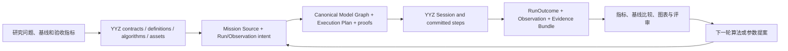
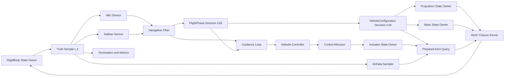

# 15｜纵向架构验证、压力场景与对象落位

[上一册：周期数据流、状态事务与连续闭合](14-cycle-dataflow-state-transaction-and-continuous-closure.md) · [返回总索引](README.md) · [进入路线图：演进路线总览](11-roadmap-overview.md)

**主线定位**：本册把 02–14 的语义放回真实研究链，逐项检查对象落位、同周期因果、提交结果、失败证据和稳定区。它是目标架构的纵向证明与代码导航，不增加另一套全局概念。

## 阅读主线｜同一个案例放大三次

Reference A 应从外到内阅读，避免直接从对象清单开始推断系统结构：

| 放大尺度 | YYZ 案例中的起点 | 需要证明的闭环 | 本册落点 |
| --- | --- | --- | --- |
| 研究迭代 | “某制导/控制方案在声明工况和数值策略下是否满足指标” | 问题与基线 → 模型/Mission → Run → 指标/报告 → 评审与下一轮算法 | 本节、§17–§20，并连接 08/09 |
| 单次运行 | 已编译 YYZ Plan + 一组 RunBinding | initialize/reset → committed steps → terminate/fail/cancel → RunOutcome/Evidence | §2–§4、§9、§18、§20 |
| 单个 step | `t_k` 的飞行器、执行机构、质量和推进 committed state | truth → sensor → nav → guidance → control → actuator/aero/propulsion/mass → closure → form → commit | §2–§8 |

一条完整的 YYZ 研究链如下：



这条链要求同一个稳定 identity 贯穿算法版本、模型 definition、Mission、Plan、Run、Field/Metric 和 Artifact lineage。§2 的运行图只是链中的 Session 放大图；§4 的周期表再放大其中一个 step。对象落位只有同时服务编译证明、运行提交和证据追踪时才算闭合。

Reference A 的首个验收不止包含“轨迹跑通”。它至少形成以下证据集合：

- authoring source、有效配置和 package/version lock；
- Canonical Model Graph 与 Execution Plan 的 dry-run/proof 摘要；
- 公式级 oracle、状态/输出时序和 termination/RunOutcome；
- 单位、坐标、时间、数值策略与随机种子清单；
- 成功 run、配置失败、绑定失败和 step failure-point 的证据；
- 基线对比指标、图表、适用域与评审结论；
- 结论触发的下一轮 source/algorithm proposal。

后续 Reference B/C 和压力样本继续复用这三种尺度，只替换模型语义、图关系或研究问题。

## 1. 本册目的

前几册给出架构主轴、对象与语义，本册用真实纵向链和未来压力场景验证扩展接缝。重点回答：

- 当前一个 6DoF mission 在目标架构里有哪些运行对象；
- 每个对象拥有哪些状态、函数和端口；
- 哪些现有节点会消失、拆分或变成纯 query；
- guidance 的阶段、滤波、限幅等内部 behavior 如何组合且不增加运行节点；
- aero、mass、propulsion、actuator 与 form 如何在一个 step 内闭合；
- 一个 665 行论文制导节点如何拆成可验证算法包；
- 新增功能如何先拆 CapabilitySlice，确定 AuthorityDomain、七维 ChangeVector、change class、extension seam 与稳定区，再决定对象、文件、接口、变量和测试的落位。

本册中的类型名表达目标职责，正式 C++ 拼写可在实现 ADR 中微调。对象关系、所有权和时间语义属于目标决策。

## 2. Reference A：YYZ Cartesian 6DoF 轻量闭环

### 2.1 目标运行图



图中的 `Prepared Aero Query` 和 `6DoF Closure Kernel` 没有 RuntimeComponent 身份。它们分别由 closure plan 和 integration scope 调用。`OnboardStateProcess` 从图中移除，guidance 直接获得编译后的 InputBundleView。

### 2.2 运行对象清单

| 对象 | Placement | RuntimeCellProfile / obligations | 权威状态 | 正式输出 |
| --- | --- | --- | --- | --- |
| RigidBody6DoF | vehicle.form | continuous-owner / PublishProjection + DerivativeEvaluation | position/velocity/attitude/rates | Cartesian6DoFTruth |
| ImuSensor | vehicle.input | discrete-processor / BoundaryEvaluation | bias/random cursor/filter state | ImuMeasurement |
| SatNavSensor | vehicle.input | discrete-processor / BoundaryEvaluation | fault/dropout/random cursor | SatNavMeasurement |
| AirDataSampler | vehicle.input | sampled-transform 或 discrete-processor / BoundaryEvaluation | 仅有传感器动态时才有 | AirDataMeasurement |
| NavigationFilter | vehicle.process | discrete-processor / BoundaryEvaluation | estimate/covariance/filter state | NavigationEstimate |
| FlightPhaseDecisionCell | vehicle.process | coordinator recipe / BoundaryEvaluation | phase protocol StateFragment | FlightPhaseSnapshot/Event |
| GuidanceLoop | vehicle.process | discrete-processor / BoundaryEvaluation | guidance mechanism/law state | GuidanceCommand variant |
| AttitudeController | vehicle.process | discrete-processor / BoundaryEvaluation | controller/filter/mechanism state | MomentCommand |
| ControlAllocator | vehicle.process | sampled/discrete recipe / BoundaryEvaluation | 只有故障分配有状态 | ActuatorCommand |
| VehicleConfigurationDecisionCell | vehicle.output | coordinator/continuous recipe / Boundary + optional Derivative | configuration/progress state | ConfigurationSnapshot |
| Actuator | vehicle.output | discrete/continuous recipe / Boundary + Interval/Derivative | surface/throttle/fault state | ActuatorSample/interval model |
| Propulsion | vehicle.output | discrete/continuous recipe / Boundary + Interval/Derivative | fuel/engine state | PropulsionResponse/MassFlowInterval |
| MassProperties | vehicle.output | discrete/continuous recipe / Publish + Interval/Derivative | mass/CG/inertia state | MassPropertiesSample |
| Termination/Metric | evaluation | evaluator recipe / BoundaryEvaluation | 可选窗口状态 | EvaluationResult/Decision |

共享 environment 的 Earth、Atmosphere、Gravity、Wind 优先采用 `PureQueryDescriptor`，运行期共享 immutable PreparedModel。若风场随时间演化并拥有随机状态，则风场升级为 environment RuntimeComponent，发布 `WindFieldSnapshot` 或提供基于该快照的 query。

## 3. Reference A 的 contract 拆分

当前 `yyz_c6_types.hpp` 将 form、环境、传感器、导航、phase、target、guidance、control、actuator、aero、propulsion 和 mass 放在同一头文件。目标按稳定消费者拆分：

```text
user/yyz_cartesian_6dof_framework_9/contracts/
  cartesian_6dof_state.hpp
  cartesian_6dof_truth.hpp
  form_input_6dof.hpp
  environment_queries.hpp
  imu_measurement.hpp
  satnav_measurement.hpp
  air_data_measurement.hpp
  navigation_estimate.hpp
  target_estimate.hpp
  flight_phase.hpp
  guidance_command.hpp
  control_command.hpp
  actuator_state.hpp
  vehicle_configuration.hpp
  aero_response.hpp
  propulsion_response.hpp
  mass_properties.hpp
```

规则：

- 文件表达一个稳定语义族，避免按现有节点打包；
- contract struct 不带 provider 虚类；
- sampled contract 带时间、sequence、quality；
- vector/quaternion 字段在 descriptor 中固定 frame、direction 和 unit；
- mutually exclusive command 使用 tagged variant；
- response 不复制 query input，query/result 通过 correlation/operating-point id 关联；
- port descriptor 位于消费/生产模型 descriptor 中，无需再声明 `IWhateverProvider`。

## 4. Reference A 的周期执行表

假设 base rate 100 Hz，IMU/air data/control/actuator 50 Hz，satnav/guidance 10 Hz。一个 guidance 执行 tick 的目标调用表：

| 顺序 | Phase/DAG node | 读取 | 产生 | 时间关系 |
| --- | --- | --- | --- | --- |
| 1 | TruthProjection | committed rigid-body x_k | Truth_k | Sample@t_k |
| 2 | IMU | Truth_k、held fault config | Imu_k、instant sensor state | Sample@t_k |
| 3 | SatNav | Truth_k | SatNav_k、instant sensor state | Sample@t_k |
| 4 | AirData | Truth_k、WindQuery、AtmosphereQuery | AirData_k | Sample@t_k |
| 5 | Navigation | IMU_k、SatNav_k/held | NavEstimate_k、next filter state | Current/Held |
| 6 | FlightPhase | NavEstimate_k、due events | PhaseSnapshot_k、transition event | CurrentCycle |
| 7 | Guidance | NavEstimate_k、Target_k、Phase_k | GuidanceCommand_k | CurrentCycle |
| 8 | Controller | GuidanceCommand_k、NavEstimate_k | MomentCommand_k | CurrentCycle |
| 9 | Allocator | MomentCommand_k、health/config | ActuatorCommand_k | CurrentCycle |
| 10 | Configuration | due config command、Phase_k | ConfigurationSnapshot_k | CurrentCycle |
| 11 | Actuator | committed actuator a_k、ActuatorCommand_k | ActuatorSample_k、a_k+1 candidate | sample + interval |
| 12 | Propulsion | committed engine/fuel、Config_k、command | PropulsionResponse_k、flow interval、candidate | sample + interval |
| 13 | Mass projection/evolution | mass state m_k、Config_k、flow interval | MassProperties_k、m_k+1 candidate | sample + interval |
| 14 | Aero query | Truth_k、AirData_k、ActuatorSample_k、Config_k | AeroResponse_k | Frozen closure sample |
| 15 | Closure | Aero/Prop/Mass/Gravity responses | FormInput_k | IntervalModel |
| 16 | Evaluation | Truth_k、outputs/events | Decision/metrics | t_k |
| 17 | Integration | x_k、FormInput_k | x_k+1 candidate | `[t_k,t_k+1]` |
| 18 | Commit | all validated deltas | state_epoch e+1；continue 时 tick k+1，terminal 时 tick k | atomic |

普通 tick 中 guidance 未执行时，GuidanceCommand slot 注入最近一次 committed sample；Controller 读取其 sample age。若 max_age 超限，Controller policy 明确进入 hold/degraded/failure。

由于 `VehicleConfigurationDecisionCell` 位于 output phase，Controller/Allocator 在本 tick 读取 committed `ConfigurationSnapshot_n`；ActuatorCommand 必须携带 `basis_configuration_revision=n`。若 output phase 同 tick 提交到 revision n+1，Actuator transition reducer 按 definition 声明的 `RejectOldCommand | Neutralize | TypedRemap` 策略处理该命令，并把结果写入 `ActuatorCommandDisposition` output/telemetry 与可选 remap event。Compiler 要求每个可达 configuration transition 都覆盖该策略，避免旧构型命令被新构型执行机构静默解释。ActuatorCommand 属于周期 SampledSignal，不进入 Session command ledger。

## 5. GuidanceLoop 的具体内部设计

### 5.1 文件与对象

```text
algorithms/guidance/intercept_guidance/
  definition.hpp
  state.hpp
  input.hpp
  output.hpp
  telemetry.hpp
  behavior/
    phase_definition.hpp
    phase_state.hpp
    phase_mechanism.hpp
    handover_smoother.hpp
    command_limiter.hpp
  midcourse_kernel.hpp
  terminal_kernel.hpp
  command_mapper.hpp
  verification_cases.*

components/
  intercept_guidance_recipe.hpp
```

### 5.2 对象内容

```text
InterceptGuidanceDefinition
  midcourse parameters
  terminal parameters
  transition thresholds/hysteresis
  command limits
  numerical policy ids

InterceptGuidanceState
  GuidancePhaseState fragment
  MidcourseState | TerminalState
  handover smoothing state

InterceptGuidanceInput
  SampleRef<NavigationEstimate>
  SampleRef<TargetEstimate>
  OptionalSampleRef<FlightPhaseSnapshot>
  due GuidanceControlCommand requests
  due target/fault/phase events

InterceptGuidanceOutput
  GuidanceCommand variant
  GuidanceHealth

InterceptGuidanceTelemetry
  range/closing speed/LOS rate
  guard values
  selected transition
  unsaturated/saturated command
  handover residual
```

### 5.3 单次求值的函数边界

```text
buildPhaseObservation(input) -> PhaseObservation
evaluateGuidancePhase(definition, state.phase, observation, events, commands, tick) -> PhaseDecision
reduceGuidancePhase(definition, state, decision) -> next owner state fragment
evaluateSelectedLaw(prepared, stagedStateView, input) -> LawResult
mapAndLimitCommand(definition, LawResult) -> GuidanceCommand
assembleOwnerReplacement(phaseResult, lawResult, limiterResult) -> InterceptGuidanceState
assembleDelta(ownerReplacement, command, telemetry) -> ComponentDelta
```

`phase_mechanism`、`handover_smoother` 和 `command_limiter` 都嵌入 Guidance Recipe，没有 RuntimeInstanceId 或独立 schedule。`evaluateSelectedLaw` 无需知道 Session phase、lookup name 或 observation selection。局部 behavior 与 law 求值同处一个 owner replacement/ComponentDelta，能够整体回滚。

## 6. 当前 `GuidanceProcess` 的逐项搬迁

| 当前成员/函数 | 目标对象 |
| --- | --- |
| `navigation_lookup_name_` | Mission BindingIntent，运行实例中删除 |
| `target_lookup_name_` | Mission BindingIntent |
| `onboard_state_lookup_name_` | 删除，Compiler 生成 InputBundleView |
| `command_.command_mode` | GuidanceCommand tagged variant / local ModeState |
| `desired_euler_rad` config | GuidanceAlgorithmDefinition，带 attitude convention |
| `base_desired_force_body_n_` | GuidanceAlgorithmDefinition，带 body frame |
| LOS 计算 | guidance law kernel |
| launch/body 转换 | explicit frame kernel/adapter |
| Euler 提取与误差 | attitude-reference kernel；明确 sequence 与 singularity policy |
| `actual_force_body_n` 由动压伪造 | 删除；真实 feedback 使用正式 Aero/ForceEstimate port |
| `initialize()->update(0)` | initialState builder + initial output policy |
| observable lambdas | Telemetry/OutputSchema + ObservationPlan |
| registration macro | ModelDefinition/package contribution |

## 7. Controller、Allocator 与 Actuator 的边界

### 7.1 Controller

输入是 NavigationEstimate/AttitudeEstimate 与 GuidanceCommand。输出是 body moment、angular acceleration 或 generalized control demand。Controller 负责误差计算、反馈/前馈、law mode、积分与限幅前 policy。

它不决定具体舵面组合，不查询气动表，不写 actuator state。

### 7.2 Allocator

输入是 generalized demand、ActuatorCapabilitySnapshot 和可选 effectiveness model。输出是 typed ActuatorCommand。无状态伪逆可以是 SampledTransform；故障重构、active-set warm start 或动态约束需要 DiscreteStateProcessor。

### 7.3 Actuator

输入是 ActuatorCommand 与 ConfigurationSnapshot。它拥有实际 surface/throttle state、rate/position limit、故障锁存和 dynamics。输出区分：

- `ActuatorSample@t_k`：当前实际状态；
- `ActuatorIntervalModel[k,k+1]`：高保真 closure 所需；
- `ActuatorHealth`：allocator 可消费的能力；
- `ActuatorEvent`：jam、limit、deployment complete。

理想执行机构采用独立 SampledTransform definition，明确零延迟。动态执行机构采用 state owner，禁止通过 `dt <= 0` 分支模拟初始化。

## 8. Aero、Propulsion、Mass 与 Closure 的边界

### 8.1 Aerodynamics

静态表模型拆分：

```text
AeroTableArtifact
  raw normalized data and metadata

AeroModelDefinition
  interpolation/extrapolation policy
  coefficient convention
  reference geometry mapping
  supported configuration ids

PreparedAeroModel
  grids, indices, interpolator coefficients

AeroQueryKernel
  OperatingPoint -> AeroResponse + QueryTelemetry
```

Query input 包含 Mach、alpha、beta、rates、surface state、configuration id 与所需 derivative set。AeroResponse 包含 coefficient/force-moment schema、frame、reference point、domain status 和 model version。

文件路径、CSV 列映射和 table load 只存在于 Artifact adapter/prepare。当前工况和 `last AeroState` 不进入 PreparedModel。

### 8.2 Propulsion

```text
PropulsionDefinition
PreparedPropulsionModel
PropulsionState
PropulsionInput
PropulsionResponse
PropulsionTelemetry
PropulsionKernel
```

enable 由 typed PropulsionCommand/ConfigurationSnapshot 决定。fuel state 与 mass-flow time relation 显式。`enabled_phase_name`、phase provider 指针和自由字符串退出。

### 8.3 MassProperties

MassState 是质量、CG 和 inertia 的唯一 owner。输出投影不拥有第二份 state。模型提供：

```text
projectMassProperties(state, configuration) -> MassPropertiesSample
evolveMass(state, MassFlowInterval, dt) -> IntervalCandidate
applyConfigurationJump(state, transition_event) -> InstantPatch
```

分离 jump、燃料消耗与烧蚀可以组合，但各自有独立 telemetry 和 invariant。

### 8.4 Closure

```text
ForceMomentClosureInput
  Truth/CandidateState
  AeroResponse
  PropulsionResponse
  MassPropertiesSample
  GravityResponse

ForceMomentClosureResult
  total body force/moment
  gravity/reference-frame terms
  form input
  closure telemetry
```

ClosureKernel 是纯函数。它由 `ClosurePlan` 和 `IntegrationScopePlan` 持有，strategy 为 FrozenInterval、CandidateState 或 AlgebraicSolve；它没有 `last_input_`，也没有 IObservable 身份。

## 9. VehicleConfiguration transition 案例

假设在 t_k 收到 stage separation command：

1. `VehicleConfigurationDecisionCell` guard 校验当前 config、DecisionAuthority 和时刻；
2. 输出 staged `ConfigurationSnapshot(config=stage2, revision=n+1)` 与 transition event；
3. `MassProperties` 对 attached stage 应用 instant jump，产生新 MassProperties output；
4. `Propulsion` 切换 active engine set，产生新 response；
5. `AeroQuery` 选择 stage2 geometry/table；
6. `Actuator` 选择 stage2 declared feature set；
7. Actuator 检查控制命令的 `basis_configuration_revision`，执行已声明的 neutralize/remap/reject transition policy，并发布 `ActuatorCommandDisposition`；
8. Closure 检查所有 response 的 `configuration_revision` 均为 n+1；
9. Evaluation 记录 separation metrics；
10. 整步成功后 configuration/mass/engine/outputs 一起 commit；
11. 任一模型缺失 stage2 mapping 或 command transition policy 时，整步回滚并报告具体 ModelDefinition/ConfigurationId。

分离体若继续作为独立飞行实体，目标 v1 在 Execution Plan 中预实例化 inactive stage entity，transition reducer 产生 `ActivateEntityRequest` 并在当前 ModelCommit 原子激活。运行期创建全新 topology 不进入 v1；后续只有真实任务需要未知数量实体时才开启动态 entity ADR。

## 10. Reference B：CAVH 滑翔增程制导拆分

### 10.1 当前职责团块

现有 `cavh_glide_range_guidance.hpp` 在一个节点内承担：

- JSON 配置和自由文本校验；
- navigation/aero/atmosphere/gravity/earth/mass 绑定；
- 常量质量与连续质量 provider 二选一；
- 大气密度与 Mach 偏导有限差分；
- L/D 最大值采样与 golden-section 搜索；
- CL* 对 Mach 的有限差分；
- Eq.17/Eq.18 两套公式；
- 分母保护和 fallback；
- TDCT feedback；
- command 输出；
- 大量中间成员和 observable lambda；
- 注册元数据。

这使公式验证、prepare cache、数值策略、运行性能与观测 schema 彼此耦合。

### 10.2 目标算法包

```text
algorithms/guidance/cavh_glide_range/
  definition.hpp
  state.hpp
  input.hpp
  output.hpp
  telemetry.hpp
  kernel.hpp
  gamma_reference_policy.hpp
  tdct_feedback_kernel.hpp
  verification/
    paper_cases.*
    matlab_reference.*

models/aero/glide_envelope/
  definition.hpp
  prepared_model.hpp
  builder.hpp
  query.hpp
  verification/

models/environment/derivatives/
  atmosphere_derivative_query.hpp
  mach_derivative_query.hpp

components/
  cavh_glide_range_guidance_definition.hpp
```

### 10.3 `GlideEnvelopePreparedModel`

若 aero coefficient 只依赖 immutable asset、Mach 和 alpha，prepare-time builder 在声明 Mach grid 上计算：

- alpha*(Mach)；
- CL*(Mach)、CD*(Mach)、L/Dmax(Mach)；
- dCL*/dMach；
- interpolation error estimate；
- boundary/domain flags。

运行时 guidance 只做 pure query。Builder 使用 foundation optimizer 与 NumericalPolicy，输出 Verification Artifact 和 cache key。

若 perturbation 或构型会改变 aero envelope，Definition 显式选择：

- 为每个 configuration/parameter set 准备独立 envelope；
- 在 case materialization 后 prepare；
- 使用 runtime pure optimization query，并声明性能预算。

运行时不能悄悄复用与当前 aero model 不一致的 envelope。

### 10.4 `CavhGuidanceDefinition`

只保存模型选择和参数：

```text
gamma_reference_policy: Eq17MachDerivative | Eq18Simplified
tdct_gain
bank_command policy
vertical_lift_min
denominator policy
atmosphere derivative policy id
glide envelope ref
valid domain
command limits
```

Eq17/Eq18 是 immutable strategy 选择。若未来需要运行中切换，才提升为 local ModeState，并定义 transition evidence。

### 10.5 `CavhGuidanceInput`

```text
NavigationEstimate
AirDataEstimate or explicit atmosphere operating point
MassPropertiesSample
GravityResponse
EarthGeometryResponse
optional FlightPhaseSnapshot

CavhGuidanceQuerySet
  AtmosphereDerivativeQuery
  MachDerivativeQuery
  GlideEnvelopeQuery
```

输入 contract 明确 sample time、frame、unit 和 quality。`CavhGuidanceQuerySet` 是 QueryPlan 授权给该 callsite 的窄 BoundQueryHandle set，不属于组件端口，也不提供按名称查询。Core Kernel 无 handle/provider 指针，也不自行判断 constant/continuous mass interface。

### 10.6 kernel 分层

```text
deriveOperatingPoint(input) -> OperatingPointOutcome
evaluation composition calls query_set.environment_derivatives(operating_point)
evaluation composition calls query_set.glide_envelope(Mach)
computeGammaReference(policy, definition, operating point, derivatives, envelope)
  -> GammaReferenceOutcome
computeTdctFeedback(definition, navigation, gamma_reference)
  -> TdctOutcome
mapGuidanceCommand(definition, envelope, tdct)
  -> BankAndAngleOfAttackCommand
assembleTelemetry(all outcomes) -> CavhGuidanceTelemetry
```

前两次 query 与 core kernel 的编排属于 package-specific typed evaluation composition。它只持有编译授权的 query handles 和 caller-owned workspace；`computeGammaReference`、`computeTdctFeedback` 与 `mapGuidanceCommand` 继续以普通 value 输入独立测试。

分母接近零、有效域外、L/D optimum 不存在和 derivative 不可信分别使用稳定 Numerical/Domain status。fallback 只有 Definition 明确允许时执行，并在 command quality 与 telemetry 中留下标记。

### 10.7 成员变量归属

| 当前成员类别 | 目标归属 |
| --- | --- |
| lookup name/pointer | BindingIntent/InputFrame handles |
| alpha range/sample count | GlideEnvelopeDefinition |
| golden search temporary | Builder Workspace |
| density/mach finite-difference step | NumericalPolicy/DerivativeDefinition |
| Eq17/Eq18 enum | CavhGuidanceDefinition |
| current altitude/speed/Mach/density | call-local OperatingPoint |
| CL*/CD*/L/Dmax 等 | EnvelopeSample + Telemetry |
| denominator protection flags | GammaReferenceTelemetry |
| TDCT error/feedback | TdctTelemetry |
| command | AlgorithmOutput/CycleFrame slot |
| no-memory algorithm state | 省略 State；有 mode/filter 时再增加 |

### 10.8 验证边界

- GlideEnvelope builder：独立函数/表格 reference；
- derivative query：解析模型或高精度差分对照；
- Eq17/Eq18：论文算例逐项中间量对照；
- TDCT feedback：符号、单位、极限情况；
- full guidance kernel：command 与 telemetry golden；
- component conformance：port/time/quality、mode、reset；
- closed loop：CAVH mission trajectory evidence。

公式验证失败能定位到具体 kernel，不需要从完整 Session 的最终轨迹反推原因。

## 11. Reference C：导航交班链路

### 11.1 DecisionAuthority 设计

多个导航器件/算法分别发布 `NavigationCandidate`，`NavigationDecisionCell` 消费 candidate health、coverage、covariance、freshness 和 handover command，发布唯一 `NavigationEstimate` 与 `NavigationSourceSnapshot`。

每个 estimator 的内部 mode 保持 local。交班 DecisionAuthority 独立存在，因为 guidance/control 需要一个共同选择结果，报告也需要审计 source transition。

### 11.2 数据流

```text
Sensors -> Estimator A -> Candidate A
        -> Estimator B -> Candidate B
Candidates + Handover Policy/Command
        -> NavigationDecisionCell
        -> NavigationEstimate + SourceTransitionEvent
        -> Guidance/Control
```

Compiler 的闭合报告检查：

- candidate state coverage；
- frame/unit；
- covariance/quality；
- max age 和 rate；
- DecisionAuthority 唯一性；
- 每个 handover transition 的 guard 输入可达；
- guidance/control 只绑定权威 output。

这条设计也可复用于 seeker、control DecisionAuthority 和多传感器 fusion 的共享选择问题。

## 12. 当前文件到目标文件的替换表

| 当前文件 | 目标去向 |
| --- | --- |
| `interfaces/yyz_c6_types.hpp` | 拆为 `contracts/*.hpp`，provider interfaces 删除 |
| `components/process_guidance.hpp` | guidance algorithm 六件套 + thin descriptor |
| `components/process_sequencer.hpp` | flight phase graph/Coordinator definition |
| `components/process_onboard_state.hpp` | 删除或升级为真正 estimator/fusion component |
| `components/process_flight_control.hpp` | controller algorithm 六件套 + descriptor |
| `components/process_control_allocation.hpp` | allocator kernel/state + descriptor |
| `components/output_actuator.hpp` | actuator definition/state/kernel/telemetry + descriptor |
| `components/output_propulsion.hpp` | propulsion model/state/kernel + config command contract |
| `components/output_mass_properties.hpp` | mass definition/state/projection/evolution/jump reducer |
| `components/output_aerodynamics.hpp` | AeroTable Artifact adapter + PreparedAeroModel + query kernel |
| `components/interaction_force_moment_6dof.hpp` | pure closure definition/kernel |
| `components/form_rigid_body_6dof.hpp` | StateSchema + truth projector + derivative kernel + continuous descriptor |
| `cavh_glide_range_guidance.hpp` | Reference B 的 guidance/envelope/derivative 包 |
| legacy generic callback state-machine helper | 删除；局部 mode/protocol 使用 embedded mechanism + owner StateFragment/reducer，共享决策按 promotion rule 建立窄 StateOwner/DecisionAuthority cell |

## 13. 目标 Mission 片段的职责

目标 Mission Source 仍以领域模型为中心。下列片段只展示职责，不冻结 JSON 拼写。示例中的 `physical` 是作者视图分组，Compiler 会将其规范化到既有 `vehicle.output` placement；它不增加新的 placement，也不改变领域 ownership：

```text
vehicle interceptor
  form:
    model: project.yyz.rigid_body_6dof@1
    closure: project.yyz.frozen_force_moment_6dof@1

  input:
    imu: project.yyz.imu@1, rate=50Hz
    satnav: project.yyz.satnav@1, rate=10Hz
    air_data: project.yyz.air_data@1, rate=50Hz

  process:
    navigation: project.yyz.navigation_filter@1
    phase: project.yyz.flight_phase@1
    guidance: project.yyz.intercept_guidance@1, rate=10Hz
    controller: project.yyz.attitude_controller@1, rate=50Hz
    allocator: project.yyz.fin_allocator@1, rate=50Hz

  physical:
    configuration: project.yyz.vehicle_configuration@1
    actuator: project.yyz.fin_actuator@1
    propulsion: project.yyz.propulsion@1
    mass: project.yyz.mass_properties@1
    aerodynamics: project.yyz.aero_table_model@1

  bindings:
    explicit semantic edges where uniqueness or DecisionAuthority requires

  run:
    closure_policy: frozen_interval
```

作者选择模型、参数、速率、DecisionAuthority 与 closure policy。Runtime Cell boundary、recipe/RuntimeCellProfile provenance、execution obligations、state schema、port schema 和 behavior composition 来自 Catalog definition，Mission 不重复描述内部结构。

## 14. 新功能的落位工作表

普通单域 A–E 变化先填写 02 定义的 ChangeCard。F 类、跨两个及以上 AuthorityDomain，或改变 identity/owner/time/commit/rollback/effect/shared contract 的变化再填写本节完整工作表。

### 14.1 架构分流

- 自然语言需求应拆成哪些 CapabilitySlice？
- 每个切片属于 Plan、Model、Operation 或 Artifact 中哪个 AuthorityDomain？
- `<V,G,S,T,I,R,X>` 七个维度各自改变了什么？未改变的维度应明确写零；
- 需要新增或复用哪一种 canonical grammar：Model Graph、Workflow Graph、typed Proposal/Command 或 Artifact schema？
- identity、ownership/DecisionAuthority、causality、time/lifecycle、state/transition、resource/effect、evidence 七类 `PlanProofRecord` 是否完整？
- 能否降级到所属权威域的既有 closed operators，并形成唯一 commit/receipt？
- 跨域 handoff 是否只经过 typed intent/ref/receipt/Outcome？
- 变化属于 A–F 中哪一类？
- 主要 extension seam 是 package、behavior composition、graph/topology、solver、observation、workflow、application 还是 backend？
- 本次应保持零修改的稳定分区有哪些？
- 是否出现所属权威域既有操作集无法表达的 time、atomicity、topology、lifecycle 或 irreversible-effect 语义？
- 最终权威产物是 recipe、contract、plan、Artifact、DTO 还是 `KernelCapability`？

### 14.2 语义

- 研究问题和物理假设是什么？
- 输出中哪些量会被其他模型消费？
- 哪些量只用于解释和报告？
- unit、frame、time、quality、valid domain 是什么？

### 14.3 ownership

- 它拥有 continuous、discrete、behavior StateFragment、configuration 或 resource state 中的哪一种？
- 状态如何初始化、reset、checkpoint 和迁移？
- 哪些 immutable AlgorithmDefinition/PreparedModel 可以共享？
- 哪些 scratch 只属于 Workspace？

### 14.4 Runtime Cell boundary

- 是否有独立 schedule、command DecisionAuthority、failure domain 或多个消费者？
- 纯 query、AlgorithmKernel、Adapter 和 RuntimeComponent 中哪一种足够？
- placement 与 execution form 分别是什么？若进入 Session，boundary reason、Runtime Cell Recipe 和 execution obligations 是什么？
- 局部 behavior 能否由 embedded mechanism + StateFragment 表达？
- 与 owner 合并会不会更符合一致性边界？

### 14.5 information flow

- 每条输入来自哪个 stable contract？
- 使用 CurrentCycle、PreviousCommitted、Held、Interval 还是 Candidate relation？
- 是否形成同瞬时代数环？
- 需要 Frozen、Candidate 还是 Algebraic closure？
- terminal 和 step failure 时哪些 delta 应提交？

### 14.6 behavior/DecisionAuthority/transition

- 行为切换是否有记忆、滞回、事件或 DecisionAuthority？
- 局部逻辑是否嵌入宿主，跨组件概念是否需要 shared StateOwner/DecisionAuthority cell？
- transition state mapping、bumpless policy 和 fault path 是什么？
- 多个物理模型是否需要同一 configuration revision？

### 14.7 failure/evidence

- 正常域外、输入降级、数值失败和内部缺陷如何区分？
- Diagnostic code、telemetry 和 policy owner 是谁？
- unit/property/reference/closed-loop 测试分别是什么？
- 哪个 Artifact 能证明实现符合论文或工程假设？

没有明确答案的项目先留在 project spike，避免用通用接口掩盖语义空缺。常见 A–E 变化若要求修改 Kernel，应先审查接缝泄漏。

## 15. Definition 与 State 的判定示例

| 值 | Definition | State | Telemetry | Workspace |
| --- | --- | --- | --- | --- |
| controller gain | ✓ | 动态 tuning 时进入显式 parameter state |  |  |
| PID integral |  | ✓ | 可投影 |  |
| selected formula Eq17 | ✓ | runtime transition 时才进 ModeState | 可记录 identity |  |
| current Mach |  |  | ✓/Input |  |
| golden search bracket |  |  | 可选 final bracket | ✓ iterative scratch |
| last command | hold contract 时进 output store | owner 算法显式依赖历史值时进 State，例如 rate limiter memory | 可记录 |  |
| saturation flag |  | 若锁存则 ✓ | 普通情况 ✓ |  |
| aero table grid | PreparedModel |  | identity only |  |
| random bias | initial distribution 在 Definition | realized bias/RNG cursor ✓ | 可投影 |  |
| configuration id | graph/mapping 在 Definition | actual id/revision ✓ | transition details |  |

外部 `Command<T>` 的 idempotency、expiry、supersession 和 queue sequence 进入 Session 的 CommittedCommandLedger/control stores，不进入组件 State。ExternalEndpoint 输入流自身的 cursor/dedup watermark 会改变下一批物理输入，属于 SourceRuntimeState。

## 16. Interface 的判定示例

| 需求 | 目标接口 |
| --- | --- |
| guidance 读取 navigation | `SampledSignal<NavigationEstimate>` input port |
| form 查询大气 | `PureQuery<AtmosphereQuery, AtmosphereResponse>` |
| 外部要求切换阶段 | `Command<PhaseTransitionRequest>` |
| 报告获知已经切换 | `Event<PhaseTransitionEvent>` |
| aero 读取 prepared table | `AssetBinding<AeroTableArtifact>` |
| RK 子步读取 candidate actuator | `ContinuousClosureLink` |
| 记录 TDCT error | Telemetry field，无 component port |
| 获取完整 onboard bundle | compiled InputBundleView，无 provider component |
| Python step/reset | Application Control contract，无 RuntimeComponent interface |

## 17. 需求变化闭包的压力样本

本节是 AuthorityDomain + 七维 ChangeVector 与分区封闭操作语言的验证集，不承担需求分类。需求抽象的权威语法位于 [02](02-layered-reference-architecture.md) 第 1.2–1.5 节。每个样本都应能还原：

```text
Requirement
-> CapabilitySlice<AuthorityDomain, Delta<V,G,S,T,I,R,X>>
-> domain-specific canonical grammar delta
-> seven PlanProofRecords
-> closed operator + AuthorityDomain commit
-> typed cross-domain handoff
-> Evidence route
-> stable untouched areas
```

压力集按下列规则生成，表中的产品场景只是当前实例：

| 生成规则 | 要验证的架构性质 |
| --- | --- |
| 单维变化 | 每个维度都能独立扩展，其他六维 identity 保持稳定 |
| 两两组合 | graph/state、state/time、graph/information、representation/execution-context 等边界没有隐式耦合 |
| 多域纵向链 | 复合需求可以按 AuthorityDomain 拆开、分别证明，并用 typed handoff 重新组合 |
| scale deformation | 数量、频率、时长和并发增长只触发 resource/backend policy，除非执行语义改变 |
| fidelity deformation | 同一研究对象可以替换模型/solver fidelity，并明确 state mapping 与证据差异 |
| failure deformation | 任一边界失败都有唯一 owner、commit result 和 evidence validity |
| withheld scenario | 评审时加入未预列需求；若切片、域内 lowering 或跨域 handoff 只能靠产品专用分支完成，抽象闭包判失败 |

这些案例不要求在路线 R0–R3 全部实现。它们按 [02](02-layered-reference-architecture.md) 的语义主干、权威域和闭包判据分类，用于检查合理增长是否已有明确落点，以及无关稳定区能否保持零修改。

压力样本的交付状态统一读取 [术语注册表 §8](reference-glossary.md#8-能力状态与未来词汇)：

| 状态 | 样本 ID | 本册承诺 |
| --- | --- | --- |
| `V1` | P-SOURCE-YAML、P-DATA-MAT、P-ALG、P-CTRL、P-PERTURB、P-DISTURB、P-FAULT、P-MULTI-TRUTH、P-COMM、P-SEPARATION、P-BATCH、P-CALIBRATE、P-OPTIMIZE、P-RL、P-AUTHOR、P-BRANCH、P-TOOLS | 在对应路线 gate 交付至少一个 fixture/consumer |
| `PressureOnly` | P-SOURCE-INI、P-DATA-STORE、P-LIVE-DATA、P-SCHEMA-EVOLVE、P-DAMAGE、P-MULTIPHYS、P-FIDELITY、P-CONSTELLATION、P-COLLISION、P-GROUND、P-ASYNC、P-ASTRO-TIME、P-ADAPTIVE、P-COSIM、P-REALTIME、P-GAME | 只证明 extension seam、unsupported 结果和稳定区 |
| `Deferred` | P-DOCKING 中的动态 solver membership、P-DYNAMIC-ENTITY、P-EVENT 中的 located jump | 只能经过 TopologyTransaction/SegmentTransaction 准入门开启 |

同一样本可以同时含 V1 子路径和延期子路径，例如 P-GROUND 的 AtGrid contact fixture 可以先落地，高精度 located jump 继续保持 Deferred。实现 PR 必须声明实际选中的子路径和状态。

### 17.1 表示与证据出口

| ID | 常见需求 | 主要落点 | 应保持稳定 |
| --- | --- | --- | --- |
| P-SOURCE-YAML | JSON Mission 改用 YAML | YAML Source Frontend + SourceMap | schema、Mission IR、Compiler semantic passes、Kernel |
| P-SOURCE-INI | ParameterSet/RunProfile 改用 INI | versioned INI SourceFrontend mapping | ModelDefinition、Execution Plan；超出表达范围时明确失败 |
| P-DATA-MAT | CSV 时序改存 MATLAB `.mat` | MAT Dataset Sink + EncodingPlan | FieldId、ObservationBatch、StepTransaction、模型 |
| P-DATA-STORE | HDF5/Parquet/数据库/对象存储 | Dataset Sink / Artifact Storage Adapter | Evidence schema、model execution hash |
| P-LIVE-DATA | 高频 dashboard、共享内存或网络流 | best-effort live sink/transport | CriticalEvidence sink、物理 step、committed state |
| P-SCHEMA-EVOLVE | 旧数据集升级与多版本读取 | Artifact schema migration/export adapter | 历史 Artifact bytes/hash、当前模型状态 |

### 17.2 模型、内部行为与场景干预

| ID | 常见需求 | 主要落点 | 应保持稳定 |
| --- | --- | --- | --- |
| P-ALG | 新论文制导律，含阶段和约束 | Model Package + Behavior Composition | Compiler core、Kernel、Artifact、Frontend |
| P-CTRL | 控制器增加抗饱和、增益调度和 fallback | recipe/state fragments/tests | Session、port kinds、Kernel regions |
| P-PERTURB | 新质量/气动/安装误差拉偏及相关分布 | Parameter descriptor + Experiment target mapping | sampler/executor/Session、组件成员布局 |
| P-DISTURB | 阵风、外力、振动、热流等时变扰动 | typed signal/closure model | ParameterSet、Diagnostic policy、record backend |
| P-FAULT | 舵机卡死、发动机熄火、传感器漂移/dropout | typed fault command + owner mechanism/state | Kernel commit、其他 owner、Framework failure taxonomy |
| P-DAMAGE | 液压、电源、结构损伤同时影响多个模型 | 窄 physical StateOwner + revisioned physical availability snapshot | 全局 Kernel、各 consumer 私有状态 |
| P-MULTIPHYS | 柔性、晃动、热、电、能源与控制耦合 | ModelDefinitions + SolverIslandPlan | 普通 sampled cells、Workflow、Frontend |
| P-FIDELITY | lightweight/high-fidelity 模型选择或切换 | model identity；运行切换另需 `RegimeMappingPlan`，步内跳变再进入 SegmentTransaction gate | Artifact identity、Control API、无隐式猜测 |

### 17.3 多实体、关系与拓扑

| ID | 常见需求 | 主要落点 | 应保持稳定 |
| --- | --- | --- | --- |
| P-MULTI-TRUTH | 多飞行器相对几何、目标观测、碰撞判断 | entity-scoped truth selector + interaction/sensor | form state owner、Kernel、无全局 truth bus |
| P-COMM | 数据链、编队协同、星间链路 | communication Link Model + Message/Measurement | truth contract、navigation internals、Session transaction |
| P-SEPARATION | 已知母体抛出子体、多级火箭分离 | predeclared inactive entity + atomic activation mapping | EntityId、普通 StepTransaction、Evidence |
| P-DOCKING | 对接、挂载、解锁、编组变化 | relationship plan；solver membership 改变时用 `TopologyTransaction` | 单体模型定义、Observation contract |
| P-DYNAMIC-ENTITY | 未知数量 payload、碎片或运行期生成实体 | future TopologyTransaction + EntityPrototype/capacity policy | v1 静态 plan、stable handles、package lock |
| P-CONSTELLATION | 数百卫星、分组可见性与链路 | entity templates/groups + ephemeris/time/query plans | 单星 recipe、Kernel domain vocabulary |
| P-COLLISION | 撞击、接触、破坏或实体合并/分裂 | contact solver；产生 topology diff 时进入 TopologyTransaction | Diagnostic/Evidence、普通非接触模型 |

### 17.4 动力学、时间与执行环境

| ID | 常见需求 | 主要落点 | 应保持稳定 |
| --- | --- | --- | --- |
| P-GROUND | taxi、滑跑、起飞、着陆、刹车和冲出跑道 | terrain/contact + SolverIslandPlan + regime state mapping | guidance/control contracts、Artifact/Workflow |
| P-EVENT | 精确触地、碰撞、分离瞬间和状态 jump | ContinuousLocated detector + SegmentTransaction | package formulas、Control API、Evidence identity |
| P-ASYNC | 异步传感器、通信延迟、多个 clock domain | TemporalContract/ClockPlan/hold/interpolation | state ownership、FieldId、source format |
| P-ASTRO-TIME | UTC/TAI/TT/TDB、星历 epoch、长时传播 | TimeScale/Ephemeris contracts + `NumericalExtension` | Kernel domain vocabulary、普通短时 mission |
| P-ADAPTIVE | 自适应步长、高阶积分、刚性求解器 | `NumericalExtension` + IntegrationScopePlan + observation boundary policy | Model Graph、Artifact lineage、sample semantics |
| P-COSIM | FMI/FMU、Simulink、ROS2 或其他步进式联合仿真 | External Endpoint + clock/rollback/timeout contract | Runtime Cell internals、model StateOwner |
| P-REALTIME | HIL、soft/hard realtime、GPU/worker backend | `BackendCapability` + endpoint/resource contract | execution-core semantics、plan identity、evidence |

### 17.5 研究流程与使用入口

| ID | 常见需求 | 主要落点 | 应保持稳定 |
| --- | --- | --- | --- |
| P-BATCH | 十万次 Monte Carlo、DOE、参数扫描 | Experiment materializer + worker backend | 单次 Session、model package |
| P-CALIBRATE | 参数辨识、校准、贝叶斯估计、敏感度/UQ | Workflow tasks + Artifact lineage + Parameter targets | Kernel、模型 owner、source encoding |
| P-OPTIMIZE | GPOPS2、MPC 离线设计、多目标优化 | Workflow/Artifact adapters | 单步 Session、Control API |
| P-RL | Python reset/step、VectorEnv、训练与评估 | Application adapter + RunBinding/Observation | Runtime Cell Recipe、transaction semantics |
| P-AUTHOR | LLM/ComfyUI/GUI 生成或修改模型图 | Source frontend/proposal + Compiler diagnostics | Runtime Cell internals、Kernel |
| P-GAME | UE/Godot/ImGui、交互调参与 replay | Command/snapshot/pacing adapters | committed StateOwner、domain packages |
| P-BRANCH | checkpoint、分支试验、事故复盘和 deterministic replay | Checkpoint/command/input Artifact + Session lifecycle | ModelDefinition、FieldId、source parser |
| P-TOOLS | 新气动工具、Origin 图表、Word/Excel 模板 | Workflow task/adapter/template | Compiler、Kernel、model state |

每个实现 PR 选取相关压力案例，提交 AuthorityDomain/transform route、dependency diff、plan explain、untouched-area 和 architecture guard 结果。常见 A–E 场景触碰任何稳定 executor 时，先查明 contract、recipe、Compiler lowering 或 adapter 边界是否缺失。只有所属权威域出现既有操作集无法表达的时间、原子性、lifecycle、rollback 或不可逆 effect 语义时进入 F 类；其中 F-Model 才能申请 `KernelCapability`。

## 18. 代表性需求的因果走查

### 18.1 YAML/INI 配置与 MAT 输出

CapabilitySlices：`<Plan, R=source encoding>` 与 `<Artifact, R=dataset encoding>`；其余维度为零。YAML/INI 改变 Plan 输入表示，MAT 改变 Artifact 输出表示，两个切片没有共同的执行 owner。

```text
mission.yaml
-> YAML Source Frontend
-> SourceTree/SourceMap
-> schema normalization and Model Graph
-> Execution Plan

ObservationBatch
-> MAT EncodingPlan
-> MAT Dataset Sink
-> time-series Artifact(.mat)
```

JSON/YAML 等价输入保持 `model_graph_hash` 与 `execution_core_hash`；增加 MAT sink 只改变 encoding/descriptor 相关 hash。INI 只覆盖 versioned SourceFrontend mapping 能明确表达的 source kinds。两个变化都不触碰 Runtime Cell 或物理闭环。

### 18.2 多飞行器 truth、传感与通信

CapabilitySlices：`<Plan, G=entity relations, I=access policy/PermissionGrant>`、`<Model, G=bound selectors, T=message timing, I=truth/measurement/message flow>` 与 `<Artifact, I=entity-scoped evidence>`；已有领域量不变时 `V/S/R/X=0`。Compiler 负责 selector、可见性、cardinality、frame 与时效闭合。

```text
Form A/B committed states
-> entity-scoped Truth A/B
-> compiled relative-geometry view
   -> Interaction/Evaluation for physical relation
   -> Sensor Model for Measurement
-> Navigation/Guidance consumes Measurement/Estimate

Estimate A -> Link Model(latency/dropout/bandwidth) -> Message received by B
```

这条链同时支持导弹—目标、编队、空战、交会对接和星间链路。ideal direct-truth guidance 使用独立 model identity，研究证据可以识别理想化捷径。

### 18.3 舵机卡死到坠毁

CapabilitySlices：`<Plan, V=fault contract, G=target binding, T=activation plan>`、`<Operation, I=command receipt>`、`<Model, S=owner degradation, T=activation/commit, I=physical consequence>` 与 `<Artifact, I=fault/termination evidence>`。Model 切片降级到 `InvokeCompiled -> Stage -> Validate -> Commit -> SealEvidence`，无需故障专用 Kernel 算子。

```text
Fault schedule -> typed FaultCommand
-> Actuator owner commits FaultStateFragment
-> stuck surface sample/candidate
-> aero and force-moment closure
-> rigid-body/contact trajectory
-> impact/crash evaluator
-> terminal Event, RunOutcome and Evidence
```

整个过程沿正常物理链运行。Fault activation 是模型事实；非法 fault payload、数值失败和记录失败分别进入 command rejection、Diagnostic 和 EvidenceOutcome。

### 18.4 新增拉偏项

CapabilitySlices：`<Plan, V=ParameterId/schema, G=target binding>`、`<Operation, S=case lifecycle, X=worker resources>`、`<Model, S=initial/parameter variation>` 与 `<Artifact, I=sample provenance>`。Experiment 物化属于运行外编排，Session 只消费 typed binding。

```text
new stable ParameterId in model/RunBinding schema
-> ParameterSpace distribution/correlation
-> CaseMaterialization
-> CompilePatch or RunBinding
-> ordinary typed model input/state
```

Experiment executor 只读取 descriptor。新增拉偏量不修改 sampler、case scheduler、Session、RecordPipeline 和 report engine；Manifest 自动记录样本、派生值、单位、seed 与 converter version。

### 18.5 母体抛出子体

CapabilitySlices：`<Plan, G=entity lifecycle/relation, S=state mapping, T=activation plan>`、`<Model, G=topology revision, S=state transfer, T=atomic visibility>` 与 `<Artifact, I=topology evidence>`。已知子体预编译为 inactive entity。分离事件触发完整 parent-to-child mapping，parent mass/configuration、child 初态、relative transform、separation impulse、active relationship 与 topology revision 在同一 commit set 中生效。child 从下一 Publish Region 产生 truth。该路径使用现有 `Stage/Validate/Commit/SealEvidence`。未知实例数量需要“原子改变 graph/schedule/solver membership”算子，因此进入 TopologyTransaction gate。

### 18.6 飞机起降与地面异常

CapabilitySlices：`<Plan, V=contact/regime contracts, G=body-surface relation, T=solver/event plan>`、`<Model, S=constraint/state mapping, T=event/solver/commit>` 与 `<Artifact, I=impact evidence>`。terrain/runway query、landing-gear/tyre/brake state、contact solver 和 rigid-body form 构成同一候选态闭合。轻量模型使用 `AdvanceCandidate/Validate/Commit` 处理 6DoF + contact force；简化 taxi form 与 airborne form 的切换使用完整 state mapping。精确 touchdown/bounce 需要“步内定位、jump、剩余区间推进”算子，因此进入 SegmentTransaction。刹车失效、爆胎或舵机故障只改变各 owner 的正常输出，冲出跑道和坠毁由物理状态与 evaluator 判定。

### 18.7 星座与天文运行

CapabilitySlices：`<Plan, V=orbital/time/frame vocabulary, G=homogeneous graph, T=timescale/solver plan>`、`<Model, S=orbit/attitude evolution, T=solver, I=visibility/link>`、`<Operation, X=parallel execution>` 与 `<Artifact, I=group evidence, R=entity-long encoding, X=storage>`。entity template 生成多颗卫星 occurrence，group/neighbor selector 描述星座关系；TimeScale、Ephemeris、Frame 和 central-body query 提供统一时空语义；独立轨道或多体耦合分别进入多个 IntegrationScopePlan 或 SolverIslandPlan；星间链路走 Link Model；Observation 使用 entity-long/group dataset。增加卫星数量只扩展 Model Graph occurrence 与 resource plan，不复制 Kernel 类型或手写 truth 总线。

### 18.8 本轮未预列样本：主备飞控计算资源降级与权威切换

该需求未出现在前述产品清单中，用于反查抽象能否处理“计算资源影响控制闭环”这一跨域问题。切片如下：

- `<Plan, V=compute-health/deadline/DecisionAuthority contracts, G=primary-backup relation, T=freshness/switch plan, I=command DecisionAuthority, X=BackendCapability>`；
- `<Operation, T=deadline/timeout lifecycle, I=endpoint receipts, X=CPU/worker/HIL resource>`；
- `<Model, S=onboard health and active DecisionAuthority state, T=safe-point switch, I=command validity>`；
- `<Artifact, I=deadline miss/DecisionAuthority transfer evidence, X=performance trace volume>`。

若研究目标模拟机载计算机降频、指令迟到或主备切换，ComputeHealth 和 CommandValidity 属于模型 contract，DecisionAuthority reducer 在已编译 safe point 通过普通 `InvokeCompiled/Stage/Validate/Commit/SealEvidence` 产生物理可见结果。若宿主进程真实超时、worker 丢失或 HIL endpoint 断开，Operation owner 形成 timeout/failure receipt，并按 policy 取消、降级或向模型提交 typed missing/delayed input；它无权直接改写 onboard health state。要求亚步级精确切换时，再依据时间误差需求评审 SegmentTransaction。

该样本没有产生飞控计算机专用 Kernel 类型，也没有把 host failure 与 simulated degradation 合并。它证明七维向量仍需配合 AuthorityDomain 和 handoff closure；单独列一张功能—模块映射表无法得到这条边界。样本记录后退出 withheld pool，后续架构评审必须另选未预列需求。

这些走查都遵循同一推导：CapabilitySlice 先分开权威域和七维语义差异，各域 canonical grammar 承载开放概念，对应 Compiler 生成 PlanProofRecord 并降级到封闭操作集，各 owner 只提交本域事实，typed handoff 串联纵向链，Observation/Evidence 记录结果，表示 adapter 处理输入输出编码。未来新增场景应复用这套推导，无需继续扩充案例目录才能获得架构位置。

## 19. 已冻结的 v1 实现决策

对象关系与首版表达使用一条确定路径：

1. typed static C++ descriptor 是唯一 source of truth；确定性 exporter 生成 Catalog JSON、config/contract schema 和文档表。package contribution 显式列出 descriptor，无 registration macro 或运行扫描；
2. Descriptor 保存稳定 StateSchema；Image link 为每个 state block 建立 codec/layout entry；Session 使用 plan-local block handle 和独立 aligned storage；
3. ComponentDelta 使用完整 owner-block typed replacement，分成 InstantAtTk 与 IntervalAtTk1 两类，不接受任意 byte/field patch；
4. CycleFrame 使用 Image 编译的 fixed slot header/offset 与每 StepTransaction bounded arena；所有 view 在 transaction 结束时失效，大 payload 只允许 bounded span 或 immutable buffer ref；
5. C++ 内部 command port 使用 `Command<T>`；Control/跨语言 envelope 使用 `ContractId + schema_version + encoded payload`，Image 中的 typed decoder 在入队前完成校验，不建立全局 giant variant；
6. YYZ `FrozenInterval` strategy 使用 `a_k/m_k/config_k` 形成本区间 force/moment，command 与 mass-flow 产生 `a_{k+1}/m_{k+1}` candidate，并与 rigid-body candidate 一起提交；
7. IntegrationScopePlan 接收 candidate state view、frozen non-member state、held CycleFrame input、BoundQueryHandle set 和 caller-owned workspace，返回 derivative/closure outcome；它不接触 Runtime Cell；SolverIslandPlan 只作为 scope-local 联立求解子计划；
8. Runtime Cell Recipe 把 AlgorithmKernel、embedded mechanisms 和 StateFragments 合成为宿主 owner reducer，再由 Compiler 展开为 execution obligations；mode graph 只是可选 mechanism descriptor，enter/exit 不允许自由回调；
9. critical evidence reservation 在 ModelCommit 前失败会使 step fail；ModelCommit 后 durable write 失败保留物理 commit，并把 EvidenceValidity 置为 Partial 或 Invalid。noncritical sink 只产生 caveat/drop evidence；
10. 多级分离体预编译为 inactive entity，构型 transition 只做原子 activation；v1 不动态改变 topology；
11. v1 只有 AtGrid event 可以改变 state/mode/termination。ContinuousLocated 只形成 estimate telemetry；SegmentTransaction、jump observation 和 partial-time commit 留给后续独立版本。

ADR 只记录 alignment 常量、arena 容量算法、具体 codec 模板等局部实现参数，不能重新打开上述因果语义或职责边界。

## 20. Reference slice 的验收证据

### 20.1 静态证据

- Catalog JSON 展示全部模型 execution form、ports 和 assets；RuntimeComponent 另展示 boundary reason、recipe provenance、obligations、state、behavior metadata 与 lifecycle；
- Mission dry-run 展示 execution regions、temporal relation、IntegrationScopePlan/SolverIslandPlan/ClosurePlan；
- include graph 证明 kernels 无 core/config/logger/filesystem；
- runtime graph 中无 OnboardState copy node、static Aero runtime node 和 Interaction mutable query node。
- Kernel call table 中无 guidance/controller/vehicle/RuntimeCellProfile/mechanism switch。

### 20.2 算法证据

- guidance/controller/actuator/aero/mass/closure 可分别 unit test；
- CAVH 中间公式与独立 reference 对齐；
- quaternion、frame 和 unit property tests 通过；
- numerical domain/fallback 进入 structured outcome。

### 20.3 runtime 证据

- same-phase priority 任意调整不改变依赖链结果；
- 在任一 component/closure/integration 位置注入失败后 state epoch 一致；
- terminal t_k 记录 transition 与 output，continuous/interval state 不前进；
- query 评估次数变化不改变 published observation；
- 两个 Session 共享 PreparedAeroModel 且 State/RNG 完全隔离。

### 20.4 research evidence

- YYZ reference mission 的物理差异有逐项分类；
- 修复过的旧行为使用新 scientific oracle，不追求二进制/API 等价；
- Run Manifest 固化 Descriptor/link fingerprint、RunBinding、command stream、algorithm、asset、closure 和 numerical policy；
- 一条 CAVH closed-loop 结果可追到公式级 verification artifact。

## 21. 完成定义

1. YYZ 6DoF 纵向链的每个对象都有 placement、execution form、port 和 temporal relation；RuntimeComponent 另有 boundary reason、recipe provenance、obligations 与 state owner。
2. 当前大一统 types/provider header 有清晰拆分方案。
3. Guidance、Controller、Allocator、Actuator 的命令、StateFragment、mechanism 与 owner 边界可独立实现和测试。
4. Aero 静态模型变成 Prepared PureQuery，Closure 变成纯 kernel。
5. Configuration、Mass、Propulsion 的 transition 使用统一 configuration revision，并明确 interval evolution 的时间关系。
6. CAVH 复杂节点拆成 prepare-time envelope、pure supporting queries、runtime guidance kernel 和 typed telemetry。
7. 新功能落位工作表先拆 CapabilitySlice，确定 AuthorityDomain、七维 ChangeVector、closed operators、commit/handoff、change class、extension seam 和 untouched areas，再让函数、变量、接口和文件获得唯一归属。
8. 至少一个 target Mission dry-run 能展示依赖 DAG、hold、closure 与 commit 语义。
9. 目标 slice 不依赖旧 SimulationNode、provider RTTI、lookup name、IObservable 或手工 priority 关系。
10. 新算法、局部 behavior、新 workflow 和新 frontend 的压力验证保持 Kernel 稳定区零修改。
11. 实施所需开放项已经缩小为窄 ADR，不再包含架构接缝、对象 ownership 和信息流方向争议。
12. JSON/YAML 等价 source 与 CSV/MAT 等价 dataset 证明表示格式位于语义链两端，`execution_core_hash` 不受编码选择影响。
13. 多实体 truth、模拟传感与通信各有独立因果路径，onboard 算法的理想 truth 捷径可被编译检查和证据识别。
14. 拉偏、时变扰动和触发故障沿 ParameterId、typed signal 或 owner command 进入普通模型链；模型故障与框架失败拥有不同 Outcome 语义。
15. 已知子体 activation、飞机接地与天体星座案例均有可执行的 v1 路径；未知动态拓扑、步内接触 jump 和更高精度天文能力各有独立状态/gate。
16. 每个压力样本都能从 CapabilitySlice 追到 domain-specific grammar、PlanProofRecord、closed operator、AuthorityDomain commit、typed handoff 与 evidence route。
17. Plan、Model、Operation 和 Artifact owner 之间无直接状态写入，纵向链只交换 intent/ref/receipt/Outcome。
18. Kernel、Workflow scheduler、Control handler 与 Artifact Store 的 dispatch vocabulary 均不包含具体飞行器、故障、工具、文件格式或报告名称。
19. 每轮评审使用一个新的 withheld scenario；若只能添加产品专用执行分支才能落位，相关抽象不得通过完成门。
