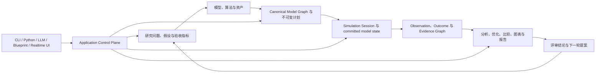

# GNCZMKN 目标架构：从这里开始

> 文档状态：目标架构 v1 权威设计与单路径重构基线。
> 适用范围：GNCZMKN 仿真内核、研究工作流、工具适配、产物系统、多语言接口及未来交互前端。
> 基线日期：2026-07；主叙事重组：2026-08。
> 旧入口归档：[legacy source index](../../reference/legacy/source-index.md#legacy-design-notes)。

## 1. 先看完整系统

GNCZMKN 要承载的核心活动，是研究者从一个 GNC 问题出发，得到可复核的结论，再据此修改假设、模型或算法。闭环仿真、DATCOM、配平、线性化、裕度分析、轨迹优化、打靶、图表、报告、Python 训练、自然语言设计和实时前端，分别参与这条研究主线的不同阶段。

框架的骨架是一条从意图到证据、再回到意图的连续变换链：

这条主线同时解释产品能力和架构边界：

- 研究者控制问题、物理假设、算法选择和结论解释；
- Model Ecosystem 提供可版本化的模型、算法、契约和资产；
- Compiler 把开放的作者意图冻结为已证明闭合的计划；
- Session 只执行计划，并在事务边界提交模型事实；
- Evidence 系统只记录已提交事实、结果和谱系；
- Workflow 使用 Artifact 连接外部工具、批量实验、分析与报告；
- 所有交互入口都经过同一个控制面，不生成第二套运行语义。

后续分册共同展开这一张图。它们是同一系统在不同放大倍率下的设计说明，不构成彼此独立的模块百科。

## 2. 用三个嵌套尺度理解运行

阅读任何局部设计前，先判断它位于哪个尺度：

| 尺度 | 从哪里开始 | 怎样推进 | 形成什么权威结果 | 主要分册 |
| --- | --- | --- | --- | --- |
| 研究迭代 | 问题、假设、指标、现有证据 | 建模、运行、分析、比较、评审 | Evidence Graph、结论与下一轮提案 | 00、08、09、10 |
| 单次运行 | Execution Plan + Run Binding | Session 生命周期、事件、取消、资源与多个 step | RunOutcome、运行级 Artifact 与 committed-state 历史 | 05、06、07、08 |
| 单个 step | `t_k` 的 committed state | publish、边界求值、连续求解、stage、validate、commit、seal | `t_{k+1}` 的 committed state 与绑定该提交的 Observation | 12、13、14 |

外层研究迭代可以编排多次运行；一次运行包含多个 step；一个 step 可以包含多个 Execution Region，并可执行 `SolverIslandPlan`。局部代码必须声明自己影响的尺度和提交边界。报告任务不会进入 step，控制律公式也不会拥有研究任务生命周期。

## 3. 主线中的六次权威交接

架构完整性来自交接结果，不能只靠目录和类名判断：

| 主线阶段 | 上游输入 | 本阶段完成的变换 | 权威输出 | 隔离作用 | 深入阅读 |
| --- | --- | --- | --- | --- | --- |
| 1. 研究表达与模型供给 | 问题、假设、算法、资产 | 把物理和算法意图表达成 versioned definitions、contracts、recipes 与 authoring source | DefinitionRef、Mission/Workflow Source | 实验逻辑留在 project/package，公共契约保持稳定 | 03、04、12、13 |
| 2. 语义编译 | Source、Catalog、Package contribution | 归一化、解析、绑定、证明、lower、freeze/link | Canonical Model Graph、ExecutionPlanDescriptor/Image、proof index | Plan Firewall 隔离作者表示和运行对象 | 05 |
| 3. 操作受理 | PlanRef、RunBinding、command、policy | 授权、资源预留、启动、取消与完成处置 | operation receipt、RunId、TaskOutcome | Artifact/Control Firewall 的 Control 面隔离入口和各 executor | 06、09、10 |
| 4. 模型推进 | ExecutionPlanImage、已提交状态、冻结输入 | 执行 regions/obligations，形成候选、校验并原子提交 | ModelCommit、state/topology revision、RunOutcome | Commit Firewall 保护唯一状态 owner 和时间语义 | 06、14 |
| 5. 证据提交 | ModelCommit、Observation、Outcome、artifact intent | 编码、校验、持久化与谱系登记 | ArtifactRef、EvidenceCommit、Evidence Graph | Artifact/Control Firewall 的 Artifact 面隔离运行内存和持久化格式 | 07、08 |
| 6. 研究决策与再编译 | committed ArtifactRef、Workflow Plan | 分析、优化、比较、图表、报告和人工门 | Analysis Artifact、报告、批准或拒绝的提案 | Workflow 通过 Artifact 回到新一轮作者意图 | 09、10 |

Design/Plan、Model、Operation 与 Artifact 四类 AuthorityDomain，是对这六次交接中“谁有资格提交何种事实”的归纳。三道防火墙来自交接处的隔离需要。权威域和防火墙服务于主线，不能取代主线本身。

## 4. 第一次阅读只走五站

首次进入这套设计时，按下列顺序建立全局心智模型：

1. [00｜愿景、范围与架构宪章](00-vision-and-architecture-principles.md)：理解研究工作台解决什么问题，以及长期取舍依据。
2. [00A｜从 YYZ Mission 到一条可复核结论](00a-yyz-end-to-end-walkthrough.md)：用固定数据看清 source、plan、run、CSV、Diagnostic、Artifact 与下一轮提案。
3. [02｜系统架构蓝图与演进接缝](02-layered-reference-architecture.md)：沿一项研究、一次运行和一个 step 走完整主线。
4. [15｜纵向架构验证、压力场景与对象落位](15-reference-vertical-designs-and-object-placement.md)：把抽象映射到 YYZ/CAVH、导航交班和未来场景。
5. [11｜架构演进路线总览](11-roadmap-overview.md)：理解目标架构按什么依赖顺序落到源码。

阅读途中遇到陌生名词时再查 [统一术语附录](reference-glossary.md)，无需先背完整词表。

需要编写局部代码时，再沿当前阶段向下钻取：

- 数学、物理语义、模型与组件内部：03 → 04 → 12 → 13；
- Mission 和执行计划：05；
- step 数据流与 Session 生命周期：14 → 06；
- 失败处置、记录和研究证据：07 → 08；
- DATCOM、配平、优化、图表与报告：09；
- Python、LLM、蓝图和实时前端：10；
- 旧代码迁移依据与当前缺口：01，再进入 11 的对应阶段。

编号只用于稳定引用；阅读顺序服从主线和当前任务。

## 5. 每组分册在主线中的职责

| 分册组 | 在主线中回答什么 | 它接收什么 | 它交给谁 | 边界要求 |
| --- | --- | --- | --- | --- |
| [00](00-vision-and-architecture-principles.md) | 为什么建设、怎样判断取舍 | 研究愿景与项目尺度 | 所有设计决策 | 不定义局部对象布局 |
| [01](01-current-architecture-deep-audit.md) | 当前代码从哪里出发、哪些要保留或退出 | 源码、测试和现行文档证据 | 路线的迁移输入 | 不充当目标运行语义 |
| [02](02-layered-reference-architecture.md) | 整个系统怎样从意图推进到证据，变化怎样进入 | 00 的愿景与 01 的事实 | 所有详细分册 | 这里是全局叙事与逻辑架构权威 |
| [03](03-mathematics-and-numerical-foundation.md)、[04](04-domain-contracts-and-interface-layer.md) | 全链路共享什么物理和数据语言 | 数学约定、领域语义 | Model、Compiler、Kernel、Evidence | 只给稳定语义，不吸收项目流程 |
| [12](12-runtime-object-model-and-component-anatomy.md)、[13](13-behavior-composition-and-extension-mechanisms.md) | 模型和算法怎样形成可编译的运行边界 | contracts、definitions、algorithms、assets | 05 的 Catalog/Compiler | 不拥有 Session 或 Workflow |
| [05](05-component-catalog-and-mission-compiler.md) | 开放意图怎样成为闭合计划 | authoring source + package contribution | 06/14 的 Session | 不推进模型时间 |
| [14](14-cycle-dataflow-state-transaction-and-continuous-closure.md)、[06](06-simulation-kernel-time-and-lifecycle.md) | 计划怎样形成唯一的 committed-state sequence | immutable plan + run binding | 07/08 的 Observation、Outcome | 不解释前端和报告格式 |
| [07](07-diagnostics-reliability-and-observability.md)、[08](08-data-artifacts-and-research-evidence.md) | 失败和结果怎样成为可信证据 | 各 owner 的 diagnostic draft、commit、observation、outcome | 09 的 Workflow 和研究者 | 不回写模型状态 |
| [09](09-research-workflows-and-tool-adapters.md) | 多次运行和外部工具怎样形成研究闭环 | committed ArtifactRef + Workflow Plan | 分析产物、报告、下一轮输入 | 不进入单步推进 |
| [10](10-packages-multilanguage-and-frontends.md) | 人、智能体和前端怎样使用同一系统 | Application commands、queries、events、schemas | proposal、command、snapshot | 不绕过 Compiler、Session 或 Evidence |
| [15](15-reference-vertical-designs-and-object-placement.md) | 主线能否在真实场景中闭合 | 02–14 的设计 | architecture proof 与对象落位 | 不另行发明全局语义 |
| [11](11-roadmap-overview.md) 与 [roadmap/](roadmap/) | 按什么依赖顺序把设计变成唯一运行路径 | 目标架构、科学 oracle、迁移约束 | 可执行工作包与阶段门 | 不重复定义对象契约 |

## 6. 从局部代码回到全局设计

开始修改前，用七个问题把局部任务挂回主线：

1. 这段代码消费主线中哪个已提交结果，又准备产生哪个结果？
2. 它位于研究迭代、单次运行还是单个 step？
3. 哪个 owner 对它改变的事实拥有唯一提交权？
4. 输入通过 contract、plan handle、command、query、event 还是 ArtifactRef 到达？
5. 时间关系、候选态、提交点和不可逆 effect 位于哪里？
6. 失败由哪个 Outcome 表达，哪份 evidence 能证明成功或降级？
7. 新功能完成后，哪些稳定区域应保持零修改？

七个问题回答完整后，先按变化等级选择治理深度。单一权威域内、没有新增共享契约或执行语义的 A–E 类改动填写简化 `ChangeCard`；F 类、跨两个及以上 AuthorityDomain，或改变 identity、owner、time、commit、rollback、effect 语义的改动填写完整 `CapabilitySlice`。两种表单都要从系统职责推导文件和接口，减少沿现有类结构顺手堆叠逻辑的风险。

## 7. 参考附录：文档中的决策状态

| 标记 | 含义 | 后续动作 |
| --- | --- | --- |
| **继承约束** | 已由当前项目文档和有效运行语义确立 | 修改前需要 ADR 和回归测试 |
| **目标决策** | 目标 v1 的权威选择 | 实现必须遵守；变更需先更新分册、ADR 与验证证据 |
| **后续能力** | 已明确排除在 v1 路径外 | 出现真实消费者和证据后开启独立路线 |

02 已冻结 Plan/Commit/Artifact-Control 三道防火墙、四类 AuthorityDomain、七维 ChangeVector、九类扩展接缝和分区语义准入门。12–15 确定模型运行路径的对象 ownership、behavior composition、execution obligations、因果方向、state/slot 表达和提交边界；08–10 确定 Artifact、Workflow 与 Control 路径；实现 ADR 只记录局部参数与实现证据。

能力交付状态统一使用术语注册表中的五个值：`Stable` 表示已冻结并要求跨迁移保留的架构/科学约束，`V1` 表示第一代目标，`PressureOnly` 表示只验证接缝，`Deferred` 表示已有明确准入门，`Legacy` 表示迁移来源。状态描述承诺层次，不等同于当前源码完成度；详细分册不能自行创造相近状态词。

验收项还要标明证据成熟度：`Fixture` 表示已有规范数据实例，`Gate` 表示已有可执行退出条件，`Implemented` 表示源码和自动测试已通过。缺少标记的目标契约不能被描述成当前已交付能力。

## 8. 参考附录：统一术语

[统一术语表](reference-glossary.md) 独立放置，供按需查询。首次阅读应先完成本页 §1–§6 与 02 的主叙事，再进入术语表。

## 9. 参考附录：权威模型与派生模型

Design/Plan、Model、Operation 与 Artifact 四类 AuthorityDomain 的正式定义、各域封闭操作语言、跨域 handoff 和支持判据统一位于 [02｜系统架构蓝图与演进接缝](02-layered-reference-architecture.md)。本索引只保留主线和阅读导航，避免复制第二份逻辑架构说明。

## 10. 参考附录：需求覆盖矩阵

| 需求编号 | 目标能力 | 主文档 | 主要验收产物 |
| --- | --- | --- | --- |
| G-01 | 理论人员专注算法，其余链路可复用 | 00、02、09 | 端到端纵向工作流 |
| G-02 | 统一数学、单位、坐标和数值策略 | 03 | 数学契约测试与参考算例 |
| G-03 | 清晰、稳定、可演进的架构接缝 | 02、04、12、14 | AuthorityDomain + 七维变化向量、分区操作 lowering、跨域 handoff、对象 ownership 与端口时序测试 |
| G-04 | Mission 可编译、可诊断、可由工具生成 | 05 | Mission IR 与 dry-run 报告 |
| G-05 | 确定性、可取消、可恢复的仿真 Session | 06、14 | 生命周期、整步事务、失败点注入与回放测试 |
| G-06 | 结构化异常处置和完整可观测性 | 07 | Diagnostic、RunOutcome 和失败点注入测试 |
| G-07 | 数据、图表、报告形成可追溯证据 | 08 | Run Manifest 与 Artifact DAG |
| G-08 | DATCOM、配平、特性量、裕度等自动化 | 09 | 气动到控制论证流水线 |
| G-09 | 导航交班链路闭环论证 | 09 | 接口闭合矩阵和论证报告 |
| G-10 | GPOPS2 与论文算法复现工程化 | 09 | 外部适配器和复现包 |
| G-11 | Python 智能体训练 | 10 | 可重入 reset/step 环境 |
| G-12 | LLM 自然语言设计与仿真配置 | 10 | 受控提案、编译、审批、执行环 |
| G-13 | 蓝图式仿真设计 | 05、10 | 图编辑模型到 Mission IR 编译 |
| G-14 | UE、Godot、ImGui 实时前端 | 06、10 | 快照/命令边界和实时演示 |
| G-15 | 导弹、卫星、火箭、飞机领域扩展 | 04、05、10 | 版本化领域包和兼容矩阵 |
| G-16 | 组件结构代码与算法研究解耦 | 12、13、15 | Runtime Cell Recipe、算法六件套、嵌入机制和无 Session 单元测试 |
| G-17 | 组件内部行为与共享决策持续扩展 | 02、13、15 | local mechanism、`DecisionAuthority` promotion rule、原子构型 transition |
| G-18 | 多速率与连续物理链路语义闭合 | 14、15 | Execution Region、Boundary DAG、TemporalRelation、ClosurePlan 和 reference case |
| G-19 | JSON/YAML/INI 等输入表示可替换 | 02、05、11 | Source Frontend conformance、SourceMap 与 semantic hash equality |
| G-20 | CSV/MAT/HDF5 等数据编码可替换 | 02、08、11 | EncodingPlan、Dataset Sink 与 round-trip dataset equality |
| G-21 | 多实体 truth、传感、通信与关系建模 | 04、10、14、15 | compiled selector、two-entity causal fixture 与 entity-scoped evidence |
| G-22 | 拉偏、扰动与模拟故障因果闭合 | 04、07、13、15 | VariationTarget、typed fault command、owner state 与 physical termination fixture |
| G-23 | 分离、接地和动态拓扑演进 | 06、10、14、15 | inactive activation、contact/regime reference 与 `SegmentTransaction` / `TopologyTransaction` gates |
| G-24 | 卫星星座、天体、时标与星间链路 | 03、04、10、15 | TimeScale/Ephemeris/Frame contracts 与 constellation fixture |

## 11. 文档治理规则

1. 这套文档定义长期方向，当前源码仍以仓库现有文档和测试为运行事实。
2. 02 是“意图—计划—运行—证据—迭代”全局主叙事的唯一权威；详细分册只能放大其中一段，11 与 `roadmap/` 只定义建设顺序。
3. 每个详细分册开头必须声明主线位置、上游输入、权威输出和下游消费者；新增章节也要能写出输入—变换—提交—证据链。
4. 一个术语或契约只在职责最接近的分册中完整定义；其他分册通过链接引用，并说明它在本地流程中的用途。
5. 新增跨册术语前，先在 [全库术语注册表](reference-glossary.md) 登记唯一名称、生命周期状态、定义和权威分册；改名要在同一变更中更新全部引用和退出映射。
6. 共享枚举、cache key、identity 或状态机只能有一个权威定义。详细分册引用该定义，并给出本地使用实例，不能复制一份字段略有差异的版本。
7. 新需求先写因果叙述。普通 A–E 类局部变化填写 `ChangeCard`；F 类、跨权威域或改变 identity/owner/time/commit/rollback/effect/shared contract 的变化填写完整 `CapabilitySlice` 与七维 ChangeVector。只有无法降级到既有 Execution Algebra 的 F-Model 变化可以进入 `KernelCapability` 评审。
8. 目标契约进入稳定 API 前，至少经过一个项目侧真实案例和一个失败案例验证；纵向案例必须贯穿权威输入、运行结果和 Evidence route，并标明 `Fixture`、`Gate` 或 `Implemented`。
9. `PressureOnly` 与 `Deferred` 能力可以留在正文承担压力验证；标题、表格和术语注册表必须同步标明状态，正文不能把它们写成 v1 承诺。
10. 源码、Mission schema、运行语义发生变化时，同步更新 02 的主线影响、职责分册、15 的纵向证明、11 的阶段门和现有 `doc/` 用户文档。
11. 任何前端、语言绑定或外部工具都通过控制面、Artifact 或稳定边界接入，避免直接操纵内核运行对象。
12. 术语、链接、UTF-8、Markdown 和 reference fixture conformance 进入 R0 自动文档门；处置依据见 [专家评审处置](专家评审处置.md)。
