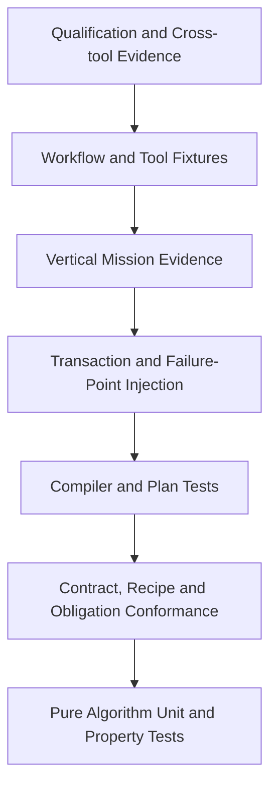

# 路线治理｜直接重构、架构守卫与验收

[上一分册：R6–R8](r6-r8-platform-and-frontends.md) · [返回路线总览](../11-roadmap-overview.md) · [返回文档总索引](../README.md)

**主线定位**：本分册治理整条重构链，确保每个阶段都有科学 oracle、权威交接、成功/失败证据、架构守卫和旧路径删除。它决定何时可以切换主线，不重新定义各分册的对象契约。

## 1. 治理结论

R0–R3 采用单路径直接替换。当前仓库没有外部用户与发布兼容责任，源码、Mission、输出格式和运行对象都可以按目标架构重写。治理重点包括五件事：

1. 科学结论和数学约定有独立 oracle；
2. 未来变化具有明确 CapabilitySlice、AuthorityDomain、七维 ChangeVector、change class、extension seam 和稳定区；
3. ownership、信息流和提交语义在实现前闭合；
4. 新 Compiler/Session 从空骨架建立，旧内核不进入新对象内部；
5. 纵向 slice 与压力场景通过后完成硬切换和旧路径删除。

Git branch、commit 与 Evidence Bundle 提供回看和回退。运行时不承担历史博物馆职责。

## 2. 保留、重写与删除

### 2.1 保留的科学资产

- 用户确认的 GNC 数学、坐标、四元数和单位约定；
- 明确的物理假设、模型公式与适用域；
- 初始条件、气动/推进/质量资产及其来源；
- 有独立依据的轨迹、公式中间量和收敛 reference；
- terminal t_k 进入观测的研究语义；
- project-first、可复现、早失败和可诊断原则。

### 2.2 直接重写的结构

- ConfigManager/ConfigReader 运行配置链；
- NodeFactory、registration macro 与 RTTI interface discovery；
- SimulationNode、DiscreteNode 和 provider getter 接口；
- AssemblyContext/NodeRegistry 名称绑定；
- Simulator 调度、离散原地 state 和 continuous-only commit；
- IObservable getter、AutoDataLogger 与自由 summary；
- 通用 callback StateMachine；
- 旧 Mission schema、priority 依赖和 component lookup names；
- 大一统 project types/provider headers。

### 2.3 只保留在历史中的内容

- 旧 C++ API；
- 旧 Mission reader；
- 旧 CSV 列顺序与 summary 文案；
- direct Simulator unit fixture；
- facade、forwarding header、feature flag 和双 runtime；
- 用于兼容旧错误的宽松默认、silent clamp 和 unknown-state-to-zero。

旧 runner 可以在重构分支早期生成 comparison evidence。完成 G6 后从工作树删除，通过 git commit 访问。

## 3. 目标对象到源码责任

| 目标对象 | 权威分册 | 实现责任 | 禁止依赖 |
| --- | --- | --- | --- |
| Definition/PreparedModel/Kernel/Result | [12](../12-runtime-object-model-and-component-anatomy.md) | model/algorithm packages | ConfigNode、Session、logger、filesystem |
| execution form / RuntimeCellRecipe / execution obligations | [02](../02-layered-reference-architecture.md)、[12](../12-runtime-object-model-and-component-anatomy.md) | model SDK + compiler lowering | 领域/RuntimeCellProfile switch、名称绑定、PureQuery/Closure 实例化 |
| Algorithm/mechanism/StateFragment/owner reducer | [13](../13-behavior-composition-and-extension-mechanisms.md) | Runtime Cell Recipe + compiled obligations | arbitrary callback、跨 owner 写、局部工具节点化 |
| Port/TemporalRelation | [14](../14-cycle-dataflow-state-transaction-and-continuous-closure.md) | contract/compiler | 隐式调用顺序 |
| CycleFrame/CommittedStateStore/StepTransaction | [14](../14-cycle-dataflow-state-transaction-and-continuous-closure.md) | runtime | JSON、Catalog lookup、文件 sink |
| `ClosurePlan` / `IntegrationScopePlan` | [14](../14-cycle-dataflow-state-transaction-and-continuous-closure.md) | runtime continuous + model kernels | mutable component query |
| YYZ/CAVH composition | [15](../15-reference-vertical-designs-and-object-placement.md) | project packages | 旧 provider shell |
| SourceFrontend/SourceTree/SourceMap | [05](../05-component-catalog-and-mission-compiler.md) | authoring adapters + compiler boundary | runtime、模型实例、领域默认值 |
| Entity selector/topology/intervention plans | [04](../04-domain-contracts-and-interface-layer.md)、[14](../14-cycle-dataflow-state-transaction-and-continuous-closure.md) | contracts + compiler + owner reducers | 全局 truth/fault 容器、跨 owner 写 |
| ObservationBatch/EncodingPlan/Dataset Sink | [08](../08-data-artifacts-and-research-evidence.md) | evidence adapters | model query、CommittedStateStore 写、物理执行选择 |

实现 PR 无法指出对应目标对象和权威分册时，不进入 R0–R3 主分支。

## 4. 工作分支与提交策略

### 4.1 分支

- 使用单个目标重构分支承载新架构；
- 旧主线保持可查，不在目标分支维护同步功能；
- 大规模机械搬迁与语义改动分开提交；
- 每个 gate 形成可 build、可审阅、带 evidence 的 checkpoint commit。

### 4.2 推荐提交序列

```text
1. scientific oracles and design guards
2. target contracts/descriptors
3. runtime primitive unit tests and skeleton
4. mission compiler and explain
5. empty-model Session transaction
6. YYZ slice by vertical subchain
7. scientific difference approval
8. runner/active-project cutover
9. old runtime deletion
10. docs/current architecture update
```

提交 8 与 9 之间只允许短暂审阅窗口，禁止继续向旧路径添加功能。

### 4.3 rollback

Rollback 以 commit 为单位。回退后重新分析失败原因，再修正目标设计或实现。禁止为方便 rollback 在 runtime 中增加 `use_legacy_*`、dual schema 或 adapter graph。

## 5. 科学 oracle 治理

### 5.1 oracle 层次

| 层次 | 证据 |
| --- | --- |
| 数学性质 | unit/frame/quaternion invariants、解析解 |
| 数值算法 | convergence order、residual、independent implementation |
| 模型 kernel | paper table、MATLAB/Python reference、golden intermediate values |
| component contract | input/output/time/quality/reset/failure cases |
| closure | force/moment balance、hold/candidate comparison、dt convergence |
| vertical mission | key trajectories、events、terminal metrics、energy/mass invariants |

最终 CSV 只能作为 vertical evidence 的一部分，无法替代公式与 kernel oracle。

### 5.2 差异分类

新旧结果差异必须归入：

| 类别 | 处理 |
| --- | --- |
| 旧实现错误 | 修复，记录旧证据无效范围 |
| 目标约定统一 | 采用权威约定，更新 reference 与 ADR |
| 显式模型变化 | 新 model/algorithm id，分别保存 evidence |
| 时间语义澄清 | 写 TemporalRelation/closure policy，做 convergence comparison |
| 浮点实现差异 | 依据 tolerance、invariant 和 convergence 接受或调查 |
| 无法解释 | 阻断切换 |

“旧结果能跑”与“曲线看起来接近”都不构成接受理由。

### 5.3 用户修订保护

`03-mathematics-and-numerical-foundation.md` 8.1 的四元数权威约定是 R0 oracle 的输入。任何自动重写、格式化或迁移不得自行改变其方向、乘法或序列化规则。相关代码与测试引用同一 ADR/contract id。

## 6. 删除台账

删除台账取代兼容层台账。每项至少包含：

| 字段 | 含义 |
| --- | --- |
| legacy object/path | 目标删除对象 |
| hidden semantics | 其中需要提取的科学或测试事实 |
| target replacement | 新对象与分册链接 |
| consumers | 当前调用点 |
| migration batch | 所属 vertical/bulk work package |
| guard | 删除后禁止回归的 rg/include/compile rule |
| deletion commit | 实际删除证据 |
| residual exception | 必须为零或有明确非运行用途 |

首批台账：

| Legacy | Target | 删除门 |
| --- | --- | --- |
| ConfigManager/ConfigNode runtime use | SourceTree/SourceMap + CompiledModelOccurrence/AlgorithmDefinition | kernels/Session 无 ConfigNode include |
| ConfigReader in component | schema compiler + Definition validator | components 无 JSON parse |
| NodeFactory/registration macro | package descriptor/Catalog contribution | catalog 只读新 descriptors |
| NodeRegistry/AssemblyContext | Execution Plan + typed handles | runtime 无 lookup name |
| SimulationNode/DiscreteNode | execution form + RuntimeCellRecipe + compiled obligations | all models classified，only boundary-qualified cells enter InstanceStore |
| Simulator | new Session collaborators | runner/tests only new Session |
| IDiscreteTask::update | evaluate -> ComponentDelta | no in-place discrete writes |
| IContinuousSystem getter interface | StateSchema + derivative kernel + scope | plan owns state blocks |
| IObservable | ObservationProjectionPlan | no getter lambda |
| generic StateMachine callbacks | embedded mode/protocol mechanism + owner reducer | no runtime callback mutation、no independent RuntimeInstanceId |
| interaction mutable query | pure ClosureKernel | query call-count test passes |
| project provider header | split contracts + ports | no provider RTTI path |

## 7. R0–R3 直接重构节奏

### 7.1 R0：设计与 oracle

- 完成 current-source evidence inventory；
- 对未来压力场景先做 AuthorityDomain × 七维 ChangeVector 分解，再做 A–F change-class × seam × untouched-area 分类；
- 为表示格式、多实体、故障/拉偏、实体 activation、地面接触和天体星座记录完整 transformation route；
- 对所有代表模型做 placement × execution-form × boundary-reason × obligations × state-owner 分类；
- 固定 02、12–15 的架构主轴与对象关系；
- 建立 quaternion/math/model/mission reference bundles；
- 建立删除台账与 architecture guards。

退出条件：没有函数、变量、mode、port 或 closure 的 ownership 悬空项。

### 7.2 R1：目标原语

- Domain Contracts；
- Definition/PreparedModel/AlgorithmResult；
- State/Output/Telemetry schema；
- ComponentDelta；
- RuntimeCellRecipe、execution obligations 与 SDK profiles；
- embedded mechanism/StateFragment/owner reducer 与 `DecisionAuthority`；
- entity-scoped truth selector、VariationTarget 与 fault/perturbation owner contract；
- DiagnosticDraft/Outcome；
- fixture algorithms/components。

退出条件：fixture 可在无 Session 单测和空模型 Session 中同时运行。

### 7.3 R2：Compiler/Plan

- SourceFrontendPort、SourceTree/SourceMap 与格式 conformance；
- package-owned Catalog descriptors、StateSchema/layout identity、initial-state builder、PublishProjection 与 execution entries；
- typed Mission IR；
- BindingPlan、TemporalBindingPlan、StateBlockPlan、CommandRoutePlan、EventDeliveryPlan、EntityTopologyPlan 与 InterventionPlan；
- QueryPlan、ClosurePlan、static invocation authorization、RuntimeComponent callsites 与 execution region DAG；
- IntegrationScopePlan、TransactionPlan、Observation/Encoding plans；
- 从真实 planning facts 派生的 PlanProofIndex；
- 无选择语义的 exact linker 与 immutable process-local ExecutionPlanImage；
- 分层 model/execution/observation/encoding hashes；
- dry-run/explain；
- negative compile suite。

R2 可以抽取和链接 package-owned 纯 entry，但不得调用它们；Image 不包含 per-session state、workspace、PreparedModel/Bound handle、RuntimeCell、runner 或 Session。退出条件：YYZ target source 能生成完整、已证明、已链接且可解释的静态 Image，不创建 runtime instance，也不执行 simulation step。

### 7.4 R3：Session 与纵向切换

- 从 ExecutionPlanImage 物化 PreparedModel/Bound handles、workspace、RuntimeCell 与 per-session state；
- lifecycle/CommittedStateStore/CycleFrame/compiled scheduler/StepTransaction；
- 调用 projection/query/closure/component/derivative entries，执行 integration、candidate staging 与 atomic commit；
- YYZ contracts 与 sensor-nav-guidance-control chain；
- configuration-actuator-propulsion-mass-aero-closure-form chain；
- terminal/evaluation/observation；
- 两实体 truth/传感/通信、故障物理链与 inactive child activation fixtures；
- failure injection 与 scientific difference report；
- runner/active project 切换；
- 旧 runtime 删除。

退出条件：G4–G6 全部通过。

## 8. ADR 治理

02、12–15 已冻结首版架构防火墙、扩展接缝、对象 ownership、behavior composition、execution obligations、state/slot 表达、因果方向和纵向落位。本节 ADR 用于记录这些权威决策、补充局部实现参数并关联验证证据，不能把已关闭的基础设计重新列为多方案选择。新证据若迫使基础设计变化，应先更新对应分册与压力/纵向案例，再形成 Superseding ADR。

### 8.1 必须写 ADR

- 四元数、frame、unit 和 attitude error 约定；
- state storage/layout 与 ComponentDelta representation；
- CycleFrame slot ownership/lifetime；
- terminal instant/interval commit；
- command/event delivery；
- embedded mechanism state/owner reducer、`DecisionAuthority` 与 transition conflict；
- Frozen/Candidate/Algebraic closure；
- integrator/candidate context；
- Artifact identity/hash；
- Control/Python/IPC boundary；
- runtime entity activation；
- 新 execution form、execution obligation、region 或 `KernelCapability`。

### 8.2 ADR 模板

```text
Title / Status / Date / Owner
Concrete source evidence and research scenario
Target objects and owners
Inputs, outputs and temporal relations
State, mode and transaction semantics
Mathematical/physical assumptions
Failure, diagnostic and policy
Evidence and oracle
Alternatives
Source deletion impact
Consequences and revisit trigger
```

### 8.3 状态

Proposed -> Trial -> Accepted -> Superseded/Rejected。Trial 有真实 project consumer、截止 gate 和 evidence。R0–R3 的基础 ownership ADR 在进入 R3 前必须 Accepted。

## 9. 架构 Fitness Functions

### 9.1 主轴与扩展接缝守卫

| ID | 自动检查 |
| --- | --- |
| FF-ARCH-01 | package/model SDK 不依赖 compiler、kernel、workflow、application 或 adapter |
| FF-ARCH-02 | Kernel source 无 placement、vehicle type、RuntimeCellProfile 或 mechanism id 分支 |
| FF-ARCH-03 | SDK RuntimeCellProfile 全部在 Compiler 展开为 obligations/region callsites |
| FF-ARCH-04 | embedded mechanism 无 RuntimeInstanceId、独立 port、schedule 或 lifecycle hook |
| FF-ARCH-05 | Workflow/Artifact 不读取 CommittedStateStore、CycleFrame 或 Runtime Cell pointer |
| FF-ARCH-06 | Frontend 只依赖 Authoring/Application/Observation DTO |
| FF-ARCH-07 | 新 `KernelCapability` 带 F 类场景、ADR、Compiler representation 和 failure-point evidence refs |
| FF-ARCH-08 | 压力测试清单记录 primary seam 与 untouched areas，纵向 diff 符合声明 |
| FF-ARCH-09 | 每个 CapabilitySlice 可追踪 AuthorityDomain -> canonical grammar -> proof -> closed operator -> commit -> evidence route |
| FF-ARCH-10 | 高风险 feature design 有 `<AuthorityDomain, Delta<V,G,S,T,I,R,X>>`、grammar delta、PlanProofRecords、operator lowering 与 handoff；普通变化有 ChangeCard |
| FF-ARCH-11 | Kernel、Workflow scheduler、Control handler 与 Artifact Store dispatch 不含具体飞行器、故障、文件格式、研究工具或前端产品名称 |
| FF-ARCH-12 | Plan、Model、Operation、Artifact owner 只提交本域事实，跨域只交换 typed intent/ref/receipt/Outcome |
| FF-ARCH-13 | 每个 workflow task 可追到 Workflow Graph、proof、Operation/Artifact operators、TaskOutcome 与 ArtifactCommit |
| FF-ARCH-14 | 每轮 gate 使用新的 withheld scenario；产品专用执行分支使抽象闭包检查失败 |
| FF-ARCH-15 | model/task/contract definitions 经 declare/validate/version/publish 取得稳定 DefinitionRef，发布过程不创建 Session 或启动工具 |
| FF-ARCH-16 | `Delta=0` 的重构、优化或缺陷修复提供 preservation proof；检测到语义差异时必须更新 ChangeVector 与证据 |

### 9.2 依赖守卫

| ID | 自动检查 |
| --- | --- |
| FF-DEP-01 | foundation/math 不 include runtime/config/logger/filesystem |
| FF-DEP-02 | domain contracts 不 include JSON/CSV/CLI/Eigen-specific serialization |
| FF-DEP-03 | algorithm kernels 不 include Mission/Session/Catalog/Artifact/Frontend |
| FF-DEP-04 | framework 不 include `user/<project>` |
| FF-DEP-05 | runtime 不 include concrete CSV/report/tool/frontend |
| FF-DEP-06 | workflow task 不 include runtime state/instance store |
| FF-DEP-07 | frontend 不 include component/runtime internals |
| FF-DEP-08 | package private algorithm headers 不跨包泄漏 |
| FF-DEP-09 | Compiler core 不依赖 JSON/YAML/INI parser，Dataset Sink 不依赖 Runtime Cell/CommittedStateStore |

### 9.3 对象与状态守卫

| ID | 自动检查 |
| --- | --- |
| FF-OBJ-01 | 每个 RuntimeComponent 有 boundary reason、recipe provenance、obligations、state/output handles 和 descriptor |
| FF-OBJ-02 | component/algorithm 中无 ConfigNode、lookup name、registry 指针 |
| FF-OBJ-03 | initialize path 不调用 scheduled evaluate |
| FF-OBJ-04 | 影响未来结果的 mutable member 全部进入 StateSchema |
| FF-OBJ-05 | Workspace/Telemetry 不进入 checkpoint |
| FF-OBJ-06 | Output 与 Telemetry FieldId 分属独立 schema |
| FF-OBJ-07 | PureQuery 无可观察写副作用 |
| FF-OBJ-08 | 一个 state block 只有一个 owner |
| FF-OBJ-09 | RuntimeInstanceId 只作 plan-local slot，完整 cell identity 包含 SessionId |
| FF-OBJ-10 | session resource prepare 看不到 RunBinding，initial/reset builder 无外部副作用 |
| FF-OBJ-11 | RunFinalizeHook 失败后 lease close 仍执行，run commit 前失败不调用 RunFinalizeHook |
| FF-OBJ-12 | InstantPatch/IntervalCandidate 只携带完整 owner-block replacement，无裸 offset/字段级 byte patch |
| FF-OBJ-13 | StateCodec clone/validate 在 commit 前完成，commit swap 为 noexcept |
| FF-OBJ-14 | CycleFrame view 不越过 StepTransaction；held output 深拷贝，无界动态 payload 不进入 frame |
| FF-OBJ-15 | mechanism StateFragment 合并到唯一宿主 owner block，无独立 state handle |

### 9.4 behavior 与 `DecisionAuthority` 守卫

| ID | 自动检查 |
| --- | --- |
| FF-BEH-01 | shared phase/configuration snapshot 只有一个 writer |
| FF-BEH-02 | mechanism state fragment namespace/initializer/reset/checkpoint 完整 |
| FF-BEH-03 | no arbitrary enter/exit callback external mutation |
| FF-BEH-04 | timer 使用 simulation tick |
| FF-BEH-05 | configuration consumers 覆盖全部 declared ids |
| FF-BEH-06 | command/event/decision/snapshot contract 分离 |
| FF-BEH-07 | ActuatorCommand 携带 basis configuration revision，每条可达 transition 有旧命令处理策略 |
| FF-BEH-08 | package-local mechanism/RuntimeCellProfile 加入时 Kernel source diff 为空 |
| FF-BEH-09 | entity truth 只有对应 entity owner projector；selector view 只读且 plan-local |
| FF-BEH-10 | simulated fault injector 只提交声明 command，不写其他 owner state 或直接终止 run |

### 9.5 编译与数据流守卫

| ID | 自动检查 |
| --- | --- |
| FF-PLAN-01 | current-cycle sampled edges 形成 DAG 或显式 solver group |
| FF-PLAN-02 | later-to-earlier current edge 编译失败 |
| FF-PLAN-03 | priority 不创建或覆盖 dependency |
| FF-PLAN-04 | 每条 edge 有 port kind 与 TemporalRelation |
| FF-PLAN-05 | rate/hold/freshness 静态闭合 |
| FF-PLAN-06 | closure candidate dependency 成员完整 |
| FF-PLAN-07 | plan hash 不依赖显示名、注册顺序和 UI layout |
| FF-PLAN-08 | Runtime Cell recipe 展开结果包含 obligations、region、state/port writes 和 attribution |
| FF-PLAN-09 | 等价 JSON/YAML source 具有相同 model graph/execution core hash |
| FF-PLAN-10 | 改变 Dataset Sink 只改变 observation/encoding/descriptor 相关 hash |
| FF-PLAN-11 | selector cardinality、inactive policy、activation mapping 与 intervention target 在 compile-time 闭合 |
| FF-PLAN-12 | 每个 Model Graph grammar element 都能追到一个或多个既有 Execution Algebra operator；未 lowering 元素编译失败 |
| FF-PLAN-13 | Descriptor 为 identity/ownership/causality/time/state/resource/evidence 七类 closure 提供可查询 proof refs |

### 9.6 运行事务守卫

| ID | 自动检查 |
| --- | --- |
| FF-RUN-01 | t_k publish/observation/terminal timeline |
| FF-RUN-02 | component 只能返回 owner delta |
| FF-RUN-03 | discrete failure 保持 committed epoch |
| FF-RUN-04 | integration failure 回滚当前 step instant/interval delta |
| FF-RUN-05 | terminal commit instant，丢弃 interval/continuous candidate |
| FF-RUN-06 | query call count 不影响 physical result/observation |
| FF-RUN-07 | cancel/failure finalize exactly once |
| FF-RUN-08 | wall time 不进入物理状态 |
| FF-RUN-09 | model commit 与 evidence durability 独立可查 |
| FF-RUN-10 | parent/child activation 与 topology revision 使用同一 ModelCommit，下一 Publish Region 才暴露 child truth |

### 9.7 诊断、证据与配置守卫

| ID | 自动检查 |
| --- | --- |
| FF-DIA-01 | 新公开 failure 有 stable code |
| FF-DIA-02 | tests 不匹配完整文案 |
| FF-DIA-03 | primary diagnostic 不被 cleanup 覆盖 |
| FF-DIA-04 | kernel 不直接 LOG/切 mode |
| FF-ART-01 | 每次 run 总有 manifest/outcome |
| FF-ART-02 | figure/report 可追到 inputs/plan/algorithms/assets |
| FF-ART-03 | CSV/MAT round-trip dataset 在 FieldId、entity、time、unit、frame 与 quality 上语义等价 |
| FF-CFG-01 | stable/project physical config unknown/type/required 严格 |
| FF-CFG-02 | source/default/override origin 可查 |
| FF-CFG-03 | runtime 无 raw JSON/path resolution |

### 9.8 删除守卫

R3 切换后，CI 对以下 token/path 新引用失败：

```text
SimulationNode
DiscreteNode
NodeFactory
NodeRegistry
AssemblyContext
IObservable
IDiscreteTask
GNC_REGISTER_NODE_TYPE
GNC_REGISTER_BUILTIN_NODE
requireByName
bindIfPresent
```

若某个名称在非运行用途继续存在，必须改名或通过精确 allowlist 说明，避免宽泛例外。

## 10. 测试架构



### 10.1 pure algorithm

- Definition validation；
- state transition/reducer；
- mathematical properties；
- numerical domain/failure；
- telemetry intermediate values；
- independent reference。

### 10.2 execution form、recipe 与 obligation conformance

PureQuery fixture 验证无 Session identity、无 state/schedule entry、重复 query 无写副作用；Closure fixture 验证只由 `ClosurePlan` / `IntegrationScopePlan` 调用、candidate context 完整且无 RuntimeComponent lookup。

每个基础 execution obligation 用通用 fixture 验证：

- initial state；
- committed-state read-only；
- legal delta writes；
- reset/checkpoint；
- output timing；
- diagnostic enrichment；
- deterministic repeated evaluation。

每个 SDK `RuntimeCellProfile` 验证能够确定性展开为 state/port/obligation/lifecycle plan，Kernel 无 RuntimeCellProfile-specific entry。embedded mechanism 另验证 StateFragment 合成、宿主 rollback、attribution 和无独立运行身份。

### 10.3 compiler

- per-pass positive/negative；
- source map；
- JSON/YAML semantic equivalence 与受限 INI positive/negative mapping；
- port cardinality/unit/frame/time；
- execution region/obligation callsite/Boundary DAG/algebraic loop；
- behavior recipe/`DecisionAuthority`/configuration coverage；
- entity selector/topology/activation/intervention coverage；
- closure group；
- canonical plan hash；
- layered model/execution/observation/encoding hashes；
- dry-run no runtime side effect。

### 10.4 transaction/failure-point injection

在 publish、每个 Boundary level/obligation callsite、transition reducer、delta validation、termination、closure query、每个 RK stage、candidate validation、model commit 前后、sink flush/finalize 注入失败。

每个 case 断言：

- committed epoch/tick；
- state/output store；
- command ledger sequence/queue 与 application receipt/consumption 分别断言；
- event visibility；
- observation sealed/durable status；
- primary/related diagnostics；
- finalize journal 与无条件 lease close。

### 10.5 vertical evidence

- minimal 3DoF；
- YYZ 6DoF frozen closure；
- YYZ/CAVH guidance mode transition；
- configuration/mass/propulsion transition；
- two-entity truth/sensor/link fixture；
- stuck-actuator-to-impact fixture；
- predeclared parent-child activation fixture；
- CSV/MAT dataset conformance fixture；
- withheld reasonable-demand review：只给出需求语义，由评审者现场生成 CapabilitySlice、AuthorityDomain/ChangeVector、grammar/proof/operator/commit/handoff route；
- candidate-state high-fidelity closure（R3 后）；
- Experiment/Workflow（R4–R5）。

## 11. 切换门禁

### 11.1 允许切 runner 前

- new Catalog/Compiler/Plan 只有一个权威 descriptor source；
- YYZ slice 完整；
- G0–G5 通过；
- scientific difference report 经维护者确认；
- all step failure-point injection pass；
- necessary MinGW build/tests pass；
- active project target Mission 可 dry-run/run。

### 11.2 runner 切换提交

- runner 只调用 new Application/Compiler/Session；
- CLI help/list-components/config examples 同步；
- old runner target 从默认 build 移除；
- current architecture docs 在同一提交或紧随提交更新。

### 11.3 删除提交

- 删除旧 runtime/schema/tests/examples；
- 执行 deletion guards；
- 全库无 legacy lookup/provider path；
- build/test/reference bundle 再次通过；
- 记录删除清单和 commit。

### 11.4 R4 解锁

G6 未完成时不得大规模建设 Artifact、Python 或前端，以免这些能力绑定即将删除的内部对象。

## 12. Definition of Ready

R0–R3 任务进入实现前需要：

- CapabilitySlice decomposition、AuthorityDomain 与七维 ChangeVector；
- domain-specific canonical grammar、proof、closed operators、commit/receipt 与跨域 handoff；
- concrete source evidence；
- research/physical scenario；
- A–F change class、primary extension seam 与 untouched areas；
- target owner/partition/placement/boundary reason/obligations；
- Definition/State/Input/Output/Telemetry/Kernel 表；
- Runtime Cell Recipe、embedded mechanisms 与 StateFragments；
- ports/TemporalRelation；
- behavior/`DecisionAuthority`/configuration/closure 决策；
- success/failure/terminal state table；
- diagnostic/policy owner；
- oracle 与 tests；
- legacy deletion impact；
- explicit non-goals。

缺少 ownership 或 temporal relation 的任务返回设计阶段。

## 13. Definition of Done

- target implementation and descriptor complete；
- pure/contract/compiler/transaction tests pass；
- stable Diagnostic codes；
- scientific oracle comparison complete；
- no hidden default/path/global state；
- no in-place cross-owner mutation；
- no legacy runtime dependency；
- deletion guard added；
- performance/determinism measured where relevant；
- docs/ADR/reference Artifact updated；
- requirement traceability updated。

## 14. Review checklist

### 14.1 对象与 SOLID

- 需求是否已经分解为 CapabilitySlice，并明确每个切片的 AuthorityDomain？
- 每个切片是否能闭合到本域 operator/commit，跨域是否只使用 typed handoff？
- RuntimeComponent 是否确有独立 state/schedule/`DecisionAuthority`/resource？
- Definition、State、Output、Telemetry、Workspace 是否分离？
- Kernel 是否可脱离 Session 测试？
- Runtime Cell Recipe 是否把局部 behavior 留在宿主，并展开为最小 obligations？
- SDK `RuntimeCellProfile` 是否只存在于 package/compiler，不进入 Kernel switch？
- interface 是否由具体 consumer 定义？
- 新抽象是否减少真实重复或固定实际契约？

### 14.2 behavior、`DecisionAuthority` 与信息流

- 局部工具是否以 embedded mechanism/StateFragment 存在？
- 共享概念是否确有独立 `DecisionAuthority` RuntimeCell？
- `DecisionAuthority` 是否唯一？
- command/event/decision/snapshot 是否分开？
- 每条 edge 的 sample/effective time 与 hold 是否明确？
- downstream 是否只读 CycleFrame output？
- 是否出现 priority 代替依赖或 provider getter 代替 port？

### 14.3 数学、物理与连续闭合

- unit/frame/direction/quaternion convention；
- valid domain/extrapolation；
- Frozen/Candidate/Algebraic closure 选择；
- candidate state membership；
- mass/propulsion/actuator time convention；
- independent reference/convergence evidence。

### 14.4 transaction 与失败

- mutable state 属于 instant 还是 interval/continuous？
- terminal/failure/cancel commit set；
- query 是否纯读取？
- irreversible effect 是否 post-commit？
- primary diagnostic/finalize relation；
- evidence failure 是否独立表达？

### 14.5 数据与长期入口

- schema/id/version/source；
- state/output/telemetry/event observation source；
- manifest/lineage；
- Python/LLM/frontend 是否只依赖 Control DTO；
- project-private 能力是否过早进入 framework。

## 15. 文档治理

| 变化 | 同步文档 |
| --- | --- |
| architecture firewall/seam/KernelCapability | 02、11、governance、architecture guards |
| model/component anatomy | 12、15、`doc/02`、extension guide |
| behavior composition/`DecisionAuthority`/configuration | 13、15、Mission schema、ADR |
| CycleFrame/transaction/closure | 14、06、current architecture、runtime ADR |
| math/quaternion | 03、math ADR、contract/property tests |
| Mission/Execution Plan | 05、current mission docs、reference |
| diagnostics/outcomes | 07、code registry、failure tests |
| observation/artifacts | 08、manifest/schema docs |
| roadmap gate | 11 与对应 R 分册 |

`design-notes` 描述尚未全部实现的目标；`doc/` 描述当前工作树事实。硬切换提交后，相关目标必须同步进入 `doc/`。

## 16. 指标

### 16.1 R0–R3 架构健康

- unclassified existing models；
- unclassified pressure scenarios/change classes；
- single CapabilitySlice changes crossing more than one primary seam without typed handoff；
- unresolved variable/function ownership questions；
- kernels including forbidden modules；
- runtime lookup names/provider RTTI count；
- in-place discrete state writes；
- PureQuery side-effect violations；
- priority-only dependency edges；
- unplanned behavior/configuration writers；
- unplanned cross-entity truth access、intervention writers 与 topology changes；
- source/encoding format branches in Compiler core or Kernel；
- Kernel domain/RuntimeCellProfile/mechanism switches；
- legacy deletion items remaining。

### 16.2 科学可信度

- oracles by math/kernel/closure/mission level；
- unexplained new-old differences；
- numerical domain/fallback events；
- deterministic replay pass rate；
- models with declared valid domain/maturity；
- runs with complete algorithm/asset/plan identity。

### 16.3 研究生产力

- 新算法从六件套 scaffold 到首个 kernel test 时间；
- 从算法到 closed-loop plan 所需结构代码量；
- 失败定位到 formula/port/state epoch 所需时间；
- 从 raw aero data 到 report 的手工步骤；
- 修改模型后最小重算范围。

指标用于发现设计摩擦，不追求脱离实验室规模的商业 KPI。

## 17. 风险登记

| 风险 | 触发信号 | 响应 |
| --- | --- | --- |
| 直接重构范围失控 | 多个 vertical slice 同时半完成 | 只保留 YYZ 主 slice，其他暂停 |
| 新对象仍是概念名词 | 无法指出 AuthorityDomain、ChangeVector、operator/commit、seam 和 stable untouched area | 回到 02 闭包判据和 15 纵向证据 |
| 旧内核渗入新实现 | new Session 调用 Simulator/NodeRegistry | dependency guard 立即失败 |
| 科学差异无法解释 | 只剩末端 CSV 对比 | 补 kernel/closure oracle，阻断切换 |
| transaction 过度复杂 | 组件仍倾向原地写 | 先 fixture 验证 instant/interval 两类 delta |
| mechanism SDK 过度泛化 | 引入通用 graph/runtime callback 无真实宿主 | 保持 package-local composition，用多个真实宿主后再晋升 |
| RuntimeCellProfile 变成新类层次 | Kernel 出现 RuntimeCellProfile switch | Compiler 展开 obligations，删除 RuntimeCellProfile-specific runtime path |
| descriptor 代码膨胀 | 项目作者重复 metadata | single source + generator/validation |
| Candidate closure 延误 R3 | 高保真 group 尚不稳定 | R3 使用 explicit Frozen model，R3 后扩展 |
| 删除迟延 | legacy usage count 不下降 | G6 阻断 R4，专门 deletion commit |
| 单维护者负担 | 文档与测试失速 | 优先 oracle、slice、delete，延后前端平台 |

## 18. 需求追踪

| 愿景 | 目标对象 | 路线证据 |
| --- | --- | --- |
| 理论人员专注算法 | Algorithm six-piece + Runtime Cell Recipe/embedded mechanisms | 新 guidance 无 Session/JSON unit test，Kernel diff 为空 |
| 数学底座 | math contracts/oracles | quaternion/property/numerical evidence |
| 接口清晰 | six port kinds + typed contracts | compiler binding report |
| 异常处置 | DiagnosticDraft/Outcome/Policy | all-boundary failure-point injection |
| 仿真链构建 | Mission IR/Execution Plan | dry-run graph/temporal/closure explain |
| JSON/YAML/INI 输入 | SourceFrontendPort + SourceTree/SourceMap | cross-format semantic hash 与受限 INI 诊断 |
| CSV/MAT/HDF5 数据 | ObservationBatch + EncodingPlan + Dataset Sink | round-trip schema/data conformance |
| 多飞行器 truth/通信 | entity-scoped truth + selector/sensor/link contracts | two-entity causal fixture |
| 拉偏与故障场景 | VariationTarget + typed command + owner state | new-parameter unchanged-executor 与 stuck-to-impact fixture |
| 分离与拓扑 | EntityTopologyPlan + activation mapping | parent-child atomic commit fixture |
| 起降与地面 | contact model + `SolverIslandPlan` + regime mapping | grid-contact reference 与 Segment gate |
| 星座与天体 | entity template/selector + TimeScale/Ephemeris/Frame | constellation compile/reference fixture |
| 局部行为与共享切换 | embedded mechanism/`DecisionAuthority` | guidance、anti-windup、configuration transition cases |
| 打靶配置 | Experiment/ParameterSpace | case manifests |
| 气动/配平/裕度 | Artifact Workflow Tasks | R5 evidence workflow |
| 导航交班 | NavigationDecisionCell | closure/DecisionAuthority report |
| 论文复现 | Prepared models + pure kernels + verification | CAVH formula bundle |
| Python 智能体 | opaque Session/Observation/Command | deterministic reset/step |
| LLM/蓝图 | Catalog/Compiler/Control DTO | typed proposal + plan explain |
| UE/Godot/ImGui | RenderSnapshot/Command | real-time boundary tests |

## 19. 方案级最终验收

1. 02 的架构防火墙、扩展接缝与 A–F 分流在源码依赖和变更范围中可验证。
2. 12–15 的对象、behavior composition 和 transaction 关系全部有源码对应，无关键 ownership 偏差。
3. 新 runtime 只有一个 Compiler、Execution Plan、Session、CommittedStateStore 和 StepTransaction。
4. 旧 runtime/schema/provider/observation 路径全部删除。
5. algorithms 无配置、绑定、日志、文件和 Session 结构代码。
6. embedded mechanisms 无独立 Runtime identity；`DecisionAuthority`、configuration 和 lifecycle 使用明确 owner 与 typed contract。
7. execution region DAG 和 TemporalRelation 取代手工 priority 依赖。
8. `RuntimeCellProfile` 全部展开为 obligations，Kernel 无领域/RuntimeCellProfile switch。
9. instant、interval 与 continuous state 在 terminal/failure 下保持一致 epoch。
10. PureQuery 和 ClosureKernel 无隐藏写副作用。
11. YYZ 6DoF、CAVH 与未来压力案例能解释架构稳定区和全部重要变化。
12. Diagnostic、RunOutcome、Observation 与 Artifact 分别表达问题、状态、数据和证据。
13. 首条研究 workflow 从输入资产贯通到可追溯报告。
14. Python/LLM/蓝图/实时前端无法绕过 Compiler、Control 和 Session 边界。
15. `CommandSubmissionOutcome`/`CommandLedgerMaintenanceReceipt` 与 `CommandApplicationReceipt` 使用 ledger/model 两个提交边界，step rollback 不消费 due command。
16. Source Frontend 与 Dataset Sink 通过语义等价测试证明格式选择位于转换链两端。
17. 多实体 truth、故障/拉偏和已知 entity activation 沿 typed owner/plan/transaction 路径运行，无全局可写捷径。
18. 地面接触、星座天体、未知动态拓扑和步内 jump 均有与精度需求匹配的当前表达或独立状态/gate。
19. 任一需求都能拆成 `<AuthorityDomain, Delta<V,G,S,T,I,R,X>>` CapabilitySlice，并追到 domain-specific grammar、proof、closed operator、commit 和 evidence。
20. Plan、Model、Operation 与 Artifact 的提交状态分别可查；跨域 handoff 只使用 typed intent/ref/receipt/Outcome。
21. Workflow/Application/Artifact 的能力缺口进入各自语义准入门，无法借扩充 Simulation Kernel 绕行。
22. 新 withheld scenario 能沿统一推导落位；Kernel、Workflow scheduler、Control handler 和 Artifact Store 中无对应产品专用 dispatch。
