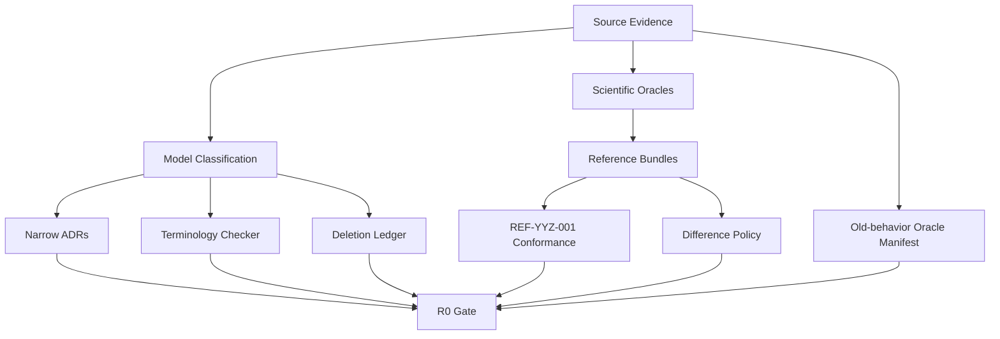
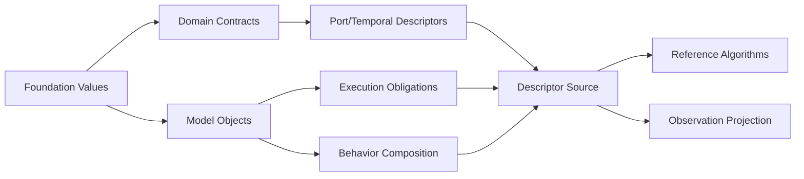

# 路线 R0–R2｜架构主轴、模型生态与语义编译

[返回路线总览](../11-roadmap-overview.md) · [返回文档总索引](../README.md) · [下一分册：R3–R5](r3-r5-kernel-and-research.md)

**主线定位**：本分册建设“科学基线与架构坐标 → 模型供给 → Canonical Model Graph → immutable Execution Plan”。阶段出口是可解释、可 dry-run、已证明闭合的 Plan，不包含物理时间推进。

## 1. 阶段目标

R0–R2 在编写完整新 Session 前关闭六类问题：

1. 哪些旧结果具有科学权威，哪些属于实现偶然行为；
2. 未来变化通过哪个架构接缝进入，哪些稳定区域保持零修改；
3. 每个模型、函数、变量、局部 behavior、port 和 state 归哪个 owner/recipe；
4. 作者输入如何编译成完整、typed、可解释的 Execution Plan。
5. 输入编码、实体关系、场景干预和输出编码如何接入同一条语义转换链。
6. 任意新需求如何选择 ChangeCard 或 AuthorityDomain + 七维变化向量，并降级到所属域的封闭操作集，何种 Model Authority 语义才允许扩充 Kernel。

阶段结束时，YYZ target Mission 可以从 Source Frontend 编译并 dry-run 生成包含 execution form、Runtime Cell recipe provenance、execution obligations、`StateBlockPlan`、`CommandRoutePlan`、`EventDeliveryPlan`、`EntityTopologyPlan`、`InterventionPlan`、`BoundaryDagPlan`、`TemporalBindingPlan`、`IntegrationScopePlan`、`SolverIslandPlan`、`TransactionPlan`、`ObservationProjectionPlan` 和 `EncodingPlan` 的不可变计划。新制导算法、局部 mechanism、新领域 package、新输入编码和新实体关系都有明确扩展路径，此时无需运行物理 step。

## 2. R0：设计闭合与科学 oracle

### 2.1 R0.1 源码证据清单

审阅并记录：

- Simulator 的 publish/discrete/record/termination/integration 顺序；
- same-phase priority/registration 排序；
- continuous candidate commit 与 discrete in-place update；
- generic state machine、Session phase manager 和项目 sequencer；
- YYZ guidance/controller/allocator/actuator/propulsion/mass/aero/closure/form；
- CAVH glide-range guidance；
- ConfigReader/bind/IObservable/registration 的结构重复；
- query mutable cache、OnboardState copy aggregator 和 giant contract header。

交付：`current-source-evidence.md`，每条事实链接文件/测试，并映射到 12–15 的目标对象。

验收：代表性 runtime chain 的每个读取/写入点都能标出当前 epoch、调用顺序和 hidden dependency。

### 2.2 R0.2 数学与数值 oracle

优先建立：

- [03](../03-mathematics-and-numerical-foundation.md) 8.1 四元数约定的 composition、inverse transform、matrix equivalence 和 serialization tests；
- frame/unit/direction property tests；
- Euler sequence/singularity tests；
- RK order、NaN、dimension 与 invariant tests；
- interpolation/root/optimization result/failure fixtures；
- mass/force/moment conservation/consistency checks。

交付：`ScientificOracleBundle`，含版本、输入、expected/tolerance、independent source 和 validity。

验收：oracle 不调用 Simulator，不依赖旧 CSV 列或错误文案。

### 2.3 R0.3 CapabilitySlice、执行闭包与 model classification ledger

先建立与具体场景无关的需求变化台账。单域 A–E 普通变化填写 ChangeCard；F 类、跨域或关键语义变化填写下表：

| 字段 | 说明 |
| --- | --- |
| pressure scenario | 新输入/输出编码、算法、内部行为、实体关系、故障、强耦合、批量、LLM、实时等 |
| `CapabilitySlice` | 需求拆成哪些独立语义切片 |
| `AuthorityDomain` | 每个切片改变 Design/Plan、Model、Operation 或 Artifact 中哪一类权威事实 |
| seven-dimensional vector | Vocabulary、Graph/Topology、State/Evolution、Time/Atomicity、Information/Authority/Evidence、Representation/Encoding、Execution Context/Resources 各自的 delta |
| canonical grammar delta | 在 Model Graph、Workflow Graph、typed Proposal/Command 或 Artifact schema 中新增或复用哪些元素 |
| PlanProofRecords | identity、ownership/DecisionAuthority、causality、time/lifecycle、state/transition、resource/effect、evidence 中需要哪些证明 |
| operation lowering | 映射到所属权威域哪些 closed operators |
| commit and handoff | 形成何种 commit/receipt，怎样通过 typed intent/ref/Outcome 跨域 |
| change class | A–F |
| primary seam | source frontend、package、behavior、graph、solver、dataset sink、workflow、application/backend |
| authoritative product | recipe、contract、plan、Artifact、DTO 或 `KernelCapability` |
| transformation route | SourceTree、Model Graph、Plan、committed state、Observation 与 Evidence 的经过路径 |
| untouched areas | 本场景必须保持零修改的稳定分区 |
| unresolved semantic | 是否存在所属权威域既有操作集无法表达的 time/atomicity/topology/effect/lifecycle 语义 |

验收分两步：先用维度级 property 检查证明任何单维扩展都能进入明确 AuthorityDomain，且不要求产品专用 Kernel 分支；再用 [02](../02-layered-reference-architecture.md) 第 12 节和 [15](../15-reference-vertical-designs-and-object-placement.md) 第 17 节的复合场景验证切片组合与跨域 handoff。当前样本中的步内多次 ModelCommit 与未知 topology 原子变化因缺少通用 Model Authority 算子进入后续 F 类能力；新的 withheld scenario 可以继续发现其他通用缺口。

为所有当前 registered model 填写：

| 字段 | 说明 |
| --- | --- |
| current path/type | 当前文件与 type id |
| target ModelDefinition | 新 identity |
| placement | 领域位置 |
| execution form | PureQuery/Closure/RuntimeComponent tagged union |
| cell boundary reason | state、clock、DecisionAuthority、failure、resource、shared output |
| recipe/RuntimeCellProfile | Runtime Cell Recipe 与可选 RuntimeCellProfile |
| execution obligations | Publish/Boundary/Interval/Derivative/Source/Effect/Resource |
| DecisionAuthority/state | owner 与 state schema 草案 |
| algorithm six-piece | Definition/State/Input/Output/Telemetry/Kernel |
| ports | kind、contract、temporal relation |
| behavior/DecisionAuthority | embedded mechanisms、shared DecisionAuthority 或 none |
| closure role | frozen/candidate/algebraic/none |
| target action | rewrite/split/merge/delete |

优先填写 15 的 YYZ/CAVH slice，随后覆盖 framework builtin。

验收：`unclassified = 0`；每个 mutable member 归入 State、OutputStore、Telemetry、Workspace、PreparedModel 或删除。

### 2.4 R0.4 纵向 source 与 reference bundle

固定两条输入：

1. minimal 3DoF：验证 Compiler/Session 最小闭合；
2. `REF-YYZ-001` / YYZ Cartesian 6DoF：验证多速率、mode、configuration、physical closure、plan proof、Observation/CSV 和 terminal。

另保存 CAVH formula bundle，用于 R1 algorithm decomposition。

Bundle 包含：

- source documents 与 includes；
- initial conditions；
- exact assets/hash；
- algorithm choices；
- run/numerical policy；
- key intermediate values；
- key trajectory/terminal metrics；
- known old defects/ambiguities。

### 2.5 R0.5 difference policy

每项旧行为分类：

- `ScientificInvariant`：新实现必须满足；
- `DeclaredModelChoice`：可变化，但使用新 model id/evidence；
- `ImplementationDefect`：修复；
- `AccidentalStructure`：删除；
- `NeedsDecision`：阻断 R1/R2 相关对象。

priority 数值、注册顺序、provider RTTI、CSV column order、free-text exception 和 old Mission shape 默认属于 AccidentalStructure。

### 2.6 R0.6 deletion ledger 与 guards

建立 [治理分册](migration-governance-and-acceptance.md) 第 6 节台账，并为目标删除 token 建立可先 warning、G6 后 error 的 search/include guards。

首批：SimulationNode、DiscreteNode、NodeFactory、NodeRegistry、AssemblyContext、IDiscreteTask、IObservable、registration macros、lookup-name binding、generic callback StateMachine。

### 2.7 R0.7 权威决策落档

把 02、03 与 12–15 已冻结的结论写成短 ADR 和 executable contract tests：

- Plan/Commit/Artifact-Control firewalls 与 dependency direction；
- A–F change routing、extension seams 与 `KernelCapability` gate；
- AuthorityDomain + seven-dimensional ChangeVector、各域 canonical grammar 与 closed operation languages；
- 七类跨域 proof 问题、各 Compiler 的 PlanProofRecord/PlanProofIndex schema 和 plan-as-proof-artifact 规则；
- quaternion/math storage；
- descriptor source-of-truth；
- Runtime Cell Recipe、StateFragment 与 execution obligation lowering；
- StateSchema/block representation；
- ComponentDelta representation；
- CycleFrame slot lifetime；
- embedded mechanism/owner reducer 与 shared DecisionAuthority promotion rules；
- port/TemporalRelation enum；
- terminal instant/interval commit；
- Frozen closure default convention；
- DiagnosticDraft/Outcome mapping。
- Source Frontend/SourceTree 与语义编译边界；
- ObservationBatch/EncodingPlan/Dataset Sink 边界；
- entity-scoped truth、compiled selector 与禁止可写全局 truth 容器；
- simulated fault/perturbation 与 framework failure 的语义分界；
- predeclared entity activation 与 future TopologyTransaction gate。

这些 ADR 记录既定选择与证据，不提供双实现开关。Python ABI、dynamic package、remote worker 和完整实时策略不进入 R0–R5。

### 2.8 R0.8 术语、fixture 与旧行为 conformance

交付三个可执行门：

1. 术语 checker 扫描目标架构与路线文档中的代码词/CamelCase，对照 `reference-glossary.md`；退出词、共享 enum/key 重定义和未知跨册词使检查失败，项目专用 type 使用有注释的 allowlist；
2. `REF-YYZ-001` conformance test 校验 Mission Source、BindingPlan、ExecutionPlanDescriptor、PlanProofRecord、DiagnosticRecord、ObservationBatch、CSV mapping、RunManifest 和 LineageEdge 示例；
3. old-behavior oracle manifest 为每条行为标记 Preserve/Fix/Retire，并至少覆盖 publish 不推进状态、固定 discrete phase 顺序、同步连续候选提交、当前 `IContinuousGroup` 行为、CSV `t_k`、停止前记录和 SimFlow 外置边界。

术语检查只验证登记和一致性，不把每个 PascalCase 单词自动提升为 framework API。oracle 比较 stable field id、物理量、时间语义和容差，不锁定旧类名、节点数量或列顺序。

### 2.9 R0 依赖顺序



### 2.10 R0 退出条件

1. 用户修订后的四元数约定有权威 tests。
2. YYZ/CAVH 代表对象完成分类与逐成员落位。
3. minimal/YYZ source/reference bundle 可由独立脚本或 tests 读取。
4. 所有 NeedsDecision 有 owner、ADR 和截止 gate。
5. deletion ledger 完整。
6. 02、12–15 与 R0 ledger 无 ownership/extension-seam 冲突。
7. 十三个长期压力面都有 CapabilitySlice、AuthorityDomain、七维 ChangeVector、canonical grammar delta、PlanProofRecords、operation lowering、commit/handoff、change class、transformation route、primary seam 和 untouched areas。
8. JSON/YAML、CSV/MAT、多实体 truth、舵机卡死、拉偏、分离、接地与星座案例均有因果走查和稳定区断言。
9. 随机抽取一个未预列出的合理需求时，评审者能沿同一模板完成跨域切片、lowering 和 handoff，或精确指出缺失的通用域内算子。
10. 术语 checker 对目标架构正文通过，所有退出词只保留在术语迁移表、专家原文或历史证据中。
11. `REF-YYZ-001` conformance 通过，PlanProofRecord 可按 subject/source/plan element 查询。
12. old-behavior oracle 的 Preserve 项有自动测试，Fix/Retire 项有批准理由和替代证据。

## 3. R1：Model Ecosystem、Behavior Composition 与运行契约

### 3.1 R1.1 foundation Outcome

建立最小公共值：

- stable ids/version；
- SimulationTime/Tick/Duration；
- Quality/Validity；
- NumericalStatus/NumericalOutcome；
- DiagnosticCode/DiagnosticDraft；
- generic Outcome；
- StateEpoch/Sequence/EffectiveInterval。
- EntityId/EntityGroupId/TopologyRevision；
- ParameterId/InterventionId。

约束：foundation 无 logger、ConfigNode、filesystem 和 Session。

### 3.2 R1.2 Domain Contracts

先为 YYZ slice 建立：

- Cartesian6DoFState/Truth；
- IMU/SatNav/AirData Measurement；
- Navigation/Target Estimate；
- FlightPhase/VehicleConfiguration；
- tagged GuidanceCommand；
- Moment/Actuator Command；
- Actuator/Aero/Propulsion/Mass Response；
- FormInput/EvaluationResult。
- EntityTruthView/RelativeGeometry、LinkMessage 与 EntityLifecycleState；
- PerturbationValue、DisturbanceSignal、FaultCommand/`FaultStateFragment` 与 ActivationCommand。

每个 contract 有 FieldSchema、unit、frame、sample/effective time、quality 和 stable id。Provider virtual interfaces 不进入新 contracts。

### 3.3 R1.3 Model object primitives

建立：

```text
ModelDefinition descriptor
PreparedModel handle
AlgorithmResult
QueryOutcome
RuntimeCellRecipe
ExecutionObligationDescriptor
MechanismDescriptor / StateFragmentSchema
StateSchema
StateCodecEntry
OutputSchema
TelemetrySchema
WorkspaceLayout
PortSlotHandle / SlotCodecEntry
EntitySelectorDescriptor / VariationTargetDescriptor
StateReplacement
ComponentDelta
```

ComponentDelta 支持：

- 携带完整 owner-block replacement 的 InstantPatch@t_k；
- 携带完整 owner-block replacement 的 IntervalCandidate@t_k+1；
- sampled outputs；
- interval models；
- events/receipts；
- telemetry/diagnostics。

测试：非法 owner write、unknown FieldId、错误 schema/layout hash、字段级 byte patch 拒绝、state/telemetry 混放、query side effect fixture。

### 3.4 R1.4 execution forms、obligations 与 SDK profiles

按 12 先建立两个无 Session identity 的 execution form：

- PureQueryDescriptor execution form；
- ClosureDescriptor execution form；

RuntimeComponentDescriptor 使用一组基础 execution obligations：

- PublishProjection；
- BoundaryEvaluation；
- IntervalEvolution；
- DerivativeEvaluation；
- SourceFreeze；
- PostCommitEffect；
- ResourceLease。

model SDK 提供 SampledTransform、DiscreteStateProcessor、ContinuousStateOwner、Coordinator、Evaluator 和 ExternalEndpoint 等常用 `RuntimeCellProfile`。每个 RuntimeCellProfile 展开为 state/ports/obligations，不形成 Kernel enum 或运行分支。每种 execution form、obligation 和合法组合都有 conformance fixture；至少增加一个 package-local RuntimeCellProfile 证明扩展无需修改 Kernel。

同时冻结 lifecycle hook 契约：`ModelPrepareFactory`、`RuntimeCellFactory`、`InstanceResourcePrepareHook`、`InitialStateBuilder`、`ResetStateBuilder`、`RunResourceOpenHook`、`RunFinalizeHook` 与 `DisposeHook`。Instance resource 看不到 RunBinding；initial/reset builder 无外部副作用；run resource 以 Lifecycle Coordinator 持有的 lease 表达。正常结束先运行可选 finalize，再无条件 close lease；run commit 前失败只 rollback/close lease。

### 3.5 R1.5 Behavior Composition SDK

实现/设计冻结：

- Runtime Cell Recipe composition；
- AlgorithmKernel、Explicit Adapter、Projection/Invariant；
- MechanismDefinition/StateFragment/Result semantic shape；
- local pipeline 与 owner replacement assembly；
- mechanism Diagnostic attribution；
- Runtime Cell promotion rule；
- `DecisionAuthority` + typed snapshot pattern。

fixture 至少覆盖三种不同机制：

1. guidance local mode/protocol；
2. controller anti-windup、hysteresis 或 fault latch；
3. FlightPhaseDecisionCell 或 VehicleConfigurationDecisionCell 内的 shared transition protocol。

测试：state fragment namespace、initialize/reset/checkpoint、determinism、failure rollback、no external callback mutation、shared mutable mechanism instance rejection。状态图自己的 priority/conflict、timeout tick、self transition 和 guard failure 作为 mechanism 单测，不成为 Session 执行语义测试。

### 3.6 R1.6 Port and temporal descriptors

建立六类连接：

- SampledSignal；
- Command；
- Event；
- PureQuery；
- AssetBinding；
- ContinuousClosureLink。

TemporalRelation：CurrentCycle、PreviousCommitted、HeldLatest、IntervalModel、CandidateStateQuery、EventAtOrBefore。

Descriptor 同时声明 cardinality、scope、rate/freshness、unit/frame、quality 和 phase availability。

跨实体访问由 `EntitySelectorDescriptor` 解析到 plan-local narrow handles，并声明 cardinality、visibility、inactive policy、frame 与 temporal relation。物理 relation、模拟 sensing 与通信 link 使用独立 contract；onboard GNC 的理想 truth 访问需要独立 model identity 和 evidence flag。

拉偏、扰动与模拟故障通过 `VariationTargetDescriptor` 声明 stable ParameterId、单位、合法域、物化时机、目标 builder/command、恢复规则和 owner。故障 injector 只提交 typed command；owner state、普通物理输出和 evaluator 形成后续因果链。

### 3.7 R1.7 Descriptor source of truth

首版固定采用 typed static C++ descriptor 作为唯一 source of truth，并通过确定性 exporter 生成 Catalog JSON、config/contract schema 和文档表。它必须满足：

- Catalog JSON、package contribution、typed handles、docs 可从同一来源生成或相互校验；
- model identity、config、ports、state、recipe/obligations、behavior metadata、telemetry、assets、maturity 完整；
- project package 无需手写 registration macro；
- descriptor 可在不创建 runtime instance 时读取。

### 3.8 R1.8 Observation projection primitive

Observation source 固定为：

- committed state；
- CycleFrame output；
- invocation telemetry；
- event/diagnostic journal。

实现 FieldId projector fixture，不读取 component getter，不再次调用 query/kernel。

### 3.9 R1.9 Reference algorithm decomposition

至少完成：

1. 一个简单 guidance/controller algorithm six-piece + RuntimeCellRecipe；
2. actuator state kernel；
3. PreparedAeroModel + pure query；
4. force/moment ClosureKernel；
5. CAVH GlideEnvelope builder 与 Eq17/Eq18 kernel unit design；
6. 两个不同 family 的 embedded mechanism composition。

它们在无 Session tests 中通过 oracle。

### 3.10 R1 依赖顺序



### 3.11 R1 退出条件

1. algorithms 无 runtime/config/logger/filesystem dependencies。
2. fixture components 只通过 state/input views 求值并返回 delta。
3. local behavior、`DecisionAuthority` 与 configuration fixtures 通过。
4. PureQuery call-count test 通过。
5. descriptors 可离线导出完整 Catalog 数据。
6. tagged command、time/quality/frame/unit schema 完整。
7. CAVH/YYZ 核心 algorithms 可脱离 Session 对照 oracle。
8. package-local `RuntimeCellProfile` 与新 embedded mechanism 不需要修改 Kernel source。
9. entity selector、ideal-truth、fault/perturbation descriptor 的成功与越权失败 fixture 通过。

## 4. R2：Mission Compiler 与 Execution Plan

### 4.1 R2.1 Source Frontend、SourceTree 与 SourceMap

`SourceFrontendPort` 接收 `SourceBlob{uri, media_type, bytes}`，只负责语法解析和 source location，输出 syntax-neutral `SourceTree/SourceMap`。Compiler core 从该边界开始，不依赖 JSON、YAML 或 INI parser library。frontend 无权创建 C++ 模型对象，也不拥有领域默认值、单位换算、binding 或执行选择。

新 Mission schema 从 v1 开始：

- document kind/version/namespace；
- imports/includes；
- scenario/assembly/parameters/run/observation 分离；
- typed quantities 与 URI；
- source/default/override origin；
- precise source span。

JSON 作为首个完整 frontend；YAML conformance frontend 用来证明相同规范树产生相同语义；INI 仅支持扁平 ParameterSet、RunProfile、简单 ObservationPlan 或明确版本化的 section mapping。无法无歧义表达 graph、array、include 或 typed quantity 时，INI frontend 早失败并给出 source span。Parser 失败无陈旧 state。旧 Mission reader 不进入新 Compiler。

### 4.2 R2.2 Catalog resolver

- package/model/contract/algorithm/asset identity；
- version and duplicate resolution；
- static factory availability；
- descriptor integrity；
- maturity/policy；
- machine-readable query/explain。

### 4.3 R2.3 typed Mission IR

IR 至少包含：

- entities/scopes；
- ModelInstanceSpec；
- CompiledModelOccurrence/AlgorithmDefinition values；
- state/initial-condition intents；
- port binding intents；
- behavior recipe、`DecisionAuthority` 与 configuration refs；
- entity lifecycle、relationship/topology 与 selector intents；
- perturbation/fault/disturbance/activation intents；
- closure/run/observation policy；
- source refs/dependency lock。

IR 不持有 runtime pointers 或 ConfigNode。

### 4.4 R2.4 BindingPlan

对每条 edge 解析：

- endpoint/contract/cardinality/scope；
- unit/frame/version/quality；
- port kind；
- TemporalRelation；
- rate/hold/freshness/latency；
- explicit adapters；
- `StateOwner` / `DecisionAuthority` uniqueness；
- entity visibility、selector cardinality、inactive policy 与 ideal-truth evidence；

输出完整 provider-consumer graph 和 negative diagnostics。

### 4.5 R2.5 ExecutionRegionPlan、ObligationCallsitePlan 与 BoundaryDagPlan

- 固定 Publish、Boundary DAG、`IntegrationScopePlan` / `SolverIslandPlan`、Commit、PostCommit region 主线；
- 每个 recipe 展开后的 obligation callsite、compiled entry 与授权 handle；
- Boundary region 内的 coarse phase band；
- current-cycle edge DAG 与 topological levels；
- explicit priority tie-break 和 stable instance-id final order；
- multi-rate interval/offset 与 held output slot initialization。

测试：obligation 与 region 不兼容、RuntimeCellProfile 名流入 Kernel dispatch、priority 覆盖 edge、later-to-earlier current edge、same-phase algebraic loop、registration/display-name independence。

### 4.6 R2.6 `StateBlockPlan`、`CommandRoutePlan` 与 `EntityTopologyPlan`

- StateBlockPlan 与 owner；
- initial state builder；
- instant/interval/continuous class；
- checkpoint/reset lifecycle support；
- mechanism StateFragment merge 与 local attribution metadata；
- Runtime Cell Recipe expansion provenance；
- compiled execution obligations/callsites；
- command/event routes；
- phase/configuration `DecisionAuthority` 与 snapshot writer；
- configuration coverage matrix。
- EntityTopologyPlan、predeclared inactive entities 与 topology revision；
- parent/child activation mapping、state/frame/impulse/mass/configuration transfer；
- InterventionPlan、ParameterId target、fault command route 与 recovery policy。

### 4.7 R2.7 `ClosurePlan` 与 `IntegrationScopePlan`

- Frozen/Candidate/Algebraic strategy；
- query/closure kernels；
- candidate group member states；
- held inputs；
- integrator/numerical policy；
- event detectors/invariants；
- workspace layout。

Compiler 检查所有 candidate dependencies 成员完整，普通 port loop 不得混入 closure group。

### 4.8 R2.8 TransactionPlan

为 terminal/continue/failure 三条路径编译：

- instant patch commit set；
- interval/continuous candidate set；
- held output writes；
- due command application receipt/consumption 与 event consumption；
- invariant sequence；
- observation seal point；
- post-commit effect hooks。

Command submission、expiry 与 supersession 由 `CommandRoutePlan` 约束，并通过 CommandLedgerCommit 推进 ledger sequence，不推进 model state_epoch；submission 产生 `CommandSubmissionOutcome`，expiry/supersession 产生 `CommandLedgerMaintenanceReceipt`。TransactionPlan 只处理冻结 cutoff 内的 due command；owner staged `CommandApplicationReceipt` 仅随 ModelCommit 生效，step rollback 后 due command 保持未消费。

### 4.9 R2.9 ObservationPlan

- FieldId projector；
- state/output/telemetry/journal source；
- sample rate/phase；
- dtype/shape/unit/frame；
- RecordSink supported schema/shape 与 data volume；
- critical evidence flags。
- entity selector/topology revision 与 inactive entity representation；
- sink-independent dataset schema；
- 每个 sink 的 codec id/version、supported dtype/shape 与 EncodingPlan。

### 4.10 R2.10 ExecutionPlanDescriptor 与 Image

Descriptor 汇总：

```text
identities and dependency lock
model occurrences/recipe provenance/prepared factories
runtime cells/execution obligations/region callsites
typed handles and slot layout
lifecycle plan: model prepare -> instantiate -> session resource prepare
                -> initial/reset state build -> run resource open
                -> run finalize/lease close -> dispose
execution regions/obligation callsites/Boundary DAGs
StateBlockPlan, CommandRoutePlan and EventDeliveryPlan
entity topology/selectors and intervention plans
closure/integration plan
transaction plan
observation and encoding plans
run binding schema
diagnostic/policy/source refs
```

Descriptor 同时是一份 machine-checkable closure certificate。每条 compiled occurrence、edge、state block、solver scope、transaction branch、resource lease 和 observation field 都携带其 identity/ownership/causality/time/state/resource/evidence proof reference；`--explain` 可以从任一 callsite 反查证明链。Compiler pass 通过并不只表示 schema 可解析，还表示 Model Graph 已经完整降级到 Kernel 的封闭执行代数。

canonical serialization 不依赖显示名、注册顺序、源文件绝对路径、UI layout、函数地址和 cache 命中。`model_graph_hash` 与 `execution_core_hash` 不依赖输入编码；`source_content_hash` 和整体 `descriptor_hash` 可以反映 source bytes/SourceFrontend 配置的变化。分层 identity 至少包括 `source_content_hash`、`model_graph_hash`、`execution_core_hash`、`observation_plan_hash`、`encoding_plan_hash` 与整体 `descriptor_hash`。随后实现无选择语义的 plan linker，把 Descriptor 与 exact package implementations 解析为 process-local ExecutionPlanImage；Image 有 link fingerprint，Session 只消费 Image。

### 4.11 R2.11 dry-run/explain

必须展示：

- model occurrence、Runtime Cell boundary reason、recipe provenance 与 obligations；
- Definition/State/PreparedModel identity；
- port edge kind/temporal/rate/quality；
- execution region、obligation callsite、Boundary DAG 和 hold；
- embedded behavior attribution、phase/configuration `DecisionAuthority`；
- entity selector、topology lifecycle、activation mapping 与 intervention route；
- closure group/candidate membership；
- terminal/continue commit table；
- observation sources；
- dataset schema、sink codec id/version 与 EncodingPlan；
- source map/assumptions/warnings。

### 4.12 R2 负向矩阵

| 类别 | 必测失败 |
| --- | --- |
| source | unknown/type/unit/path/include cycle、unsupported INI shape、frontend semantic mismatch |
| catalog | missing/duplicate/version/factory |
| port | missing/multiple/contract/frame/unit/quality |
| temporal | stale/rate mismatch/reverse current edge |
| graph | same-instant cycle/priority misuse |
| state | multiple owner/missing initializer/delta class conflict |
| behavior/DecisionAuthority | state fragment conflict、invalid local transition、multiple DecisionAuthority |
| entity/topology | selector cardinality、invisible/inactive entity、incomplete activation mapping、unsupported dynamic instance |
| intervention | unknown ParameterId、unit/domain mismatch、unsupported fault、cross-owner mutation |
| configuration | consumer mapping missing/revision writer conflict |
| closure | candidate member missing/illegal mutable query |
| observation/encoding | unknown field/expensive debug/critical sink mismatch、unsupported shape/append/schema mapping |

### 4.13 R2 退出条件

1. minimal 与 YYZ target source 编译成功。
2. dry-run 完整解释 15 的纵向调用表。
3. negative matrix 使用 stable Diagnostic codes。
4. compile 无 runtime instance、文件输出和 hidden global state。
5. Plan hash 稳定且 source diff 可解释。
6. new Compiler 不调用 ConfigManager/MissionAssembler/NodeFactory。
7. Plan 足以让 R3 Session 运行，无 runtime dependency discovery。
8. 语义等价 JSON/YAML fixture 产生相同 `model_graph_hash` 与 `execution_core_hash`；INI SourceFrontend mapping 的支持边界有正负测试。
9. 改变 CSV/MAT EncodingPlan 不改变 `execution_core_hash`，Session Image 无格式分支。
10. 多实体 selector、模拟故障/拉偏和已知 child activation 的 dry-run 展示完整 owner、因果与 commit route。
11. Descriptor 能列出每个模型图语法元素对应的执行算子及七类 PlanProofRecord；未 lower 的语义使 compile fail。

## 5. R0–R2 总完成定义

1. 科学 oracle、difference policy 和 deletion ledger 完整。
2. 所有代表模型与 mutable member 有唯一目标 owner。
3. algorithms 采用六件套并可独立验证。
4. descriptors、Runtime Cell Recipes、execution obligations、embedded mechanisms 和 port kinds 可组合。
5. Source Frontend 把多种输入编码统一为 SourceTree；Mission 语义编译成 typed IR/ExecutionPlanDescriptor，并可无选择语义地 link 为 ExecutionPlanImage。
6. `BoundaryDagPlan`、`TemporalBindingPlan`、`StateBlockPlan`、`CommandRoutePlan`、`EventDeliveryPlan`、`EntityTopologyPlan`、`InterventionPlan`、`ClosurePlan`、`IntegrationScopePlan`、`SolverIslandPlan`、`TransactionPlan`、`ObservationProjectionPlan` 和 `EncodingPlan` 全部显式。
7. dry-run 能回答“谁在何时读取哪个 epoch 的什么值”。
8. R3 无需包装旧 Simulator 即可开始实现新 Session。
9. 输入编码、输出编码、实体选择和场景干预均有分层 hash、dry-run explain 与负向诊断证据。
10. CapabilitySlice -> AuthorityDomain/ChangeVector -> canonical grammar -> PlanProofRecords -> closed operators -> commit/handoff/evidence 的通用推导链经过单维 property fixtures 与复合场景验证。
